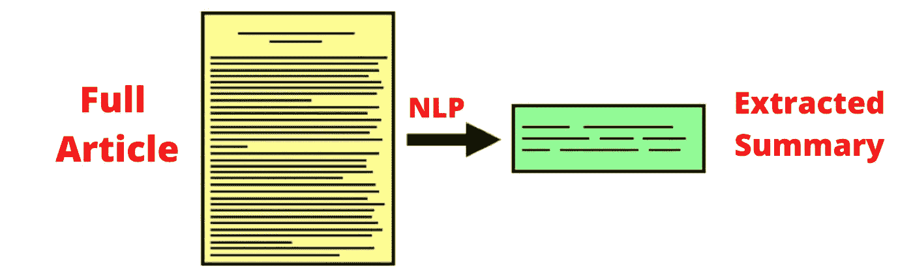
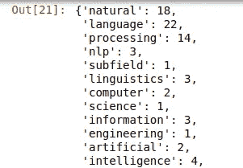
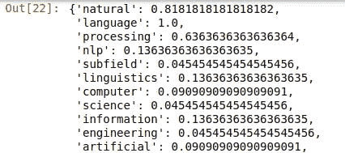
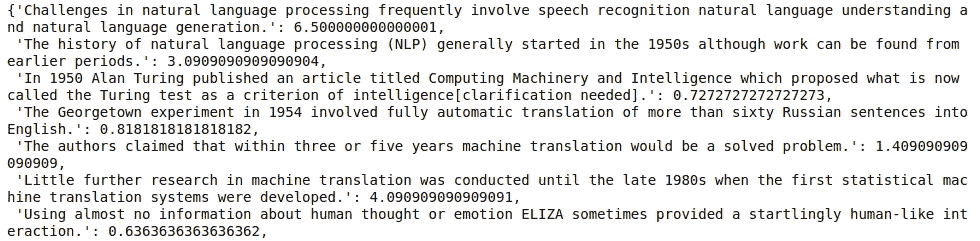

# 使用提取方法的简单文本摘要

> 原文：<https://pub.towardsai.net/simple-text-summarizer-using-extractive-method-849b65c2dc5a?source=collection_archive---------1----------------------->

## [自然语言处理](https://towardsai.net/p/category/nlp)

## 自动对包含最重要句子的文章进行简短总结。



将文章转换为摘要|来源:作者图片

> 你见过像 shorts 中的 ***这样的应用程序，它可以将文章或新闻转换成 60 个字的摘要。是的，这就是我们今天要建造的。在本文中，我们将使用**提取方法**构建一个文本摘要器，它非常容易构建，并且在处理结果时非常可靠。别急，我也来解释一下这个提取的方法是什么？***

您可能会发现许多关于 ***文本摘要的文章*** ，但是这篇文章的独特之处在于它简短的*和 ***对初学者友好的*** 代码片段的高级描述。*

*因此，文本摘要可以通过两种方式完成*

*   ****提取方法***——从文章中选择最有可能传达文章信息的 **n** 个最重要的句子。这种方法非常容易实现并且对初学者友好。这是本教程选择这种方法的主要原因。*
*   ****抽象法*** —这种方法使用深度学习的概念，如 ***编解码器*** 架构、 **LSTM(** 长短期记忆 **)** 网络，这些对于初学者来说非常难以理解。这种方法生成文章的全新摘要，并包含甚至在原始文章中不存在的句子。这种方法可能会创造出没有任何意义的句子。*

*现在，我们清楚了为什么选择提取方法，让我们直接跳到编码部分😎*

## ***先决条件:-***

*我假设你熟悉 ***python*** 并且已经在你的系统中安装了 ***python 3*** 。这个教程我用过 ***jupyter 笔记本*** 。你可以使用你喜欢的 **IDE** 。*

## ***安装所需的库***

*对于这个项目，您需要在 python 中安装以下包。如果没有安装，可以直接使用`pip install PackageName`。 ***抓取*** 部分是可选的，你也可以跳过它，使用任何你想要摘要的本地文本文件。*

*   ***bs4** —用于解析 Html 页面的 BeautifulSoup。*
*   *lxml —它是用于用 python 处理 Html 和 xml 的包。*
*   ***nltk** —用于执行自然语言处理任务。*
*   ***urllib** —用于请求网页。*

# *开始编码吧！*

*在这里，首先我们已经导入了我们将要使用的所有库。 ***bs4*** 和 ***urllib*** 将用于文章的抓取。 ***re*** (正则表达式)用于删除文章中不想要的文字。第 4 行用于安装 ***nltk(*** 自然语言工具包 ***)*** 包，这是本教程最重要的包。之后，我们下载了文本处理所需的一些数据，如 ***punkt*** (用于句子分词)和 ***停用词*** (如`is,the,of`这样不起作用的词)。*

```
***import** bs4
**import** urllib.request as url
**import** re
#!pip3 install nltk
**import** nltk
nltk.download('punkt')
nltk.download('stopwords')
**from** nltk **import** sent_tokenize
**from** nltk.corpus **import** stopwords
**from** nltk **import** word_tokenize
stop_word = stopwords.words('english')
**import** string*
```

*这里，我只是从用户那里获取了文章的 URL。*

```
*url_name = input("Enter url of the text you want to summerize:")*
```

*在这段代码中，我们用 urllib 请求页面源，然后用***beautiful soup***解析该页面，找到段落标签，并将文本添加到`article`变量中。*

```
*web = url.urlopen(url_name)
page = bs4.BeautifulSoup(web,'html.parser')
elements = page.find_all('p')
article = ''
for i in elements:
    article+= (i.text)
article*
```

*现在，我们从包含要总结的整篇文章的字符串变量`article`中删除所有特殊字符。为此，我们简单地使用了内置的`replace`函数，还使用了正则表达式( ***re*** )来删除数字。*

```
*processed = article.replace(r'^\s+|\s+?$','')
processed = processed.replace('\n',' ')
processed = processed.replace("\\",'')
processed = processed.replace(",",'')
processed = processed.replace('"','')
processed = re.sub(r'\[[0-9]*\]','',processed)
processed*
```

*这里，我们简单地使用了***【nltk】***的`sent_tokenize`函数来制作包含文章中每个索引处的句子的列表。*

```
*sentences = sent_tokenize(processed)*
```

*之后我们把文章的人物转换成`lowercase`。然后我们遍历文章的每个单词，检查它是否不是停用词或任何标点符号(我们已经删除了标点符号，但我们仍然使用它以防万一)。如果这个单词不在其中，我们只需将该单词添加到字典中，然后进一步统计该单词的 ***频率*** 。*

*在截图中，你可以看到字典中包含了文章中的每个单词及其计数(单词出现的频率越高，越重要)。现在你知道为什么我们去掉了像`of the for`这样的停用词，否则它们会出现在最上面。*

```
*frequency = {}
processed1 = processed.lower()
for word in word_tokenize(processed1):
    if word not in stop_word and word not in string.punctuation:
        if word not in frequency.keys():
            frequency[word]=1
        else:
            frequency[word]+=1
frequency*
```

**

*包含文章中每个单词及其出现频率的词典*

*这里，我们通过简单地将每个单词的**频率**除以其中的**最大频率**来计算字典中每个单词的重要性。在截图中，你可以清楚地看到单词`language`的重要性排在最前面，因为它的最大频率是 **22** 。*

```
*max_fre = max(frequency.values())
for word in frequency.keys():
    frequency[word]=(frequency[word]/max_fre)
frequency*
```

**

*文章中每个单词的重要性*

*做完这些，现在我们要计算文章每一句话的重要性。为了做到这一点，我们遍历文章的每一个句子，然后为句子中的每个单词加上该单词的个人得分**或重要性**来给出该特定句子的最终得分。*****

*在截图中，你可以清楚地看到，现在每个句子都有一些分数，代表那个句子有多重要。*

```
*sentence_score = {}
for sent in sentences:
    for word in word_tokenize(sent):
        if word in frequency.keys():
            if len(sent.split(' '))<30:
                if sent not in sentence_score.keys():
                    sentence_score[sent] = frequency[word]
                else:
                    sentence_score[sent]+=frequency[word]
sentence_score*
```

**

*每句话的得分或重要性*

***最后**，我们用`heapq`找到了得分最高的 4 个句子。你可以选择任意数量的句子。然后简单地加入所选句子的列表，形成一串摘要。*

**自然语言处理*文章的最终输出摘要可以在所附的截图中看到。*

```
*import heapq
summary = heapq.nlargest(4,sentence_score,key = sentence_score.get)
summary = ' '.join(summary)
final = "SUMMARY:- \n  " +summarytextfinal = 'TEXT:-    '+processed
textfinal = textfinal.encode('ascii','ignore')
textfinal = str(textfinal) 
final*
```

**

*最终摘录摘要*

**

*是啊！我们做到了。*

****摘录摘要*** 可能不达标，但足以传达给定文章的主旨。此外，它更可靠，因为它只输出文章本身的选定数量的句子，而不是生成自己的输出。*

*我也会试着为抽象方法做一个教程，但是对我来说解释起来会是一个很大的挑战。😬*

*谢谢你宝贵的时间。😊我希望你喜欢这个教程。*

*另外，查看我的教程 [*如何可视化排序算法*](https://medium.com/analytics-vidhya/visualize-interesting-sorting-algorithms-with-python-bdd64bdd0713)*

*[](https://medium.com/analytics-vidhya/visualize-interesting-sorting-algorithms-with-python-bdd64bdd0713) [## 用 Python 可视化有趣的排序算法

### 有各种类型的排序算法，有时很难理解它们…

medium.com](https://medium.com/analytics-vidhya/visualize-interesting-sorting-algorithms-with-python-bdd64bdd0713)*