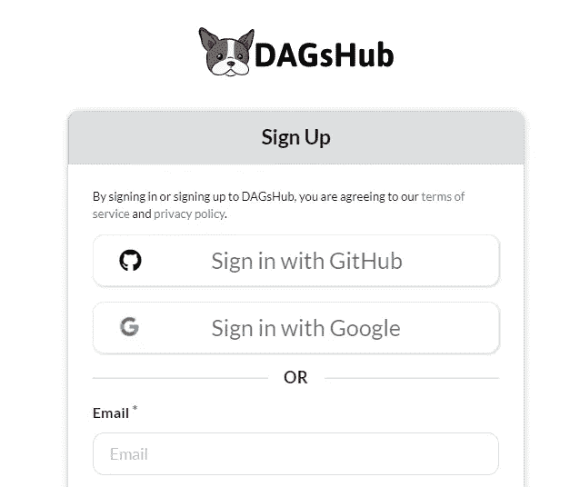
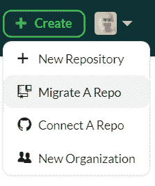
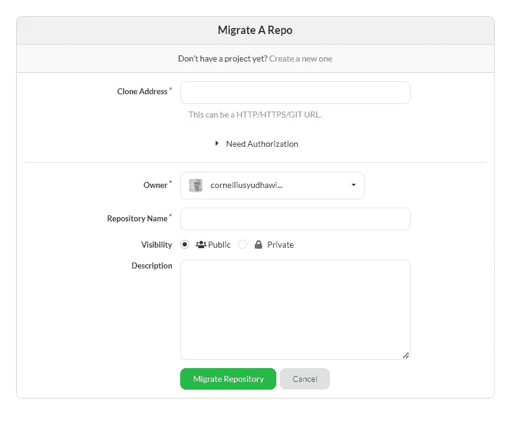
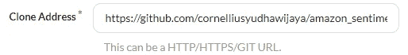
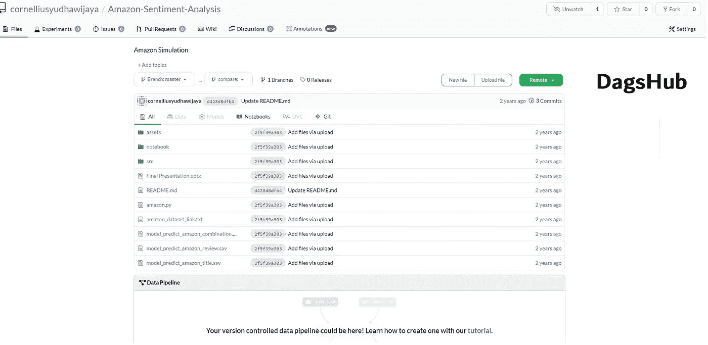
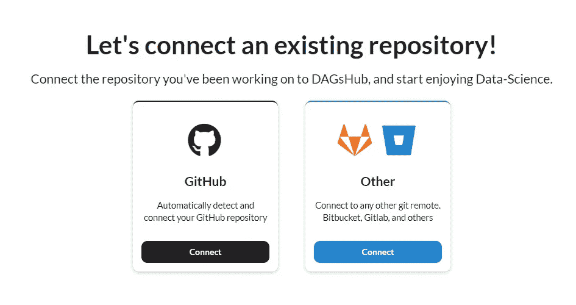
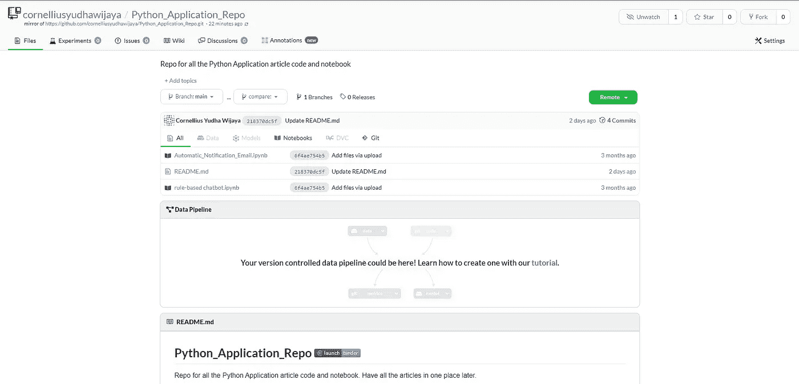

# 使用 DagsHub 镜像简化数据科学家的协作

> 原文：<https://pub.towardsai.net/simplify-collaboration-for-data-scientist-with-dagshub-mirroring-705471698233?source=collection_archive---------2----------------------->

## 这个特性将帮助您的数据科学工作变得更加容易

[天一马](https://unsplash.com/@tma?utm_source=medium&utm_medium=referral)在 [Unsplash](https://unsplash.com?utm_source=medium&utm_medium=referral) 上拍照

DagsHub 是一个 web 平台，它利用流行的开源工具来版本化数据集模型、跟踪实验、标记数据和可视化结果。这是一个类似于 GitHub 的免费网络平台，用于开源数据科学项目，提供了一个简单的入门流程，无需下载或学习新语言。简单来说， **DagsHub 是一个为数据科学家提供 GitHub 体验的网络平台**。

如果你想深入了解 DagsHub，我之前在下面的文章中写过一篇介绍性的文章。

 [## DagsHub 简介:完整的数据科学项目集成平台

### 一个屋檐下代码、实验、模型和数据集成

towardsdatascience.com](https://towardsdatascience.com/introducing-dagshub-complete-data-science-project-integration-platform-c3bec84e4e7c) 

DagsHub 中有许多令人兴奋的特性，但是我想在本文中通过一个示例项目来讨论如何使用 DagsHub 镜像。我们将更多地了解为什么镜像存储库对我们的日常数据科学活动有帮助。让我们开始吧。

# 将 GitHub 存储库镜像到 DagsHub

随着我对 DagsHub 了解的越来越多，我明白了这个平台是多么模块化。您可以选择您希望在项目中使用的功能和工具，在某种程度上，您只能使用实验跟踪服务器来记录您的 MLflow 实验，而不会将任何其他内容推送到 repo！不仅如此，如果您在 Git 平台上主持一个项目，并且仍然希望使用 DagsHub 功能(存储、注释、实验等)。)你可以简单的镜像到 DagsHub，享受两个世界！让我一步一步地告诉你怎么做。

你首先需要的是 Dagshub 账户。很容易创建；你可以通过 GitHub、Google 帐户或电子邮件来创建帐户。

作者图片

在您将您的帐户注册到 DagsHub 之后，您可以使用右上角的按钮在 DagsHub 平台中创建一个存储库。

作者图片

在创建下拉列表中有四个选项，但是让我们忽略新的组织选择。在 DagsHub 平台中创建新的存储库有三种选择:

1.  新存储库
2.  迁移回购
3.  连接回购

在第一种选择(新存储库)中，您将创建一个全新的存储库，但是我们将关注从 GitHub 迁移和连接存储库。

## 迁移回购

**有两种方法可以通过迁移或连接将 GitHub 存储库放入 DagsHub 平台**。如果我们迁移一个 repo，我们是将整个 GitHub 库复制到 DagsHub 库中，而没有在平台之间建立任何连接。

让我们选择 migrate a repo 选项，您将看到**“Migrate a Repo”**表单。

作者图片

迁移 GitHub 库最简单的方法是用 GitHub 地址填充克隆地址表单。例如，我会用我的 [GitHub 库](https://github.com/cornelliusyudhawijaya/amazon_sentiment_analysis)来填充它。

作者图片

GitHub 存储库很快就会迁移到 DagsHub 存储库中，迁移后的存储库与原始 GitHub 存储库相似。

作者图片

您可能希望迁移您的存储库，而不将其镜像到 GitHub。如果您希望将项目完全迁移到 DagsHub，这两个项目在两个不同的平台上运行，但是没有连接。

## 连接回购

虽然存储库迁移会将您的 GitHub 存储库复制到 DagsHub 平台，但是连接一个 repo 会镜像您的 GitHub 存储库。**在这种情况下，镜像是什么？**这意味着您的 GitHub 存储库与 DagsHub 存储库相关联，您的 GitHub 存储库中发生的每一个变化都会反映在 DagsHub 中。让我们试着镜像回购。

首先，我们需要选择 Connect a Repo 选项，我们将获得以下选择。

作者图片

我们的连接可能来自 GitHub 存储库或另一个 git 远程对象。在这种情况下，我们将使用标准的 GitHub 连接作为常用连接。

在连接我们的存储库之前，我们需要允许 DagsHub 访问我们的 GitHub 帐户。我们可以通过选择 Add Access to Repository 并遵循安装过程来实现。

作者图片

访问完成后，连接表单会显示所有的 GitHub 存储库，如下图所示。

作者图片

在上面的表单中，您可以选择想要镜像到 DagsHub 存储库的 GitHub 存储库。该列表不仅限于您的公共 GitHub 库，还可以扩展到您的私有库。让我们选择任何存储库并将其镜像到 DagsHub 平台。

作者图片

如果您进行存储库迁移，连接的 GitHub 存储库与您的存储库类似，但有更多的细节。如果你看一下 repo 的名字，你会意识到有信息表明我们的存储库是 GitHub 存储库的镜像。

作者图片

你的 GitHub 库中的每一个变化都会在其他库中反映出来。

镜像存储库在许多方面都很有用，例如:

1.  当您创建一个项目并希望项目在两个地方都可用时，
2.  团队之间的协作发生在两个不同的地方(例如，GitHub 上的软件开发人员和 DagsHub 上的数据科学家)，
3.  利用两个平台的特性取决于项目的需求

# 结论

DagsHub 是一个为数据科学家提供 GitHub 体验的网络平台。虽然乍看起来，可用性仅限于数据存储和跟踪，但是您可以使用许多特性来最大化 DagsHub 在项目中的体验。

您应该知道的镜像回购的功能有:

*   迁移回购
*   连接回购

希望有帮助！