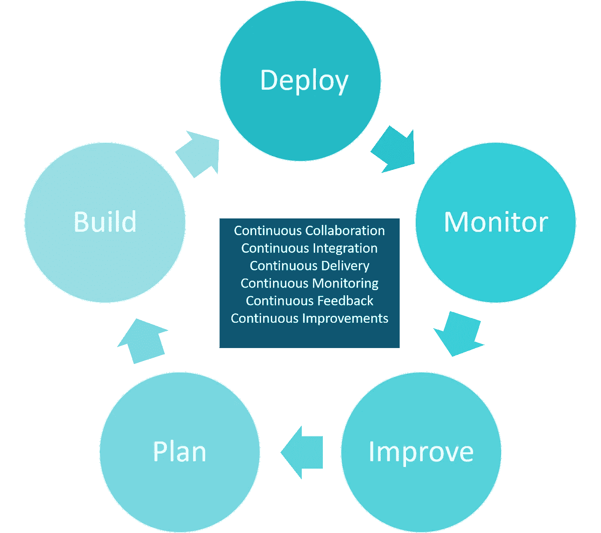
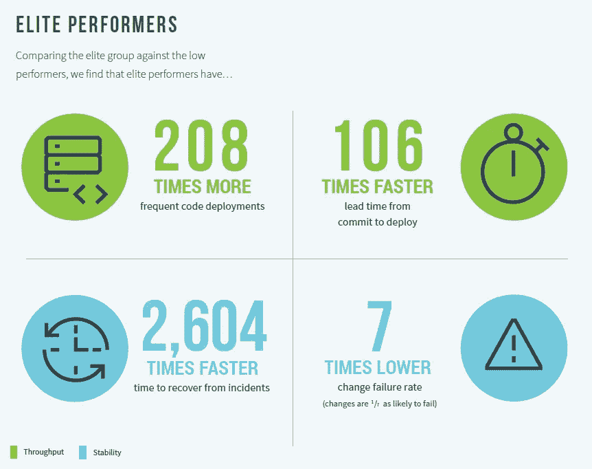
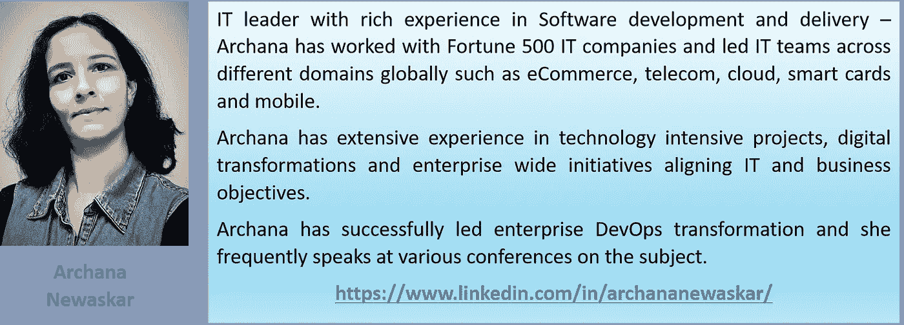

# 简化开发运维— 10 个常见问题

> 原文：<https://pub.towardsai.net/simplifying-devops-10-frequently-asked-questions-3772aead4c0?source=collection_archive---------3----------------------->

## [DevOps](https://towardsai.net/p/category/devops)

# 介绍

随着 IT 发展速度的变化，组织必须改变多年来构建软件的方式——他们必须重新审视构建和交付软件的传统方式，以保持在市场中的竞争力。组织需要快速思考，快速行动以应对变化。

随着软件开发从基于项目的交付进展到持续的迭代和演进，对于组织来说，简化 it 并寻求协同作用是至关重要的。

通过联合开发、运营和业务团队，可以缩短上市时间、减少停机时间、减少缺陷和提高运营效率。

DevOps 将业务团队、开发人员和运营团队聚集在一起，改善了他们之间的协作，并创建了自动化的连续软件开发和部署流程。

# 1.DevOps 是什么？

DevOps 将业务团队、开发和运营结合在一起，改善团队之间的协作，并创建自动化的连续软件开发和部署工作流。它有助于组织减少软件交付时间，并在提高软件质量的情况下实现生产中的频繁发布。

跨软件生命周期的开发

DevOps 团队是跨职能的，并被授权进行日常决策，以加速软件交付。由于团队持续协作，而不是各自为政，DevOps 通常被视为接受组织中的文化变革。提升员工技能对于实现整体成功至关重要，以满足 DevOp 对持续学习和改进的需求。

# 2.为什么是 DevOps？

DevOps 向市场提供高质量的产品，缩短并改进了发布周期。它增加了不同团队之间的反馈循环和协作。它将技术、人员和流程改进结合在一起，以实现快速高效的交付。

一段时间后的一些好处是:

## 业务优势:

*更好的投资回报率*

*频繁发布*

*提高客户满意度*

## 组织优势:

*授权团队*

*高效治理*

*员工满意度*

## IT 优势:

*更好的代码质量*

*高效运营*

*更好的自动化*

*更好的流程*

*减少部署失败和回滚*

在整个行业中，组织已经了解了 DevOps 的优势，并开始了采用它的旅程。一些在实施 DevOps 方面取得成功的知名组织包括:亚马逊、网飞和脸书。此外，各种政府组织正在实施 DevOps 以引入更快的变化，并推进数字化。

来源:2019 年 DevOps 研究和评估报告

根据 DevOps 的研究，DevOps 的精英表现明显优于低表现者，在市场上提供更快、更可靠的产品功能方面遥遥领先于竞争对手，从而增加了公司的收入和利润份额。

# 3.我如何实现 DevOps？

DevOps 的常见实践和工具有:

**持续集成** **(CI)** —开发人员代码经常与公共软件库集成，因此被称为持续集成。自动构建和测试验证代码，并将其传递到交付工作流的下一个阶段。

**连续交付(CD)——**构建总是为任何平台上的产品发布做好准备，这可以通过定义连续交付管道来实现。

CI/CD 的一些常用工具有 Jenkins、Bamboo、Gitlab、AWS 和 Azure DevOps。

**基础设施即代码(IAAC)——**通过代码而不是手动管理软件基础设施。它自动化了基础架构维护和配置。

IAAC 的一些常用工具是厨师，木偶，Ansible 和 Terraform。

**容器化** —将应用程序与其环境虚拟打包—将系统资源、内存和依赖项整合到一个名为“容器”的软件中，以便在不受环境影响的情况下平稳运行应用程序。

容器化的一些常用工具有 Docker、Kubernetes 和 AWS ECS。

**持续监控和变更—** 持续监控和测量应用程序的性能及其在生产中的环境。

持续监控的一些工具有 Nagios、Splunk 和 AppDynamics。

**持续协作、学习和反馈—** 这些都是由在 DevOps 环境中工作的团队实现的，这使得人员能力对其成功如此重要。技能、管理支持和组织文化的正确组合起着重要的作用。

# 4.DevOps 为什么是文化和组织变革？

DevOps 要求团队协同工作——它模糊了不同团队之间的界限。团队需要放弃传统的工作方式，相互协作以实现共同的目标。个人分担端到端的责任，并有权做出有利于客户的决策。DevOps 鼓励快速失败的文化，同时创新和尝试新事物。重点是在整个生命周期中不断反馈，通过持续改进应用所学知识，并交付质量。

通过建立创新文化和鼓励新想法，所有这些都是可能的。组织对持续学习和不断提高员工技能的支持性文化也是成功推进 DevOps 的关键区别。

# 5.我已经在使用敏捷了；我需要 DevOps 吗？

敏捷专注于如何在增量和频繁的迭代中开发软件，DevOps 扩展了敏捷开发实践，并将运营与开发团队结合在一起，以实现端到端的工作流。敏捷确保需求可以被多次合并到开发中，而 DevOps 确保这些需求以最有效的方式向业务交付价值。

DevOps 的范围更广，因为它使用敏捷实践、自动化、人际技能和精益原则，以尽可能最好的方式向市场交付软件。

# 6.我已经实现了自动化；我需要 DevOps 吗？

DevOps 通过价值流映射优化流程，将不同活动的自动化结合起来，以创建持续的开发和交付工作流，并提高工作场所的效率。

DevOps 在整个生命周期的每个阶段都融入了自动化，以在保持质量的同时实现连续流动。各种任务，比如代码审查、单元测试、构建和部署，都可以自动化。此外，在部署之后，可以自动对生产事件进行持续监控，以接收来自生产的实时反馈。这一反馈将再次反馈到交付渠道，以便持续改进。

通过将过程和工具标准化并与自动化相结合，组织可以交付可靠的、可伸缩的和可维护的软件，并减少生产中的“停机时间”。

# 7.在 DevOps 世界中，开发和运营团队是如何工作的？

传统上，开发(Dev)团队负责构建高质量的软件，而运营(Ops)团队确保软件在生产中的可靠性。开发人员和运营人员在他们各自的筒仓中工作——通常，在构建经过良好测试并准备好投入生产之后，运营人员会在周期的后期介入。

**在 DevOps 世界** —跨职能团队一起工作，并参与从需求到部署等所有阶段。他们有权做出决策并端到端地分担责任—开发支持安全部署和跟踪其代码所需的基础架构和环境，而运营部门则协作最终确定各种运营要求，如稳定性、性能和可扩展性。因此，开发人员和运营人员携手合作，在整个生命周期中拥有可交付成果，以确保顺利和非常高效的发布。

# 8.DevOps 如何运用精益原则？

精益组织通过消除流程中的瓶颈和低效，关注各种活动中的“客户价值”和“如何减少浪费”。精益理念追求完美，致力于持续学习和改进。

由于 DevOps 专注于以高效的方式进行端到端软件交付工作流，并为客户增加价值，因此它结合了精益原则，从客户的角度定义“价值”，以映射在工作流中增加价值的不同活动。价值映射有助于确定计划和产品特性的优先级，消除没有增加价值的活动并改进现有流程，从而减少冗余和不需要的任务、活动、代码等。

# 9.我如何衡量 DevOps 的成功？

DevOps 支持频繁和高质量的交付、更快的故障恢复、更好的流程、自动化和改进的人员技能。以下是可以定义的一些衡量开发运维成功的指标:

> 代码质量
> 
> 单元测试覆盖率
> 
> 自动测试通过率%
> 
> 部署频率
> 
> 应用可用性
> 
> 应用程序恢复时间
> 
> 生产后缺陷
> 
> 部署失败的次数
> 
> 人员能力指数
> 
> ….

# 10.我能在一年内完成 DevOps 实现吗？

简单的答案是否定的。

DevOps 不是 IT 的新范式，而是对技术和工具的改进。基于工具、过程、自动化和人的能力，它的实现因组织而异。

DevOps 是一个旅程，而不是目的地。其实施取决于—组织的当前状态以及管理层对实施 DevOps 的承诺程度。

DevOps 是关于在软件生命周期中消除低效的。它强调协作、创新和学习的文化，减少浪费，更频繁、更可靠地将更好的软件推向市场。

持续的学习、协作和持续的改进使得 DevOps 对组织来说既令人兴奋又充满挑战，但是其成功实施的回报超过了这一点。

**_ _ _ _ _ _ _ _ _ _ _ _ _ _ _ _ _ _ _ _ _ _ _ _ _ _ _ _ _ _ _ _ _ _ _ _ _ _ _ _ _ _ _ _ _ _ _ _ _ _ _ _ _ _**

