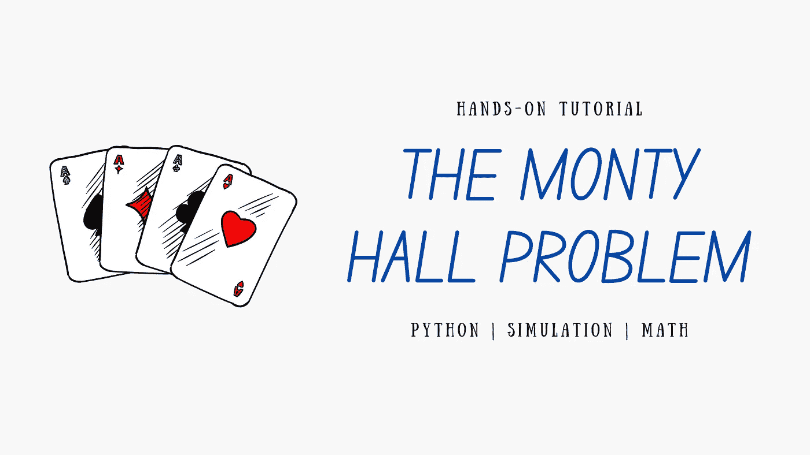
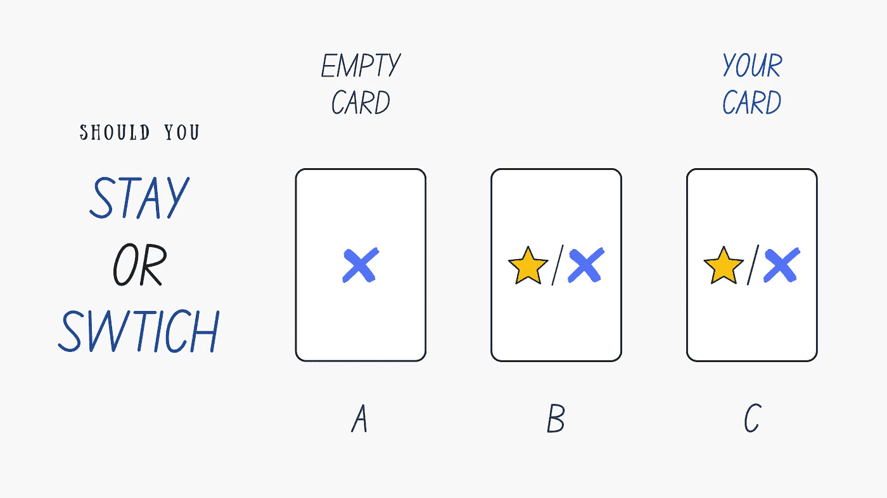

# 使用 Python 模拟最著名的反直觉概率问题

> 原文：<https://pub.towardsai.net/simulate-the-most-famous-counter-intuitive-probability-problem-using-python-94f3e2617540?source=collection_archive---------1----------------------->

作者图片

## 数学，教程

## 学习如何模拟蒙蒂霍尔问题，以便更好地理解其背后的逻辑和数学。

## 动机

最近，我遇到了违反直觉的[蒙蒂霍尔难题](https://en.wikipedia.org/wiki/Monty_Hall_problem)。最初，我对这个答案感到惊讶，并不信服。当我最终理解它时，我更加惊讶，这改变了我对概率的直觉。我希望这篇文章能帮助你更好地理解概率统计。

# 蒙蒂·霍尔问题

蒙蒂霍尔问题最初是由[史蒂夫·塞尔文](https://en.wikipedia.org/wiki/Steve_Selvin)提出并解决的。但它的名字来自蒙蒂·霍尔，他在一个电视游戏节目中主持了这个节目。好的，这里有一个*蒙蒂霍尔问题*的修改版本。

*   有**三张** **牌**——两张空牌，一张上面有星星标志的牌。如果您正确地选择带有**星形符号**的卡片，您就赢了。
*   你看不到牌上的内容。你被要求**从三张牌中选择一张**。
*   现在在剩下的两张卡中，**一张空的**卡出现了。你有一个选择——要么换另一张卡，要么保持之前的选择。

这里的实际问题是，你应该**留在**还是**切换**？哪个选项最有利？

作者图片

我们可能会直觉地认为两张牌都有 50%的机会在上面出现星号，我们是留下还是换都没关系。

但事实是，与使用之前的卡相比，转换给我们带来了两倍的优势。这可能是反直觉的，我会解释为什么你应该切换。

但是在我们着手解决之前，我们将使用 Python 模拟这个问题，看看会发生什么。

上面的代码运行上述场景的 **1000 次模拟**。我得到了**342**stay _ wins 和**658**switch _ wins。

你可能会得到不同的结果，但是 *switch_wins* 将会是**大约两倍于 *stay_wins* 的数量。**

您可以尝试增加或减少模拟的数量，并观察会发生什么。

当你增加模拟的次数时，模式就变得清晰了——33%的停留时间赢得了而 66%的切换时间赢得了。

看到代码后，你们中的一些人可能已经明白，移除一张空卡与问题无关。

它只是用来骗你的。实际问题可以简化如下。

*   有三张 **牌****——如前所述，要求**从三张牌中选择一张**。**
*   如果你选的牌是上面有**星号**的牌，你就赢了。

所以你挑星卡的概率是**一张三**或者 33%，而你挑空卡的概率是**两张三或者** 66% **。**

当我们可以选择换牌时，我们会误以为我们是在两张牌之间选择。

但实际上，我们有机会选择我选的' ***牌是一张空牌***'——这有三分之二的机会是正确的。

如果你仍然像我一样觉得这个问题有悖常理，我认为当我们分析一个事件时，我们通常倾向于根据**可能性**来看待——我们只是关心**一个特定的事件**。

我们不会根据**概率**来思考——当事件**重复很多次**时会发生什么。

但是，只有从概率的角度思考，才能帮助我们做出最有可能带来有利结果的选择。