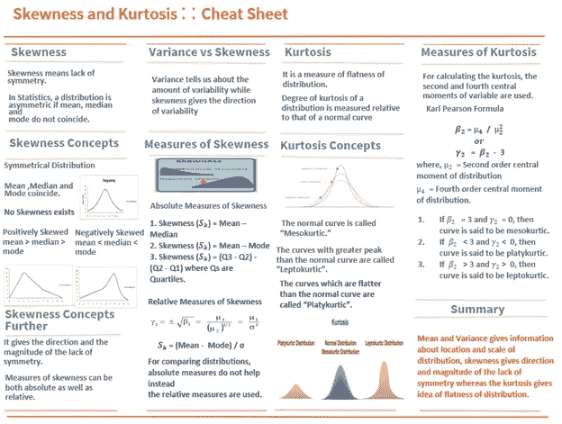
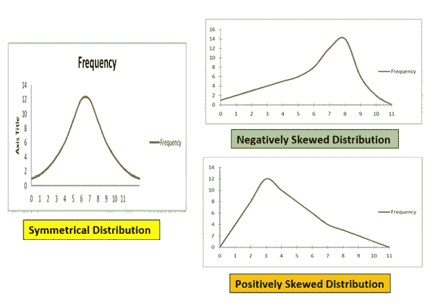
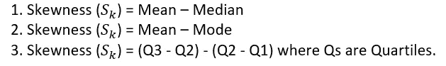
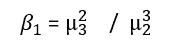
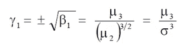
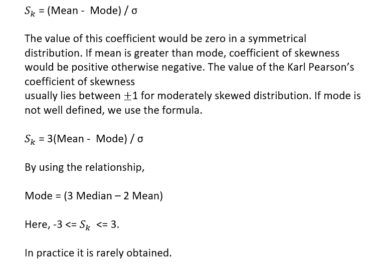
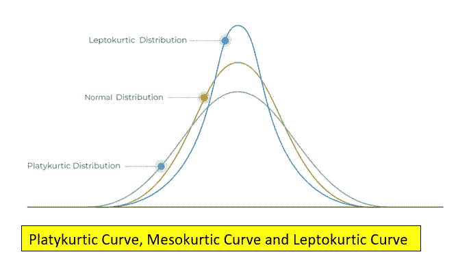
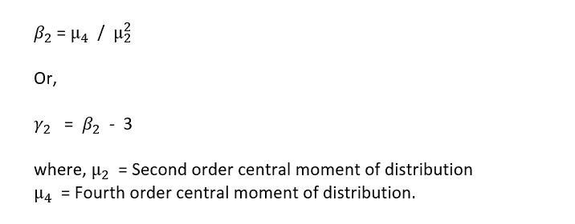
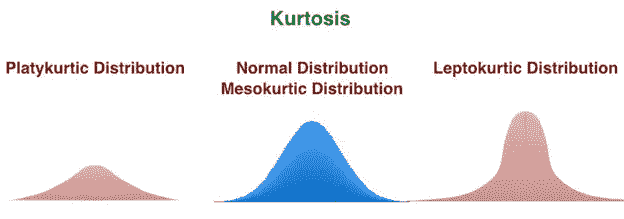
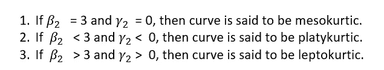

# 偏斜度和峰度——详细解释和备忘单…

> 原文：<https://pub.towardsai.net/skewness-and-kurtosis-explanation-in-detail-along-with-cheat-sheet-4ad2373169a8?source=collection_archive---------0----------------------->

## [机器学习](https://towardsai.net/p/category/machine-learning)

作者图片

B 在我们开始讨论偏度和峰度之前，让我简单解释一下矩，因为我们需要矩来理解偏度和峰度。

**决定性时刻**

在统计学中，矩被定义为解释分布的某些特征的度量。

通常，在任何频率分布中，获得四个矩，分别称为一阶(1)、二阶(2)、三阶(3)和四阶(4)矩。

一阶矩描述的是频率分布的均值信息，二阶矩描述的是方差信息，三阶矩描述的是偏度信息，四阶矩描述的是峰度信息。

均值和方差给出了关于分布的位置和规模的信息，偏度给出了缺乏对称性的方向和大小，而峰度给出了分布平坦性的概念。

**偏斜度的概念**

偏斜意味着缺乏对称性。

在数学中，如果一个图形中存在一个点，则称该图形为对称的。如果在 X 轴上画一条垂线，则该点将该图形分成两个全等的部分，即互为镜像。

在统计学中，如果均值、中位数和众数重合，则称之为对称分布。否则，分布将变得不对称。

如果右尾较长，我们得到正偏态分布，均值>中值>众数，而

如果左尾较长，我们会得到一个负偏态分布，这意味着方差和偏态之间的差异< median < mode.

The below figure depicts the Skewness.

**方差和偏度有两个重要的区别。**

**1.方差告诉我们可变性的数量，而偏度给出可变性的方向。**

**2.在商业和经济中，变异的度量比偏度的度量有更大的实际应用。然而，在医学和生命科学中，偏斜度比方差有更大的实际应用。**

****各种偏态度量****

**偏斜度的测量有助于我们了解分布偏离对称的程度和方向(正或负)。虽然正或负的偏斜度可以用图形来检测，这取决于右边的裁缝左边的尾巴是否更长，但我们不知道其大小。此外，对称和不对称之间的边界情况变得难以用图形检测。因此，需要一些统计测量来发现缺乏对称性的程度。**

****一个好的偏度度量应该具备以下标准:****

**1.它应该是无单位的，这样就对称性而言，不同分布的形状是可以比较的。**

**2.如果分布是对称的，度量值应该为零。类似地，如果分布分别具有正或负的偏斜度，则该度量应该给出正值或负值，并且**

**3.当我们从极端负偏度移动到极端正偏度时，度量的值应该相应地变化。**

**偏斜度可以是绝对的，也可以是相对的。因为在对称分布均值中，中位数和众数是相同的。男人越远离该模式，不对称或偏斜就越大。**

**偏斜度的绝对量度不能用于比较的目的，因为相同的偏斜度在具有小变化的分布和具有大变化的分布中具有不同的意义。**

****绝对偏斜度****

**以下是偏斜度的绝对度量:**

****

**为了比较分布，绝对测量没有帮助，而是使用相对测量，称为偏态系数。偏斜系数是独立于测量单位的纯数字。**

****相对偏斜度****

**为了对两个或多个分布的偏斜度进行相关比较，我们必须消除变异的分布影响。这种消除可以通过将绝对偏斜度除以标准偏差来完成。**

**以下是测量相对偏斜度的重要方法:**

****β和γ偏度系数****

**卡尔·皮尔逊定义了以下β和γ偏度系数，**

**基于第二和第三中心矩:**

****

**它被用作偏斜度的度量。**

**对于非对称分布，β1 应为零。β1 作为偏斜度的度量，并不说明偏斜度的方向，即正或负。因为 3 是平均值偏差的立方之和，可能是正的，也可能是负的，但 3 的平方总是正的。**

**另外，方差 2 总是正的。因此，β1 总是正的。如果我们计算卡尔·皮尔逊的γ系数γ1，它是β1 的平方根，即**

****

**那么偏斜度的符号将取决于 3 的值，无论它是正的还是负的。用γ1 作为偏斜度的度量是可取的。**

****卡尔·皮尔逊偏态系数****

**这种方法最常用于测量偏斜度。测量偏斜系数的公式由下式给出**

****

****关于偏斜度的要点****

**1.如果任何分布中的平均值、中值和众数都相同，则该分布中不存在偏斜度。这些值的差异越大，偏斜度就越大。**

**2.如果模式两侧的频率之和相等，则不存在偏斜。**

**3.如果第一个四分位数和第三个四分位数的距离与中位数相同，那么偏度就不存在。同样，如果十分位数(第一个和第九个)和百分位数(第一个和第九十九个)与中位数的距离相等。那么就不存在不对称。**

**4.如果从均值、中值或众数获得的正负偏差之和相等，则不存在不对称性**

**5.如果一个数据图成为一条正态曲线，当它在中间折叠，一部分完全重叠在另一部分上时，就不存在不对称。**

****峰度的概念****

**如果我们知道集中趋势、分散性和偏斜度的度量，即使这样我们也不能得到分布的完整概念。除了这些度量之外，我们需要知道另一个度量来获得关于分布形状的完整概念，这可以在峰度的帮助下进行研究。卡尔·皮尔逊教授称之为“曲线的凸性”。**

**峰度给出了分布平坦性的度量。**

**分布的峰度是相对于正态曲线的峰度来衡量的。峰值比正常曲线大的曲线称为“轻点曲线”。比正常曲线更平坦的曲线称为“扁平曲线”。正常曲线被称为“中 kurtic”下图描述了三条不同的曲线。**

****

**来源—[https://analyst prep . com/CFA-level-1-exam/quantitative-methods/Kurt osis-and-skewness-types-of-distributions/](https://analystprep.com/cfa-level-1-exam/quantitative-methods/kurtosis-and-skewness-types-of-distributions/)**

****峰度的度量****

****卡尔·皮尔逊对峰度的度量****

**为了计算峰度，使用变量的二阶和四阶中心矩。为此，卡尔·皮尔逊给出的下列公式被使用了:**

********

**来源—[https://prepnuggets.com/glossary/kurtosis/](https://prepnuggets.com/glossary/kurtosis/)**

****

****总结—****

**让我把偏斜度和峰度总结如下。**

**1.偏斜度给出了缺乏对称性的方向和大小，而峰度给出了分布平坦性的概念。**

**2.在无偏斜的对称分布中，均值、中位数和众数是一致的。**

**3.正偏态分布具有均值>中值>众数，而负偏态分布具有均值**

**4.偏斜度可以是绝对的，也可以是相对的，但是绝对的偏斜度不能用于分布的比较。**

**5.分布的峰度是相对于正态曲线的峰度来衡量的。峰值比正常曲线大的曲线称为“轻点曲线”。比正常曲线更平坦的曲线称为“扁平曲线”。正常曲线被称为“中 kurtic”**

**6.在商业和经济中，变异的度量比偏度的度量有更大的实际应用。然而，在医学和生命科学中，偏斜度比方差有更大的实际应用。**

**希望这篇文章有助于抓住偏度和峰度的症结。**

**感谢阅读！！！**

**你可以在媒体上跟踪我**

**LinkedIn: [Supriya Ghosh](https://www.linkedin.com/in/supriya-ghosh)**

**还有推特: [@isupriyaghosh](https://twitter.com/isupriyaghosh)**