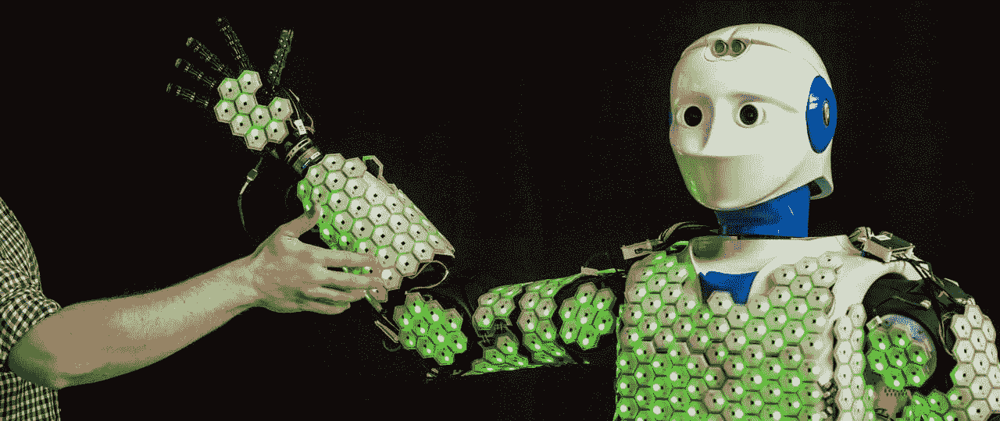

# 机器人的皮肤及其重要性

> 原文：<https://pub.towardsai.net/skin-for-robots-and-why-its-crucial-d9ffd542ace4?source=collection_archive---------2----------------------->

## [技术](https://towardsai.net/p/category/technology)

## 抱歉星球大战，这不是未来人形机器人的样子！

[莱曼·杰罗娜](https://unsplash.com/@lhgerona?utm_source=medium&utm_medium=referral)在 [Unsplash](https://unsplash.com?utm_source=medium&utm_medium=referral) 上拍摄的照片

根据《星球大战》, C-3PO 是未来人形机器人的一个惊人的例子。但是这个可怜的家伙有一个巨大的障碍:他的皮肤！
皮肤是人类最大的器官，那么为什么我们在设计机器人时对它的重视程度如此之低呢？抱歉星球大战，这不是未来人形机器人的样子！

# 皮肤与人类的相关性

皮肤对每个生物来说都至关重要，但当涉及到机器人的外观时，似乎只有少数科学家意识到它的重要性。除了赋予生物以感知方式与环境互动的能力，温度调节是我们皮肤最重要的功能之一。出汗是大自然为生物设计的绝妙机制，而局部出汗是当今人类可以指望的进步。

另一个很大的特点是能够提供对外部环境的屏障。皮肤防止我们失水，保护我们免受外来化学物质和微生物的侵害。这可以通过具有不同功能的各种皮肤层来实现。当然，由于人体最大的器官，我们的身体也得到了力量和硬度。

# 机器人的优势

人类的皮肤由几层组成。每一层都有独特的结构和功能，但在设计机器人时，它往往只是一个装饰性的目的。

为了使机器人能够感知他们的环境，慕尼黑工业大学的科学家们开发了用于机器人目的的人造皮肤细胞。此外，一个自组织网络建立了机器人的运动学模型，皮肤附着在它上面。利用多模态传感器信号，科学家们试图设计出更安全的机器人，能够识别接触以及接触前的交互。

*这张照片是由图姆的阿斯特里德·埃克特拍摄的*

上图所示的 [H-1 机器人](https://www.tum.de/nc/en/about-tum/news/press-releases/details/35732/)配备了 1260 个电池和 13000 多个传感器。细胞本身可以测量:

*   振动(加速度传感器)
*   压力(电容式力传感器)
*   预触摸(接近传感器)
*   温度(温度传感器)

然后，微控制器对每个电池上的传感器数据进行采样和过滤，并准备好信息进行分发。

实现这些六边形皮肤细胞不仅可以使人形机器人变得可以拥抱。正如 TED 演讲中所展示的，甚至机器人的脚也装有传感器，使它们对不平的地面更加负责，从而极大地提高了它们的行走能力。

研究电子皮肤的科学家们也发现了对人造皮肤的类似需求。各种类型的传感器需要分布在不同的区域。传感器的适当放置很重要，就像人体不同的敏感区域一样。传感器需要嵌入柔软和可拉伸的材料中，而组件需要快速响应和低功耗。然而，强大的处理能力对于处理大量生成的数据集是必要的。皮肤本身应该受益于一系列不同的传感器，如触觉、温度、气体和电化学传感器。

# 需要克服的挑战

Gordon Cheng 的团队必须应对的最大挑战之一是处理六边形皮肤细胞产生的大量数据。超过 1200 个细胞的多模式触觉信号需要大的通信带宽和大量的处理能力。不同的实施框架允许减少信息负载，但是冗余小区网络对于其操作仍然是至关重要的。

本质上，应用更多的细胞并不一定是更好的选择。科学家和工程师仍然需要在皮肤细胞可以为重要的机器人部件带来的好处和不太重要的领域需要妥协之间找到一种平衡。

# 结论

人类的皮肤是由细胞构成的，那么我们为什么不能尝试将皮肤细胞也应用到机器人身上呢？像 C-3PO 这种金属蒙皮显然不是为传感而生的。为了克服这个问题，科学家们正在研究类似的方法。

程的团队创造了一种由六角形细胞制成的自我校准人工皮肤，它可以自主工作。这种皮肤的最大优势是通过不同传感器提供的各种功能来提高安全性。由于预接触检测，机器人最终可以感知他们的环境，并防止伤害人类(甚至他们自己)。

尽管目前的研究领域还没有涵盖人类皮肤的一些特征，但第一概念可以带来大量新的机会，并可以使人类与机器人的互动更加安全。

## 参考资料:

[1]E . R . Nadel，R . W . Bullard 和 J A Stolwijk，[皮肤温度在出汗调节中的重要性](https://journals.physiology.org/doi/abs/10.1152/jappl.1971.31.1.80) (1971)，耶鲁大学医学院

[2]马里恩·吉尔里格斯，[皮肤层力学](http://www.mate.tue.nl/mate/pdfs/11390.pdf) (2010)，图·埃因霍温

[3] Emmanuel Dean-Leon，Florian Bergner，Karinne Ramirez-Amaro 和 Gordon Cheng，[从多模态触觉信号到柔顺控制](https://ieeexplore.ieee.org/abstract/document/7803378/?casa_token=XvYD8ht08nsAAAAA:U7OnPbJBw20jMMt7aF8Bto2lpKsnoNXzbXQ_VmX9-GYWwFM6JrTKRlry0tU0-v8InurJp-Vc-A) (2016)，IEEE-RAS 第 16 届国际仿人机器人会议

[4]R·达西亚，[电子皮肤:从人形机器人到人类](https://ieeexplore.ieee.org/abstract/document/8626774/) (2019)，格拉斯哥大学工程学院