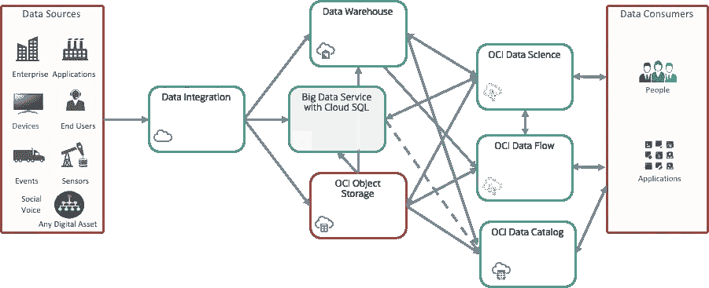
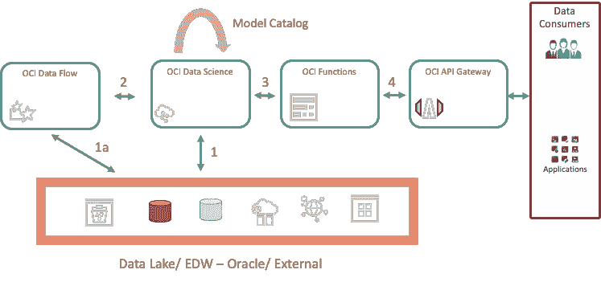
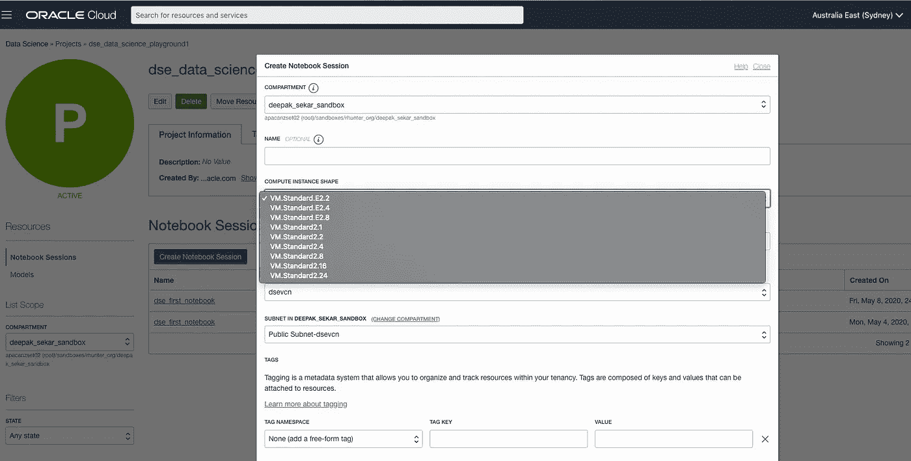
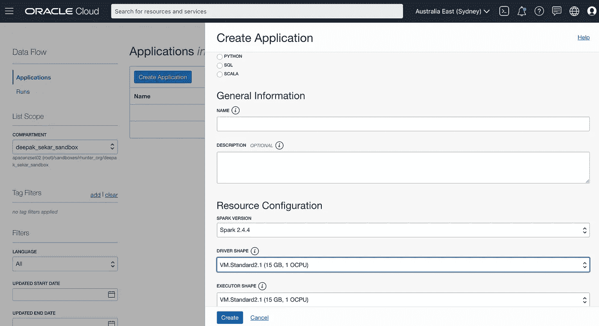

# 小型->大型->海量—从虚拟机到 BM 再到基于 Spark 的无服务器数据科学

> 原文：<https://pub.towardsai.net/small-big-massive-vm-to-bm-to-spark-based-data-science-d33b29d48594?source=collection_archive---------1----------------------->

## 云计算

我们听说大数据平台通过分布式计算支持 ML 工作负载。但是，您的数据科学工作负载是否总是需要大数据平台？

构建小规模、扩展大规模以及跨越数据的每个字节的灵活性如何？

## 这是什么意思？

让我们通过一步一步的流程来理解这一点。

## 数据存储在哪里？

主要是以下两个

1.  数据湖和
2.  数据仓库

## 数据工程在哪里做？

1.  本地服务器
2.  云中的虚拟机
3.  云中的裸机
4.  本地大数据集群
5.  基于云的大数据集群

## 数据科学在哪里做？

1.  本地服务器
2.  不含 GPU 的云中的虚拟机
3.  云中没有 GPU 的裸机
4.  本地大数据集群
5.  基于云的大数据集群
6.  内部数据科学环境
7.  基于云的数据科学环境

因此，看起来有些情况下小型环境可以满足需求，有些情况下需要大型集群。

分析/操作数据的开源方法

***小数据- >适度大数据- >大数据***

是通过使用

***熊猫- >达斯克- > PySpark***

为什么同样的逻辑不能用于扩展数据工程/数据科学工作负载的计算？

***VM->BM->Spark/*无服务器 Spark**

建立/维护 Spark 集群有多困难？猜猜看。无服务器/托管 Spark 集群就是答案

Oracle 的云基础设施数据科学和数据流提供了从 ***VM - > BM - >* 无服务器 Spark** (Oracle 云基础设施数据流)迁移的灵活性

这是如何实现的？



1.  您可以在开始时选择计算的形状
2.  使用 VM/ BM 建模/分析数据，并从数据湖(OCI 对象存储)、Oracle 数据库或外部数据源访问数据
3.  从 OCI 数据科学内部移交到无服务器 spark 集群(OCI 数据流)来运行 spark 应用程序
4.  在数据科学环境中访问结果/模型
5.  使用 OCI 函数和 API 网关部署模型(如果需要)



数据科学到数据流



OCI 数据科学



OCI 数据流

OCI 数据流支持

两种类型的模板:

1.  用于标准 PySpark 作业的`standard_pyspark`模板
2.  用于 spark SQL 作业的`sparksql`模板

从 OCI 数据科学公司移交到 OCI 的数据流

```
**from** ads.dataflow.dataflow **import** DataFlowdata_flow **=** DataFlow()**import** uuidpyspark_file_path **=** f"/home/datascience/dataflow/example-{str(uuid.uuid4())[**-**6:]}.py"# *Object Storage bucket*display_name **=** "<>"
bucket_name **=** "<>"*# Create app config (can choose driver and executor size & num)*app_config **=** data_flow.prepare_app(display_name,bucket_name,pyspark_file_path)app **=** data_flow.create_app(app_config)app.oci_linkrun_display_name **=** "sample new run"log_bucket_name **=** "dataflow-log"*#Create run config and run the spark application*run_config **=** app.prepare_run(run_display_name, log_bucket_name)runrun.stats*# Run - clickable link*run.oci_link
```

如果 PySpark 脚本将输出写回对象存储/数据库，那么您可以在运行后访问它。

欢迎来到数据科学的世界！

*如果你喜欢这篇文章，请不要忘记鼓掌:)*

所表达的观点仅代表作者的观点，不一定代表甲骨文的观点。你可以在媒体上找到我，我的名字是迪帕克·塞卡尔。

## 资源:

[](https://medium.com/towards-artificial-intelligence/5-different-ways-to-build-ml-models-138bf611245f) [## 构建 ML 模型的 5 种不同方法！

### 我们遇到了面向拥有 Python/ R/…的专家受众的数据科学平台和 ML 产品

medium.com](https://medium.com/towards-artificial-intelligence/5-different-ways-to-build-ml-models-138bf611245f) [](https://medium.com/towards-artificial-intelligence/what-how-why-in-the-world-of-data-science-9a9cc314a040) [## 什么？怎么会？为什么？—在数据科学的世界里！

### 在本文中，我们将看到数据科学过程中最重要的三件事

medium.com](https://medium.com/towards-artificial-intelligence/what-how-why-in-the-world-of-data-science-9a9cc314a040) 

*   甲骨文云基础设施数据流—【https://www.oracle.com/big-data/data-flow/ 
*   甲骨文分析云(OAC)—[https://www . Oracle . com/au/business-Analytics/Analytics-Cloud . html](https://www.oracle.com/au/business-analytics/analytics-cloud.html)
*   甲骨文机器学习(OML)-[https://www . Oracle . com/database/technologies/data warehouse-big data/Machine-Learning . html](https://www.oracle.com/database/technologies/datawarehouse-bigdata/machine-learning.html)
*   Oracle 自治数据库—[https://www.oracle.com/au/database/autonomous-database.html](https://www.oracle.com/au/database/autonomous-database.html)
*   甲骨文云基础设施数据科学—[https://www . Oracle . com/Data-Science/Cloud-infra structure-Data-Science-product . html](https://www.oracle.com/data-science/cloud-infrastructure-data-science-product.html)
*   Oracle 云对象存储—[https://www.oracle.com/au/cloud/storage/object-storage.html](https://www.oracle.com/au/cloud/storage/object-storage.html)