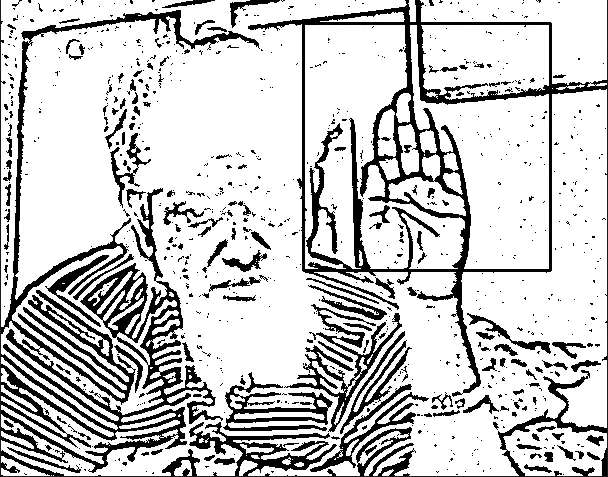
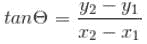
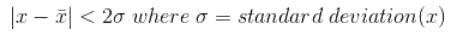
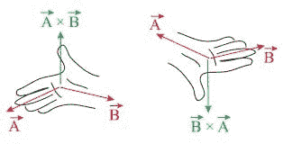
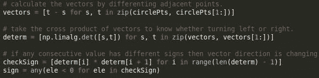
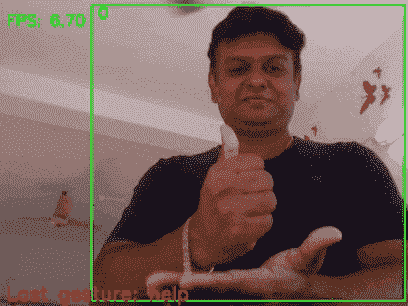

# 带手势报警的智能边缘摄像头

> 原文：<https://pub.towardsai.net/smart-edge-cam-with-gesture-alarm-1f9e0a98d33d?source=collection_archive---------0----------------------->

## [IoT](https://towardsai.net/p/category/iot)

*基于 RPi 或 Jetson Nano 上的 CV、向量凹度估计、OpenVINO、MQTT 和 Pimoroni Blinkt 的手势触发安全警报。*

尽管技术取得了显著的进步，但发展中经济体总体上仍受困于性骚扰、强奸或针对女性的犯罪等家长制罪恶。**女性通常不允许在深夜呆在自己的工作岗位上，即使在白天也不被认为是安全的，尤其是在发展中国家。当务之急是让另一半人口变得更加安全&富有成效。**为什么不用先进的技术来武装他们的力量呢？****

想象一下**一位** **的女士独自坐在诊所、商店、公司**，或者被隔离在其他地方，需要紧急救助。她可能没有机会或自由打电话。**监控摄像头应该足够智能**来检测她的手势，无论是手还是物体，作为 SOS 信号。类似的解决方案**可用于家中老人**、**、**发送请求或呼救。

小工具检测球的圆形手势。手势和对象可以改变。

让我们评估一下我们的选择，是使用图像处理、深度学习还是算术算法来分析来自带摄像头的 SoC 的输入视频帧，以触发警报。

本项目有 **3 个主要模块**，

a) **本地化对象**，用于触发事件。

b) **分析物体**的运动 **来识别信号**

c)**SoC 上的部署**在环境中安装小工具。

这是一个棘手的问题，因为**我们需要一个便宜的解决方案**以便于采用，但是**不能以准确性为代价，**因为我们在这里处理紧急情况。同样，检测定制物体更容易，但使用自己的身体发出紧急信号**更有用。记住所有这些，让我们讨论定位&手势检测的解决方案。**

**一)物体定位方法**

**i)物体检测**

我们可以使用硬件优化的 YOLO 来检测，比如说一部手机，并在配备 Movidius NCS 2 的 4GB Raspberry Pi 4B 上轻松获得**5–6 FPS。**我们可以训练 YOLO 去探测一个定制的物体，比如手。但是这个解决方案并不理想，因为 **NCS stick** **会抬高产品价格**(香草 YOLO 在 4GB RPi 4B 上几乎没有 1 FPS)。

**ii)多尺度模板匹配**

模板匹配**是一种基于 2D 卷积的方法**，用于在更大的图像中搜索和找到模板图像的位置。我们还可以使模板匹配**具有平移不变性和比例不变性**。

*   使用自适应阈值生成模板图像的**二进制掩模。模板图像包含要检测的对象。**
*   从 cam 中抓取帧并生成其二进制掩码
*   在列表中生成 0 和 1 之间的线性间隔点。
*   **通过 x 中元素的因子迭代调整输入帧的大小**。
*   使用 cv2.matchTemplate 进行**模板匹配**
*   找到匹配区域的位置，画一个矩形。

使用多尺度模板匹配的手部检测

但是为了检测**手势，即一个物体的一系列运动**，我们需要在所有帧中进行稳定的检测。实验证明手形模板多尺度匹配并不是在每一帧中都检测到一个物体。此外，如果您试图匹配旋转的对象**或显示非仿射变换的对象，模板匹配并不理想。**

**iii)使用计算机视觉进行物体颜色掩蔽**

为一种特定的颜色创建一个蒙版来根据它的颜色识别物体是非常高效的。然后我们可以**检查** **的尺寸** **和轮廓**的形状以确认找到。谨慎的做法是使用颜色不同的物体，以避免误报。

这种方法**不仅高效准确**，而且为使用纯数学模型进行**手势识别铺平了道路，**使其成为边缘的理想解决方案。下面给出了这种方法以及数学手势识别的演示。

**B)手势识别技术**

我们可以定义一个简单的手势，以便有效地检测。让我们将手势定义为圆周运动，现在我们尝试检测相同的运动。

**i)** **自相关斜率匹配**

*   沿着半径= r 的圆的圆周生成“n”个点

“I”表示圆上的第 n 个点

*   计算连接序列中每个点的直线的斜率，

*   使用上述任何一种物体定位方法生成点云。对于每一帧，将本地化对象的中心添加到点云。
*   计算连接序列中每个点的直线的斜率。
*   **计算以上步骤生成的斜率曲线**的相关性。
*   使用 np.argmax()找到相关曲线的**最大值的索引**
*   **按索引值旋转点云**队列以获得最佳匹配
*   计算**圆相似度= 1-点云之间的余弦距离**
*   如果相关性>阈值，则检测到圆圈并触发警报。

在实现时，发现上面的算法是有效的。但是实际上，局部点之间的距离根据旋转速度和 FPS 而变化。**另一个简洁而简单的解决方案是使用线性代数来检查点的移动是凸的还是凹的。**

**ii)凹度** **估计** **使用向量代数**

如果点云中的所有矢量都是凹的，那么它代表圆周运动。

*   通过求相邻点的差来计算矢量。
*   使用 np.linalg.norm 计算向量长度
*   通过定义边界分布排除异常向量

*   如果点之间的距离< threshold, then ignore the motion
*   Take the **矢量叉积检测左转或右转。**

右手法则:如果 B 从 A 逆时针方向，那么 AxB 指向上，否则向下

*   **如果任何连续值具有不同的符号，则方向正在改变。**因此，**计算一个滚动乘法。**

计算向量，取行列式，乘法后求符号

*   找出**方向改变的位置(曾经指数为负)**
*   计算负指数的方差
*   如果所有滚动乘法值> 0，则运动是循环的
*   如果负指数的方差>阈值，则运动是非圆形的
*   如果负值百分比>阈值，则运动是非圆形的
*   基于以上 3 个条件，检测到圆形手势。

从上面的讨论中，很明显，我们可以使用**对象颜色掩蔽(检测对象)**并使用**高效的基于代数的凹度估计(检测手势)。如果物体很远，那么只能看到一个小圆圈。所以我们需要**根据物体深度放大矢量，**不要错过手势。出于演示的目的，我们将把这些算法部署在一个带摄像头的 RPi 上，看看它的表现如何。**

现在让我们看看**手势检测数学黑客代码。**

如果检测到圆周运动，就会向相关人员发送消息，并触发警报。Pimoroni Blinkt 上的**闪烁“红色”灯显示事件触发！使用 MQTT 消息**和**通过 Twilio 集成向手机发送短信。**观看上面视频中的项目。

对于边缘设备上的手势检测，这是一种高效且实用的解决方案。请注意**你可以用** **任何物体代替******网球或者除了圆周运动**以外的任何手势。只是你需要相应地调整数学公式。可能唯一的缺点是，对极端光照条件的敏感性或需要外部物体(不是你的身体)来触发警报。**

**为了解决这个缺点，我们还可以使用由 OpenVINO 优化的**手势识别模型来识别手语**并触发警报。你也可以训练自己的自定义手势，如这里的[所述](https://github.com/openvinotoolkit/training_extensions/tree/develop/models/action_recognition/model_templates/custom-action-recognition)。**

****

**但是，此类 OpenVINO 模型的某些层不被 MYRIAD device 支持，如表[所示。](https://docs.openvinotoolkit.org/latest/omz_models_intel_device_support.html)因此，该模块需要作为 API 托管在远程服务器上，而不是 RPi 上。**

**或者，**训练手势分类模型，并将**转换为 OpenVINO 中间表示格式，以部署在 SoC 上。**

**1.首先，**选择针对低功耗硬件的高效对象检测模型**，如 **SSD-Mobilenet、Efficientdet、Tiny-YOLO、YOLOX** 等。在 RPi 4B 上对所有这些模型进行了**实验** **之后，我们发现 SSD-Mobilenet 可以提供最高的 FPS。****

**2.**使用您的自定义数据**对目标检测模型**进行迁移学习****

**3.**转换**经过训练的*。pb 文件**到中间表示** — *。xml 和*。使用**模型优化器的 bin。****

> **export PATH = "<omz_dir>/deployment _ tools/inference _ engine/demos/common/python/:$ PATH "</omz_dir>**
> 
> **python 3**<OMZ _ 目录>/部署 _ 工具/模型 _ 优化器/mo_tf.py** —输入 _ 模型<冻结 _ 图形. pb > —反向 _ 输入 _ 通道—输出 _ 目录<输出 _ 目录>—tensor flow _ object _ detection _ API _ pipeline _ config<SSD _ mobilenet _ v2 _ coco . config>—tensor flow _ use _ custom _ operations _ config<OMZ _ 目录**
> 
> **python 3 object _ detection _ demo . py-d CPU-I<input_video>—labels labels . txt-m<location of="" frozen_inference_graph.xml="">—在 ssd 上</location></input_video>**

**4.最后，**在 Pi 上部署硬件优化模块**。**

**在一个类似的实验中，一个经过**训练的手势分类模型被部署在 Jetson Nano 上，几乎没有 3-5 FPS。**这样效率不高，而且硬件成本也更高。请注意，手势触发器不仅可以用于发出紧急信号，还可以传递消息。**

**总之，我们可以认为**矢量代数模型**是一种**高效、廉价、通用的手势检测解决方案**。另一种检测手势的创造性方法是**使用 Pico4ML 等 SOC 上的板载 IMU**来识别手势。只需戴上你的创意帽子，用数学方法模拟其他几何形状！**

**此解决方案的源代码可从[这里](https://github.com/AdroitAnandAI/Gesture-Triggered-Alarm-on-Pi-or-Jetson-Nano)获得**

*****如果您有任何疑问或建议，可以联系我*** [***这里***](https://www.linkedin.com/in/ananduthaman/)**

# **参考**

*   ****书:大学物理 I —经典力学**。叉积和旋转量。https://phys.libretexts.org。**

 **[## 开放式模型动物园演示- OpenVINO 工具包

### 开放式模型动物园演示应用程序是控制台应用程序，提供强大的应用程序模板来帮助您…

docs.openvinotoolkit.org](https://docs.openvinotoolkit.org/latest/omz_demos.html)**