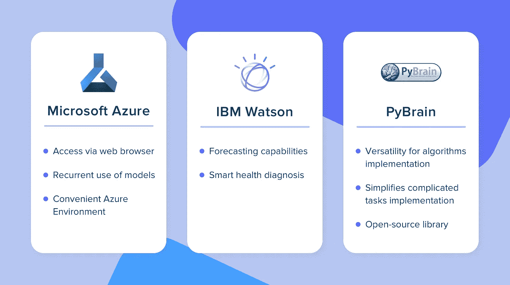
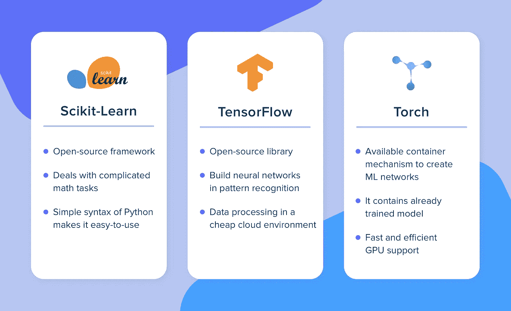
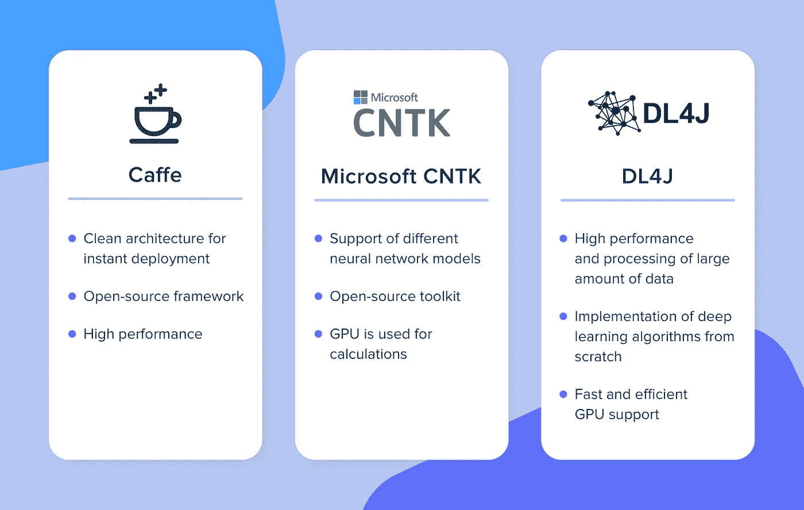
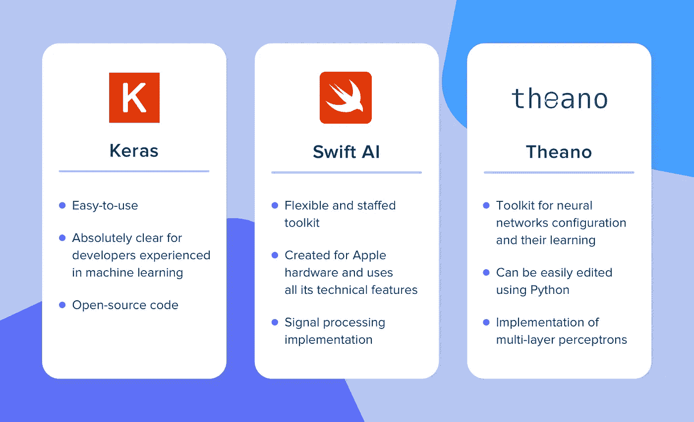

# 聪明中的聪明:12 个让软件智能化的人工智能工具

> 原文：<https://pub.towardsai.net/smartest-of-the-smart-12-ai-tools-to-make-software-intelligent-6319d87cd4de?source=collection_archive---------2----------------------->

## 如何为你的软件选择一个合适的人工智能库

环顾四周，世界上正在发生一些令人震惊的事情。汽车在自动驾驶模式下穿过街道，一些名叫“Alexa”的女孩可以管理你家里所有的电器，并给你的孩子讲睡前故事。

根据最近的研究，人工智能将在 2029 年前多次战胜人类智能。如今，智能手机使用人工智能集成来制作高质量的照片或提供虚拟助理功能。所以，这个隐藏在处理器深处的合成大脑可以让你的软件变得更好。

然而，今天有不同的人工智能领域。如果你对这个话题感兴趣，你肯定听说过深度学习、数据科学等概念。

既然这个介绍吸引了你的注意力，那么让我们来看一下开发人员用来在他们的项目中集成 AI 的所有工具的列表。此外，我们将阐明人工智能与机器学习和数据科学之间的差异。

# 机器学习框架和库

首先，我们将讨论机器学习的工具。其中有些值得一提。

## Azure 机器学习工作室

这是一个由微软开发的机器学习解决方案，允许您对您的数据建立、测试和部署预测分析。此外，这是一个基于云的解决方案，所以所有的操作都在云上处理。在 Azure ML 的帮助下，工程师可以设计用于改善客户服务、建立预测、预测设备故障等的功能。

**优势**:

*   **方便**。基于云的处理、通过浏览器的访问和一组协作功能使 Azure ML studio 成为一个有用的、易于访问的解决方案。
*   **支持多种算法**。Azure ML 提供了大量可以轻松配置的著名算法。你甚至不需要数据科学或算法理论的实践经验。你只需要知道什么时候使用这些算法。
*   **微软标准的文档**。如果你曾经和。NET 文档，然后你就意识到微软文档有多详细了。Azure ML 提供了从快速入门和教程到部署和管理商业机器学习解决方案的文档。

## IBM 沃森

这是一个自给自足的系统，能够学习、理解和预测。IBM Watson 由于其广泛的功能性，可以应用于科学技术的各个领域。一些使用案例是:预测政治和体育事件的结果，基于监测旋风和大气条件预测自然灾害等。

IBM Watson 向第三方应用和服务提供 API。基于这个 API 平台，开发人员可以实现语音到文本的功能，机器学习和数据科学，在人工智能的整个生命周期中跟踪其结果。此外，使用 Watson 的助手开发人员可以在他们的应用程序中构建对话界面。Watson 目前包含大约 50 个可用的 API。

**优势**:

*   **安全性提高**。IBM Watson 可以帮助您的公司提高数字信息和流程的安全性。网络安全专家使用机器学习来高精度地检测他们系统中的漏洞。
*   **收集员工情报**。这种 ML 软件还可以帮助确定员工的行为模式，并估计他们的情绪，以改善工作条件，团队合作和个人表现。

因此，IBM Watson 旨在创造简化工作、让生活更舒适的软件。

## PyBrain

该库通过消除各种库的使用，为算法实现提供了多功能性。它突出了算法，而不是其实现的特殊性。PyBrain 通过提供 Python 简洁语法和各种机器智能算法的组合获得了顶级地位。

**优点**:

*   **灵活的算法实现环境**。它提供了一个一体化的解决方案，因此您在处理算法时不必考虑额外的库。
*   **优雅在于简单**。PyBrain 大大简化了算法的使用。可以快速实现各种复杂的算法和方法。
*   **开源**。PyBrain 是一个开源的人工智能库，因此每个开发人员都可以对它做出贡献。

## sci kit-学习

机器学习的一个分支是数据挖掘。所以，是时候为数据科学家们介绍一个简单高效的工具了。Scikit-Learn 基于几个流行的 Python 包，特别是 NumPy、SciPy 和 matplotlib。这个库处理数据处理、分类和聚类任务。因此，它是数据可视化、分析、异常检测等的完美解决方案。

**优点**:

*   Scikit-Learn 提供了许多非常有用的工具，用于数据分割、计算统计数据、处理矩阵运算。
*   Scikit-Learn 有很好的文档和平衡且易于使用的 API。
*   NumPy 集成。

## 张量流

它是一个高效的面向数据流的机器学习库，由谷歌创建，后来在 2015 年开源。基本上，TensorFlow 是一个用于复杂数学运算的低级工具，其受众是知道如何构建学习架构并将其转化为运算软件的研究人员。换句话说，这是一个编程系统，你可以用图形来表示计算。

**优点**:

*   **它是一个模块化软件**。这意味着它的某些部分可以是独立的。
*   **简单的施工方法**。你可以很容易地想象出图表的每一部分。
*   **CPU 和 GPU** 。在 CPU 和 GPU 上都可以使用。
*   **开源**。TensorFlow 是可定制和开源的。

## 火炬

Torch 是科学计算的库，基于编译的 LuaJIT，为机器学习提供 API。该库被分成负责神经网络过程的不同阶段的模块。其中一些负责神经网络结构，另一些负责优化学习过程，等等。一些功能可以通过安装额外的模块来添加。

**优点**:

*   在 Torch 中，一切都是编译的，因此根据代码的不同，与其他机器学习库相比，您可能具有性能优势。
*   Torch 使用容器机制创建复杂的 ML 网络。
*   这个库包含已经训练好的模块。
*   Torch 提供动态计算图，因此网络可以在执行时改变行为。这对于调试和构建复杂的模型很有帮助，允许 PyTorch 的表达式被自动区分。

# 深度学习框架和库

深度学习是基于具有表示学习的人工神经网络的机器学习的一个子领域。这种学习方式很深奥，也更复杂。因此，让我们来看几个简化深度学习的工具。

## 咖啡

Caffe 是一个用 C++编写的开源框架，但同时，它是为商业用途而发布的。它还允许用 Python 编写算法。Caffe 专注于语言和图像识别，机器视觉，多媒体。它在速度和可扩展性方面进行了很好的优化，因此该框架通过使用人工智能为学术项目和商业应用程序提供了解决方案。

**优点**:

*   构建应用原型的预训练模型。
*   与其他框架配合良好。
*   开源软件，允许你控制集成和修改你需要的代码。
*   C++提供的高性能使 Caffe 成为深度学习人工智能框架的领导者之一。

## CNTK

微软认知工具包(CNTK)是一款面向商业分发的开源深度学习工具。它将神经网络表示为有向图上的一系列计算步骤。该工具包用于语音识别案例，例如，Windows Cortana、Skype Translator 等。它还可以用于翻译软件和图像识别。它是用 C++语言开发的。

**优点**:

*   CNTK 是省时的。它可以比很多深度学习软件更快地训练系统。
*   可以在企业系统和基准测试任务上实现一流的性能。
*   CNTK 支持多种任务，如语音、图像和文本识别等。
*   CNTK 处理不同的网络模型——卷积、前馈、递归神经网络及其组合。

## 深度学习 4j

DeepLearning4j 是用 Java 编写的，兼容每一种 Java 虚拟机语言，如 Kotlin、Scala 或 Clojure。主要的计算是用 C、C++和 Cuda 编写的。这个库是为商业应用开发的。由于 Apache Spark 和 Hadoop 框架，DL4j 利用了分布式计算。

**优势**:

*   高性能和处理大量数据，同时使用多 GPU。
*   库是完全开源的，由开发者和社区维护。
*   DL4j 很灵活，可以让你结合不同类型的深度学习网络。

## 克拉斯

Keras 是深度学习的高级 API。它是用 Python 写的，最显著的好处是你可以在所有最新的深度学习库或框架之上运行 Keras，比如 Theano、TensorFlow、Torch 等。此外，它是为执行快速实验而开发的。Keras 提供了在最短的时间内从一个想法中获得结果的能力。

由于 TensorFlow 的受欢迎程度，Keras 与这个库有着密切的联系。许多科学家更喜欢使用 Keras 在 TensorFlow 中导航。这降低了构建一个输出错误结论的模型的可能性。

**优点**:

*   由于省略了一些底层的 API 细节，因此易于使用。
*   Keras 是基于 Python 的，这就是为什么它能与庞大的 Python 数据科学生态系统很好地集成。
*   详细的、组织良好的文档。
*   开源代码。
*   随着想法的出现进行实验的能力。

## 迅捷人工智能

这是一个为 Swift language 创建的库，只能在 Mac 电脑上使用。Swift AI 主要用于设计神经网络和深度学习算法。Swift AI 的领域被认为是书面语音识别。

**优点**:

*   专为苹果硬件设计，使用其所有功能。
*   斯威夫特很快。Swift 背后的 LLVM 编译器高效且高度优化，因此 Swift 在性能上接近 C。
*   信号处理实现。
*   Swift 离硬件很近，所以更容易检查代码，比如用 Python。

## Theano

Theano 是用于科学计算的 Python 库。它简化了神经网络的创建，并为模型架构提供了灵活性。另一个重要因素是不同 Python 库的可用性，特别是科学计算和可视化库。其中最著名的是 NumPy、SciPY 和 ScikitLearn。

然而，这些优势甚至不会影响整体性能。关键是，ano 的关键部分要么作为本机代码模块执行，要么动态转换成 C 代码。这就是在使用 Python 时实现 C 级性能的方法。

**优点**:

*   由于神经网络创建的简单性，深度学习的低水平进入门槛。
*   C 语言应用程序级别的性能，同时拥有 Python 语言的所有优势。
*   使用多层感知器、递归神经网络、自动编码器等。

# 人工智能能力的未来展望

我们已经走过了十几个工具，它们可以通过添加人工智能来显著改变你的应用程序。但与对我们生活各个领域的潜在影响相比，移动应用只是沧海一粟。

除了数据结构化、文本和图像识别，今天，人工智能还被用于许多不同的任务。

医生在日常工作中使用 AI 作为次要辅助，例如心率分析，为患者提供常见问题软件等等。此外，汽车制造商使用人工智能来提高传输质量和开发附加功能，如自适应巡航控制和自动驾驶。

机器学习应用于银行业，以估计金钱损失和识别不可靠的客户。此外，一些应用程序帮助用户根据他们的消费模式优化他们的支出。

不太受欢迎但仍然非常有趣的是 AI 在音乐领域的贡献。根据给 AI 的音乐集，在算法的帮助下，机器可以创作出前所未有的独特作品。其中一个例子是 AIVA，这款基于人工智能的软件可以创作不同流派的音乐，如流行音乐、摇滚音乐、中国民间音乐等。

总而言之，随着技术的发展，人工智能越来越好。在某些领域已经比人类强了，到时候 AI 会把世界变得面目全非。至于现在，每个打算开发应用的人都可以在里面集成 AI。但是为了正确处理这项任务，你应该将这项任务分配给专业团队。

**作者简介**

Vitaly Kuprenko 是 Cleveroad 的技术作家。这是乌克兰的一家安卓和 T4 iOS 应用开发公司 T5。他喜欢讲述技术创新和推动商业发展的数字化方式。