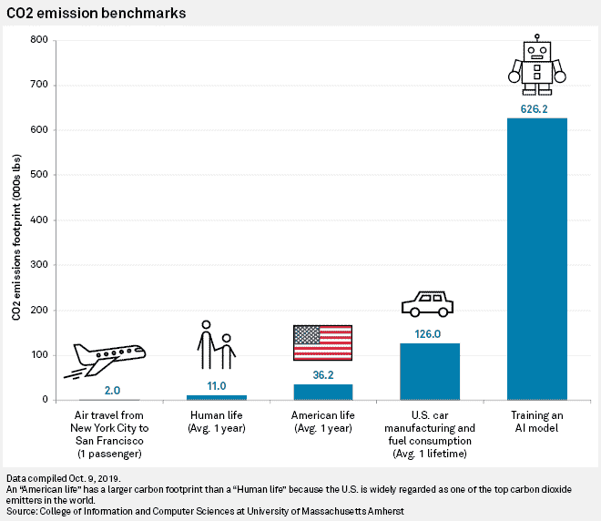
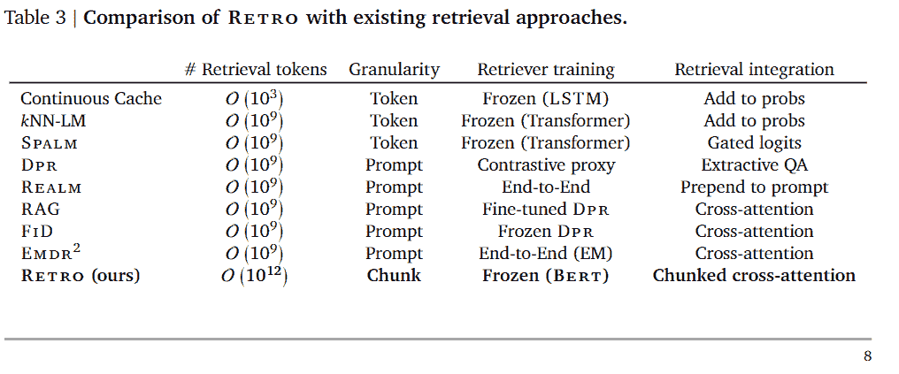
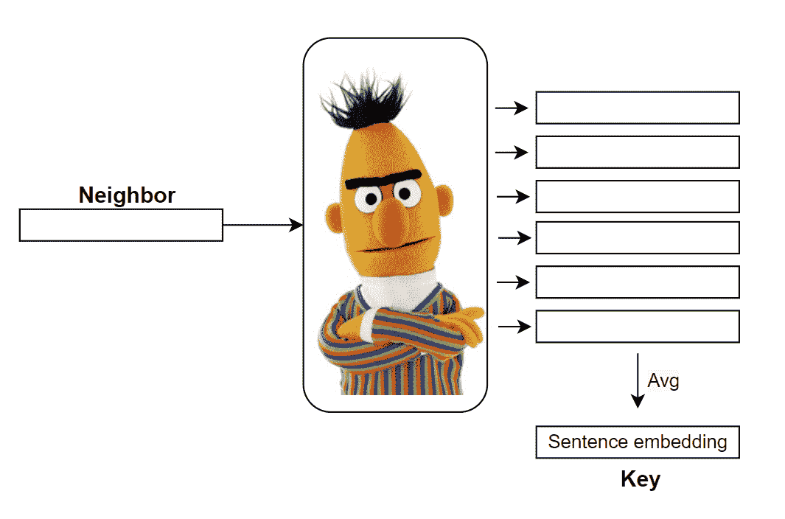
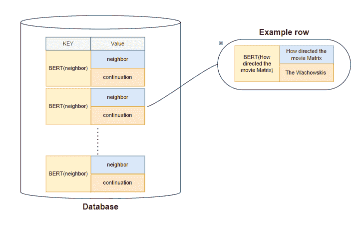
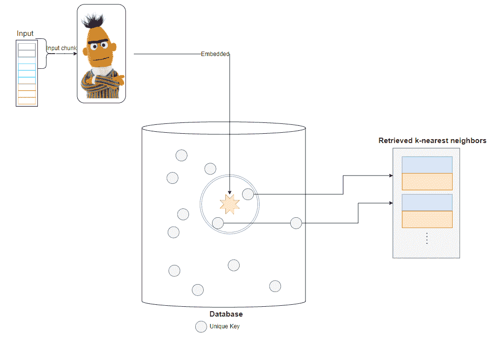
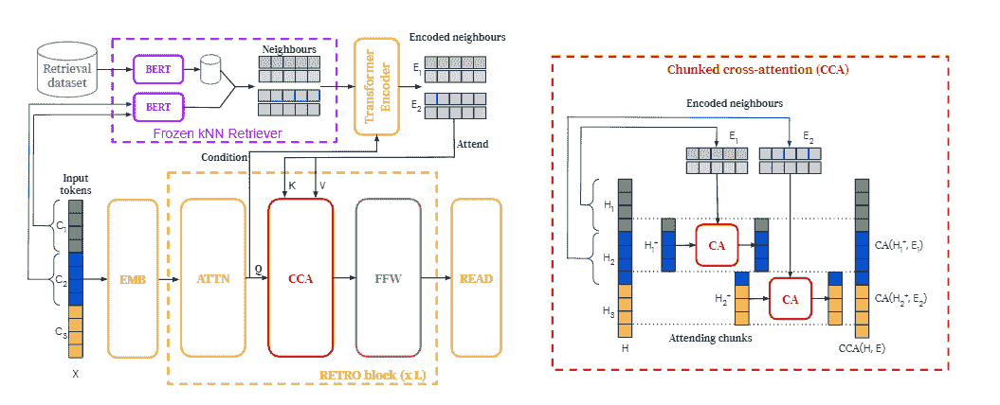

# 所以我们需要的是恢复？

> 原文：<https://pub.towardsai.net/so-retrieval-is-what-we-needed-9485e4f9e939?source=collection_archive---------0----------------------->

## [人工智能](https://towardsai.net/p/category/artificial-intelligence)

上个月，DeepMind 发布了他们的新 NLP 模型，名为 [RETRO](https://arxiv.org/pdf/2112.04426.pdf) (检索增强变压器)，根据该论文，这是 NLP 世界在多个方面的一次飞跃。一个值得注意的是，虽然这个模型取得了与 SOTA 建筑相当的结果(例如， [GPT-3](https://arxiv.org/abs/2005.14165) )，但它比 [AI21 侏罗纪-1](https://uploads-ssl.webflow.com/60fd4503684b466578c0d307/61138924626a6981ee09caf6_jurassic_tech_paper.pdf) 的 178B 参数小 25 倍，只有 7.5B 参数。

这打破了越大的模型意味着越准确的假设。

较小模型的主要优势在于，它们意味着更短的训练时间，因此计算时间和能源更少，总体碳足迹更小。客观地说，在一个 NVIDIA Tesla V100 GPU 上训练 GPT-3 需要 355 年，估计计算时间成本约为 500 万美元(训练 GPT-3 OpenAI 使用 1024 个 A100 GPU，仍然达到约 34 天的天文训练时间)。就碳而言，它在训练期间产生了相当于 85，000 公斤的二氧化碳！这相当于驾驶 120 辆汽车一整年产生的二氧化碳量！除此之外，由于其高昂的训练成本，定期重新训练大型语言模型以纳入新的数据、语言、规范，或者在公平和偏见方面更新模型是极其昂贵的。

来源: S & P 全球

较小模型的另一个优势是，虽然大型语言模型在与从网络或其他来源收集的大型训练数据集结合时可以完美地记住它们的部分训练数据，从而带来隐私和安全问题，但较小的模型不太容易出现这种情况，*如* [*Gehman 等人(2020)*](https://aclanthology.org/2020.findings-emnlp.301/) *所示。* [*本德等人(2021)*](https://dl.acm.org/doi/10.1145/3442188.3445922)

## 那么，为什么近年来模特的尺寸增加了这么多呢？

直到最近，当我们谈到 NLU 模型时，我们分析了文本背后的语言逻辑，并做出了相应的回应。近年来，我们正在尝试(并希望)解决更多知识密集型任务，如问答，为此我们需要将更多关于世界的知识集成到模型中。问答任务的一个例子可能是— *电影《黑客帝国》是什么时候发行的？*

利用语言学，我们只能理解我们正在搜索一个日期而不是一个名字，但是如果我们对得到正确的答案感兴趣，模型需要在某个地方存储这些知识。增长的另一个原因是计算能力的可用性越来越高，GPU 处理器的进步明确允许模型和所需训练周期的快速增长。

## **检索哲学**

不用增加模型的大小和训练更多的数据，而是让模型能够在执行预测时直接访问大型数据库，这是一种半参数方法。

与检索方法最相似的是开卷考试和闭卷考试的区别。

而在闭卷考试中，人们需要学习和记忆所有的考试材料。在开卷考试中，你只需要理解材料的本质，在哪里寻找正确的答案，以及如何从给定的材料中提取正确的答案。

检索的概念(在 NLP 模型中)并不新鲜，在几篇论文中已经对 NLU 模型提出了建议，包括 [Grave 等人](https://openreview.net/forum?id=B184E5qee)的“使用连续缓存改进神经语言模型”和从 [Meta-AI](https://arxiv.org/abs/2005.11401) 或机器翻译工作中基于源句子之间的编辑距离检索翻译对并使用最接近的检索目标句子指导翻译输出的检索增强生成，如[张等人(2018)](https://arxiv.org/abs/1804.02559) 和[顾等人(2018)](https://www.aaai.org/GuideBook2018/17282-74380-GB.pdf)

下面我重点介绍 DeepMind 实现的检索机制，据我(和他们)所知，这是第一个展示将检索数据库扩展到数万亿个大型参数语言模型的好处的工作。

*来源:通过从数万亿个标记中检索来改进语言模型*

## **那么这个神奇的检索方法是什么呢？**

在高层次上，检索模型获取输入，并从给定的数据库中检索与输入相似的信息，以将其合并到模型中，从而改进网络的预测。

DeepMind 复古模型的检索增强架构的新颖性在于，它被设计为能够从拥有数万亿项的数据库中检索数据，并能够使用分块交叉注意力方案将其纳入模型。这实现了与计算时间和存储需求的线性相关。

首先，为了实现检索机制，我们需要构建一个键-值数据库，其中值是原始的文本标记块，键是冻结的嵌入。追溯模型中的关键字由冻结的预训练 BERT 模型生成，以避免在训练期间必须周期性地计算整个数据库的嵌入。

*来源:*作者

根据任务的不同，该值可以是各种各样的东西，例如在问答任务中，该值可以是邻居(问题)的元组— continuation(答案)。

*来源:*作者

在训练阶段，每个训练序列被分成组块，然后使用冻结的 BERTs 嵌入这些组块。从数据库中，检索每个块的 k 个最近邻，以便稍后在追溯块中进行扩充。

*来源:*作者

然后，编码器-解码器架构将检索组块集成到模型的预测中。

检索到的信息通过变换器编码块，以便能够被合并到复古模型的解码器部分。实际上，在复古模型中，从第 9 个复古模块开始，每隔三个模块(即 9、12、15…32)就要加入一个

*来源:通过从万亿令牌中检索来改进语言模型:复古架构—复古架构。左图:简化版本，其中长度为𝑛 = 12 的序列被分成𝑙 = 3 的大小为𝑚 = 4 的块。对于每个块，我们检索𝑘=𝑟的 2 个邻居=每个 5 个令牌。检索路径显示在顶部。右图:Cca 运算符中交互的详细信息。因为第一组块的邻居仅影响第一组块的最后一个记号和来自第二组块的记号，所以因果关系得以保持。*

## **检索的优点**

检索的明显优势是可以使用更小的模型而不损失准确性。在实践中，这对训练(或为模型更新而重新训练)和推理时间有有益的影响。更重要的是，保持检索模型是最新的，可能只需要更新检索数据库就足够了，这比从头开始重新训练模型要便宜几个数量级。

此外，如果在训练后发现部分训练数据是有偏差的或有害的输出，则检索允许一些校正，因为违规的检索数据可以被追溯性地过滤。

## **总结**

我故意不想太深入模型的机制。该模型已经在许多文章中进行了分析，当然，您可以随时阅读 Deepmind ( [链接](https://arxiv.org/pdf/2112.04426.pdf))的完整文章。

在我看来，检索的概念是革命性的，值得额外关注(双关语)。范式的转变是，与其收集和标记大量的数据来教我们的模型，不如让我们看看如何教模型分析信息，只给模型我们认为可能与他相关的信息来提取这些数据。

如今，对信息的访问是无止境的，对我们人类来说，搜索网络和分析给定的信息比记住所有东西更直观，所以为什么模型不应该这样做呢？

就像“注意力”让我们看到句子中的上下文一样，检索等方法可以帮助我们将模型与相关信息联系起来。

这可能是迈向通用人工智能模型的第一步，通过在模型中嵌入从庞大的数据库中提取特定任务信息的能力，以提高广泛任务的准确性。

此外，由于我们可以直接可视化或修改检索机制提供的邻居，我们可以获得对模型输出的更多洞察，从而提高模型的可解释性。

展望未来，接下来要问的问题可能是:我们今天如何改进现有的语言模型？有没有可能把这种检索方式推广到其他不太直观的地方？我们的数据库大小限制是多少？我们能改进我们的数据库查询吗？还有很多。

日子会证明一切

顺便说一下，黑客帝国于 1999 年 3 月 24 日发布:)

## 参考

[https://deep mind . com/research/publications/2021/improving-language-models-by-retrieving-from-万亿令牌](https://deepmind.com/research/publications/2021/improving-language-models-by-retrieving-from-trillions-of-tokens)

Borgeaud，s .，Mensch，a .，Hoffmann，j .，Cai，t .，Rutherford，e .，Millican，k .，… & Sifre，L. (2021)。通过从数万亿个标记中检索来改进语言模型。https://arxiv.org/pdf/2112.04426.pdf*arXiv 预印本 arXiv:2112.04426* -

Lewis，p .，Perez，e .，Piktus，a .，Petroni，f .，Karpukhin，v .，Goyal，n .，… & Kiela，D. (2020)。知识密集型自然语言处理任务的检索增强生成。arXiv 预印本 arXiv:2005.11401 。[https://arxiv.org/abs/2005.11401](https://arxiv.org/abs/2005.11401)

格雷夫，e .，乔林，a .，&乌苏尼尔，N. (2016)。用连续缓存改进神经语言模型。 *arXiv 预印本 arXiv:1612.04426* 。——【https://openreview.net/forum?id=B184E5qee 

[http://jalammar . github . io/illustrated-retrieval-transformer/](http://jalammar.github.io/illustrated-retrieval-transformer/)

Gehman，s .，Gururangan，s .，Sap，m .，Choi，y .，& Smith，N. A. (2020)。真实毒性提示:评估语言模型中的神经毒性退化。 *arXiv 预印本 arXiv:2009.11462*-[https://aclanthology.org/2020.findings-emnlp.301/](https://aclanthology.org/2020.findings-emnlp.301/)

张，j .，Utiyama，m .，Sumita，e .，Neubig，g .，& Nakamura，S. (2018)。用检索到的翻译片段指导神经机器翻译。 *arXiv 预印本 arXiv:1804.02559*-[https://arxiv.org/abs/1804.02559](https://arxiv.org/abs/1804.02559)

顾，王，周，李(2018 年 4 月)。搜索引擎引导的神经机器翻译。在*https://www.aaai.org/GuideBook2018/17282-74380-GB.pdfAAAI 人工智能会议论文集*(第 32 卷，№1)

本德，E. M .，t .格布鲁，麦克米兰-梅杰，a .，& Shmitchell，S. (2021 年 3 月)。论随机鹦鹉的危险:语言模型会不会太大？🦜.在*2021 年 ACM 公平、问责和透明会议记录*(第 610-623 页)[https://dl.acm.org/doi/10.1145/3442188.3445922](https://dl.acm.org/doi/10.1145/3442188.3445922)

Lieber，o .，Sharir，o .，Lenz，b .，& Shoham，Y. (2021)。侏罗纪-1:技术细节和评估。*白皮书。AI21 实验室*。—[https://uploads-SSL . webflow . com/60fd 4503684 b 466578 c0d 307/61138924626 a 6981 ee 09 caf 6 _ Jurassic _ tech _ paper . pdf](https://uploads-ssl.webflow.com/60fd4503684b466578c0d307/61138924626a6981ee09caf6_jurassic_tech_paper.pdf)

[https://fortune . com/2021/04/21/ai-carbon-footprint-reduce-environmental-impact-of-tech-Google-research-study/](https://fortune.com/2021/04/21/ai-carbon-footprint-reduce-environmental-impact-of-tech-google-research-study/)

[https://www . sp global . com/market intelligence/en/news-insights/trending/hyvwuxmo 9 ygqhfj 7j 6 tgla 2](https://www.spglobal.com/marketintelligence/en/news-insights/trending/HyvwuXMO9YgqHfj7J6tGlA2)

[https://www . the register . com/2020/11/04/gp T3 _ carbon _ footprint _ estimate/](https://www.theregister.com/2020/11/04/gpt3_carbon_footprint_estimate/)

[https://ai . Facebook . com/blog/retrieval-augmented-generation-streaming-the-creation-of-intelligent-natural language-processing-models/](https://ai.facebook.com/blog/retrieval-augmented-generation-streamlining-the-creation-of-intelligent-natural-language-processing-models/)