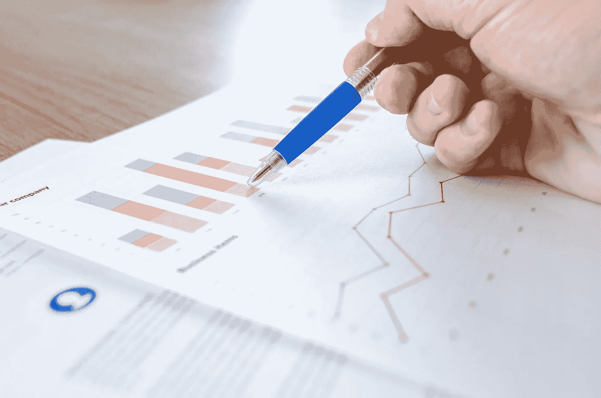
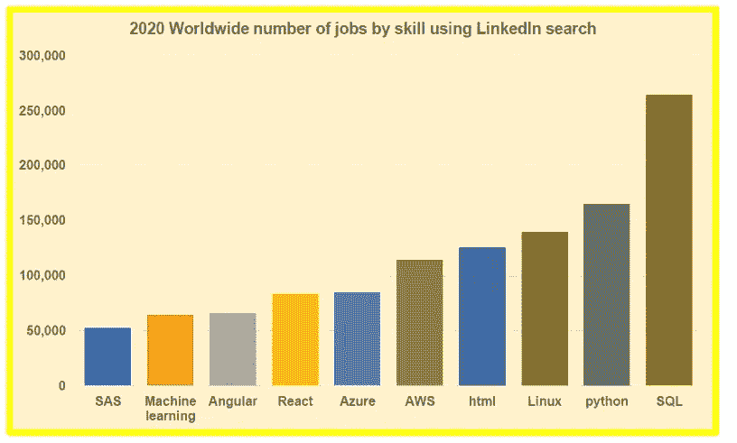

# 所以你想成为一名数据科学家

> 原文：<https://pub.towardsai.net/so-you-want-to-be-a-data-scientist-79517988dd4e?source=collection_archive---------1----------------------->

## 这是我的数据科学成功秘诀

图像来源:[像素](https://www.pexels.com/photo/chart-close-up-data-desk-590022/)

D ata 无处不在，从电子商务销售、应用下载到智能手机，再到供应链管理、生物信息学或互联设备。根据 IBM 的数据，2019 年，企业每天都在创建和存储近 2.5 万亿字节的数据。大数据是大业务，企业在有价值数据的海洋中游泳。作为增长最快、价值数十亿美元的行业之一，企业和组织正试图充分利用数据，他们已经拥有并确定了仍需要捕获和存储的数据。此外，对于数据科学家来说，理解这些数字并发现混乱的业务问题的隐藏解决方案仍然是一个不可思议的需求。[最近一项使用 LinkedIn 求职工具的研究](https://medium.com/towards-artificial-intelligence/top-10-tech-skills-in-2020-worldwide-ecef27c8d8ad?source=post_stats_page---------------------------)显示，2020 年大多数顶级技术工作都需要数据科学技能。

Benjamin O. Tayo 的图片

面对数据科学中所有令人兴奋的机会，自学数据是获得在这个竞争激烈的领域中脱颖而出所需的技能和经验，并让您的雇主在竞争中获得优势的一个好方法。

如果您对数据科学感兴趣，您可能会想知道:

***数据科学的途径是什么？***

***怎样才能成为一名成功的数据科学家？***

以下是我的数据科学成功秘诀:

1.  培养对数据科学的热情，这样做是因为它有趣且令人愉快。确保它保持足够的乐趣，这样你就会愿意每周花上 10 到 20 个小时。正如 K. Anders Ericsson 教授所说的那样，“在大多数领域，即使是最有才华的人需要多少时间才能达到最高水平，这是值得注意的。10，000 小时这个数字只是给你一种感觉，我们正在谈论的是每周 10 到 20 小时的时间，一些人可能会认为这些人是最有天赋的人，但他们仍然需要达到最高水平。“这里的重点是，你不需要 10000 个小时或者 10 年来学习数据科学的基础知识，但是匆忙地学习数据科学肯定是没有帮助的。成为数据科学家中的专家需要时间、努力、精力、耐心、激情和奉献。
2.  学习数据科学的**基础**。如果你愿意，可以在大学里呆上四年(或者在研究生院呆上更长时间)。这将使你对该领域有更深入的了解，但如果你的情况不允许你追求大学学位，你可以(带着一些热情和奉献精神)通过自学自学数据科学。入门数据科学自学推荐课程见本文: [**数据科学课程**](https://medium.com/towards-artificial-intelligence/data-science-curriculum-bf3bb6805576) 。edX、Coursera、DataCamp、Udacity、Udemy 等平台上有那么多优秀的在线数据科学课程。通过投入一些时间，您可以从这些课程中自学数据科学的基础知识。以下是我最喜欢的一些在线数据科学专业化课程:

*   [数据科学专业证书(HarvardX，通过 edX](https://www.edx.org/professional-certificate/harvardx-data-science) )
*   [分析:基本工具和方法(Georgia TechX，通过 edX](https://www.edx.org/micromasters/gtx-analytics-essential-tools-and-methods) )
*   [Python 专业化的应用数据科学(密歇根大学，通过 Coursera](https://www.coursera.org/specializations/data-science-python)

也可以从课本上学习数据科学的基础知识。从教科书中学习提供了比你从在线课程中获得的更精炼和更深入的知识。以下是一些不错的数据科学教科书:

*   [Python 机器学习](https://github.com/rasbt/python-machine-learning-book-3rd-edition)，塞巴斯蒂安·拉什卡著
*   [用于数据分析的 Python](https://sushilapalwe.files.wordpress.com/2018/04/python-for-data-analytics-book.pdf)，作者 Wes McKinney
*   [应用预测建模](https://vuquangnguyen2016.files.wordpress.com/2018/03/applied-predictive-modeling-max-kuhn-kjell-johnson_1518.pdf)，作者库恩&约翰逊
*   [数据挖掘:实用的机器学习工具和技术](https://www.wi.hs-wismar.de/~cleve/vorl/projects/dm/ss13/HierarClustern/Literatur/WittenFrank-DM-3rd.pdf)，作者伊恩·h·威滕，艾贝·弗兰克&马克·a·霍尔

3.从事数据科学**项目**。*请记住，仅仅从课程中获得的知识不会让你成为数据科学家。最好的学习方式是边做边学。因此，请继续将您从数据科学课程中学到的知识应用到具有挑战性的现实项目中。你可能会寻求实习或参加 Kaggle 竞赛，在那里你可以从事真实世界的数据科学项目。*

4.**网络**与其他数据科学家或数据科学有志者。从我的个人经历来看，通过与其他数据科学有志者合作，我从每周关于数据科学和机器学习各种主题的小组对话中学到了很多东西。与其他数据科学有志者建立联系，在 GitHub 上分享您的代码，在 LinkedIn 上展示您的技能，这将真正帮助您在短时间内学习许多新概念和工具。你还会接触到新的做事方式，以及新的算法和技术。与其他数据科学家一起开展项目将有助于您发展必要的沟通和团队合作技能。这些技能在现实世界中非常有用，因为作为一名数据科学家，你的大部分工作都需要团队合作。

5.做一个**终身学习者**。数据科学是一个不断发展的领域，所以要做好接受和学习新技术的准备。与该领域的发展保持联系的一种方式是与其他数据科学家建立联系。一些促进网络化的平台是 LinkedIn、GitHub 和 medium ( [**面向数据科学**](https://towardsdatascience.com/) 和 [**面向 AI**](https://towardsai.net/) 出版物)。这些平台对于获取该领域最新发展的最新信息非常有用。

总之，我们已经讨论了数据科学的成功秘诀。根据个人的背景和贡献，通往数据科学的旅程可能会因人而异，但本文中讨论的方法是对我有效的方法。

# 数据科学自学的有用资源

[数据科学课程](https://medium.com/towards-artificial-intelligence/data-science-curriculum-bf3bb6805576)

[机器学习的基本数学技能](https://medium.com/towards-artificial-intelligence/4-math-skills-for-machine-learning-12bfbc959c92)

[3 个最佳数据科学 MOOC 专业](https://medium.com/towards-artificial-intelligence/3-best-data-science-mooc-specializations-d58da382f628)

[进入数据科学的 5 个最佳学位](https://towardsdatascience.com/5-best-degrees-for-getting-into-data-science-c3eb067883b1)

[2020 年开始数据科学之旅的 5 个理由](https://towardsdatascience.com/5-reasons-why-you-should-begin-your-data-science-journey-in-2020-2b4a0a5e4239)

[数据科学的理论基础——我应该关心还是仅仅关注实践技能？](https://towardsdatascience.com/theoretical-foundations-of-data-science-should-i-care-or-simply-focus-on-hands-on-skills-c53fb0caba66)

[机器学习项目规划](https://towardsdatascience.com/machine-learning-project-planning-71bdb3a44349)

[如何组织你的数据科学项目](https://towardsdatascience.com/how-to-organize-your-data-science-project-dd6599cf000a)

[大型数据科学项目的生产力工具](https://medium.com/towards-artificial-intelligence/productivity-tools-for-large-scale-data-science-projects-64810dfbb971)

[数据可视化的艺术——使用 Matplotlib 和 Ggplot2 进行天气数据可视化](https://medium.com/p/4d4b48b5b7c4?source=post_stats_page---------------------------)

[使用协方差矩阵图进行特征选择和降维](https://medium.com/towards-artificial-intelligence/feature-selection-and-dimensionality-reduction-using-covariance-matrix-plot-b4c7498abd07)

[数据科学 101 —包含 R 和 Python 代码的中型平台短期课程](https://medium.com/towards-artificial-intelligence/data-science-101-a-short-course-on-medium-platform-with-r-and-python-code-included-3cdc9d489c6d)

***如有疑问和咨询，请发邮件给我*【benjaminobi@gmail.com :**