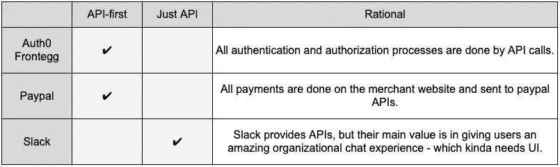

# 所以你想成为 API 第一？

> 原文：<https://pub.towardsai.net/so-you-want-to-be-api-first-3ff63289d53d?source=collection_archive---------2----------------------->

## [软件工程](https://towardsai.net/p/category/software-engineering)

决定成为 API 优先的产品并不是一个公司要做的简单决定。从 R&D 一直到市场营销，整个公司都需要在 API 优先的方法为什么以及如何加速开发、上市和整个业务上保持一致。但更重要的是，就像你需要产品-市场契合，你需要产品-市场-API 契合。外部化 API 和 API 优先之间有很大的区别，根据您的客户和他们的用例，您需要了解 API 或 API 优先是否是您的正确选择。

这篇文章探讨了 API 和 API 优先如何通过我们在 Superwise 成为 API 优先的产品和业务时所经历的演变来影响业务和 R&D。

# API 不仅仅是关于代码

幸运的是，我们不需要在这里深入探讨。在这一点上，API 是如此普遍，以至于即使是最非技术的业务角色也知道 API 是一个应用程序编程接口，它标准化了通信，因此任何两个应用程序都可以在彼此之间发送/接收数据。这样做的问题是，它们在今天是如此普遍，以至于偶尔你会看到企业在没有强大的产品-API 匹配和/或产品开发成熟度的情况下推动 API。

# 你的 API 应该是一等公民吗？

在决定如何对待 API 之前，你需要问自己一套标准；全力以赴，成为 API 优先，公开一组 API，或者对所有 API 说不。这里没有神奇的是或否的数字；你甚至可以对下面列出的所有事情说是，但是 API 优先对你的产品/业务来说仍然是错误的。

## 更大的图片适合

你需要弄清楚的第一件事是你的 API 在大局中的位置，以及它对于提高价值有多重要。

*   **你的解决方案是一个更广泛的过程的一部分吗？**是的，用户往往会对他们工作所需的过多工具和平台感到恼火，但每月使用的工具和日常使用的工具之间有很大的区别。
*   **通过 API 使用你的解决方案会为用户创造更多价值吗？** BI 是通过 API 实现更高价值的一个很好的例子，它使组织中的所有利益相关者都可以访问信息。

例如，看看模型的可观测性。它不一定是一个日常工具，但它是至关重要的，当 ML 在生产中出现问题时，监控可以触发任何一组过程来解决异常。此外，几乎总是需要将问题暴露给组织中的其他风险承担者，以便他们可以采取预防措施，直到发现根本原因并解决事件。

## 一致的可重用性

所以你有大局观，你的 API 给你的用户创造附加价值；太棒了。现在想想你的用户是如何使用你的产品的，这是否在你的用户群中一致地转化为 API 的使用。

*   你的产品符合市场吗？你的大多数用户会或多或少地以同样的方式使用 API 吗？社交登录是 API 优先的一个极好的例子。这是一个跨用户群具有一致可重用性的产品。
*   **任何组织都可以实现你的 API 吗？**这是关于两个端点，而不仅仅是你的 API。如果您通常集成的系统是特殊的或者需要特定的领域知识，那么可能不是所有的组织都会接受您的 API，因为他们没有必要的资源将它融入他们的过程。
*   **你的用户需要一个 API 还是所有的 API？**是否值得您花费时间和精力去实现 API 优先，或者在非 API 优先的方法中使用一两个 API 会得到同样的效果？

# Superwise 的 API-first 之旅

老实说，当我们第一次开始公开 API 时，我们没有一个健壮的过程，更不用说 API 第一的思想了。我们公开了相当多的 API，一些供我们的 web 应用程序内部使用，一些供客户直接使用。维护 API 和它们的文档是一件令人头痛的事情，而且我们没有适当的流程来处理大量的客户更改/创建 API 的请求。此外，可能也是最重要的，因为我们没有一个定义良好的流程和心态，在我们的后端和前端团队之间有大量的沟通错误和“迷失在翻译时刻”,这导致了比我想承认的更多的错误和过度获取。

所有这些源于我们的 API 的问题让我们坐下来思考，当涉及到 API 时，什么对我们是正确的，以及如何构建有利于我们和我们的客户的规模的过程，而没有我们到目前为止所经历的问题。结果从这个帖子的标题就很明显；我们决定先用 API。

# 那我们做了什么？

对于我们的内部和外部客户来说，API 是一件大事，我们的产品依赖于 API 的质量和它们无缝交付价值的能力。

*   谁是客户？内部？外在？
*   **API 请求和响应是否一致，是否适合客户的用例？你需要在最小化 API 调用和显式调用之间找到平衡。太多的 API 调用是低效的，但是混乱的调用是无效的——两者都不利于用户体验。**

一旦我们搞清楚了这一切，我们就记录我们的 API 来创建 API 将如何被消费的“构造”。这让我们的前端团队能够模拟数据并继续开发前端功能，而无需等待后端的支持。这种将我们的 API 视为产品不可分割的一部分的思维方式使我们总是检查任何请求，以确保我们的 API 保持可重用性和灵活性。

# API 优先的优势

无论从技术上还是思维方式上，API 优先对我们快速扩展应用程序和与外部服务集成的能力产生了巨大的影响。在我们开始将我们的 API 视为一等公民之前，当我们对一个特定的 API 有负载时，仅仅扩展那个特定的 API 是不可能的；我们必须扩展所有的应用程序。随着向 API 优先的转变，我们所有的 API 都是为具有特定任务的微服务而设计的。这使我们能够根据每个 API 的负载来扩展它，并有效地利用我们的资源。

*   **最大限度地减少依赖性**—API 优先的思维模式将依赖性推到了最前沿，并鼓励我们通过设计来分离 API，以便更新/更改可以在 API 级别完成，而不是在影响所有 API 的应用程序级别完成。这并不总是可以实现的，但在这种情况下，升级/更改 API 将是一项更加轻松和独立的任务。
*   **并行化开发** —开发团队可以通过在服务之间创建关于如何公开数据的契约(例如:记录您的 API 路由、请求、响应)来并行工作。通过这种方式，开发人员不必在转移到下一个 API 之前等待一个 API 的更新发布，团队可以基于已建立的 API 定义来模拟 API 和测试 API 依赖关系。
*   **加快开发周期**——API 优先意味着我们在编码之前设计我们的 API。对设计的早期反馈允许团队适应新的输入，而变更的成本仍然相对较低，从而降低了项目生命周期的总成本。
*   **设计中的质量保证—** 在设计阶段加倍努力，因为在 API 编码后修复问题的成本比在设计阶段修复要高得多。
*   **设计可重用性—** 您还可以通过在多个 API 项目中重用组件来降低开发成本。

# 成为 API 优先的关键点

在您的组织中实现 API 优先的开发方法需要计划、合作和实施。以下是一些关键点和概念，可以融入到你的 API 优先策略中，以确保它的成功:

*   **获得早期反馈** —了解组织内外的 API 客户是谁，并获得关于 API 设计的早期反馈有助于确保 API 与用例的匹配。这将使 API 更容易使用，并缩短您的开发周期。
*   **永远设计第一—** API(设计)—第一意味着在你写任何代码之前，你要以人类和计算机都能理解的迭代方式描述每一个 API 设计。API 消费是设计过程的一部分，重要的是要记住，客户端(复数)将通过 API 与特性进行交互，因此您需要始终记住每个人，而不要过于关注特定的客户端。首先考虑设计也将更容易理解任务中的所有依赖关系。
*   **记录你的 API**—API 文档是必须的，因为它在客户和开发者之间建立了一个结构。文档对于确保 API 使用的有效性和高效性至关重要。我们希望语言和例子准确无误，这样客户就可以用最少的努力获得最大的影响。
*   **自动化您的过程** —使用诸如 SwaggerHub 之类的工具来自动化诸如生成 API 文档、样式验证、API 模拟和版本控制之类的过程。
*   **轻松入门** —提供交互式文档和沙箱，以便开发人员可以试用 API 端点，并立即开始使用您的 API 构建应用。

‍

关于 API 优先已经说了很多，有许多资源和最佳实践(例如，来自 [Auth0](https://auth0.com/blog/the-business-value-of-api-first-design/) 和 [Swagger](https://swagger.io/resources/articles/adopting-an-api-first-approach/) 的这些文章)可以帮助您完成过渡。但是 API 优先并不一定需要重构现有的应用程序；而是拥抱不同的心态。对我们来说，这无疑是一条正确的道路，我们从客户满意度和使用量的增加中看到了这一点，从我们如何更快、更高效地扩展中看到了这一点，从我们如何更快地为客户开发和部署新功能中看到了这一点。