# 足球和数据科学:由 Ibra 和 Muriqi 解释的决策树

> 原文：<https://pub.towardsai.net/soccer-and-data-science-decision-tree-explained-by-ibra-and-muriqi-c4d498109c41?source=collection_archive---------5----------------------->

## 是时候开始新的冒险了:作为意甲数据科学家的第一天刚刚开始！


足球场上基于树的算法

当人群在外面疯狂的时候，在办公室里，我们必须开始工作…嗯…让我们做一些重要的事情…

```
import numpy as np
import matplotlib.pyplot as plt
import pandas as pd
from sklearn import datasets, svm
from sklearn.tree import DecisionTreeClassifier
from sklearn.inspection import DecisionBoundaryDisplay
from sklearn.metrics import accuracy_score
```

今天对我们来说是糟糕的一天:美国老板刚刚盛况空前地到来，宣布他们将在 3 年内赢得联赛冠军。

**如何？** == >他们不知道……但他们需要创造期望。

节目结束后，他们来找我们，他们新雇佣的数据科学家…！他们带着装在公文包里的 4000 万美元的嫁妆，带着实现飞跃所需的清晰而极其详细的想法进行投资。

> 美国人:<<< *我们买个前锋吧！>T32>*
> 
> *DS*:“…什么样的前锋？”
> 
> 美国人:<<< *我们买前锋吧！>T35>*
> 
> DS :“嗯……我们明白了，但是……一个中锋？边锋？？快？？？强大？？？？你知道吗……”
> 
> 美国人:“<<<*我们什么都知道！> > >一群专家告诉我们一切只需 71 百万美元。他们给了我们一份数千名球员的大名单，关于射门、传球、技术、盯人… < < <的数据，我们什么都知道！> > >*
> 
> *DS* : "…一份我们想象中的骗子名单…"
> 
> 美国人:<<< … *我们买前锋吧！> > >*
> 
> *DS* :“好的，知道了！！！有了 7100 万英镑，我们知道欧洲现有的每个球员的生活和对 T21 的看法，但我们不知道哪些是前锋……”

…(尴尬的沉默)…

> 美国人:“…你告诉我们…今晚之前…否则你们都会被解雇，明白吗？！拜托，这没什么大不了的……”

(呼吸)

“*我们必须有外交手腕……*”——我告诉住在我体内的小海盗，他是我的向导——“*……小心选择你的下一句话，维达。他们可能是你在这家公司的最后一个人了……*”

(呼吸)

# “……你把被征服的国王的王冠和头颅带到我的城市的台阶上！你侮辱了我的科学。你用奴役和解雇来威胁我的人民！哦，美国人，我用词很谨慎。也许你也应该这样做。”

> *美国人:“*这是亵渎神明！这太疯狂了！”

# “癫狂？！…"

…我的精神向导为了戏剧效果停顿了一下，然后用科索沃语、意大利语和西班牙语混合发出一声令人毛骨悚然的尖叫:

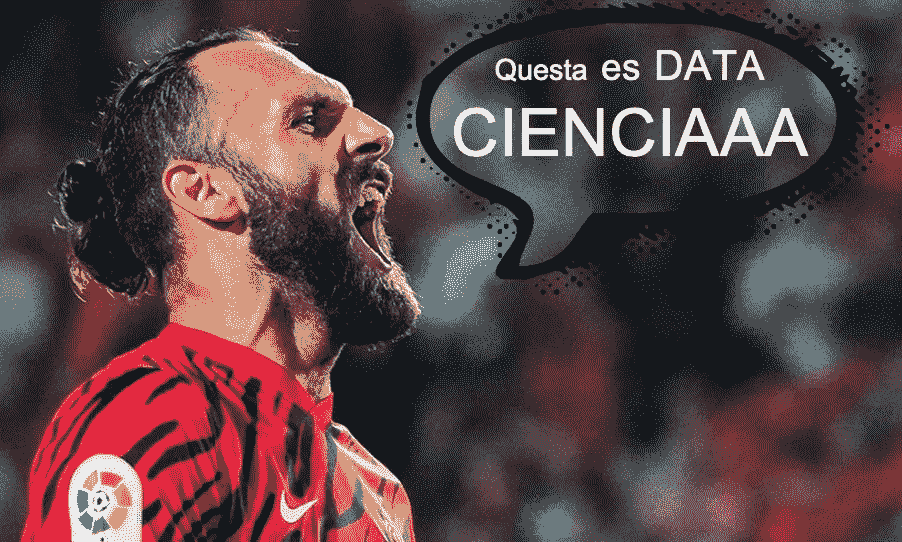

[https://www . goal . com/it/not izie/maior ca-muri qi-goal-decisivo-Atletico-Madrid/BLT 181 FD 44 f 6 e 23 C1 e 0](https://www.goal.com/it/notizie/maiorca-muriqi-goal-decisivo-atletico-madrid/blt181fd44f6e23c1e0)

(呼吸…回到现实。)

> 美国人:“……否则你们都会被解雇，明白吗？！…"

白日梦结束了，当 Vedat 在我脑海中尖叫，美国人满意地离开时，我的大脑开始想起几天前我在网上找到的一个数据集，它可能会帮助我们。时间不多了，我们直接从那里开始读吧:

```
link = "https://raw.githubusercontent.com/ianni-phd/Datasets/main/2022-12-05_soccer-players.csv"
df = pd.read_csv(link, sep=';', decimal=',')
df.head(11)
```

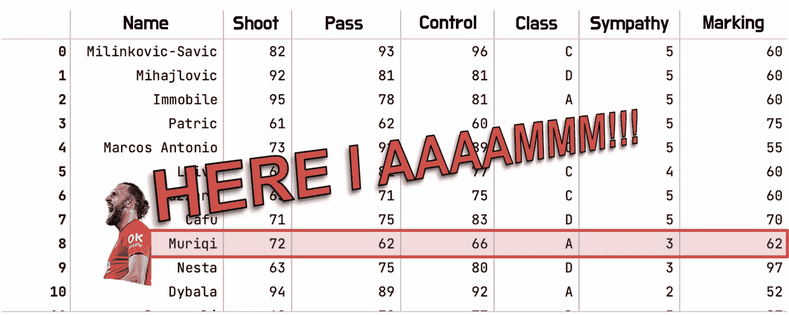

…没有那么多数据，但它们是*完整的*(而且比 7100 万便宜很多):对于每个球员，我都知道特征，知道他是后卫(“D”)、中场(“C”)还是……是的，也是前锋(“A”)！！！

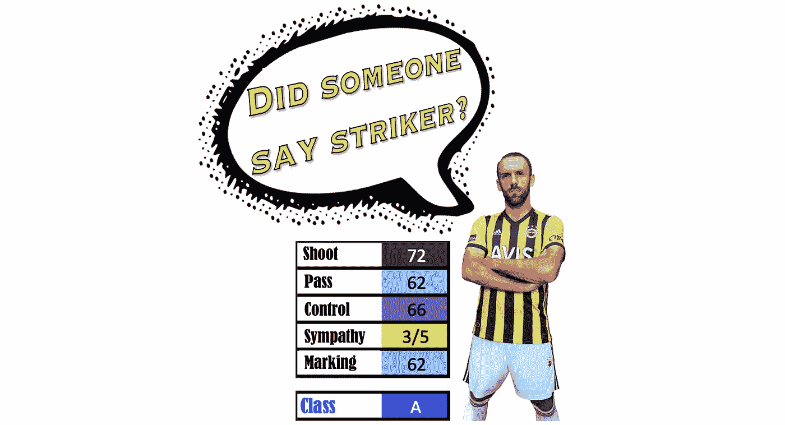

我们可以分析数据并设计一个基于阈值的系统，但是没有时间了！只有一条出路:

*   [ **FIT** 根据我们掌握的少量数据训练模型；
*   [ **预测** ]要求模型预测成千上万名欧洲球员中每一个人的角色！

它可以工作。我们要选择哪些特征？所有人？

# “显然……！每个人都知道同情是罢工的一个非常明显的特点……”

…等等，韦达！现在让我们用两个试试！**拍摄**和**标记**似乎是对分离角色有意义的两个特征。

我们可以尽量简化模型，将类的数量从 3 个减少到***n _ classes = 2***:*Strickers*vs*其余的世界*。让我们使用方法 **pd.factorize()** 来获取一个分类变量，并将其转换为一列整数(同样的方法*返回*按正确顺序排列的类别……非常有用！):

```
dict_2_classes = {"D":"other", "C":"other", "A":"strickers"}
df["Classe"] = df["Classe"].apply(lambda x: dict_2_classes[x])
classes_labels = list(pd.factorize(df["Classe"])[1])
df["Classe"] = pd.factorize(df["Classe"])[0]
n_classes = len(classes_labels)
```

好了，现在我们可以记住我们之前已经确定的特征对(*对*

*   **df** 是一个数据帧…模型无法消化！
*   df**【pair】**仍然是一个数据帧…模型无法消化！
*   df【对】**。values** 终于是 np.array 了！！

```
pair = ["Shoot","Marking"]
X_2_cols = df[pair].values

print(X_2_cols.shape)
X_2_cols
```

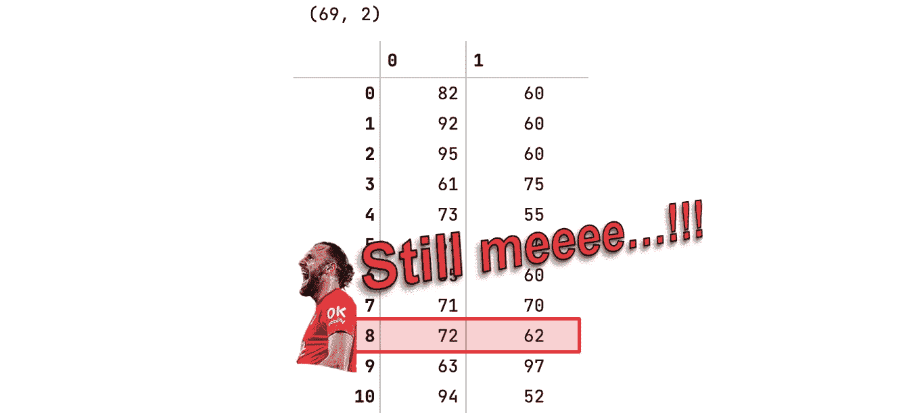

现在呢？定义谁是前锋和谁不是前锋的两个特征…简单来说，我们可以说:

另外，一个球员不可能投篮和盯人都很差…


[https://www.asroma.com/it/team/players-and-staff](https://www.asroma.com/it/team/players-and-staff/gianluca-mancini#tab_player-stats=distribution&tab_player=profile)

…嗯，也许我们应该忘记手动规则:让我们结束这一切，让我们让模型负责…我们亲爱的-明智的-老树！


通过人工智能生成的图像

我们为每个玩家提供射门和盯人( **X_2_cols** )，我们说这个玩家是不是前锋( **y** )…然后它会做剩下的事情。也许我们还可以设置一些参数…不，请不要做那些表情，我知道:“我们在赶时间”！

```
# definition of the model (without defining parameters...!!!)
clf = DecisionTreeClassifier()
# training of the model
clf.fit(X_2_cols, y)
```

只需要一次发作，我们就掌握了权力。不管他们会给我们多少球员，从射门和盯防我们的树会告诉我们他是一个前锋还是我们必须让他马上消失。你知道，我们的神谕是绝对可靠的！…不是吗？

```
# prediction on the training data
y_prev = clf.predict(X_2_cols)
# accuracy on the training data
accuracy = accuracy_score(y_prev, y)
accuracy
```

```
100,0%
```

看那蓝色 100%多好啊…让我翻译一下那个小数字:我们的树是完美的。故事结束。文章写完了，我们是最棒的。

撒谎。我们的树是不会出错的，但是在玩家身上，它已经被研究过了！嗯…我们是忠实的信徒，所以我们相信在未知的玩家身上也会有完美的表现。我们试试吧！我们选一个中场，等他们的回应！

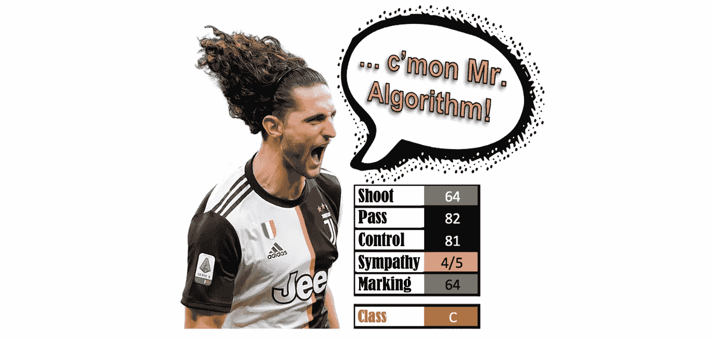

[https://www . footy renders . com/serie-a/尤文图斯/阿德里安-拉比奥特-17/](https://www.footyrenders.com/serie-a/juventus/adrien-rabiot-17/)

```
# Forecast Rabiot
print("Rabiot:")
rabiot_shoot_marking = np.array((64,64)).reshape(1,2)
y_prev_rabiot = clf.predict(rabiot_shoot_marking)
print("Features: ", rabiot_shoot_marking)
print("Model prediction: ", y_prev_rabiot)
```

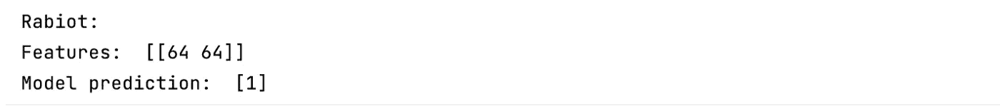

坏消息，一个中前卫是我们树的贴纸(！！！)…嗯，我们得开始收拾行李了:明天早上，我们得修改我们的简历，然后到处发布。

…是的，但只是为了给这一天的结束一个感觉…模型到底是如何创建边界的？？！我敢肯定，有一种方法揭示了边界曲线(**决策边界显示**)，幸运的是，我们在二维。

```
# creating a palette of colors
import matplotlib.colors
cmap_yg_gr_lb = matplotlib.colors.ListedColormap(["yellow", "green", "lightblue"])
cmap_yg_gr_lb
```


```
DecisionBoundaryDisplay.from_estimator(
    clf,
    X_2_cols,
    cmap=cmap_yg_gr_lb, 
    response_method="predict",
    xlabel=pair[0],
    ylabel=pair[1],
)
```

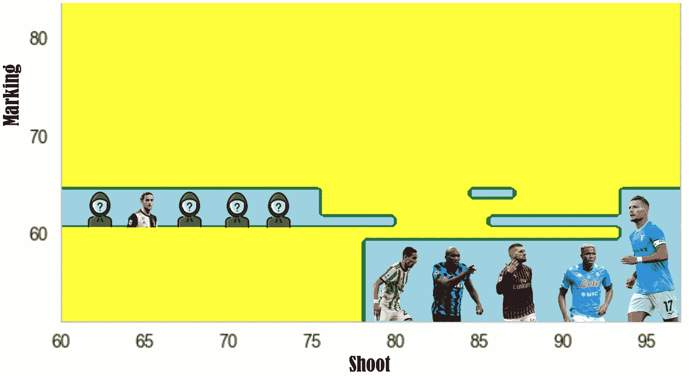

显然，这是一个不容易解释的方法来区分蓝色和黄色…尤其是考虑到大多数贴纸都在右下角区域。但是…为什么树要制定这些奇怪的规则呢？它是否过于关注训练数据？！他是不是学习太深入了？！？……有人*把它拿走了吗？！…世卫组织呢？！？！？*

```
DecisionBoundaryDisplay.from_estimator(
    clf,
    X_2_cols,
    cmap=cmap_yg_gr_lb, 
    response_method="predict",
)

# Plot the training points
for i, color in zip(range(n_classes), plot_colors):
    print(i)
    print(color)
    idx = np.where(y == i)
    plt.title("Accuracy on training: "+str(accuracy))
    plt.scatter(
        X_2_cols[idx, 0],
        X_2_cols[idx, 1],
        c=color,
        label=classes_labels[i],
    )
plt.legend()
```

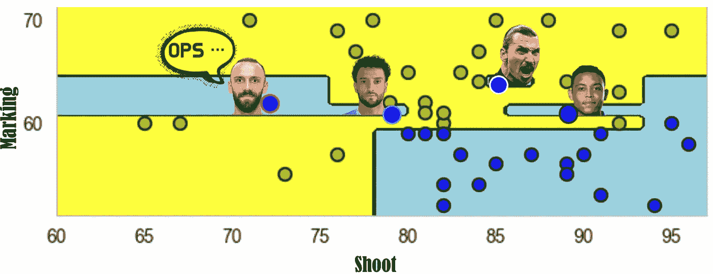

什么？？？我的海盗！！！！！

尽管如此，韦达特并不是唯一对左边的蓝色区域感到内疚的人:菲利普·安德森和他在一起，他的投篮能力比他的同事低…

是的但是..费利佩是个 stricker 吗？！数据通常代表现实的简化。如果你想一想，足球场上的实际角色可能不止 11 个，我们将他们全部归类为“贴纸”和“其他”。菲利普·安德森在前锋和中场之间扮演着一个角色，并被归类为 stricker，这一事实代表了大多数真正问题中的生理“噪音”。

这种“噪音”和我们的海盗的异常特征迫使模型在左侧创建蓝色区域。然而，它们并不是唯一的异常现象。

在他的同事之上，其实还有穆里尔，他的盯人能力高于其他前锋。然后是 Ibra，那个…那个… Ibra 只是做他想做的，算法 ssssshhhhhh..！

很明显，数据有其独特性，算法过于依赖于此，创建了看起来有点不合理的*规则*。

在 Ibra 的批准下，我们必须努力帮助算法，试图在非常特殊的情况下避免它陷入困境。不管怎样，我们必须限制它的学习能力，以防止它…夸大其词！所以我们强加了

## 规则 A:只有当子组包含至少两个玩家时，模型才能创建子组(叶子)。

我们可以通过参数 **min_samples_leaf** 轻松做到这一点。

```
clf = DecisionTreeClassifier(min_samples_leaf=2)
clf.fit(X_2_cols, y)
```

模型在已知数据(训练集)上的表现不如以前*完美*

```
y_prev = clf.predict(X_2_cols)
accuracy = accuracy_score(y_prev, y)
accuracy
```

```
95,7%
```

…但是看一下模型边界，似乎“它做得更好”。

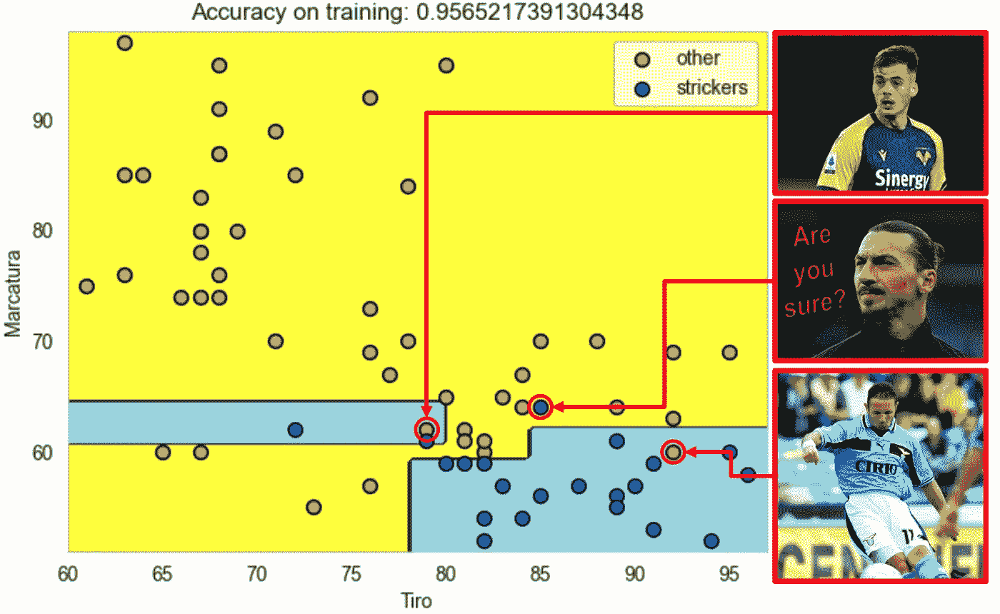

在挑战了 Ibra 之后，我们开始觉得自己无所不能:我们朝着更有效的泛化能力又迈进了一步，我们利用另一个参数来避免模型学习过深。所以我们强加了

## 规则 B:模型在深度上不能有太多的“层次”。

所以我们可以用 **max_depth** 来限制模型的“学习能力”。

```
clf = DecisionTreeClassifier( min_samples_leaf = 2, 
                              max_depth = 4
)
clf.fit(X_2_cols, y)
```

该模型在已知数据上恶化得更多，达到低于 95%的准确度:

```
y_prev = clf.predict(X_2_cols)
accuracy = accuracy_score(y_prev, y)
accuracy
```

```
94,2%
```

另一方面，我们对下一个玩家持乐观态度，因为*分离模式*似乎比以前更容易解释:

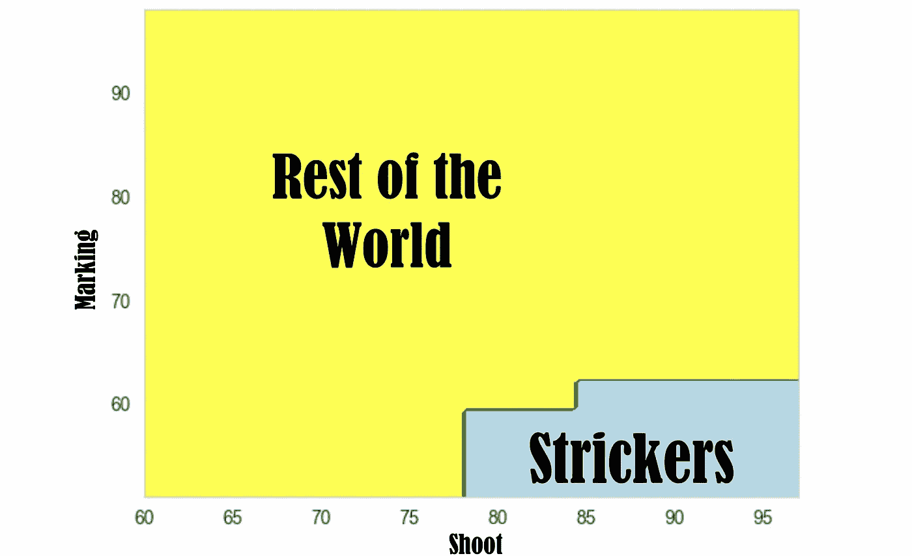

好吧，我们只使用了两个功能…如果我们也尝试所有其他功能呢！？！！

```
import numpy as np
import matplotlib.pyplot as plt
from sklearn.datasets import load_iris
from sklearn.tree import DecisionTreeClassifier
from sklearn.inspection import DecisionBoundaryDisplay
# reading the datasdet
df = pd.read_csv("https://raw.githubusercontent.com/ianni-phd/Datasets/main/2022-12-05_soccer-players.csv", sep=';', decimal=',')
# defining the classes
dict_2_classes = {"D":"other", "C":"other", "A":"strickers"}
df["Class"] = df["Class"].apply(lambda x: dict_2_classes[x])
classes_labels = list(pd.factorize(df["Class"])[1])
df["Class"] = pd.factorize(df["Class"])[0]
n_classes = len(classes_labels)
features = ["Pass","Marking","Shoot","Control"]
target = ["Class"]
X = df[features].values
y = df["Class"].values
# Parameters
plot_colors = ["ygb" if n_classes==3 else "yb"][0]
# Define the size and aspect of the final plot
fig, ax = plt.subplots(2, 3, figsize=(12, 8))
fig.tight_layout(h_pad=0.5, w_pad=0.5, pad=2.5)
# deciding the features to compare
pairs_to_focus = [["Shoot","Pass"], ["Shoot","Control"], 
                  ["Shoot","Sympathy"], ["Control","Marking"],
                  ["Shoot","Marking"], ["Marking","Pass"]]
for pairidx, pair in enumerate(pairs_to_focus):
    # We only take the two corresponding features
    X_2_cols = df[pair].values
    # Train and result on train (accuracy)
    clf = DecisionTreeClassifier(max_depth=4).fit(X_2_cols, y)
    y_prev = clf.predict(X_2_cols)
    accuracy = np.round(accuracy_score(y_prev, y),3)
    # Plot the decision boundary
    ax = plt.subplot(2, 3, pairidx + 1)
    plt.tight_layout(h_pad=1.5, w_pad=1.5, pad=2.5)
    DecisionBoundaryDisplay.from_estimator(
        clf,
        X_2_cols,
        cmap=cmap_yg_gr_lb,
        response_method="predict",
        ax=ax,
        xlabel=pair[0],
        ylabel=pair[1],
    )
    # Plot the training points
    for i, color in zip(range(n_classes), plot_colors):
        idx = np.where(y == i)
        plt.title("Accuracy: "+str(accuracy))
        plt.scatter(
            X_2_cols[idx, 0],
            X_2_cols[idx, 1],
            c=color,
            label=classes_labels[i],
            edgecolor="black",
            s=15,
        )
plt.suptitle("Decision surface of decision trees trained on pairs of features on the Players dataset")
plt.legend(loc="lower right", borderpad=0, handletextpad=0)
_ = plt.axis("tight")
```

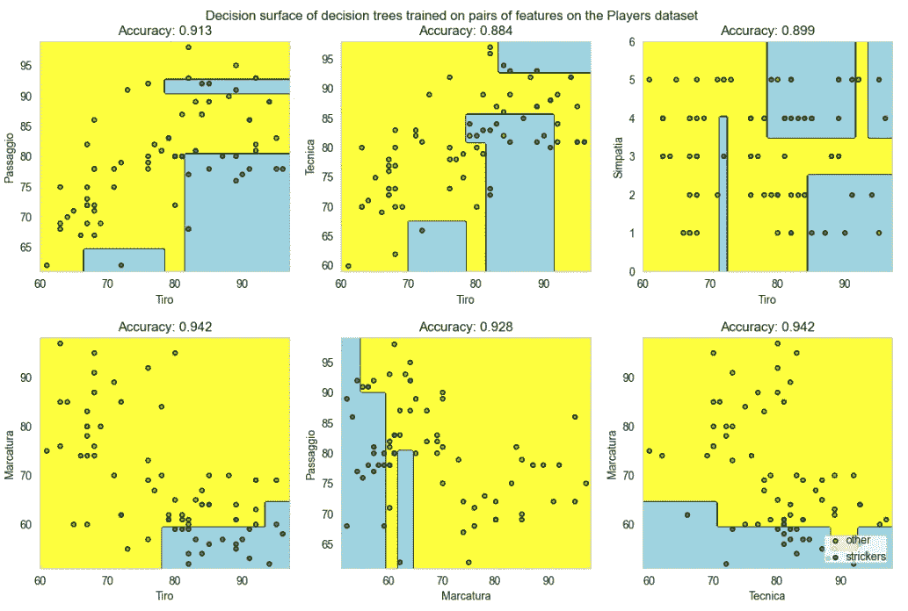

我们可以注意到，看到精度，**拍摄**和**控制**不足以区分贴纸……为什么？因为有很多射门和控球都很出色的中场球员！嗯，我们遗漏了一些东西…比如说**通道，**通道，那将会是非常完美的区分方式。

我们最终会非常惊讶于这样一个事实:同情并没有很大的帮助…！:)

尽管出于可视化的原因，我们需要使用两个特征，考虑 3 个或更多特征将使算法对于我们的分类目的更有效。如果我们要保住我们的工作，直到下一集，我们将看到如何做到这一点…！！！