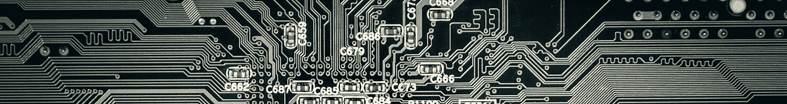
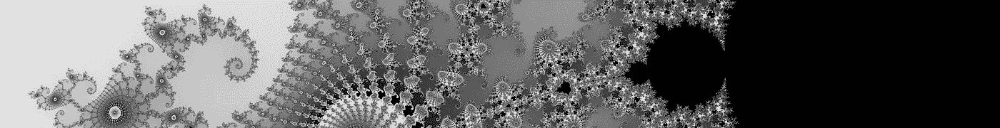

# 人工智能:计算业务发展的催化剂

> 原文：<https://pub.towardsai.net/software-2-0-b52131f65b68?source=collection_archive---------3----------------------->

## [软件工程](https://towardsai.net/p/category/software-engineering)

由[汉斯](https://pixabay.com/users/hans-2/)在 Pixabay 上拍摄的照片

# 人工智能:下一代软件？

自 20 世纪 40 年代和 50 年代以来，计算机科学家发展了两种创造智能机器的哲学:**告诉**机器做什么，以及**显示**机器做什么。

第一种哲学导致了基于规则的系统，以及我们今天所称的软件。这种哲学的顶峰是 IBM 的深蓝在国际象棋中击败了加里·卡斯帕罗夫。IBM 想吹嘘他们的人工智能有多先进，但具有讽刺意味的是，这正是大多数人对基于规则的系统作为实现智能的方式失去兴趣的时候。

第二个发展成为机器学习，或软件 2.0。这两种方法之间有着根本的区别，一种范式的转变正在到来。

# 企业为什么要关心软件 2.0？

照片由 [nicolettec](https://pixabay.com/users/nicolettec-183185/) 在 Pixabay 上拍摄

软件 1.0 和软件 2.0 的哲学之间的差异留下了重要的实际含义:**复杂性**。

在传统软件中，每当编写一个“IF”语句时，这个过程就会分裂成两个可能的线程，代码的复杂性就会加倍。代码的复杂性随着代码行数呈指数级增长，调试也变得更加困难。

那么企业如何解决这种复杂性呢？他们雇佣更多的开发人员来处理复杂的代码。但是更多的开发人员意味着更多的代码，这意味着成倍增加的复杂性，以至于企业达到了招聘能力的极限。对于小公司来说，这个限制可能是 10-100 名开发者，而对于像谷歌这样富有的公司来说，这个数字大约是 100，000 名开发者。

那么，当一家公司达到雇佣新开发人员的极限时，会发生什么呢？好吧，创造力消失了。公司无法创造，因为他们所有的资源都用于维护和调试他们已经拥有的错综复杂的代码库。

举个例子，你有没有注意到，谷歌推出的几乎每一款拥有十亿以上用户的产品都是在 2008 年之前问世的？(搜索、Gmail、YouTube、地图、安卓、Chrome 等)。所有这些都在相对短的时间内达到了 10 亿用户。但是他们在 2008 年后建立的任何东西，要么已经死了，要么没有达到相当大的用户基础，很可能很快就会被终止。由于代码库的复杂性，谷歌在过去的 14 年里没能创造出新的有用的产品。几乎所有的谷歌员工都把几乎所有的时间花在将函数调用从一个库转移到另一个库上。旨在统一更多产品的库和 API。过于纠结于代码库复杂性的产品永远不会问世，否则就会夭折。

每当传统软件不能完成它应该做的事情时，软件必须被带回办公室并在那里调试。然而，软件 2.0 从错误中学习。软件 2.0 每次失败，都会自动学习下次不再失败。当软件开发人员(在他们的大脑中拥有整个复杂性)指导软件改变其行为时，软件 1.0 的质量会提高(或降低)。但是软件 2.0 每次执行代码都会有所改进。

> 通过正确使用软件 2.0，企业可以继续将资源投入到创造力上，而不是维护和调试他们所拥有的东西。一场新的软件服务革命正在进行中。

# 为什么软件 2.0 不常见？

## 1-低效的硬件

由 Pixabay 上的 [analogicus](https://pixabay.com/users/analogicus-8164369/) 拍摄的照片

第一个明显的障碍是执行这些算法所需的处理能力。众所周知，硬件是与软件一起发展的。当前的处理器非常擅长尽可能快地一次执行一条指令。这对于软件 2.0 来说一点也不高效。

有了软件 2.0，大部分处理时间都花在一个操作上:**点积**。

现有计算机执行点积的方式是，首先，处理器将向量的两个元素提取到缓存中，然后将它们相乘，求和，并将结果放回内存中。几乎所有花在计算点积运算上的时间都花在了数据传输上。

已经努力将 map-reduce 放在存储器内部，但是 map-reduce 太普通，并且需要在存储器内部实现昂贵的处理电路。这种方法实施起来成本太高。然而，通过向每个存储器地址引入一组电容器，并利用泄漏到另一个电容器中的电容器的智能布线来实现乘法和加法，可以在存储器单元内部实现点积。

有了这种新形式的存储器，(它不是随机存取存储器)，我们可以直接读取两个向量的点积，几乎与从向量中读取单个值一样快，而且功耗极低。

Nvidia 处理器中张量内核和苹果处理器中 ML 内核的引入表明行业正在接受软件 2.0。然而，这些电路仍然是按照冯-诺依曼架构设计的。

在冯诺依曼架构中(从你的智能电视到亚马逊的超级计算机，它基本上是任何类型的处理机器的架构)，内存和处理器之间有着明显的区别。我们可以准确地说出晶体管属于处理电路还是存储电路。对于人脑来说，情况并非如此，在人脑中，不清楚一个神经元是记忆神经元还是过程神经元。在新的架构中，(据我所知还不存在)点积的过程被移植到内存单元中。这给软件 2.0 世界带来了巨大的效率

## 2-缺乏既定的流程

由 [jarmoluk](https://pixabay.com/users/jarmoluk-143740/) 在 Pixabay 上拍摄的照片

托马斯·库恩在他的著作《科学革命的结构》中强调，范式转换不是一个平稳的过程。新范式的信徒通常是年轻人，他们愿意跳槽，而年长的更有经验的人则留在旧范式中，从记忆中消失。行业决策者(产品经理、首席技术官等)最多有 30-40 年的经验，对他们来说，软件世界中发生的一切都是渐进的改进。近 80 年前，学术界称之为软件 2.0 或机器学习，从我们今天所说的软件中分支出来。很难让他们相信范式正在转变。

当开发传统软件时，有四个不同的步骤要采取:**定义、实现、部署和调试**。然而，软件 2.0 有三个不同的步骤:**定义、部署和监控**。没有实现或调试步骤。软件 2.0 在部署时会自动学习。软件 2.0 不再是由软件开发人员或数据科学家开发的，而是由模型动态暴露的数据和遍布全球的注释者开发的。

但是软件 2.0 的过程和工具都还没有很好地建立起来。每一次范式转换，都会遇到阻力。鉴于我们所看到的，软件 2.0 革命不太可能是由硅谷巨头领导的。软件 2.0 的下一批先锋仍然在他们的小型创业公司中，试图定义这个行业应该是什么样子。

## 3-知识差距

我提到软件 2.0 从错误中学习，不需要软件开发者。使这一循环自动化的技术是最近才发明的。深度学习是软件 2.0 的核心，因为它是唯一一种能够在每个任务家族中实现超人准确性的算法。*(超人类的准确是指注释者的准确。这作为一个群体通常高于单个个体。因此得名超人类)。* DL 在 2012–2014 年才开始在学术界腾飞。深度学习在学术界的成功鼓励了行业将学术解决方案复制到他们的管道中，这导致了失望。要在真实世界的数据上自动实现超人的准确性，需要解决三个不同的问题。

## 3–1-长尾分布

照片由 [zoohojakjil](https://pixabay.com/users/zoohojakjil-3058997/) 在 Pixabay 上拍摄

先说一个直观的例子。想象一下，如果一个人想学习一个话题，比如说量子物理。他们去图书馆获取知识。他们开始随机拿起一本书，从头到尾读完，放回去，再拿起另一本书，直到把图书馆里的书都读完。然后他们重复这个步骤，直到每本书都被阅读 10-100 次。深度神经网络就是这样训练出来的。这个过程是极其多余的。如果他们在读完一本关于量子物理的书后又读了一本关于字母表的书*，那么，这两本书中的一本可以被跳过。*

自然界的数据遵循长尾分布。一些观察是常见的，而真正新的观察是罕见的。随着训练的改进，信息样本的数量呈指数下降。主动学习是几十年前为解决这个问题而开发的技术，但是主动学习依赖于模型来判断样本是否有信息。深度学习是无法解释的。当前的深度主动学习方法略微优于随机采样。这意味着即使信息学样本的数量呈指数下降。大多数 DAL 方法仍然对数据集大小进行线性子采样。困难的例子很容易被堆积如山的简单数据所掩盖，从而导致次优的表现。

## 3–2-模糊性

Pixabay 上 [songpon](https://pixabay.com/users/songpon-2679154/) 的照片

信息空间是*连续的:*相似的现象往往表现相似。在 ML 中，这种假设有时显式出现(例如当我们使用正则化子时)，有时隐式出现(例如如果拉普拉斯矩阵出现，这在 DL 分析中总是出现)。然而，到目前为止，行业面临的最大问题是分类问题。分类假设信息空间是*离散的*。我们的假设和数据性质之间的差异是另一个误差来源。撕裂数据空间的连续性会产生冲击波，冲击波会流过整个预测流形。

想象一个视频，在第一帧有一只猫在一个干净的背景前面。这个画面的*猫罩*是真的。而在最后一帧，猫已经离开了帧，帧的*猫罩*为假。*猫罩*位到底在哪一帧翻转了？如果我们假设 *cat-hood* 是一个连续变量，那么如何决定一个帧是 38.3% cat 还是 38.5%？

灰色地带几乎总有样本。更糟糕的是，由于标签遵循长尾分布，灰色区域中的样本明显多于假设类别中的样本。

还有一个问题:在许多情况下，我们偏向于从灰色区域采集更多的样本。在许多 NLP 应用中，相当明显的事件不值得记录。在许多医学应用中，健康的人很少进行测试，并且显然患病的患者比那些病情不容易确定的患者更少参与医学测试。

当涉及到真实世界的数据时，观察分布可能偏向灰色区域，而标签空间假设数据位于干净的黑白世界中。问题定义本身是错误的。软件 2.0 从数据中学习是不够的，它还应该学习什么是正确的问题定义和观察分布。

## 3–3-不一致

照片由[克里斯蒂安·帕克尼乌斯](https://pixabay.com/users/christianpackenius-3401629/)在 Pixabay 上拍摄

当歧义谈论既不是 A 也不是~A 的样本时，不一致谈论的是既不是 A 又不是~A 的样本。当一个医生建议手术治疗，而另一个医生认为非手术治疗是最好的时，正确的决定是什么？

处理这些样品的第一个坏方法是把它们扔掉。这(以我的经验来看)是学术和工业数据集之间差异的最大来源。处理不一致样本的另一个不好的方法是使用多个注释器，并为标签投票，这在学术数据集中也很常见。不一致是一个巨大的信息来源。说明决策边界应该在附近。没有其他样本反映出这一点。

在学术研究中，不一致性以多种形式出现。尤其是当老师是模型而不是人类注释者的时候。自我监督学习使用模型与其自身的不一致性作为学习更好表示的信息源。一些视频分析管道使用相同模型在两个连续帧上的不一致性(闪烁预测)作为指标来收集硬样本。然而，据我所知，还没有人在一个统一的统计框架中发表过不一致的问题。

# 软件 2.0 解释器

不久前，我看到一份写于 20 世纪 70 年代的写给博士生的指南，其中一条建议是*永远不要*编写你的编译器！

我认为软件 2.0 是 20 世纪 70 年代传统软件所处的位置。即使是那些正确认识到软件 2.0 潜力的企业，仍然要重写数据管道和反向传播算法，以及其他所有人都在重写的所有复杂性。需要一个软件 2.0 编译器，它可以解决所有企业面临的所有人工智能问题。

在下一篇文章中，我将讨论软件 2.0 必须具备哪些组件来解决行业中的大多数 AI 问题。但在那之前，请允许我介绍一下我们正在做的事情。我们着手构建这个软件 2.0 编译器。我们致力于开放和透明，我们计划很快开放我们的代码库。但是在那之前，如果你有兴趣和我们一起建立这个，请把你的谷歌学术和 Github 的链接发给在 ali@razavian.org 的我