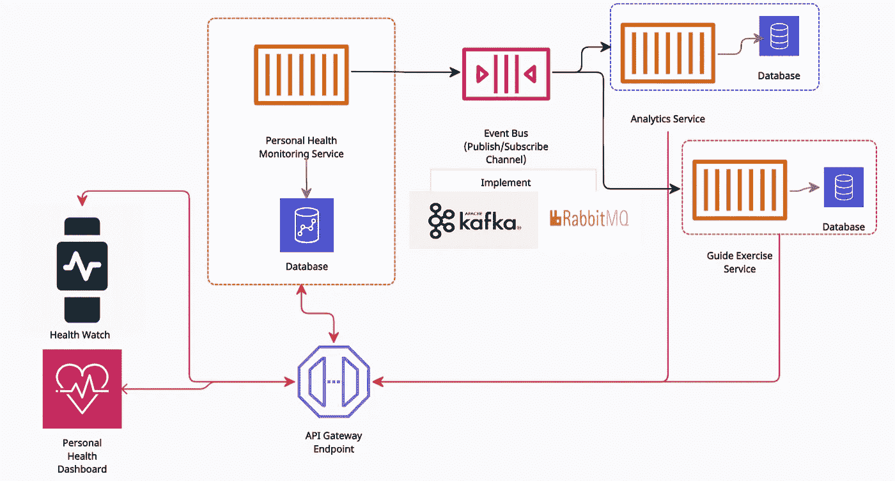
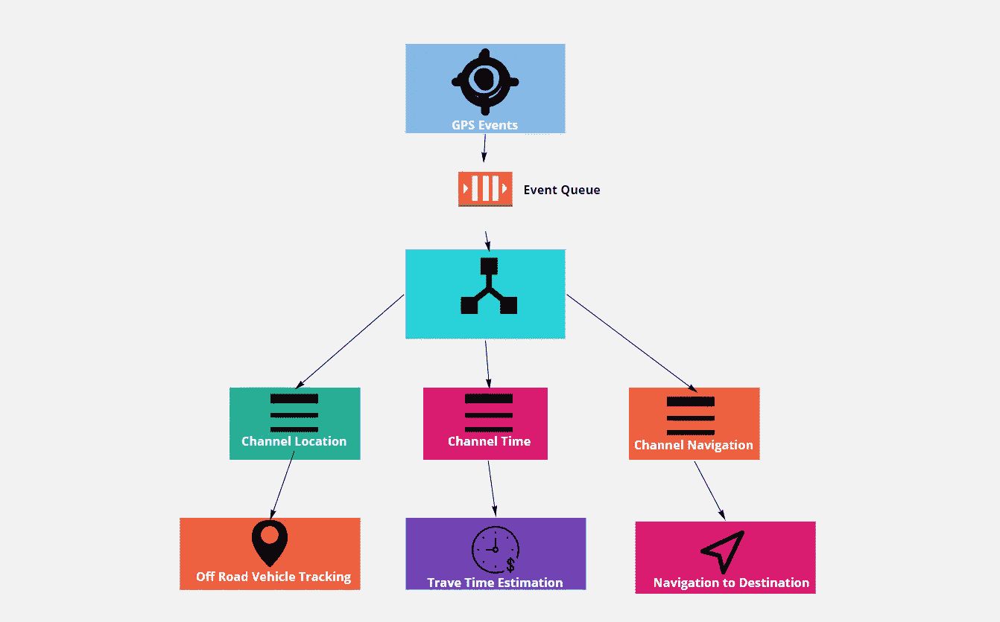
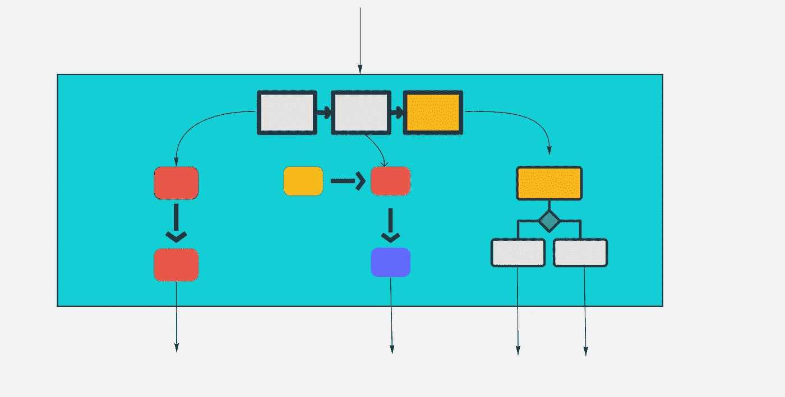
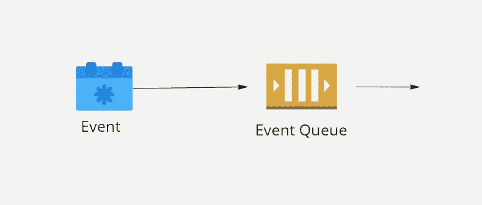
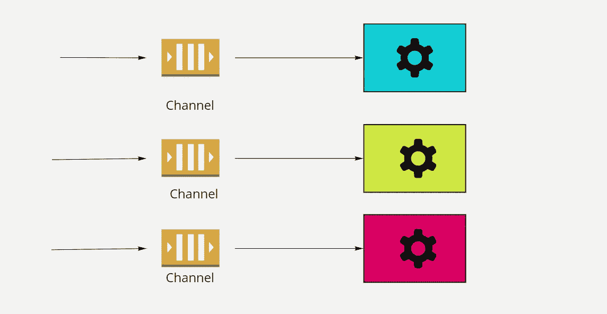
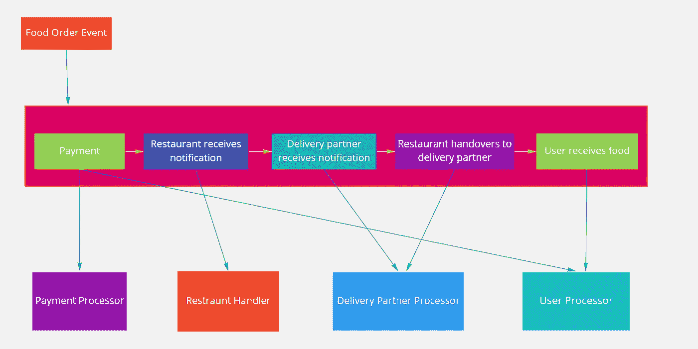

# 深入探究事件驱动的架构

> 原文：<https://pub.towardsai.net/software-engineering-baa4e7a8015c?source=collection_archive---------0----------------------->

## [软件工程](https://towardsai.net/p/category/software-engineering)

# 介绍

事件驱动架构模式是一种著名的分布式异步架构模式，用于构建高度可伸缩的应用程序。这种架构应用事件来触发解耦服务并在其中进行交互，在使用微服务开发的现代应用程序中非常流行。在一个电子商务网站的购物车中可以看到事件驱动架构。它包含几个事件，如在购物车中添加商品、产品价格变化、结帐、付款、发货、交货通知等。这种体系结构有助于应用程序在高处理时间对来自各种来源的变化做出反应，而不会影响应用程序或过度配置资源。

图 1:事件驱动的架构

事件驱动的体系结构有多种好处。它促进了跨多个服务的事件的实现，并提供了最终的一致性。一个额外的好处是，它还允许应用程序维护物化视图。

# 事件驱动架构的拓扑结构

理解事件驱动架构的拓扑对于深入研究事件驱动架构的各种子模式非常重要。这种架构模式基于两种主要的拓扑结构:

*   调解人
*   经纪人

# 中介拓扑

中心介体在介体拓扑中起着重要作用。当需要通过一个中心中介协调一个事件的各个步骤时，通常使用它。这对于具有多个事件并且需要某种程度的编排来处理事件的事件很有帮助。

图 2:中介拓扑

**示例:设计车辆中的 GPS 程序**

对于整个车辆安全、导航和成本估算计划，GPS 数据被认为是为车辆设计合适的 GPS 的起点。它们旨在提供适当的业务和安全目标。它包括以下几个步骤:

*   **越野车追踪→** 越野车被认为是能够熟练地在铺砌路面或砾石路面上行驶和驶离的任何类型的车辆。GPS 数据可以提供车辆数据，且相应的信道将被触发以分析进一步的细节。
*   **行程时间估算→** GPS 提供从一个地点到另一个地点的行程时间估算，该数据可进一步用于分析与时间相关的业务影响。
*   **导航到目的地** →这对物流公司真的很有帮助。物流公司实施远程信息处理系统来提高司机的工作效率和安全性。这一概念可用于支持路线优化、燃油效率、驾驶员安全和协议

所有这些步骤都需要一定程度的协调来确定健身目标步骤，并且可以串行和并行完成。

中介拓扑中包含四个组件:

*   调解人
*   长队
*   频道
*   处理器

## 调解人

中介组件充当每个初始步骤的协调器。它识别事件类型或数据类型，并将其发送到特定通道。

图 3:调解人

有几种工具可以处理中介拓扑。例子——jBPM、Mule ESB、Apache Camel、Spring Integration 等。

## 长队

事件队列用于将事件传送到事件中介器。这是一种企业消息队列系统。有几个消息传递系统，如 RabbitMQ、Kafka 等。

图 4:事件队列

## 频道

事件通道由事件调解器用来将与初级事件中的每个步骤相关的特定事件传递给事件处理器。它可以是消息主题或消息队列。

图 5:事件通道

## 处理器

它是一个组件或服务应用程序，包含在接收事件时执行业务需求的业务逻辑。如今，这些都是基于微服务的组件。它也可以是通道队列使用者。

# 代理拓扑

在代理拓扑中，消息流在收到事件时分布在事件处理器中。它不同于中介，因为它不是中心。它在链式加工中很有用。小口喝；怎么了

**举例:设计网上订餐系统**

在线订餐是从网站或应用程序订购食物的过程。每当用户从应用程序或网站在线订购食物时，它都会生成一个事件和不同事件的消息流来完成订购过程。这是一系列不同的流动:

*   用户选择餐馆并点餐。
*   支付点的食物。
*   餐厅收到通知
*   交货合作伙伴收到通知
*   餐厅将食物移交给送货伙伴
*   送货伙伴将食物送到用户手中

图 6:食品订购系统的代理拓扑

在上面的架构设计中，链接可用于满足业务功能。还引入了排队机制，使其更具可扩展性和精确性。当应用程序正在发展或提供未来的功能和扩展时，这种类型的拓扑结构很常见。

# 结论

目前，事件驱动架构因其高可扩展性和分布式异步行为而非常流行。它非常适合微服务架构，并提供了一个高度解耦的系统。