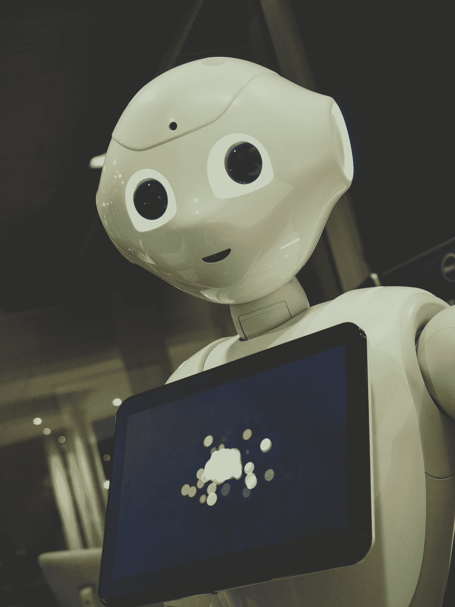
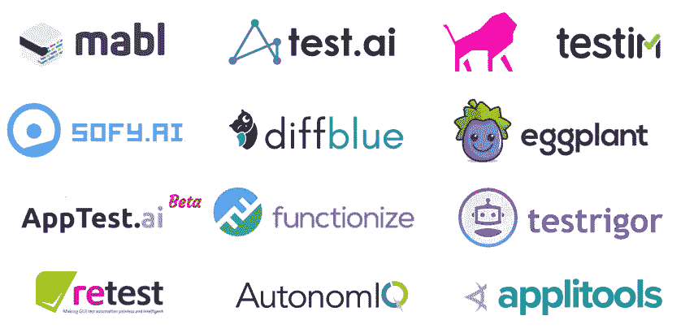

# 软件测试员可能很快会被人工智能程序取代

> 原文：<https://pub.towardsai.net/software-testers-may-soon-be-replaced-by-ai-programs-c7455b078145?source=collection_archive---------5----------------------->

## [人工智能](https://towardsai.net/p/category/artificial-intelligence)、[观点](https://towardsai.net/p/category/opinion)、[软件工程](https://towardsai.net/p/category/software-engineering)

## 基于人工智能的软件测试前景看好

照片由[欧文比尔德](https://unsplash.com/@owenbeard?utm_source=medium&utm_medium=referral)在 [Unsplash](https://unsplash.com?utm_source=medium&utm_medium=referral) 拍摄

人工智能(AI)已经改变了多个行业，并影响了我们日常生活的几个方面。大多数情况下，人工智能在自动化人工流程领域表现突出。因此，我们将调查人工智能是如何影响软件测试领域的，尤其是自动化测试。

## 什么是软件测试？

软件测试是评估程序性能的过程，以检查程序是否按照客户的要求开发，并找出是否存在错误并在程序被认为可以使用之前加以改进。

## 现有的挑战

每次开发人员添加新代码时，都必须执行新的测试，QAs 有责任花费大量时间来确保新代码不会破坏现有的代码库。[人工回归测试](https://en.wikipedia.org/wiki/Regression_testing)周期极其耗时，并且会在很大程度上加重 QAs 的负担。

传统的 QA 方法包括检查一系列任务，以确保软件按照预期的方式运行。在开始的时候，当只有一些特性需要测试时，这是一个可行的任务。但是随着功能的增加，QAs 面临着在完成最后期限的同时进行全面测试的困难。一个应用程序越复杂，就越难确保它得到完整的测试覆盖。

然而，随着人工智能的出现，简化测试过程已经成为可能。鉴于此，由于竞争，新软件和产品的发布必须加快，因为延长截止日期并不是一个真正的选择。因此，除了更聪明地测试而不是更努力地测试，别无选择。

## 人工智能如何克服这些挑战

AI 在软件测试工具中的应用集中在使[软件开发生命周期(SDLC)](https://www.tutorialspoint.com/sdlc/sdlc_overview.htm) 更容易。通过推理、解决问题和机器学习的应用，人工智能可以用来帮助自动化和减少开发和测试阶段的日常和繁琐的任务。

例如，假设您正在运行一个测试自动化框架来测试您的项目。大多数时候你不知道运行哪些测试，所以你运行所有的测试或者一些预先设定的测试。那么，如果一个支持人工智能的机器人可以审查测试状态的当前状态、最近的代码更改、代码覆盖率和其他指标，决定运行哪些测试，然后运行它们，会怎么样呢？这样的软件可以有效地代替开发人员/测试人员进行决策。

人工智能和机器学习应用推理和问题解决来自动化和改进测试。软件测试中的人工智能有助于减少耗时的手动测试，因此团队可以专注于更复杂的任务，如创建创新的新功能。人工智能可以优化软件测试过程的一些方法如下:

*   **提高准确性** — 传统测试仍然需要人力资源，我们必须承认，即使是最有经验的质量保证工程师也容易出错。测试人员失去了对软件质量保证的关注，并且因为大量的数据而忽略了一些重要的缺陷。这就是人工智能和机器学习技术出现的地方。他们教系统学习源码分析，将来应用知识。通过这种方式，AI 测试人员每次重复都会得出更准确的结果。因此，使用人工智能技术进行数据分析消除了人为错误的可能性。
*   **加速时间线**——人工测试人员不得不检查成千上万行代码，而人工智能可以快速整理日志文件，在几秒钟内扫描代码，并在更短的时间内检测错误。通过将 AI 纳入重复测试，QA 工程师可以专注于测试新功能或特别关注软件的重要部分。
*   **更好的自动化** —人工智能程序可以随着代码的变化而进化。他们可以适应并学习识别新的功能。当人工智能机器人识别出对代码的修改时，它们可以通过编程来决定这是一个新功能还是代码更改中出现的一些缺陷。
*   **正确理解客户需求** —在软件开发过程中，能够理解客户到底想要什么是至关重要的。通过使用人工智能，有可能检查类似的网站和应用程序，以确定什么有助于在目标受众中取得成功。人工智能可以帮助研究大量竞争产品，以确定它们的优势。通过对客户需求的正确理解，他们可以创建测试用例来确保产品在达到这些特定目标时不会崩溃。

## 基于人工智能的软件测试现状

实践的当前状态使用自治和智能代理，称为*“测试机器人”*来自动化诸如应用程序发现、建模、测试生成和故障检测之类的活动。使用机器学习技术的组合来实现测试机器人。这些包括但不限于决策树学习、神经网络和强化学习。

与传统的测试自动化工具和框架不同，机器学习允许测试机器人健壮并在不确定的条件下行动。过去十年形成的人工智能驱动的测试方法的例子包括:

*   **差异测试** —比较应用程序版本，对差异进行分类，并从分类的反馈中学习。
*   **视觉测试** —利用基于图像的学习和屏幕比较来测试应用程序的外观。
*   **声明式测试**——用自然语言或特定领域语言来说明测试的意图，并让系统找出如何执行测试。
*   **自我修复自动化** —当用户界面改变时，自动纠正测试中的元素选择。

自 2014 年以来，提供人工智能驱动的测试服务的供应商数量激增。这些工具供应商中的大多数都是以移动应用程序的系统级测试为目标的初创公司，这个主题正在业界产生一些急需的反响。观察人工智能力量的最简单方法是各种工具和框架的使用。以下是一些最流行的人工智能驱动的测试工具:

来源: [Perfecto](https://www.perfecto.io/blog/ai-in-software-testing)

## AI 会抢走你的软件测试工作吗？

关于这个问题，目前最流行的观点是，人工智能不会取代你，但会协助你的 QA 测试工作。这种观点背后的主要理由是，人工智能在软件开发中的应用仍处于初级阶段，自主性水平远低于更先进的领域，如仍由人类自己主导的自动驾驶系统。但可以肯定的是，人工智能帮助人类的下一步是让人工智能自己处理整个过程。只是时间问题。

但众所周知，技术的发展，特别是人工智能和机器学习是指数级的，因此，预测未来的人工智能能力并不容易。因此，人工智能接管你的测试工作的日期可能会比预期的要早！准备好！

感谢您抽出宝贵的时间阅读本文。注意安全！

## 资源

 [## 人工智能在软件测试中的现状和未来趋势

### 人工智能(AI)和机器学习(ML)正在改变经济的多个领域，并影响着…

www.perfecto.io](https://www.perfecto.io/blog/ai-in-software-testing)  [## 人工智能如何帮助软件测试

### 人工智能(AI)和机器学习(ML)已经不再仅仅是技术概念和工具…

www.browserstack.com](https://www.browserstack.com/guide/ai-with-software-testing)  [## 人工智能会取代 QA 测试员吗？- QA touch

### 最近有很多关于人工智能是否会取代测试员工作的猜测。这不是真的…

www.qatouch.com](https://www.qatouch.com/blog/does-artificial-intelligence-replace-qa-testers/)