# 使用 SARIMA、XGBoost 和 CNN-LSTM 的太阳能预测

> 原文：<https://pub.towardsai.net/solar-power-prediction-using-sarima-xgboost-and-cnn-lstm-ec5742abcd79?source=collection_archive---------1----------------------->

## 使用统计测试和机器学习分析和预测太阳能性能

努诺·马克斯在 [Unsplash](https://unsplash.com?utm_source=medium&utm_medium=referral) 上拍摄的照片

## **目录**

1.  [简介](#e715)
2.  [数据](#2601)
3.  [探索性数据分析](#df3b) (EDA)
4.  [造型](#e1a4)

*   [萨里玛](#c49d)
*   [XGBoost](#71db)
*   [美国有线电视新闻网-LSTM](#aa3e)
*   [结果](#b6ba)

5.[结论](#c863)

这篇文章的目的是展示如何应用数据科学方法来解决可再生能源领域的问题。我将讨论通过使用假设检验、特征工程、时间序列建模方法等从数据集获得有形价值的技术。我还将讨论不同时间序列模型的数据泄漏和数据准备等问题，以及如何管理它们。

# **1。简介**

能源部门利用可再生能源为家庭供电的情况有所增加。然而，无论是大规模还是家庭使用，问题都是一样的。提供来自可再生能源的电力的发电厂面临着间歇性的困难，并且需要不断的维护。由于间歇性，电网很难保持稳定。然而，通过预测方法，电网运营商可以预测发电量的增加和减少，这有助于相应地管理负载，更好地规划运营。

使用两个太阳能发电厂的数据，我将通过首先把它们总结成两个问题来解决这些问题:

> **1。是否有可能确定次优性能的太阳能组件？**
> 
> **2。有没有可能预测两天的太阳能电量？**

在回答这些问题之前，让我们先了解一下太阳能发电厂是如何发电的。

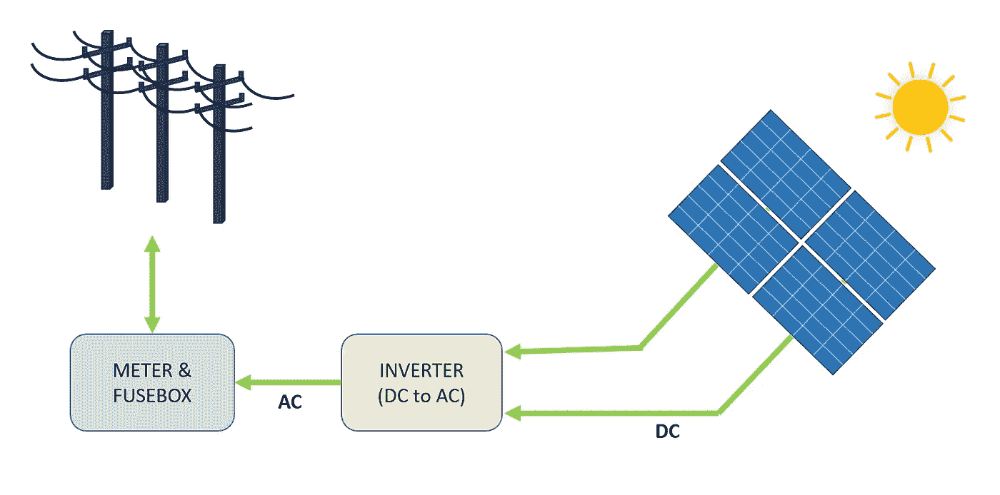

图 1-并网太阳能系统。图片由作者提供。

图 1 描绘了从太阳能电池板模块到电网的发电过程的高级视图。太阳能通过光电效应直接转化为电能。当硅(*太阳能电池板中最常见的半导体材料)等材料暴露在光线下时，光子(电磁能量的亚原子粒子)被吸收并释放出自由电子，从而产生直流电(DC)。使用逆变器，DC 被转换成交流电(AC)并馈入电网，在那里它可以被分配到家庭。*

*有不同类型的太阳能发电系统，如离网系统和直接光伏系统，但在这种情况下，我们将分析一个并网系统。*

*事不宜迟，我们继续分析。*

# ***2。数据***

*原始数据由每个太阳能发电厂的两个逗号分隔值( *CSV* )文件组成。一个文件显示了发电量，另一个文件显示了位于太阳能发电厂的传感器记录的测量值。每个太阳能发电厂的两个数据集被整理成一个单一的数据框架。*

*从 2020 年 5 月 15 日*到 2020 年 6 月 18 日*****太阳能电站 1 (SP1)** 和**太阳能电站 2 (SP2)** 的数据每 15 分钟收集一次。**SP1 和 SP2 两个数据集包含相同的变量。*

*   ****日期时间*** -15 分钟间隔*
*   ****环境温度-*** 模块周围空气的温度*
*   ****模块温度***-模块的温度*
*   ****辐照-*** 对模块进行高能辐照*
*   ****【DC 功率(千瓦)***-直流电*
*   ****【千瓦】***-交流电*
*   **-每日发电量总和**
*   ***-变频器累计产量***
*   ******工厂 ID***-太阳能工厂的唯一标识***
*   *****模块 ID***-每个模块的唯一标识**

**天气传感器用于记录环境温度、模块温度和每个太阳能设备的辐射。**

> ****原始数据可以在这里找到******。******

****在这种情况下， **DC 功率将成为因变量(*目标变量*)。在继续建模之前，深入分析数据总是一个好主意，在我们的情况下，尝试找到次优性能的太阳能电池组件。******

> ****两个独立的数据框架用于分析和预测。唯一的区别是用于预测的数据帧被重新采样成小时间隔，而用于分析的数据帧包含 15 分钟间隔。****

****工厂 ID 从两个数据框中删除，因为它对尝试回答上述问题没有增加任何价值。模块 ID 也将从预测数据集中删除。表 1 和表 2 显示了数据示例。****

****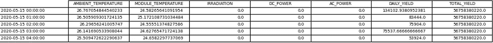****

****表 1-用于预测的数据帧。图片由作者提供。****

****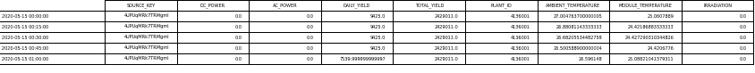****

****表 2-用于分析的数据框架。图片由作者提供。****

****在继续分析数据之前，对太阳能发电厂做了一些假设，包括:****

*   *******数据采集仪器没有故障*******
*   *******定期清洁模块*******
*   *******两个太阳能发电厂周围都没有遮阳问题*******

# ******3。探索性数据分析******

> ****对于那些刚刚接触数据科学的人来说，EDA 是通过绘制可视化和执行统计测试来理解数据的关键一步。这部分的代码不包括在内，但是，所有可视化的代码可以在我的 Github 页面上找到，该页面链接在帖子的底部。****

****首先，通过绘制 SP1 和 SP2 的 DC 和 AC，可以观察每个太阳能发电厂的性能。****

****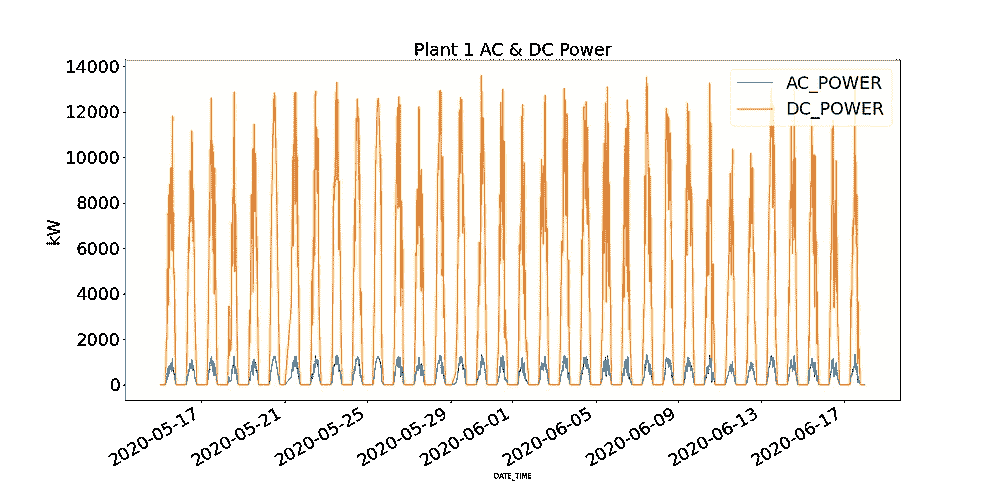********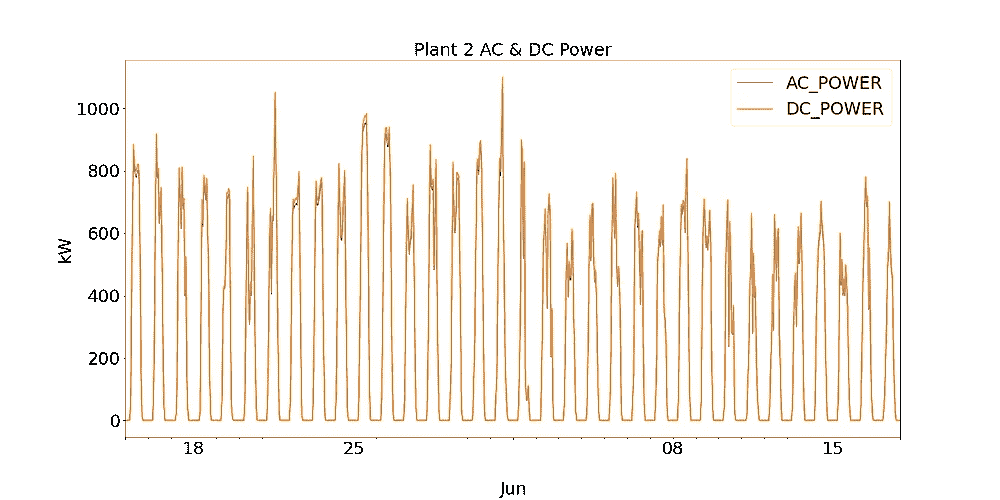****

****图 2: SP1 和 SP2 交流/DC 电力公司。图片由作者提供。****

****工厂 1 显示 DC 功率比工厂 2 高一个数量级。基于为 SP1 收集的数据是正确的并且用于记录数据的仪器没有故障的假设，这导致调查在 SP1 的逆变器的效率。****

****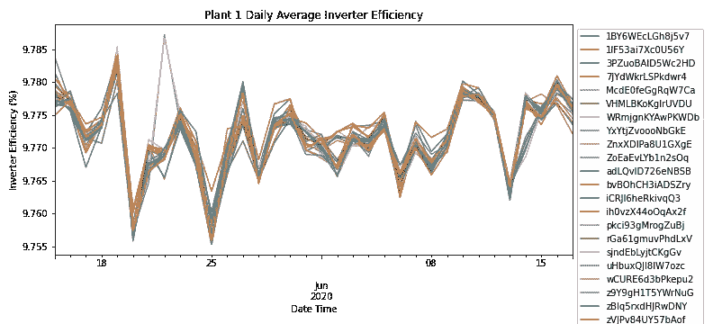****

****图 3: SP1 功率输出效率。图片由作者提供。****

****通过汇总每个模块每日频率的交流和 DC 功率，图 3 显示了 SP1 所有模块的逆变器效率。根据节能信托公司的说法，太阳能逆变器的效率应该在 93-96%之间。*由于所有模块的效率范围为 9.76% — 9.79%，太阳能电站运营商可以进一步调查逆变器的性能以及是否需要更换*。****

> ****由于 SP1 显示逆变器的问题，进一步的分析只在 SP2 完成。****

****尽管这一简短的分析导致了对逆变器的研究，但它并没有回答识别次优太阳能电池组件的主要问题。****

****由于 SP2 的逆变器按预期运行，通过深入挖掘数据，我们将尝试识别和调查任何异常情况。****

****检查图 4 中模块温度和环境温度之间的关系，有时模块温度会非常高。****

********

****图 4:SP2 的模块和环境温度。图片由作者提供。****

> ****这可能看起来有悖常理，但高温对太阳能电池板有负面影响。如前所述，当光子与太阳能电池中的电子接触时，它们会释放自由电子，但在更高的温度下，更多的电子已经处于激发态，这降低了电池板可以产生的电压，从而降低了效率。****

****请记住这一现象，下面的图 5 显示了 SP2 的模块温度和 DC 功率(*环境温度低于模块温度的数据点和一天中少量模块运行的时间已被过滤，以防止数据失真*)。****

****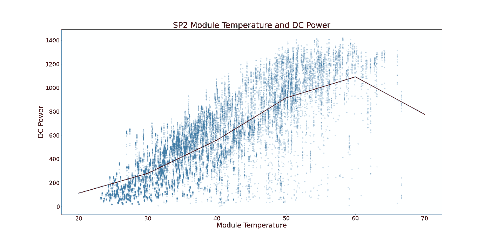****

****图 5:SP2 模块温度和 DC 功率之间的关系。图片由作者提供。****

****在图 5 中，红线显示平均温度。有一个明显的引爆点和 DC 权力停滞的迹象。DC 电力公司开始稳定在大约 52 *摄氏度。*为了发现太阳能电池组件的性能次优，**所有显示组件温度超过 52 摄氏度的行都被删除。******

****下图 6 显示了 SP2 一天中每个模块的 DC 功率。DC 的电力分配符合预期，中午的发电量更大。然而，有迹象表明在高峰时段发电量较低。很难描述这种情况的原因，因为当天的天气条件可能很差，或者 SP2 可能已经到了定期清洁周期的尾声。****

*******图 6 中也有低性能模块的迹象。它们可以在图上被识别为模块(单个数据点)，偏离它们最近的集群。*******

****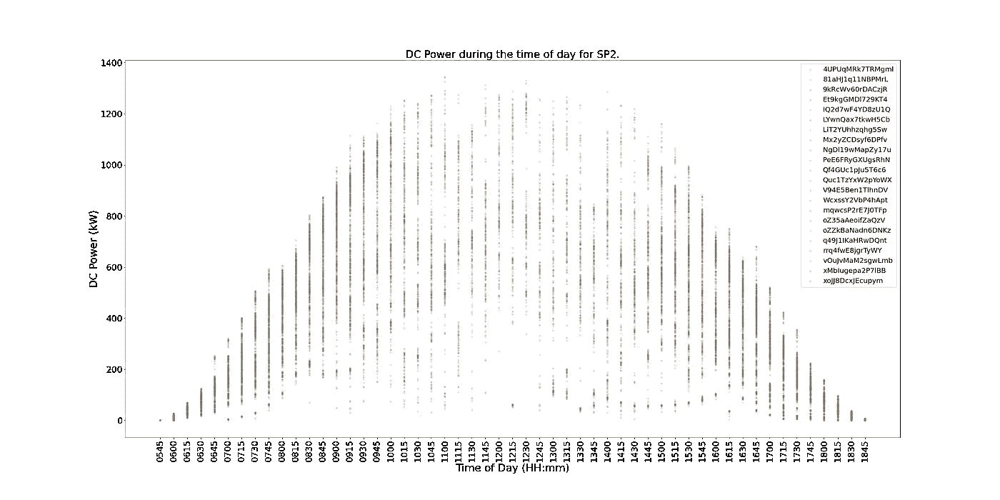****

****图 6:SP2 一天中 DC 能量的分布。图片由作者提供。****

****为了确定哪些模块性能不佳且不受恶劣天气条件或清洁周期结束的影响，同时显示每个模块与其他模块相比的性能的统计测试将确定次优性能。****

****由于在同一时间每 15 分钟间隔的 DC 电力的不同模块的分布是正态分布的，假设检验可以确定哪些模块表现不佳。**计数是指模块落在 p 值为< 0.001* 的 99.9%置信区间之外的次数。*****

****图 7 以降序显示了每个模块与同时期的其他模块相比在统计上表现明显不佳的次数。****

****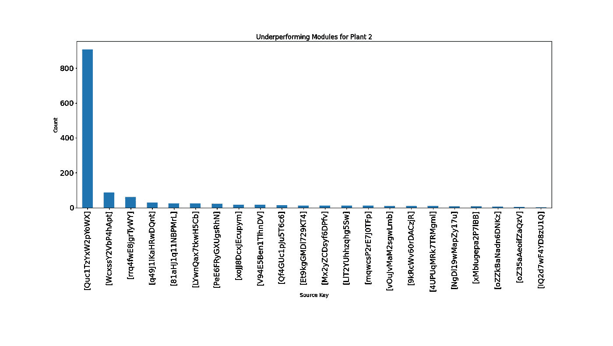****

****图 7:SP2 在统计上表现不佳的模块。图片由作者提供。****

****从图 7 中可以得出清晰的推论，图中显示***模块‘quc1 tzyxw 2 pyo wx’次优性能约为*的 850 倍。该信息可提供给 SP2 的运营经理，以调查原因。******

# ******4。建模******

****在本节中，我们将了解三种不同的时间序列算法:SARIMA、XGBoost 和 CNN-LSTM，以及它们预测 SP2 DC 2 天电力的设置。****

****对于所有这三个模型，都使用了前向走验证来预测下一个数据点。逐步验证是一种用于时间序列建模的技术，因为随着时间的推移，预测会变得越来越不准确，因此更实用的方法是在实际数据可用时用实际数据重新训练模型。****

> ****更多关于这项技术以及它如何应用于长短期记忆(LSTM)模型的信息可以在下面的帖子中找到。****

**** [## 使用深度学习来预测风力涡轮机的功率输出

### 用前推验证方法对时间序列数据实施短期长期记忆(LSTM)模型。

medium.com](https://medium.com/swlh/using-deep-learning-to-forecast-a-wind-turbines-power-output-e87b37b9a50e)**** 

****在建模之前，更详细地探索数据总是值得的。图 8 显示了 SP2 数据集中所有要素的关联热图。热图显示了因变量 DC 功率，显示了与模块温度、辐射和环境温度的强相关性。这些特征可能在预测中发挥重要作用。****

> ******在下面的热图中，交流电源显示皮尔逊相关系数为 1。为了防止数据泄漏问题，交流电源从数据帧中移除，因为在记录任何其他变量之前，模型不能访问该信息。******

****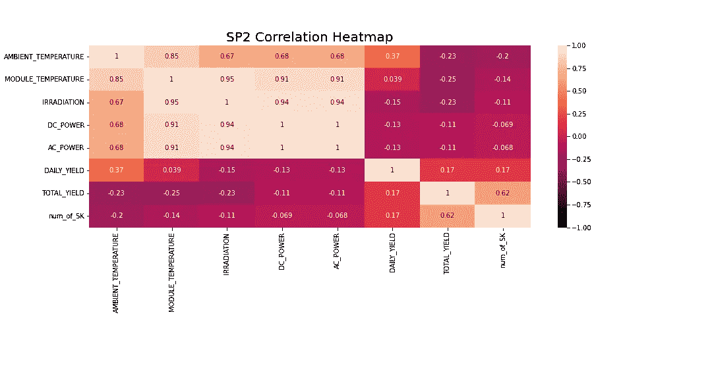****

****图 8:SP2 所有特征的相关热图。图片由作者提供。****

> ******对于 SARIMA 和 XGBoost 模型，python 库“多重处理”用于利用多个处理器，通过网格搜索找到最佳超参数。******

## *******萨里玛*******

****SARIMA ( *季节性自回归综合移动平均*)是一种单变量时间序列预测方法。由于目标变量显示出 24 小时循环周期的迹象，SARIMA 是一个有效的建模选项，因为它考虑了季节效应。这可以在下面的季节分解图中观察到。****

********

****图 9:SP2 DC 电力的季节分解。图片由作者提供。****

****SARIMA 算法要求数据是静态的。测试数据是否稳定有多种方法，例如，统计测试(*扩展的 Dickey fuller 测试*)、汇总统计(*比较数据不同部分的均值/方差*)以及直观分析数据。 ***在建模之前尝试多次测试很重要。*******

******增广的 Dickey-Fuller (ADF)** 检验是一种'[单位根检验'](https://www.statisticshowto.com/unit-root/) 用于判断时间序列是否平稳。从根本上来说，这是一个具有无效和替代假设的统计显著性测试，并根据得出的 p 值得出结论。****

*******零假设:*** 时间序列数据是非平稳的。****

*******替代假设:*** 时间序列数据是平稳的。****

****在我们的例子中，如果 p 值≤ 0.05，我们可以拒绝零假设，并确认数据没有单位根。****

****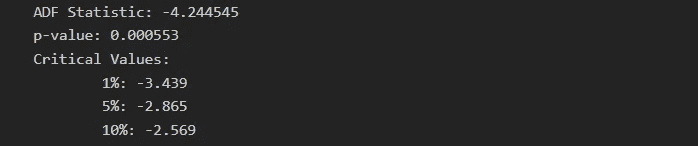****

****图片由作者提供。****

******从 ADF 测试来看，p 值为 0.000553，也就是< 0.05。根据这一统计，可以认为数据是稳定的。然而，看图 2，有明显的季节性迹象*(对于被认为是平稳的时间序列数据，不应有季节性和趋势的迹象)*，导致非平稳数据。因此，运行多个测试非常重要。******

****要使用 SARIMA 对因变量建模，时间序列需要是静态的。[图 9](#301f) ( *第一和第三图*)显示了 DC 电力季节性的明显迹象。取第一个差值 *[t-(t-1)]* 去除了季节性成分，这可以在图 10 中看到，因为它看起来类似于正态分布。数据现在是稳定的，适合于 SARIMA 算法。****

****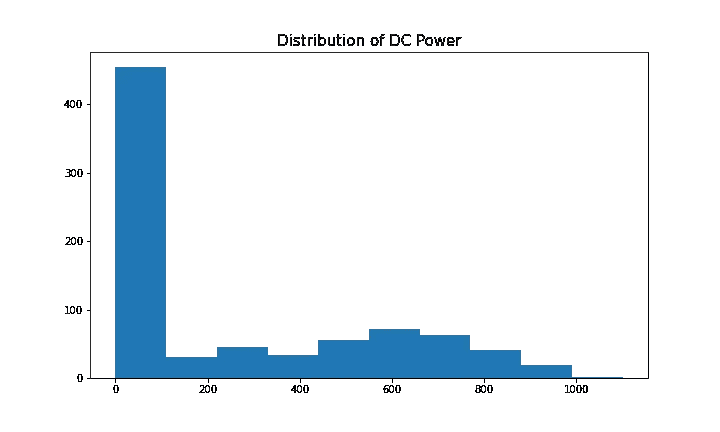********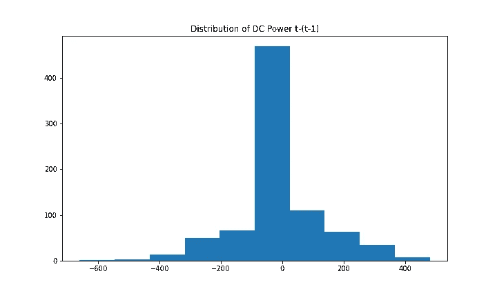****

****图 10:DC 力的分布(左)和第一差(右)。图片由作者提供。****

****SARIMA 的超参数有 **p** ( *自回归顺序*)、 **d** ( *差序*)、 **q** ( *移动平均*)、 **P** ( *季节自回归顺序*)、 **D** ( *季节差序*)、 **Q** ()更多关于 SARIMA 超参数和预测的信息可在[这里](https://machinelearningmastery.com/sarima-for-time-series-forecasting-in-python/)找到。****

****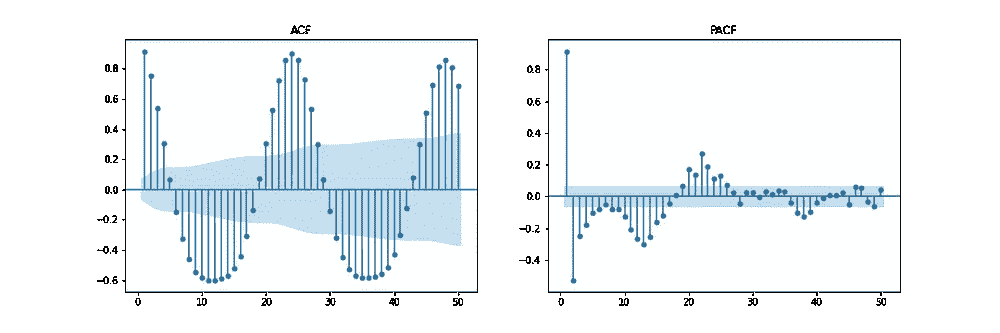********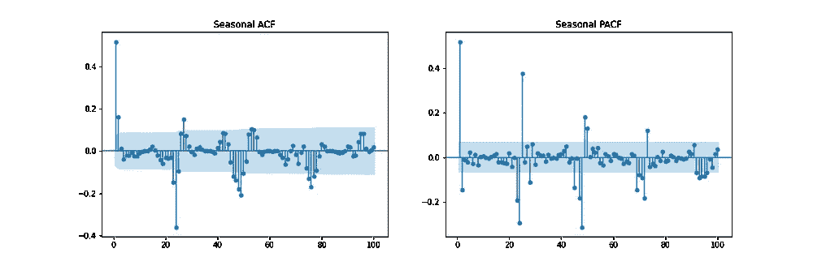****

****图 11: ACF/PACF &季节性差异 ACF/PACF。图片由作者提供。****

****图 11 显示了自相关( **ACF** )、偏自相关( **PACF** )和季节性 ACF/PACF 图。ACF 图显示了时间序列与其延迟版本之间的相关性。PACF 显示了时间序列与其滞后版本之间的直接相关性。蓝色阴影区域代表置信区间。SACF 和 SPACF 可以通过从原始数据中提取季节差异( **m** )来计算，在本例中为 24，因为有明显的 24 小时季节效应，如 ACF 图所示。****

****凭直觉，可以从 ACF 和 PACF 图推导出超参数的起点。例如，ACF 和 PACF 都显示逐渐下降，这意味着自回归阶数( ***p*** )和移动平均阶数( ***q*** )都大于 0。 ***p*** 和 ***P*** 可以通过分别观察 PCF 和 SPCF 曲线，并在滞后值不显著之前计数统计上显著的滞后数来确定。同样的， ***q*** 和 ***Q*** 也可以在 ACF 和 SACF 的剧情中找到。****

****差分顺序( ***d*** )可以由使数据稳定所取的差分数来确定。季节性差序( ***D*** )是从时间序列中去除季节性成分所需的差数估计出来的。****

****该方法作为开始建模的起点。围绕此起始点在一系列值上进行网格搜索应该会提高模型性能。关于估算这些参数的更多信息可以在 [***这里***](https://arauto.readthedocs.io/en/latest/how_to_choose_terms.html) *找到。*****

******通过使用网格搜索方法的超参数优化，基于最小均方误差(MSE)选择最佳超参数，包括 *p = 2，d = 0，q = 4，p = 2，D = 1，Q = 6，m = 24，trend =‘n’(无趋势)*。******

****图 12 显示了 SARIMA 模型的预测值与 SP2 2 天内记录的 DC 功率的比较。****

********

****图 12: SARIMA 预测(红色)与测试值(蓝色)的比较。图片由作者提供。****

****为了分析模型的性能，图 13 显示了模型诊断。在第一个滞后之后，相关图显示几乎没有相关性，下面的直方图显示了平均值零周围的正态分布。由此，我们可以说模型无法从数据中收集更多的信息。****

****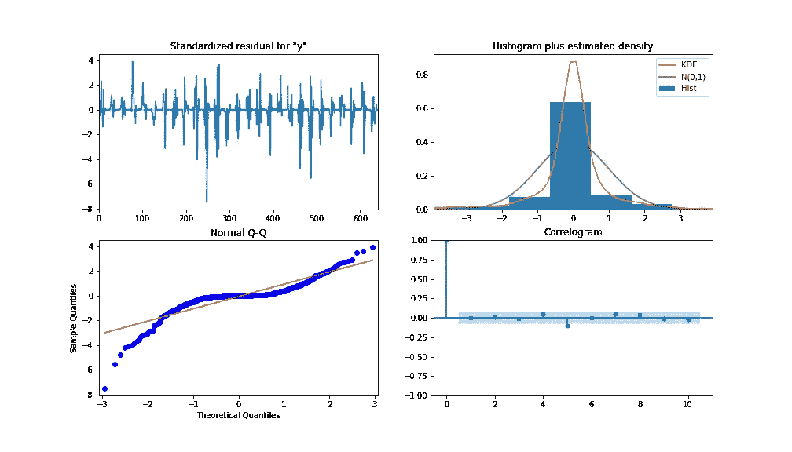****

****图 13: SARIMA 诊断。图片由作者提供。****

## *******XGBoost*******

****XGBoost *(极限梯度提升)*是一种梯度提升决策树算法。它使用一种集成方法，其中添加新的决策树模型来修正现有的决策树得分。与 SARIMA 不同，XGBoost 是一种多元机器学习算法，这意味着该模型可以采用多个特征来提高模型性能。****

****采取特征工程步骤来提高模型精度。创建了 3 个附加特征，分别包括交流和 DC 功率的滞后版本、***【S1 _ 交流 _ 功率*** 和***【S1 _ DC _ 功率、*** ，以及通过将交流功率除以 DC 功率得到的总效率、***【EFF】***。 ***AC_POWER*** 和***MODULE _ TEMPERATURE***被从数据中删除。图 14 通过增益(*使用特征*的分裂的平均增益)和权重(*特征在树中出现的次数*)显示了重要性级别。****

****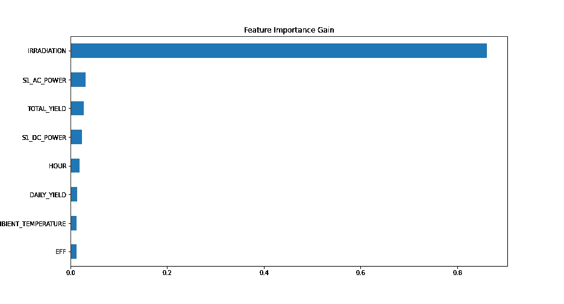********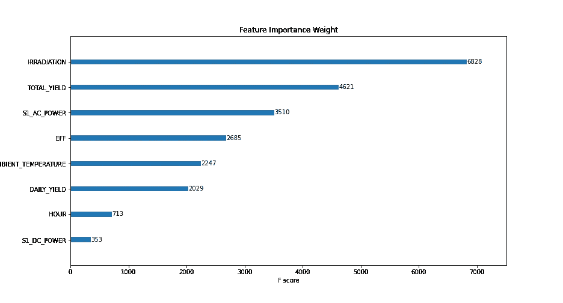****

****图 14: XGBOOST 特征重要性增益(左)和权重(右)。图片由作者提供。****

****通过网格搜索确定用于建模的超参数，并得到: ***学习率= 0.01，估计器数量= 1200，子样本= 0.8，按树分类的列样本= 1，按级别分类的列样本= 1，最小子权重= 20，最大深度= 10*** *。*****

****如前所述，使用了一种向前行走的验证方法，并使用一个 ***MinMaxScaler 在 0 和 1 之间缩放训练数据*** *(我强烈建议尝试其他缩放器，如 log-transform 和 standard-scaler，具体取决于您的数据分布)*。 ***通过将所有独立变量后移一段时间*** ，将数据转换为监督学习数据集。****

****图 15 显示了 XGBoost 模型的预测值与 SP2 2 天内记录的 DC 功率的比较。****

****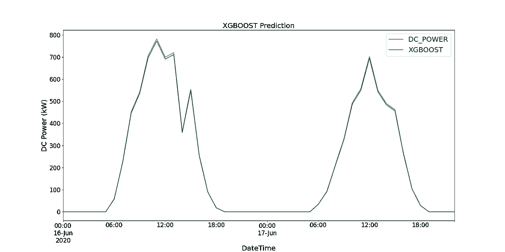****

****图 15: XGBoost 预测(绿色)与测试值(蓝色)的对比。图片由作者提供。****

## ****CNN LSTM 频道****

****CNN-LSTM *(卷积神经网络长短期记忆)*是两种神经网络模型的混合模型。CNN 是一种前馈神经网络，在图像处理和自然语言处理中表现出良好的性能。它还可以有效地应用于时间序列数据的预测。LSTM 是一种序列到序列神经网络模型，旨在通过使用内部存储系统来解决梯度爆炸/消失的长期问题，该系统允许其在输入序列上累积状态。*更多关于这些车型的信息可以在这里***和* [*这里*](https://machinelearningmastery.com/gentle-introduction-long-short-term-memory-networks-experts/) *找到。******

****在这种情况下，CNN-LSTM 被用作编码器-解码器架构。由于 CNN 不直接支持序列输入，1D CNN 读取序列输入并自动学习重要特征。这些可以由 LSTM 来解释。与 XGBoost 模型类似，使用 scikitlearn 的 MinMaxScaler 使用相同的数据并进行缩放，但是范围在-1 和 1 之间。 ***对于 CNN-LSTM 来说，需要将数据重塑成所需的结构:*** ***【样本、子序列、时间步长、特征】，这样就可以传入作为模型的输入。*******

*******因为我们希望对每个子序列重用相同的 CNN 模型，所以使用时间分布式包装器对每个输入子序列应用一次整个模型。*** 最终模型中使用的不同层的模型总结如下图 16 所示。****

****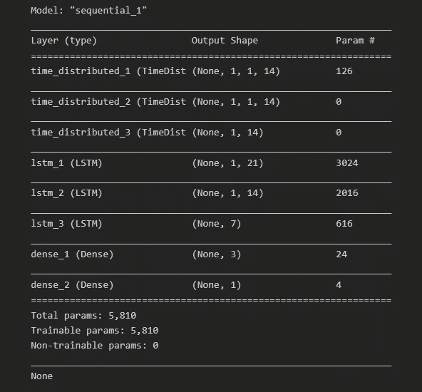****

****图 16:模型总结。图片由作者提供。****

****除了将数据分成训练和测试数据之外，还将训练数据分成训练和验证数据集。在所有训练数据(包括验证数据)的每次迭代之后，这可以进一步被模型用来评估模型性能。这被称为一个时代。****

****学习曲线是深度学习中使用的一个很好的诊断工具，它显示了每个时期后模型的性能。下面的图 17 显示了模型如何从数据中学习，并显示了验证数据与训练数据的融合。这是模特训练好的标志。****

****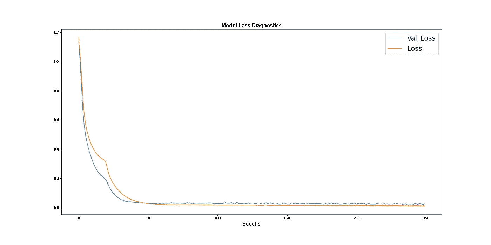****

****图 17:培训和验证损失的学习曲线。图片由作者提供。****

****图 18 显示了 CNN-LSTM 模型的预测值与 SP2 两天内记录的 DC 功率的比较。****

****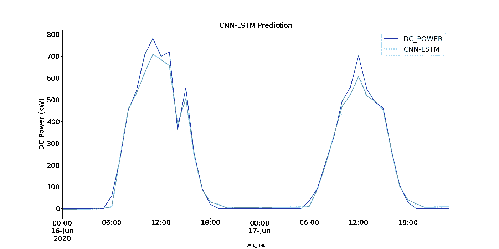****

****图 18: CNN-LSTM 预测(浅蓝色)与测试值(深蓝色)的比较。图片由作者提供。****

*******由于 CNN-LSTM 的随机性，模型运行 10 次，记录一个平均 MSE 值作为最终值来判断模型的性能。*** 图 19 显示了所有模型运行记录的 MSEs 范围。****

********

****图 19:10 次运行的平均 MSE。图片由作者提供。****

## *******结果*******

****在建模之前，计算持久性模型以提供最大 MSE 值并评估其他模型的性能。*持续性模型的结果是通过计算 DC 幂和同一时间序列的 1 个周期的滞后版本的 MSE 来计算的。表 3 突出显示了每个模型的 MSE(CNN-LSTM 的平均 MSE)和每个模型的运行时间(分钟)。*****

****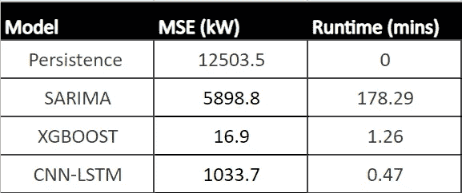****

****表 3:所有模型的 MSE 和运行时间。图片由作者提供。****

****从表 3 中可以看出，与所有其他模型相比，XGBoost 的性能最好，MSE 最低，运行时间第二快。由于该模型显示了每小时预测可接受的运行时间，它可以成为帮助运营经理决策过程的有力工具。****

# ****5.结论****

****总而言之，我们分析了 SP1 和 SP2，以找出表现不佳的地方。由于逆变器效率低，SP1 表现不佳。对 SP2 的调查进一步显示了太阳能电池组件性能不佳的迹象。使用假设检验来统计每个模块在统计上明显表现不佳的次数，与同时期的其他模块相比，提出了对模块*‘quc1 tzyxw 2 pyo wx’，* 的关注，其中显示约 850 次低性能。****

****预测未来的太阳能发电量导致对 SP2 进行每小时间隔的重新采样，并将数据分成 48 个周期(2 天)用于测试数据，其余时间用于训练三个模型。这些模型包括萨里玛，XGBoost 和有线电视新闻网 LSTM。SARIMA 表现出最差的性能，XGBOOST 表现出最好的结果，MSE 为 16.9，运行时间为 1.43 分钟。XGBoost 是所有三种模型中推荐的，并被部署到生产环境中。****

****谢谢你的阅读，祝你学习愉快。****

## ****数据参考****

*****坎纳尔，A. (2020，8 月)*。**太阳能发电数据**。许可证:数据文件原作者，2020 年 9 月 25 日从*[*https://www . ka ggle . com/datasets/anikannal/solar-power-generation-Data*](https://www.kaggle.com/datasets/anikannal/solar-power-generation-data)检索*****

> ******要访问本文中使用的代码，请访问我的 GitHub 页面。链接可以在** [**这里找到**](https://github.com/Amitdb123/Solar_Power_Analysis-Prediction) **。******

## ****取得联系****

******领英:**[https://www.linkedin.com/in/amit-bharadwa123/](https://www.linkedin.com/in/amit-bharadwa123/)****

****有兴趣开始自己的数据科学项目吗？查看下面的链接，帮助您踏上旅程。****

**** [## 成功数据科学项目的 7 个步骤

### 从头开始完成数据科学项目的初学者指南

towardsdatascience.com](https://towardsdatascience.com/7-steps-to-a-successful-data-science-project-b452a9b57149)****