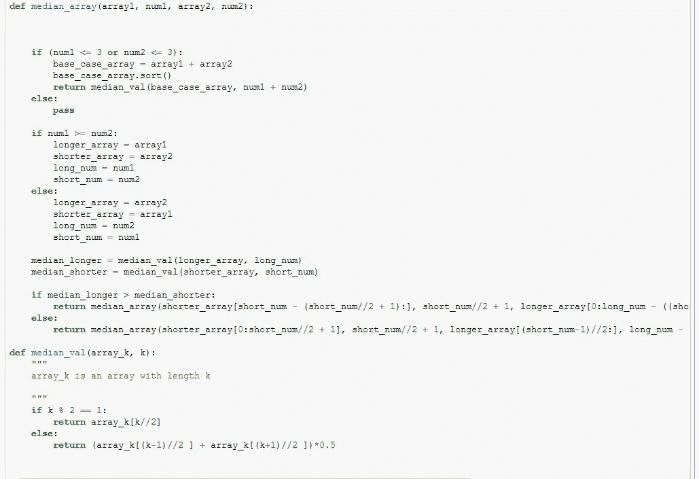
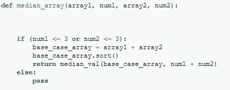
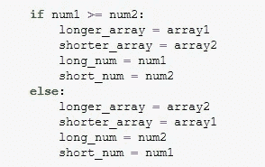
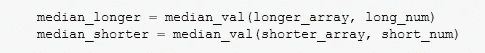
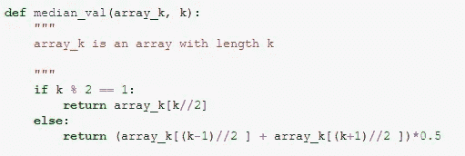
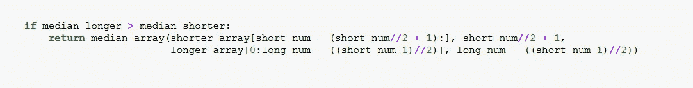
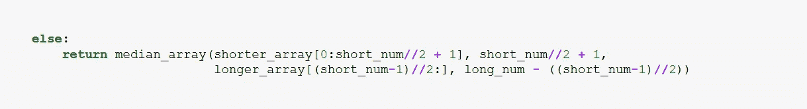

# 用代码解决亚马逊面试问题

> 原文：<https://pub.towardsai.net/solving-an-amazon-interview-question-with-code-afaf2b8d0539?source=collection_archive---------1----------------------->

## [编程](https://towardsai.net/p/category/programming)，[软件工程](https://towardsai.net/p/category/software-engineering)

## 让我们来看看在亚马逊、谷歌和优步的面试中用过的一个算法问题。包括一个 Python 实现。



# 这个问题

我们有两个已排序的数组 A 和 B。如果我们将这两个数组连接起来并排序，我们将得到一个新的数组，称为 C。例如，如果 A = [1，4，6，7]，B = [2，2，13]，那么 C = [1，2，2，4，6，7，13]。

我们的任务是在 O(log(n+m))时间内确定 C 的中位数。

问题是我们没有得到 C，我们只得到 A 和 B。时间复杂度限制意味着显式计算 C 是不可行的，因为我们必须对长度为(A) +长度为(B)的数组进行排序。

所以我们的任务就是找到一个高效的方法来求 C 的中值。

# 解决问题

## 第 0 部分:中位数和排序数组

中位数的一个很好的特性是，很容易使一个*排序的*数组变小，并保持相同的中位数——只需从中位数上方和下方移除相同数量的元素。

考虑[1，4，5，6，9]。5 在中间，是中位数。但是，如果我们移除顶部和底部的元素，则得到数组[4，5，6]——5 仍然是中间值。

如果我们将这一点发挥到极致，创建具有相同中值的最小可能数组，对于具有偶数个元素的数组，如[1，2，3，4，5，6]，我们将只保留中间的两个元素[3，4]，而对于具有奇数个元素的数组，如[1，3，5，7，9]，我们可以删除所有元素，只保留中间的一个元素，只保留[5]。

如果我们的数组分成两个有序的部分呢？我们的策略基本上是一样的，只是稍微复杂一点。我们将想要识别我们确信不是中间两个元素(如果是偶数)或中间元素(如果是奇数)的元素，并且从上面和下面移除相等的数量，从而保持中间值相同。

## 第一部分:我们的算法

1.  **我们识别中位数。**
2.  **我们比较中位数。**

这使我们可以确定，一定数量的元素高于中值，一些元素低于中值。

为什么假设 B 的中位数大于 A 的中位数。现在，选择一个高于 B 的中值且也在 B 中的元素。根据定义，这个元素*保证*大于 B 中低于中值的所有元素。但是*也是*保证大于 A 中低于 A 中中值的所有元素，因为 B 的中值大于 A 中的中值。

一个简短的例子如下。

设 A = [1，2，3，4]，B = [1，3，3，5，5，5，f]

A 的中位数是 2.5，B 的中位数是 5。我们可以立即推导出 1 ≤ f，因为 1≤A 的中值≤B 的中值≤ f

3.**我们确定哪个数组的元素更少**

这是必要的，因为我们希望从 C 的中值上方的 T2 中移除与从中值下方的 T4 中移除相同数量的元素。在上面的示例中，如果我们移除了 B 的单个中间元素上方的 3 个元素，但仅移除了 A 的两个中间元素下方的一个元素，那么我们将从 C 的中值上方移除 3 个元素，从下方移除 1 个元素。结果数组可能会有不同的中值。

4.我们从较短的数组中移除尽可能多的元素，从较长的数组中移除相同数量的元素

这个过程可以在下图中看到。这遵循逻辑 in ( **3** )确保我们从 C 的中值以上和 C 的中值以下移除尽可能多的元素


5 **我们重复步骤(1–4 ),直到两个数组中较小的一个足够小。然后我们加入并排序**

通过重复步骤 1-4，我们每次从较短的数组中删除不到一半的元素。这意味着在 O(log(min(n，m)))时间内，我们可以得到基本情况。例如，如果一个数组长度为 16，另一个长度为 1000000，那么将较小的数组减少到只有 2 个元素需要 4 个步骤。然后用 O(log(max(n，m)))将剩下的 2 个元素排序到更大的数组中，并计算出中间值。

## 第二部分:代码实现

在我的 python 代码中，“基本情况”如下。当第一个数组或第二个数组的长度≤3 时，我们只需继续，对两个数组进行排序，并直接找到中间值。



在我们从顶部和底部移除元素之前，我们要重新标记。我们把元素多的数组叫做 longer_array，它的长度是 long_num，元素少的数组是 shorter _ array，长度是 short_num。这是因为，虽然我们可能希望将两者大致分成两半，并且如果一个数组比另一个长得多，则保留每一个的一半，但是我们可能不会从中值以上和中值/以下移除相同数量的元素



接下来，我们确定长数组和短数组的中间值



为此，我们使用一个我定义的助手函数，称为 median_val。这只是接收一个数组及其长度，并返回其中值。



在我们定义了两个数组的中值之后，我们有两种情况:第一种情况 shorter_array 有一个较小的中值，第二种情况 shorter_array 有一个较大的中值。

我们看第一种情况。在这里，我们标识新的缩短数组，并将它们作为递归调用传递回我们的函数。



我们来分析一下。

```
shorter_array[short_num - (short_num//2 + 1):]
```

是第一个论点。在这种情况下，由于 short_array 的中值较小，所以我们只想保留其中较大的一半。

```
[short_num - (short_num//2 + 1):]
```

看起来很丑，而且很复杂，但这只是算术。之所以有点混乱，是因为我们想要一个对奇数和偶数大小的数组都适用的方程。

我们函数的第二个参数如下

```
short_num//2 + 1
```

这只是第一个子句中指定的数组长度。如果用 python 编码，也可以使用`len`方法

我们函数的第三和第四个参数是

```
longer_array[0:long_num - ((short_num-1)//2)], long_num - ((short_num-1)//2)
```

这与第一个和第二个参数的作用相同——标识我们要保留的数组部分及其长度。请注意较长数组的长度是如何减少(short_num-1)//2 的，这与我们减少较短数组长度的量完全相同。

*else* 子句做了同样的事情，但是对于较短的数组有较大的中值的情况。



# 时间复杂度

如果 m 是我们较短的数组的大小，我们每次都要移除(几乎)它的一半元素，所以将它减少到我们的基本情况需要 log(m)时间。在我们的基本情况下，我们已经从另一个数组中删除了大约 m 个元素，剩下一个大小大约为 n-m 的数组。如果您预先确定了基本情况的大小，那么将有限数量的元素(在我们的情况下是 3 个)添加到一个排序列表中需要 O(log(n))的时间。最后，提取中值是对排序列表的 O(1)时间操作。这意味着我们的算法是 O(log(m) +log(n))，当 n≥m 时，就是 O(log(n)) = O(log(n+m)。

要知道为什么 O(log(n)) = O(log(n+m))，观察 log(n+m) ≤ log(2n) = log(n) + log(2)。

*感谢您花时间阅读本文，希望您喜欢:)请在下面告诉我您的意见。如果有人想看这个算法的 C 语言实现，我可以添加。我是剑桥大学的一名数学系学生，也是一名非常业余的程序员:)—你可以在 twitter 上关注我的(大部分)数学和(一些)编程，我是*[*Ethan _ the _ mathmo*](https://twitter.com/MathmoThe)