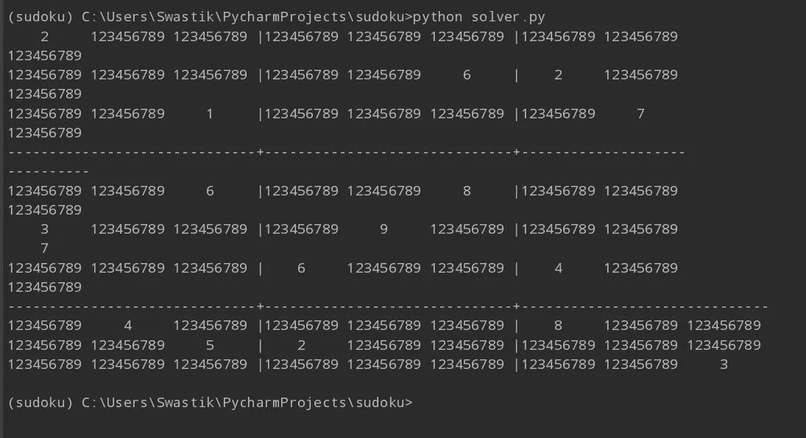

# 用 AI 还是量子解数独？

> 原文：<https://pub.towardsai.net/solving-sudoku-with-ai-or-quantum-3421f5af7b54?source=collection_archive---------1----------------------->


迈克尔·泽兹奇在 [Unsplash](https://unsplash.com?utm_source=medium&utm_medium=referral) 上的照片

## [人工智能](https://towardsai.net/p/category/artificial-intelligence)，[计算机科学](https://towardsai.net/p/category/computer-science)

## 在作为一种有趣的棋盘游戏存在了一百年之后，数独是如何成为计算研究的焦点之一的？探索如何使用人工智能或量子计算机从头开始创建智能数独解算器。

# 在深入研究之前先回顾一下历史:


约翰·摩根在 [Unsplash](https://unsplash.com?utm_source=medium&utm_medium=referral) 上拍摄的照片

“历史被称为所有学科之母”，马克·布洛赫说。所以，让我们来谈谈著名的数独是如何产生的。这个故事可以追溯到 19 世纪晚期，起源于法国。法国日报 Le Siecle 发布了一个 9x9 的谜题，需要算术计算来解决而不是逻辑，并且有两位数而不是 1 到 9，具有类似的游戏属性，如数独，如果将行，列和对角线上的数字相加，将得到相同的数字。1979 年，一位名叫**霍华德·加恩斯**的退休建筑师和解谜者被认为是现代数独游戏的创造者，该游戏最初由 [**戴尔杂志**](https://www.pennydellpuzzles.com/) 以**数字位置**的名义出版。该拼图于 1986 年由一家名为 [**Nikoli**](http://www.nikoli.co.jp/en/puzzles/) 的日本拼图公司以 **Sudoku** 的名字首次出版。

# 构建解决数独问题的框架:

数独是现实世界中约束满足问题(CSP)的一个例子，因为变量集、定义域集和约束集都是有限的。我们必须在 9x9 表格中输入范围从 1 到 9 的数字，以使每行、每列和每个 3x3 子表格中的数字包含每个数字恰好一次。数独还有另一种变体，即对角线数独，它有一组额外的约束条件，即在每条对角线上，每个数字必须恰好出现一次。正如我们所知道的约束满足域，最优解必须满足所有的约束，或者更具体地说，它应该遵守游戏规则。最优解将满足集合中的所有约束，从而解决难题。

在计算上，解决一个**n×n**数独的约束可以在非确定的多项式时间(NP)内解决，因为这些约束可以用一些非常特殊的强力算法解决，并且这组解的有效性也可以在多项式时间内测试，其中问题的输入与一组多项式长度的解相关联。一个完全解出的数独游戏是一个**拉丁方块**(如欧拉所描述的，填充了 n 个不同符号的 n×n 数组)的例子。数独问题可以被认为是一个图形着色问题，我们只需要用 9 种颜色给图形着色，暴露的字母可以被认为是部分颜色。

# 用人工智能算法满足约束:

计算科学的基本原理建立在借助逻辑满足某些约束的能力之上。在解决数独的场景中，我们必须训练求解者在基本规则之外寻找一些特定的获胜模式。所以，问题是，这个系统不仅仅是盲目地遵循规则，它还在考虑其近期和长期影响的情况下做出一些决定。这些模式被称为**启发式**。类似于那些碰巧知道一些游戏技巧和窍门的专家玩家，只知道基本规则并不能让他们成为游戏专家。因此，当我们开发算法和解决我们的问题时，我们必须记住有用的启发法，我们也应该把它包括在我们的程序中，使它在获胜时更聪明、更有用。

对于我们的数独求解器，我们将输入 81 个数字的序列作为一个字符串，并用“.”来表示未解决的数字(句号)。要解决这个问题，我们要做的是替换“.”所有可能放入该单元格的数字。

根据数独游戏的限制，我们不能在一行、一列或任何单元格附近的 3×3 子方块中多次使用一个数字。在对角线数独的情况下，我们也必须考虑同样的约束。我们首先用 1 到 9 之间所有可能的数字替换句号。我们通过使用下面的 ***grid_values*** 函数来以编程方式实现这一点。



最初在所有未求解的单元上分配所有可能的值。

因为我们现在已经用从 1 到 9 的所有可能数字替换了未解决的单元，所以我们从数独的基本规则中知道，如果一个数字已经在该行、列和该单元的 3×3 子方块中使用过，我们就不能使用它两次。所以，让我们排除它们，如果我们在未解决的网格中遇到它们，我们已经用所有可能的数字填充了这些网格。那么让我们来看看如何使用 ***消除*** python 方法从未解单元格中消除那些无关的数字。

因此，在满足这些约束的同时，我们有时会遇到一些只能放置一个数字的单元格，除了该数字之外，没有其他数字适用于该特定单元格。我们首先填写这些表格。找到合适的解决方法。我们称此为 ***唯一选择*** ，最简单的启发式求解数独网格的一个单元格。

在我们到目前为止围绕约束满足的旅程中，可能会出现这样的情况:在一个单元(考虑行、列和 3×3 子正方形)中有两个未解决的单元，其中只能分配两个特定的剩余数字。因此，这两个数字可以有效地从同一单元中其他单元上的可能数字中去除。这种启发式被称为**裸体双胞胎**。该算法实现特别制作了网格值的深度副本，并检查裸双胞胎的可行性，即是否正好有两个未解决的单元只能接受两个特定值，如果有，则继续并从同一单元中的其他单元中移除这两个值。我们通过使用如下所示的 naked_twins 函数以编程方式实现它:

我们现在试图通过重复应用这三个约束满足算法并检查它是否被卡住并且不能再减少来尽可能地减少难题。我们通过使用 reduce_puzzle 函数以编程方式实现这一点。我们所做的是在 for 循环中调用前面的三个函数，并在网格值的输入和输出序列中求解的单元数量相同时终止它，这意味着仅通过约束满足算法不能进一步减少它。

如果数独格网仍未解决约束满足问题，则部分解决方案将得到输出，其中一些像元仍将被分配给某些可能的值。在这种情况下，我们所做的就是使用搜索树在这些地方搜索最佳的数字集合。我们使用深度优先搜索(DFS)算法遍历搜索树。所以基本上用 DFS，我们用相同的网格创建几个实例，并为每个尚未解决的单元尝试不同的可能分配。我们递归地调用 CSP 算法来根据搜索结果缩小网格。我们以编程方式实现它，如下所示:

我们使用 display sudoku 函数将输入字符串序列显示为二维 9x9 Sudoku 网格:

为了解决数独序列，我们像下面这样调用上面的函数:

输出如下所示，其中一组算法成功地计算出了答案。


完全解决了对角线数独。

# 作为约束满足问题求解数独的量子方法；

我们现在将尝试用量子模拟退火来解决一个简单的数独网格。首先，什么是模拟退火？这个想法是，对于像这样的优化问题，我们使用一些次优试探法，并获得试探法的最优集合，以获得最优解。我们在这里使用了微波 AQC 模型(绝热量子计算)来找出满足前面讨论的约束的最优解。

## 使用 DWave Kerberos 混合采样器:

在这个例子中，我们使用 DWave 提供的混合求解器。它通过运行并行禁忌搜索来找出最优的启发式集合。这是一个混合求解器，因为它同时使用了量子和计算的经典属性。它也是一个分解采样器，在处理时使用异步工作流。它包含在 DWave 系统的 Ocean SDK 包中。要在本地开始开发，请确保您的系统上安装了 Python 3.5+并发出以下命令。

```
python -m pip install --upgrade pippip install dwave-ocean-sdk
```

## **使用二元二次模型(BQM)进行计算:**

我们不能直接把约束框起来，直接输入量子计算机，我们需要一个中间的表示来输入。这就是为什么我们将使用 BQM，幸运的是，DWave Ocean SDK 已经提供了一个名为 ***组合*** 的工具，可用于将约束满足问题构建到 BQMs 中。首先，二元二次模型顾名思义是一个二次方程系统，用二进制表示。由于计算的复杂性更高，量子计算机使用这些来大大加快开发过程。所以，回到游戏中，我们已经决定使用来自***【dimod】***的 ***组合*** 工具，该工具将返回一个二元二次模型，该模型针对其输入和内部变量的 k 个组合中的每一个进行最小化。

我们首先从 dwave-ocean-sdk 导入必要的包，并在实际读入数独网格之前做一些完整性检查。

我们现在继续使用 ***组合*** 工具从数独网格的行、列和子方块索引的所有可用变量组合中创建二元二次模型。

原来如此。我们已经成功地实现了两个智能解决方案，其中一个使用经典计算和人工智能启发式算法，非常强大，甚至可以解决对角线数独网格。第二种方法使用异步混合启发式采样器，该采样器也恰好使用绝热量子计算模型的最新模拟退火来执行约束满足问题到二元二次模型的转换，以对其执行采样，从而获得最优解。

我真诚地感谢你的时间。

> “即使是最大的傻瓜也能完成一项符合他或她心意的任务。但聪明的是那些能把每一部作品都转换成适合自己口味的人。”——斯瓦米·维威卡难达。