# 用二进制整数线性规划求解数独

> 原文：<https://pub.towardsai.net/solving-sudoku-with-binary-integer-linear-programming-bilp-b30c194a9266?source=collection_archive---------0----------------------->

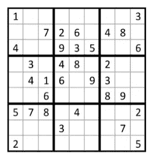

二进制整数线性规划数独

# 背景

数独是一种基于逻辑的谜题，1979 年在美国的《戴尔铅笔谜题和文字游戏》杂志上以“数字位置”的标题首次出现[6]。这款游戏是由建筑师霍华德·加恩斯设计的，他退休后转向了拼图创作。20 世纪 80 年代，这款游戏在日本越来越受欢迎，出版商 Nikoli 将其更名为“suji wa dokushin ni kagiru”，意思是“数字必须保持单一。”这最终被缩短为“数独”或“单一数字”

> 注意—假设读者已经知道线性编程的基础知识

# **数独是优化问题吗？**

不。基本上没有。因为没有我们想要最大化或最小化的目标函数。**数独问题**可以称为可满足性或可行性**问题**。

# 让我们从规则开始…

数独最常见的形式是 9 ×9 矩阵。规则很简单:填充矩阵，使每一行、每一列和 3 ×3 的子矩阵恰好包含一次数字 1 到 9。每个谜题都有一定数量的已知答案。这些的数量和位置决定了 difficulty.游戏的水平

正如我们所知，每个 ILP 问题都由一个目标函数(不适用于数独，除非有备选方案)、决策变量和约束条件组成。

> 好消息是，我们没有为此编写约束，我们只是从数学上把难题的规则作为约束！

# **数独难题的整数规划数学模型**

为了便于解释，我将在前面使用一个 4x4 的矩阵。让我们考虑使用 BILP 解决以下难题。

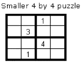

图 1: 4x4 数独拼图

更具体地说，我们将为一般的 n×n 难题制定一个二进制整数程序(BILP)。一旦程序被开发来解决图 1 的 BILP，它可以很容易地适应解决任何数独难题。

首先，我们定义我们的决策变量:

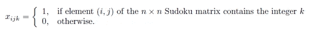

通用二元决策变量

当决策变量的值确定后，我们就知道每个整数 k(1 ≤k≤4)是否出现在 n×n 数独矩阵的每个元素(I，j)中。也就是说，对应的数独谜题的解将被定义。

我们现在转向非常重要的目标函数和约束集。请注意，这些约束条件只需要了解数独谜题的规则(增加了一个隐式约束条件，这是下面的约束条件(6 )),而不需要具备手动解决此类谜题所需的逻辑能力。适用于数独谜题的 BILP 公式如下:

***Min 0*** (让我们将其定义为常数，因为没有最小化或最大化的函数)

***服从***

***约束 1:*** *每个单元格包含一个整数 k*

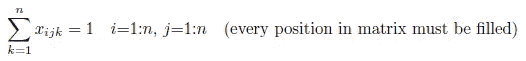

***约束 2:*** *每个整数 k 在每一行出现一次*

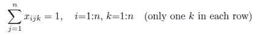

***约束 3:*** *每个整数 k 在每列出现一次*

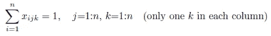

***约束 4:*** *每个整数 k 在每个子矩阵中出现一次*

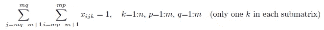

***约束 5:*** *给定矩阵中的元素 G 被设置为“on”*

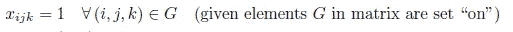

***约束 6:*** *定义整数的可能值*

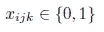

而且，就是这样！

让我们使用 Excel 求解器来解决上面的 4x4 数独难题(图 1)。一个有 64 个二进制决策变量的 4x4 拼图的模拟模板如下所示。

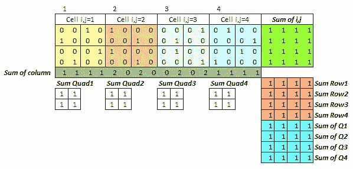

具有 64 个二元决策变量的数独模拟模板

现在，让我们解释一下前面提到的约束条件:

***约束 1:每个单元格包含一个整数 k。绿色的*** 制表符( *i，j = 1* 之和)将确保每个位置都填充一个整数值。

***约束 2:每个整数 k 在每一行出现一次。*** 砖红色的标签(第 1 行的总和:4 > = 1)将确保每个 k 在每一行中只出现一次。

***约束 3:每个整数 k 在每列出现一次。*** 橄榄色的制表符(1 列之和:16 > = 1)将确保每个 k 在每一列中只出现一次。

***约束 4:每个整数 k 在每个子矩阵中出现一次。*** 蓝绿色的标签(象限 1:4 的和> = 1)将确保每个 k 在每个 2x2 矩阵中只出现一次。

***约束 5:矩阵中给定元素 G 设置为“开”。****k 的给定值是硬编码的。*

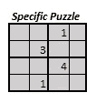

最后一步是将 64 个黄色、桃色、灰色和蓝色决策变量单元格中给出的整数规划解转换为所需的 4x 4 数独网格。然后，每个二进制单元格乘以 a*“k”*可能取的一组值(即{1，2，3，4})。

# 现在让我们得到解决方案…

这就是 Excel 规划求解的外观

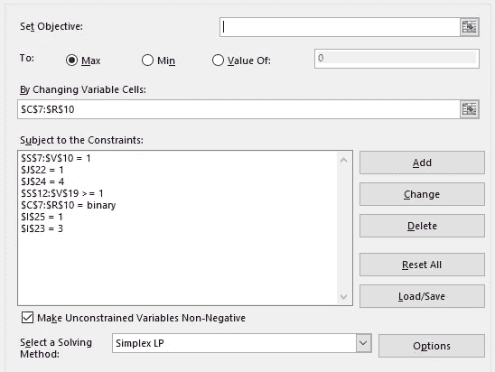

Excel 规划求解

…瞧！4x4 拼图的解决方案应该是这样的。

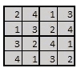

图 1 中难题的解决方案

# 临终遗言

上述逻辑不仅可以用来解决任何数独难题，也可以用来创建一个。我希望，你们觉得它很容易掌握，也很有趣！在 [Linkedin](https://www.linkedin.com/in/harjot-kaur-99792118/) 上跟我连线，多聊聊优化。