# 用遗传算法求解 5 皇后问题

> 原文：<https://pub.towardsai.net/solving-the-5-queens-problem-using-genetic-algorithm-8f5aab6af020?source=collection_archive---------1----------------------->

## [计算机科学](https://towardsai.net/p/category/computer-science)

# 什么是 N 皇后问题？

首先，N 皇后问题是指我们需要在棋盘上找到 N 个皇后的排列，这样没有皇后可以攻击棋盘上的任何其他皇后。因此，在我们的 5 皇后问题中，我们需要在 5×5 的棋盘上放置 5 个象棋皇后，这样就不会有两个皇后互相攻击。当我们找到所有可能的情况时，它看起来像下面这样:

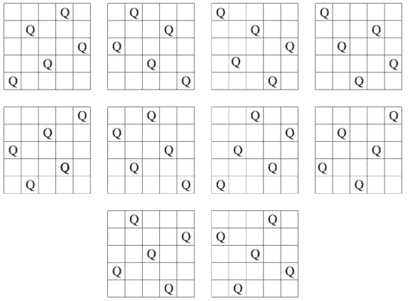

# 我们需要采取的步骤

在我们的任务中，我们需要使用遗传算法来解决 5 皇后问题。我们需要运用进化论的原理来寻找解决问题的方法。

为了解决 5 皇后问题，需要以下步骤:

*1)染色体设计
2)初始化
3)适应度评估
4)选择
5)交叉
6)变异
7)更新世代
8)返回 3)*

让我们简要解释使用遗传算法解决 5 皇后问题的每个步骤。

# ***1)*** ***染色体设计***

首先，我们需要创建一个染色体表示。为了显示一条染色体，最好的方法是把它表示成一个长度为 N 的列表，在我们的例子中 N=5。每个索引的值显示一列中皇后的行。每个指数的值从 1 到 5。

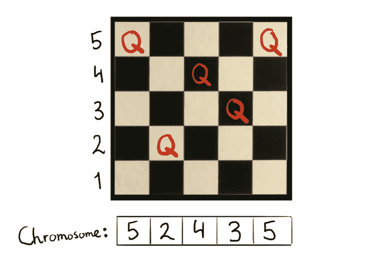

# 2) ***初始化***

在初始化过程中，我们需要安排一个随机的染色体群体(潜在的解决方案)被创建。这是初始种群，我取了 4 条染色体，每条长度为 5。他们是

*【5 2 4 3 5】*

*【4 3 5 1 4】*

*【21324】*

*【5 2 3 4 1】*

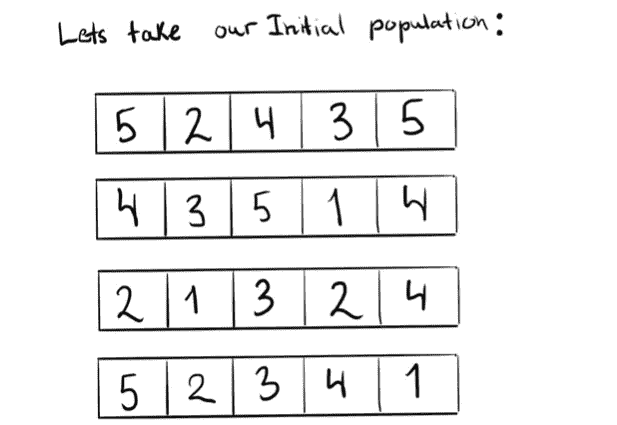

具体来说，这些染色体可以在棋盘上显示如下:

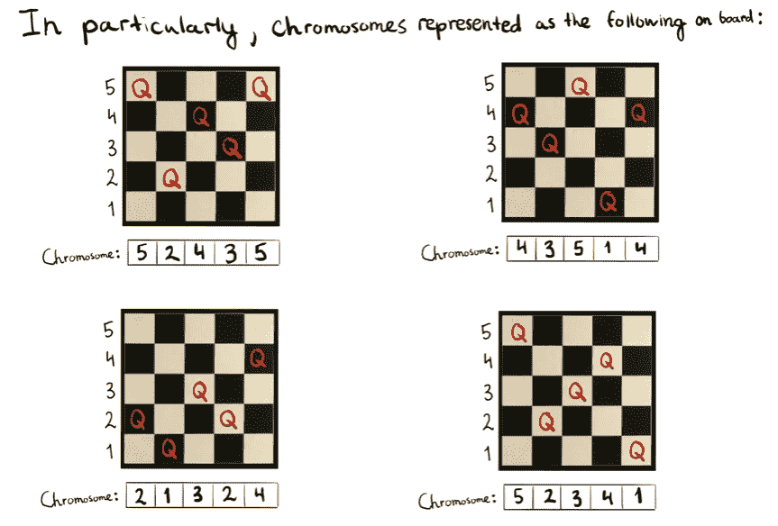

# 3) ***体能测评***

首先，适应度函数是成对的非攻击女王。所以，分数越高对我们越好。为了求解染色体[5 2 4 3 5]的适应度函数，我将每个皇后分别指定为 Q1、Q2、Q3、Q4 和 Q5。为了找到适应函数值，我建立了下面的等式:

适应度函数= F1+F2+F3+F4+F5

其中:

> F1 =非攻击性女王与 Q1 女王的配对数。
> 
> F2 =非攻击性女王与 Q2 女王的配对数。
> 
> F3 =带有皇后 Q3 的非攻击皇后对的数量。
> 
> F4 =非攻击性皇后与皇后 Q4 的配对数。
> 
> F5 =不攻击的皇后与皇后 Q5 的对数。

例如，如果我们已经把 Q1 和 Q2 对算作 F1，我们就不应该把 Q2 和 Q1 对算作 F2。

所以我们发现对于染色体[5 2 4 3 5]，适应度函数将等于 7。

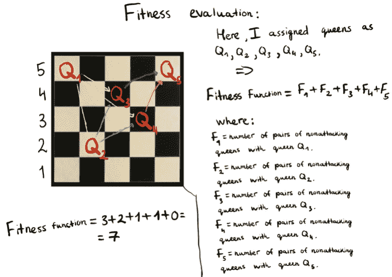

我们应该使用适应度函数来评估我们所有的群体个体(染色体)。所以适应度函数如下:

[5 2 4 3 5]适应度函数=7

[4 3 5 1 4]适应度函数=6

[2 1 3 2 4]适应度函数=6

[5 2 3 4 1]适应度函数=5

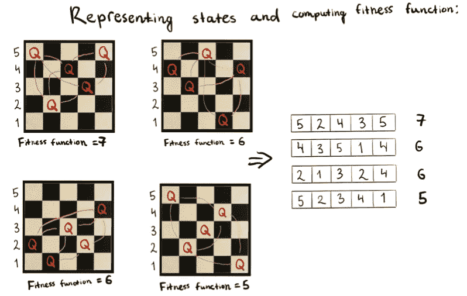

然后我们需要计算从适应度函数中被选中的概率。这将是下一个选择步骤所需要的。首先，我们需要添加所有的适应度函数，如下所示:

7+6+6+5=24

然后我们需要计算从适应度函数中被选中的概率。我们需要用适应度函数除以适应度函数之和，再乘以 100%。

【5 2 4 3 5】被选中的概率= 7/24 *100% = 29%

[4 3 5 1 4]被选中的概率=6/24 * 100% = 25%

【2 1 3 2 4】被选中的概率=6/24 * 100% = 25%

【5 2 3 4 1】被选中的概率=5/24 * 100% = 21%

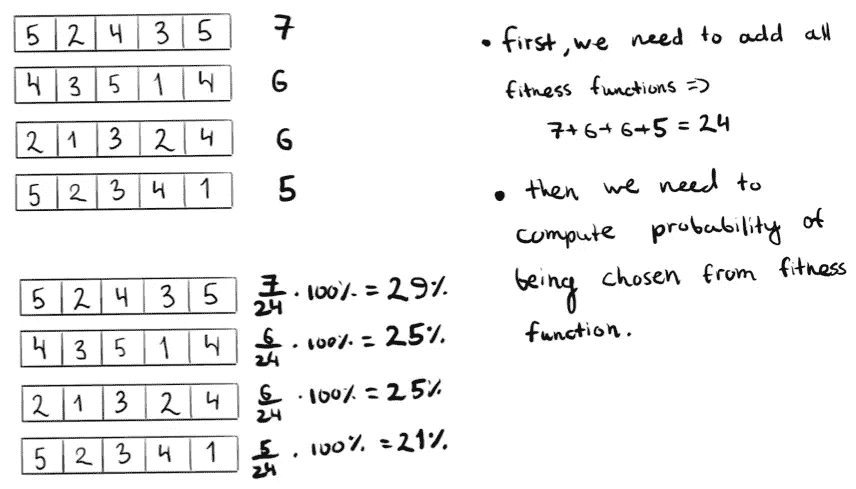

# ***4)选择***

在下一步中，我们根据上一步计算的概率随机选择两对进行复制。换句话说，使用选择操作符，一定数量的染色体将存活到下一个生成器中。这里选择的染色体作为父代，使用交叉算子组合产生子代。除此之外，我们为每一对选择一个交叉点。

这里，我们根据概率随机选取了以下染色体:

*【4 3 5 1 4】*

*【5 2 4 3 5】*

*【4 3 5 1 4】*

*【2 1 3 2 4】*

我们可以注意到，我们没有选择染色体[5 2 3 4 1],因为它被选中的概率是染色体中最小的。

对于第一对

*【4 3 5 1 4】*

*【5 2 4 3 5】*

交叉点将在两个基因之后选取。

在第二对的情况下

*【4 3 5 1 4】*

*【2 1 3 2 4】*

交叉点将在三个基因之后选取。

这里我们进入下一步，因为我们的适应值不等于 Fmax，Fmax 是染色体中满足 5 皇后问题的解的条件的最大数适应值。Fmax 等于 10。

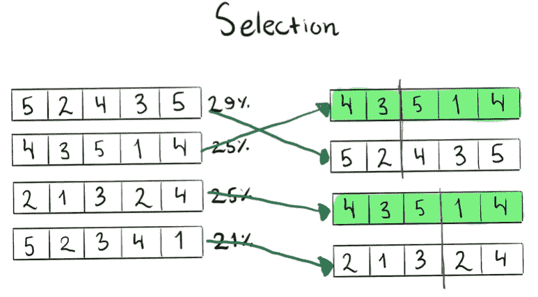

# ***5)交叉***

在交叉过程中，被选择的染色体作为父代，通过交叉算子组合成子代。换句话说，它结合了父母双方的遗传信息来产生新的后代。

这里我们可以看到从第一对([4 3 5 1 4]和[5 2 4 3 5])生成的子代如下:

[4 3 4 3 5]

[5 2 5 1 4]

第二对([4 3 5 1 4]和[2 1 3 2 4])的子节点如下:

[4 3 5 2 4]

[2 1 3 1 4]

换句话说，为了在交叉过程中从对中产生第一个孩子，我们取了亲代#1 染色体的第一部分和亲代#2 染色体的第二部分，这构成了由以下部分组成的新个体

[(亲本#1 染色体的第一部分)[(亲本#2 染色体的第二部分)]

为了从同一对中产生第二个孩子，我们取了亲代#1 染色体的第二部分和亲代#2 染色体的第一部分，这就产生了新的个体，它由以下部分组成

[(亲本#1 染色体的第二部分)[(亲本#2 染色体的第一部分)]

因此，在我们的例子中，当我们创建对[**4 3 5 1 4**]和[5 2 4 3 5]的子代时，为了产生第一个子代，我们取[(父代#1 染色体的第一部分)[(父代#2 染色体的第二部分)]=[**4 3**4 3 5]

为了生产第二胎，我们取[(亲代#1 染色体的第二部分)[(亲代#2 染色体的第一部分)] = [5 2 **5 1 4** ]

我们将对第二对([4 3 5 1 4]和[2 1 3 2 4])执行相同的过程。

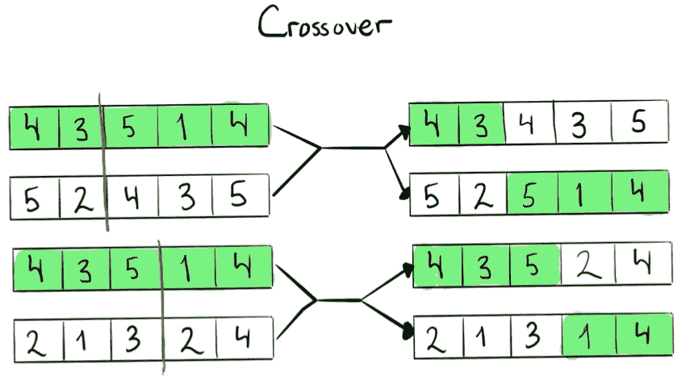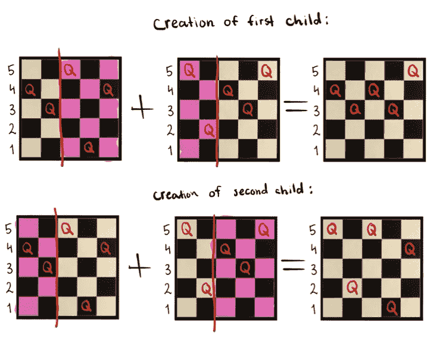

# ***6)突变***

下一步是突变。在突变过程中，我们改变了交叉后发现的染色体中的一个或多个基因值。所以它随机换几个一族，变异概率低。因此，在我们的示例中，我们的突变将如下所示:

*【4 3 4 3 5】→【4 3****1****3 5】*

*【5 2 5 1 4】→【5 2****3****1 4】*

*【4 3 5 2 4】→【4 3 5 2 4】*

*【2 1 3 1 4】→【2 1 3****5****4】*

我们可以注意到染色体上的第三个基因从 4 变成了 1。

染色体上的第三个基因也从 5 变成了 3。除此之外，染色体[2 1 3 1 4]中的第四个基因从 1 变成了 5。

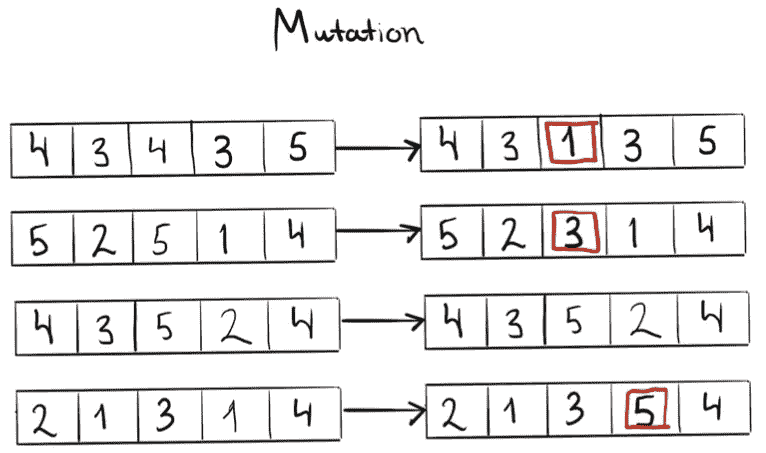

因此，在此之前，解决 5 皇后算法的遗传算法将如下所示:

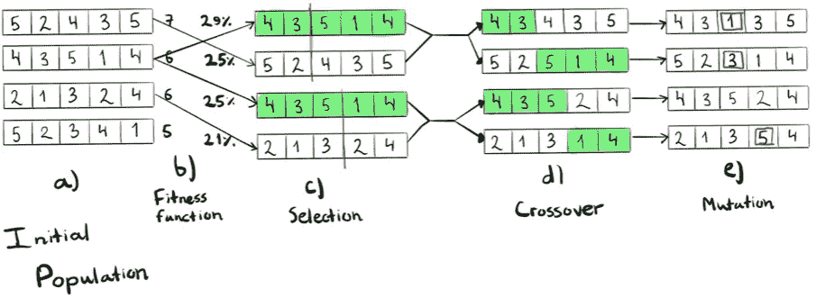

# ***7)更新生成***

在下一步中，我们需要更新生成。新的染色体将更新种群，但种群数量不会改变。所以染色体

*【4 3 1 3 5】*

*【5 2 3 1 4】*

*【4 3 5 2 4】*

*【2 1 3 5 4】*

将成为我们的新人口。

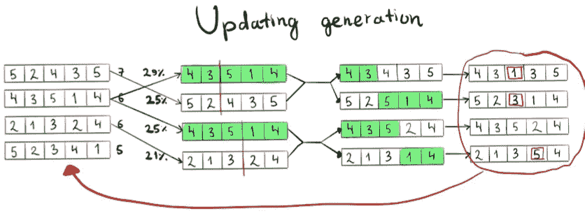

# ***8)回到步骤 3***

因此，在下一步中，我们需要回到第 3 步(适应度评估),找到我们的更新人口的适应度函数。

重复步骤 3-7，直到染色体(溶液)满足以下条件:

*适应值== Fmax*

其中 *Fmax* 等于 10

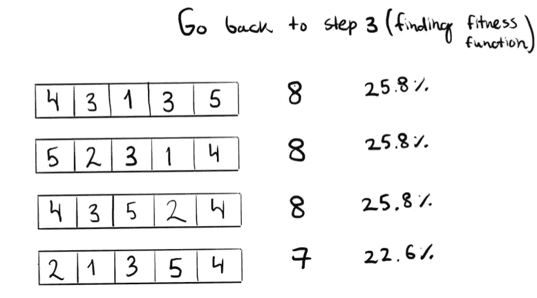

## 参考资料:

> [1] [用遗传算法求解 N 皇后问题](https://www.researchgate.net/publication/281953623_Solving_N_Queen_Problem_using_Genetic_Algorithm)
> 
> [2] [用遗传算法解决 5 皇后问题的视频讲解](https://www.youtube.com/watch?v=qt85_CinKwo&list=LL2WjQFuALy8Sqvy-YgQvPuQ&index=3)

## 帖子还发布在:

[Github 资源库](https://github.com/assankhanov/5-Queens-problem-using-Genetic-Algorithm)

如果您有任何问题或建议，请随时写在下面的评论区😁👇