# 用 Keras 解决自归一化神经网络的消失梯度问题

> 原文：<https://pub.towardsai.net/solving-the-vanishing-gradient-problem-with-self-normalizing-neural-networks-using-keras-59a1398b779f?source=collection_archive---------1----------------------->

## [机器学习](https://towardsai.net/p/category/machine-learning)

## 如何通过简单的模型配置改善深度前馈神经网络的收敛性和性能

由[马丁·桑切斯](https://unsplash.com/@martinsanchez?utm_source=medium&utm_medium=referral)在 [Unsplash](https://unsplash.com?utm_source=medium&utm_medium=referral) 上拍摄的照片

# 问题陈述

训练深度神经网络可能是一项具有挑战性的任务，尤其是对于非常深度的模型。这个困难的主要部分是由于通过[反向传播](https://en.wikipedia.org/wiki/Backpropagation)计算的梯度的不稳定性。在本帖中，我们将学习**如何使用 Keras 创建一个自标准化深度前馈神经网络。**这将解决梯度不稳定问题，加快训练收敛，并提高模型性能。

> 免责声明:本文是一个简短的总结，重点是实现。请阅读引用的论文以获得完整的细节和数学论证(参考资料部分的链接)。

# 背景

在他们 2010 年的里程碑式论文中，Xavier Glorot 和 Yoshua Bengio 提供了关于训练深度神经网络的难度的宝贵见解。

原来，当时流行的激活函数和权重初始化技术的选择直接导致了所谓的[消失/爆炸梯度问题](https://en.wikipedia.org/wiki/Vanishing_gradient_problem)。[本文](https://neptune.ai/blog/understanding-gradient-clipping-and-how-it-can-fix-exploding-gradients-problem)深入探讨了消失/爆炸渐变和渐变裁剪的主题。

简而言之，这是梯度开始收缩或增加太多以至于无法训练的时候。

## 饱和激活函数

在广泛采用现在无处不在的 ReLU 函数及其变体之前， **sigmoid** 函数(S 形)是激活函数最受欢迎的选择。乙状结肠激活的一个这样的例子是 [**逻辑功能**](https://en.wikipedia.org/wiki/Logistic_function) **:**

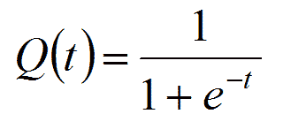

来源:https://www.mhnederlof.nl/logistic.html

sigmoid 函数的一个主要缺点是它们会饱和**。**在逻辑函数的情况下，对于负输入和正输入，输出分别饱和为 0 或 1。这导致随着输入 的幅度增加，梯度越来越小(*非常接近 0) ***)。****

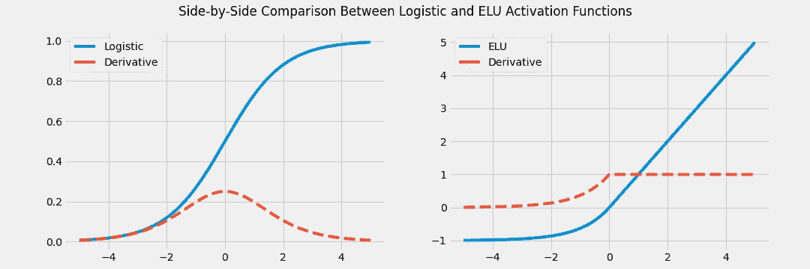

逻辑和 ELU 激活函数及其相应导数的可视化。由于饱和，逻辑函数的导数将趋于收缩。相反，对于正输入，ELU 函数的导数将是常数。

由于 ReLU 及其变体不饱和，它们减轻了这种消失梯度现象。ReLU 的改进变体，如 eLU 函数(如上所示),具有平滑的导数:

*   对于任何实际输入，导数将始终为 1
*   对于小的负数，导数不会接近于零
*   所有区域的平滑导数

> 注:因此，期望值为 0 的输入以及较小的方差是有益的。这将有助于在整个网络中保持强梯度。

## 权重初始化选择不当

论文中发现的另一个重要见解是使用平均值为 0、标准差为 1 的正态分布[进行权重初始化的效果，这是作者发现之前广泛流行的选择。](https://en.wikipedia.org/wiki/Normal_distribution)

作者表明，sigmoid 激活和权重初始化的特定组合(均值为 0，标准差为 1 的正态分布)使得**输出比**输入具有更大的方差。这种 ***效应在整个网络*** 中复合，使得较深层的输入相对于较浅(较早)层的输入具有大得多的*。这种现象后来在 2015 年由 Sergey Ioffe 和 Christian Szegedy 在一篇里程碑式的论文中被命名为**内部协变量转移**。*

*正如我们在上面看到的，当使用 sigmoid 激活时，这转化为越来越小的梯度。*

> *由于逻辑函数的期望值是 0.5 ，而不是 0，这个问题在**逻辑函数**中变得更加突出。双曲正切 sigmoid 函数的期望值为 0，因此在实践中表现更好(但也会饱和)。*

*作者认为，为了在训练期间保持梯度稳定，所有层的输入和输出必须在整个网络 中保持或多或少相同的方差 ***。这将防止信号在前向传播时消失或爆炸，以及在反向传播期间梯度消失或爆炸。****

*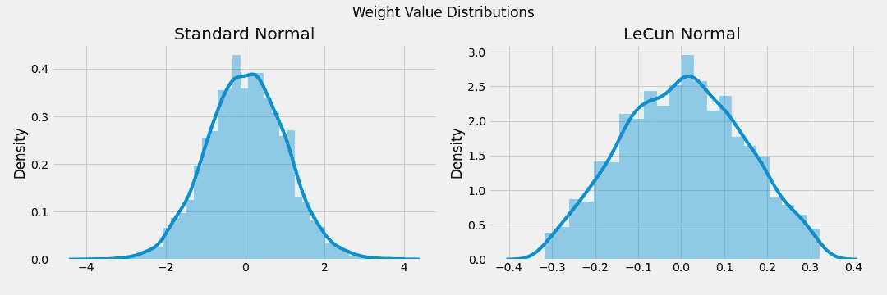*

*用 LeCun 正态初始化生成的分布导致更多以 0 为中心的概率质量，并且具有更小的方差。这与使用正态初始化(平均值为 0，标准偏差为 1)生成的分布相反，在正态初始化中，值的分布范围更广(方差更大)。*

*为了实现这一点，他们提出了一种权重初始化技术，以论文第一作者的名字命名为 **Glorot(或 Xavier)初始化**。结果是，对 Glorot 技术稍加修改，我们得到了 **LeCun 初始化，**以 Yann LeCun 命名。*

> ***Yann LeCun 在 20 世纪 90 年代提出了他的 LeCun 初始化，参考了 Springer 出版物** [**神经网络:贸易的诀窍(1998)**](https://link.springer.com/book/10.1007/978-3-642-35289-8) **。***

# *自归一化前馈神经网络*

*2017 年，君特·克兰鲍尔等人推出了 [**自归一化神经网络** ( **SNNs** )](https://papers.nips.cc/paper/6698-self-normalizing-neural-networks.pdf) 。通过确保满足某些条件，这些网络能够在所有层 上保持接近 0 平均值和 1 ***标准偏差的输出。这意味着 snn 没有消失/爆炸梯度问题，因此比没有这种自归一化属性的网络收敛得更快。根据作者的说法，在论文报道的所有学习任务中，SNNs 明显优于其他变体(没有自我规范化)。下面是创建 SNN 所需条件的更详细描述。****

## *架构和层*

*SNN 必须是仅由全连接层组成的**顺序模型**。*

> *注意:根据任务的不同，某些类型的网络比其他类型的网络更合适。例如，卷积神经网络通常用于计算机视觉任务，主要是由于它们的参数效率。确保一个全连接的层足以完成你的任务。如果是这种情况，那么考虑使用 SNN。否则， [**批量规范化**](https://arxiv.org/abs/1502.03167) 是确保整个网络正常化的极好方法。*

*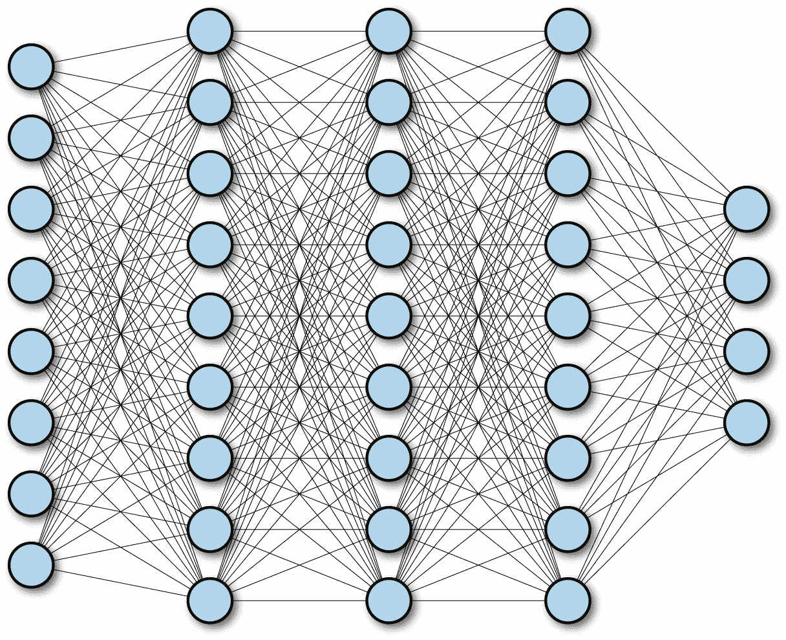*

*深度、顺序、全连接神经网络的示例。图片来源:[https://www . or eilly . com/library/view/tensor flow-for-deep/9781491980446/ch04 . html](https://www.oreilly.com/library/view/tensorflow-for-deep/9781491980446/ch04.html)*

*在这种情况下，顺序模型是指各层严格按照顺序排列的模型。换句话说，对于每个隐藏层 *l* ，层 *l* 接收的唯一输入严格来说是层 *l-1 的输出。*在第一个隐藏层的情况下，它只接收输入特征。在 Keras 中，这种类型的模型实际上被称为[顺序模型](https://www.tensorflow.org/api_docs/python/tf/keras/Sequential)。*

*全连接层是指层中的每个单元都与每个单独的输入相连。在 Keras 中，这种类型的层被称为[致密层](https://www.tensorflow.org/api_docs/python/tf/keras/layers/Dense)。*

## *输入标准化*

*输入要素必须标准化。这意味着所有特征的训练数据应该具有 0 平均值和 1 标准偏差。*

## *重量初始化*

*SNN 中的所有图层都必须使用 LeCun 正常初始化进行初始化。正如我们之前看到的，这将确保权重值的范围更接近于 0。*

*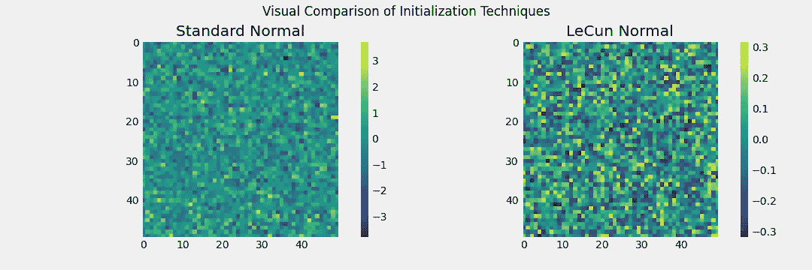*

*将权重可视化为矩阵。标准正常初始化权重的值的范围远大于 LeCun 正常初始化权重的范围。*

## *SELU 激活函数*

*作者引入了**标度 ELU** ( **SELU** )函数作为 SNNs 的激活函数。只要上述条件得到满足，SELU 就提供了自我正常化的保证。*

# *Keras 实施*

*以下示例显示了如何为 10 类分类任务定义 SNN:*

*Keras 中自规范化神经网络的实现*

# *实验结果*

*下面是常规前馈神经网络和 SNN 在三个不同任务上的比较:*

*   *形象分类([时尚 MNIST](https://www.tensorflow.org/api_docs/python/tf/keras/datasets/fashion_mnist) ， [CIFAR10](https://www.tensorflow.org/api_docs/python/tf/keras/datasets/cifar10) )*
*   *回归([波士顿住房数据集](https://www.tensorflow.org/api_docs/python/tf/keras/datasets/boston_housing))*

*两个网络共享以下配置:*

*   *20 个隐藏层*
*   *每个隐藏层 100 个单位*
*   *那达慕优化器*
*   *7e-4 的学习率*
*   *50 个时代*

*对于这两个模型，学习曲线在达到最佳性能度量的时期停止*

## *时尚 MNIST*

*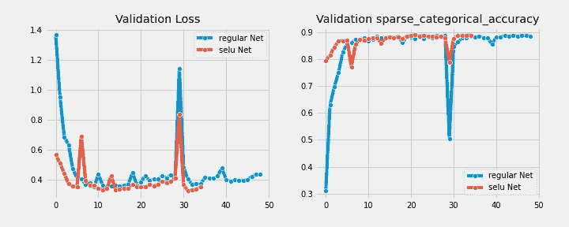*

*与常规模型相比，SNN 在少 28%迭代次数的**中达到最佳验证精度。***

*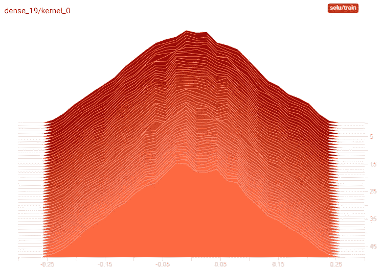*

*SNN 最后一层权重的时间分布。*

*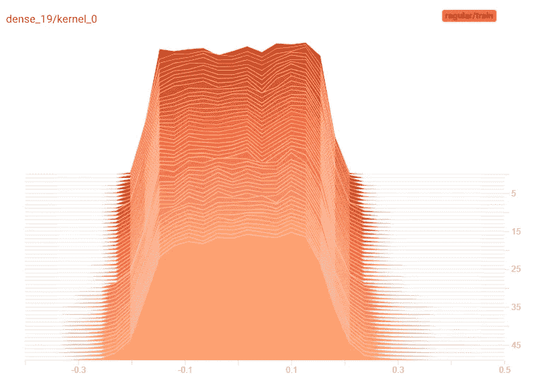*

*常规模型最后一层权重的时间分布。*

## *CIFAR10*

*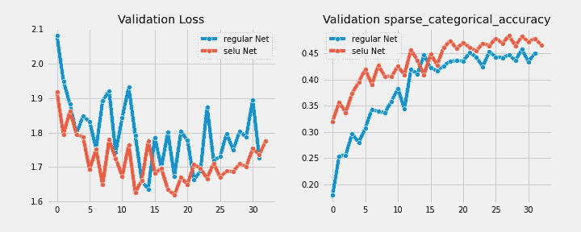*

*与常规模型相比，SNN 的验证损失和准确性始终更好。*

*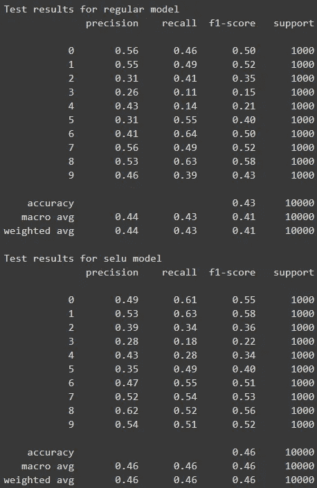*

*与普通车型相比，SNN 在测试台上的 F1 成绩**提高了**12%。*

## *波士顿住房公司*

*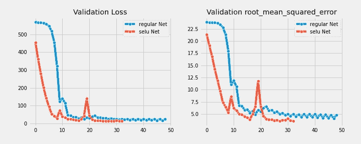*

*与常规模型相比，SNN 在**少 32%的时期**中实现了最佳验证准确性(SNN 为 34 个时期，而常规模型为全部 50 个时期)。*

# *结论*

*通过确保我们的前馈神经网络配置满足一组条件，我们可以让它自动标准化。所需的条件是:*

*   *模型必须是一系列完全连接的层*
*   *权重用 LeCun 正常初始化技术初始化*
*   *该模型使用 SELU 激活函数*
*   *输入是标准化的*

*与没有自规范化的模型相比，这几乎总是会导致**性能的提高和收敛**。如果你的任务需要一个常规的前馈神经网络，考虑使用 SNN 变体。否则，批处理规范化是一个优秀的(但更多的时间和计算成本)规范化策略。*

## *来源*

*   *格洛特、泽维尔、约舒阿·本吉奥。"理解训练深度前馈神经网络的困难."第十三届人工智能与统计国际会议论文集。2010.*
*   *约菲、谢尔盖和克里斯蒂安·塞格迪。"批量标准化:通过减少内部协变量转移加速深度网络训练." *arXiv 预印本 arXiv:1502.03167* (2015)。*
*   *Klambauer，Günter，等,“自规范化神经网络”*神经信息处理系统的进展*。2017.*
*   *[蒙塔冯、格雷瓜尔、奥尔和克劳斯-罗伯特·米勒。"神经网络-商业诀窍第二版."施普林格，多伊 10(2012):978–3。](https://link.springer.com/book/10.1007/978-3-642-35289-8)*
*   *[使用 Scikit-Learn、Keras 和 TensorFlow 进行机器实践学习](https://www.oreilly.com/library/view/hands-on-machine-learning/9781492032632/)*
*   *[https://en.wikipedia.org/wiki/Logistic_function](https://en.wikipedia.org/wiki/Logistic_function)*
*   *[https://en.wikipedia.org/wiki/Vanishing_gradient_problem](https://en.wikipedia.org/wiki/Vanishing_gradient_problem)*
*   *[https://en.wikipedia.org/wiki/Backpropagation](https://en.wikipedia.org/wiki/Backpropagation)*
*   *[https://en.wikipedia.org/wiki/Normal_distribution](https://en.wikipedia.org/wiki/Normal_distribution)*