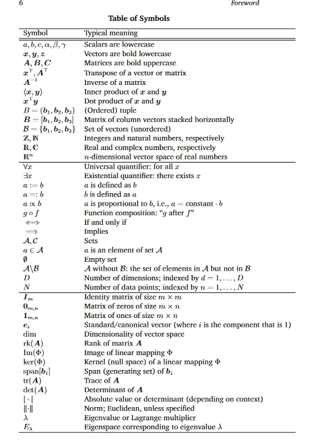
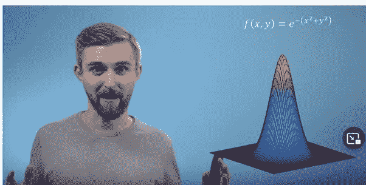

# 一些数学资源可以帮助你的 ML 之旅

> 原文：<https://pub.towardsai.net/some-maths-resources-to-help-you-in-your-ml-journey-6306bcc11c43?source=collection_archive---------3----------------------->

## [机器学习](https://towardsai.net/p/category/machine-learning)，[数学](https://towardsai.net/p/category/mathematics)

照片由[杰斯温·托马斯](https://unsplash.com/@jeswinthomas?utm_source=medium&utm_medium=referral)在 [Unsplash](https://unsplash.com?utm_source=medium&utm_medium=referral) 上拍摄

我一直在寻找提高数学技能的内容。我还注意到，当滚动一些线索时，许多人没有找到以直观方式解释数学的内容。导致学习 ML 缺乏信念。但这并不是必须的。

我和你一样，奇怪的字符和希腊字母看起来不欢迎。但是他们是一些在线的好老师，可以揭开这种经历的神秘面纱。

**其中一些材料如下:**

# 普通数学视频系列

3blue1brown [微积分](https://youtube.com/playlist?list=PLZHQObOWTQDMsr9K-rj53DwVRMYO3t5Yr)和[线性代数](https://youtube.com/playlist?list=PLZHQObOWTQDPD3MizzM2xVFitgF8hE_ab)系列

我记得不久前看过这两个系列，我会再看一遍。叙述者探索了这个话题，没有陷入细节。感觉就像你在和最初做微积分的人一起发现数学。在线性代数系列中，他在可视化向量空间方面做了大量工作。你可以看到对向量和矩阵的各种运算。让您了解各种操作的需求以及它们的作用。

[可汗学院](https://khanacademy.org)

我相信你现在已经知道萨尔·卡恩了。你看了他的几个视频。他的视频直观地解释了各种主题。此外，向您展示您需要采取的各种手工操作来进行各种计算。比如矩阵乘法和计算导数。

对于与 ML 相关的数学主题，请查看:

*   [微积分 1](https://www.khanacademy.org/math/calculus-1)
*   [微积分 2](https://www.khanacademy.org/math/calculus-2)
*   [线性代数](https://www.khanacademy.org/math/linear-algebra)

练习题允许您通过快速反馈来测试您的知识。这应该有助于巩固你刚刚在视频中学到的东西。

[35 分钟看懂微积分——有机化学导师](https://www.youtube.com/watch?v=WsQQvHm4lSw)

对该主题的概述。所以，你可以在以后熟悉深度学习的概念。如果你对微积分毫无头绪，不知道从何入手。那么视频应该是适合你的。因为只有不到一个小时的时间来学习微积分的要点。并把这些知识带进进一步的学习。

注意:你不会在 30 分钟内学会所有的微积分。但是视频会帮助你习惯这个主题的主要思想。

# 深度学习特定数学

[3blue1brown 深度学习系列](https://youtube.com/playlist?list=PLZHQObOWTQDNU6R1_67000Dx_ZCJB-3pi)

从以前的系列中提取概念，并将其应用于深度学习。3blue1brown 在可视化神经网络和解释它们是什么方面做得非常出色。

一个绝对的初学者会发现这个系列很有用，因为它介绍了什么是神经网络。一个更有知识的 ML 用户可能也会发现它是有帮助的。它有一种深刻的方式来显示基本概念，如梯度下降和神经网络中使用的线性代数。

[机器学习用数学书](https://mml-book.github.io/)

如果这是一个我想验证的概念，我倾向于用这本书作为参考指南。这本书介绍了与机器学习相关的最重要的主题，并进行了深入探讨。

注释页示例:

[https://mml-book.github.io/book/mml-book.pdf](https://mml-book.github.io/book/mml-book.pdf)

[机器学习数学—多元微积分—伦敦帝国理工学院](https://www.youtube.com/watch?v=QpwTEsO51tU)

一个解释微积分如何用于深度学习的多小时系列。这份材料从高层次的角度探讨了这个问题。但是足够详细，可以帮助你学到很多东西。这个系列将会激发你更彻底地学习微积分的兴趣。不会迷失在细节中。

[伦敦帝国理工学院](https://youtu.be/QpwTEsO51tU?t=8412)

# 其他值得注意的材料

现在，这些资源我还没有使用或者很少使用，但是从不同的人那里得到了很好的推荐。

所以，来看看吧:

[计算线性代数](https://www.fast.ai/2017/07/17/num-lin-alg/):

这门课程从自上而下的角度教授线性代数。实际深度学习应用中使用的线性代数。当你学数学的时候，它不会像理论那么重。所以，你将会处理大量的代码。

从他们的网站:

> 【课程】完全围绕实际应用展开，使用**前沿算法和工具**，包括 [PyTorch](http://pytorch.org/) 、 [Numba](https://numba.pydata.org/) 和[随机化 SVD](https://research.fb.com/fast-randomized-svd/) 。它还涵盖了基本的数字线性代数概念，如浮点运算，机器ε，奇异值分解，特征分解，和 QR 分解。
> 
> 本课程讲述了在实际计算中使用的线性代数。不仅仅是手工完成的线性代数。
> 
> …
> 
> 典型的第一线性代数课程集中于如何手动解决矩阵问题，例如，花费时间用铅笔和纸使用高斯消去法来手动解决一个小的方程组。然而，事实证明，通过计算机解决大型矩阵问题的方法和关注点往往截然不同

注意:由于课程是不久前制作的。我不知道该代码是否仍然是过时的。但是这些概念看起来还是不错的。

[伊恩·古德菲勒、约舒阿·本吉奥和亚伦·库维尔的深度学习书籍](https://www.deeplearningbook.org/)

从他们的网站:

> 深度学习教材是一种资源，旨在帮助学生和从业者进入一般的机器学习领域，特别是深度学习领域。

我还没有完全读完这本书。但是我在各种深度学习工作中使用了符号页来理解数学符号。

这些都是深度学习领域的专家。相信我，他们知道自己在说什么。

伊恩·古德费勒，甘斯的创造者。

Yoshua Bengio，深度学习的教父之一。

[统计学习简介](https://www.statlearning.com/)

ML 现场有几个人推荐过这本书。统计学是一个非常重要的话题。帮助您解决如何改进和分析数据集的问题。所以多了解一些这个话题应该没什么坏处。

*如果你觉得这篇文章有趣，* [*那就看看我的邮件列表吧。*](https://www.tobiolabode.com/subscribe) *我哪里写得下更多这样的东西*