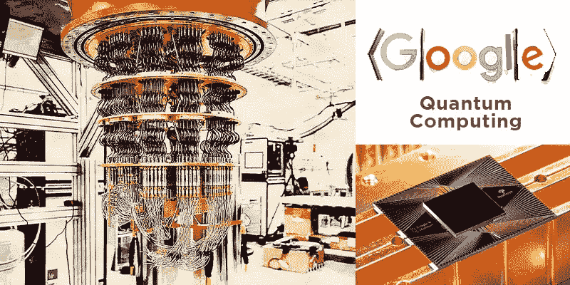
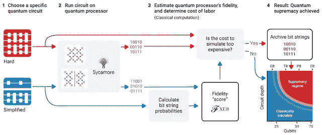
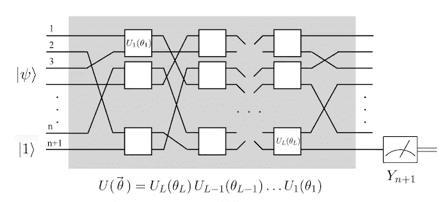
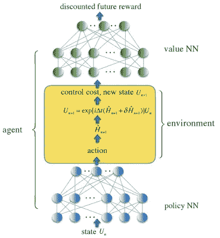

# 关于谷歌量子计算研究工作的几点说明

> 原文：<https://pub.towardsai.net/some-notes-abgoogle-research-work-in-quantum-computing-1e7815afaacd?source=collection_archive---------2----------------------->

## [量子计算](https://towardsai.net/p/category/quantum-computing)

## 谷歌研究一直在发表一些惊人的论文和技术框架，以推进量子计算。

来源:[https://www . aliteq . com/Google-quantum-computer-more-advanced-than-old-school-supercomputers/](https://www.aliteq.com/google-quantum-computer-more-advanced-than-old-school-supercomputers/)

> 我最近创办了一份专注于人工智能的教育时事通讯，已经有超过 80，000 名订户。《序列》是一份无废话(意思是没有炒作，没有新闻等)的 ML 导向时事通讯，需要 5 分钟阅读。目标是让你与机器学习项目、研究论文和概念保持同步。请通过订阅以下内容来尝试一下:

 [## 序列

### 订阅人工智能世界中最相关的项目和研究论文。受到 85，000 多人的信任…

thesequence.substack.com](https://thesequence.substack.com/) 

近年来，谷歌一直处于量子计算领域一些最有趣发展的中心。其中一些发展在科学界一直备受争议，例如最近有人声称，它已经实现了被称为量子优势的预期里程碑。[在自然](https://www.nature.com/articles/s41586-019-1666-5)杂志发表的一篇论文中，谷歌描述了在一台新的量子机器上进行的实验，代号为 Sycamore，证明了著名的基准。谷歌在争夺量子统治地位的竞赛中的主要竞争对手 IBM 只花了几个小时就发表了一篇论文反驳谷歌的说法，在计算机科学界引发了一场激烈的辩论。尽管围绕谷歌的说法存在争议，但毫无疑问，Sycamore 的发布是展示量子系统可行性的一个重要里程碑，它对其他技术领域具有深远的影响。就人工智能(AI)而言，关于量子计算的到来将如何影响人工智能程序，已经有了很多猜测。然而，没有多少人思考 AI 如何影响量子计算的发展。今天，我想从量子优越论的角度更详细地探讨这个论点。

# 什么是量子至上？

量子至上这个术语最初是由加州理工学院的理论物理学家约翰·普雷斯基尔于 2012 年创造的。这个术语是一个通用的定义，用来描述量子计算机可以做经典计算机无法完成的事情。这个术语立即被量子界所接受，但是不同的专家对它的实际含义提出了不同的理论。

围绕量子优势项的争议与某些计算的实用性有关。如果有足够的时间，经典计算机可以解决量子计算机同样的问题。然而，这些计算的时间可能会导致任何现实世界的问题不切实际。在谷歌的案例中，他们的论文声称 Sycamore 处理器需要 200 秒才能完成一次计算，而世界上最好的超级计算机——恰好是 IBM 的 Summit 机器——需要 10，000 年才能完成。那个时间好像不太实际。然而，IBM 声称他们的超级计算机可以在 2.5 天内解决同样的难题，这对于一些任务来说似乎更实际一些。

目标实验侧重于在快速多项式时间内执行一种称为“随机电路采样”的专门计算。为了描述这个实验，想象一下我们可以从一个小字典的基本门操作组成量子算法。由于每个门都有出错的可能性，我们希望将自己限制在一个适度的序列中，总共大约有 1000 个门。假设这些程序员之前没有经验，他们可能会创造出看起来像随机的门序列，这可以被认为是量子计算机的“hello world”程序。因为在随机电路中没有经典算法可以利用的结构，模拟这样的量子电路通常需要大量经典超级计算机的工作。量子计算机上随机量子电路的每次运行都会产生一个位串，例如 0000101。随着量子位元数(宽度)和闸周期数(深度)的增加，在经典电脑上寻找随机量子电路最可能的位元串变得更加困难。谷歌的实验首先运行 12 到 53 个量子位的随机简化电路，保持电路深度恒定。一旦他们验证了系统正在工作，他们就用 53 个量子位和不断增加的深度运行随机硬电路，直到经典模拟变得不可行。

**图片来源:谷歌**

我认为谷歌和 IBM 的争论纠缠于量子计算的一个重要里程碑的非重要方面。也许谷歌说错话了，IBM 反应过度了，但这并不能改变形势的根本。实际上，谷歌的 Sycamore 能够用一种不同于经典计算机的方法解决一个非常困难的数学问题。这表明，我们可以建立足够精确的量子系统来解决我们以前无法解决的问题，量子计算将继续存在。

量子计算技术的发展可能会扰乱许多计算领域。其中，没有什么比量子计算和人工智能之间的关系更让行业专家感兴趣了。

# 量子计算与人工智能的双向关系

将量子至上论应用于人工智能，我们可以直观地假设，量子计算的出现将使新的神经网络范式的创建成为可能，而这在今天是不可能的。然而，人工智能的最新发展也在影响量子技术的演变。

## 量子计算如何影响 AI？量子神经网络

量子神经网络(QNN)是一种新兴的深度学习范式，它促进了可以在量子计算架构上运行的神经网络的创建。关于 QNNs 的工作仍处于初期阶段，但我们已经看到了一些有趣的进展。

在最近一篇题为“[在近期处理器](https://arxiv.org/abs/1802.06002)上使用量子神经网络进行分类”的论文中，谷歌提出了一个专注于分类任务的 QNN 模型。QNN 的架构与传统的深度神经网络形成对比。QNN 不是隐藏层，而是通过量子位上的纠缠作用或“量子门”形成的。在超导量子位元装置中，这可以透过对应每个闸的微波控制脉冲来实现。谷歌在著名的 MNIST 数据集上训练了他们的 QNN，结果令人印象深刻。

**图片来源:谷歌**

## AI 如何影响量子计算？量子控制的强化学习

虽然量子计算对人工智能技术的影响非常明显，但没有多少人想到相反的关系。量子计算架构的创建充满了传统离散计算技术难以解决的挑战，更适合人工智能模型。其中一个问题被称为量子控制优化，专注于量子控制的设计，将每个量子算法转化为一组模拟控制信号，这些信号可以精确地控制量子计算机在[希尔伯特空间](https://en.wikipedia.org/wiki/Hilbert_space)中运行。这些控制的精确选择最终决定了每个量子操作的保真度和速度。在此之前，量子计算一直缺乏通用的控制框架，该框架有助于在系统约束下优化主要的实验非理想性，这些系统约束限制了量子架构的创建。

在一篇题为“[通过深度强化学习实现通用量子控制](https://www.nature.com/articles/s41534-019-0141-3.pdf)”的论文中，谷歌提出了一种深度强化学习(DRL)方法，克服了量子控制优化的一些主要挑战。这种新的量子控制范例的新颖性取决于量子控制函数和基于 DRL 的有效优化方法的发展。

谷歌提出的架构是基于一个三层完全连接的神经网络，被称为*策略 NN* 。类似地，控制成本函数被建模为第二个神经网络(值 NN ),其编码贴现的未来回报。谷歌提出的框架中的数值模拟显示，与使用通用门集的传统方法相比，连续参数化模拟门家族的量子门错误减少了 100 倍，门时间减少了平均一个数量级。

**图片来源:谷歌**

正如你所看到的，人工智能和量子计算注定要一起发展，以挑战经典的计算范式。虽然量子计算将引发为这种新型基础设施创建新的人工智能模型；人工智能将能够创造更好的量子架构。尽管存在争议，“谷歌的量子霸权”时刻代表着量子计算发展的一个重要里程碑，也是一个可能影响人工智能技术不久未来的里程碑。