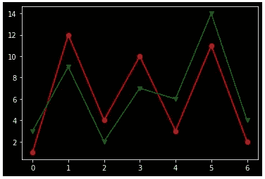
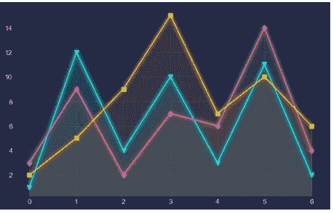
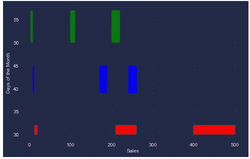
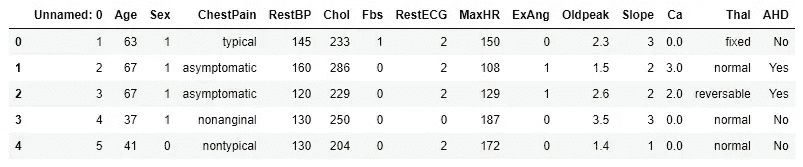
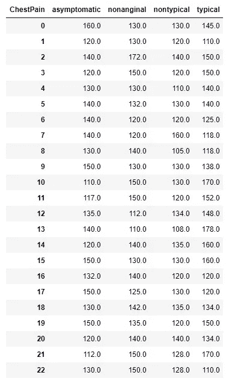
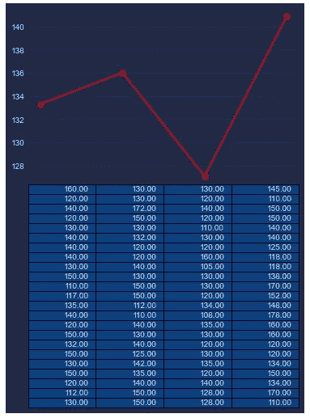
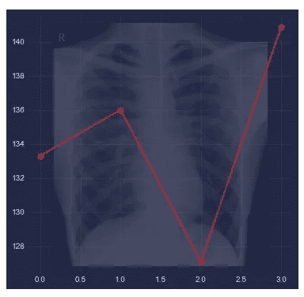
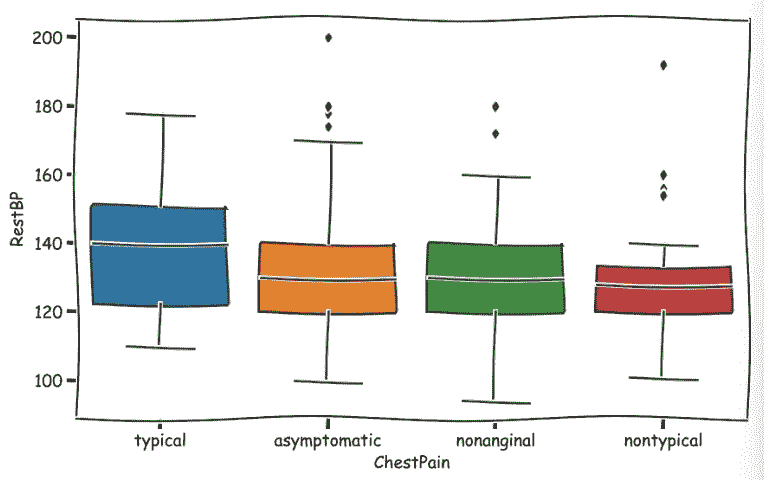

# Python 的 Matplotlib 可视化中的一些简单但高级的样式

> 原文：<https://pub.towardsai.net/some-simple-but-advanced-styling-in-pythons-matplotlib-visualization-107f3be56a24?source=collection_archive---------0----------------------->


德米特里·维乔科在 [Unsplash](https://unsplash.com?utm_source=medium&utm_medium=referral) 上拍摄的照片

## 给你的 Python 图添加一些额外的味道

Matplotlib 可以说是 Python 中最流行的可视化库。图书馆很大，很难真正学到图书馆里的所有东西。我已经分享了很多在 matplotlib 中制作更好的视觉效果的情节、技巧和提示。在这篇文章中，我想分享一些简单但有效的技巧，使情节看起来更好，更有吸引力。

## 深色背景

第一个只是简单的深色背景。你可以通过简单的黑色背景来制作一个简单的线条图。这是:

```
import matplotlib.pyplot as plt
from matplotlib import style
with plt.style.context('dark_background'):
    plt.plot([1, 12, 4, 10, 3, 11, 2], 'r-o',)
    plt.plot([3, 9, 2, 7, 6, 14, 4], 'g-v')
plt.show()
```



这难道不比常规的默认样式更好吗？

## 网络朋客

还有另一个深色背景选项，可以安装更多样式，使用此选项:

```
!pip install mplcyberpunk
```

让我们在同一个地块上使用这种风格:

```
import mplcyberpunkplt.style.use("cyberpunk")plt.figure(figsize=(8, 5))
plt.plot([1, 12, 4, 10, 3, 11, 2], marker = 'v')
plt.plot([3, 9, 2, 7, 6, 14, 4], marker = 'd')
plt.plot([2, 5, 9, 15, 7, 10, 6], marker = 's')
mplcyberpunk.add_glow_effects()
plt.show()
```



请注意，我们还使用了发光效果来进一步增强外观。

## 破碎的酒吧

保持这种相同的风格，下一个情节将是断条情节。当数据范围很大时，常规的条形图并不太适用。在一个数据集中，如果你在数据中有一个极端的范围，破条图可以是一个可视化它们的选项。

```
plt.figure(figsize = (8, 5))
xranges = [(3, 4), (100, 10), (200, 20)]
yrange = (50, 7)
plt.broken_barh(xranges, yrange, facecolors='green')xranges = [(8,3), (170, 19),(240, 21)] 
yrange = (45, -6) 
plt.broken_barh(xranges, yrange, facecolors='blue')xranges = [(13, 6), (210, 50),(400, 100)] 
yrange = (30, 2) 
plt.broken_barh(xranges, yrange, facecolors='red') 
plt.xlabel('Sales') 
plt.ylabel('Days of the Month') 
plt.show()
```



这一次我没有使用任何发光效果。

## 图表到绘图

在接下来的图中，我们将使用 Kaggle 的心脏数据集。请随意从以下链接下载数据集:

[](https://www.kaggle.com/datasets/zhaoyingzhu/heartcsv) [## Heart.csv

### Kaggle 是世界上最大的数据科学社区，拥有强大的工具和资源来帮助您实现您的数据…

www.kaggle.com](https://www.kaggle.com/datasets/zhaoyingzhu/heartcsv) 

以下是前五行数据:

```
import pandas as pd
df = pd.read_csv("Heart.csv")
df.head()
```



看胸痛栏。胸痛有四种类型。让我们制作一个数据框架，其中胸痛类别为列，相应的 RestBPs 为行值:

```
cp = df.set_index([df.groupby('ChestPain').cumcount(), 'ChestPain'])['RestBP'].unstack()
cp = cp.dropna()
cp
```



下一个图将绘制每种类型胸痛的平均 RestBP，在每个点的下方，将显示相应的数据。

```
plt.plot(cp_array.mean(axis = 0), '-o', label = "Mean chestpain", c='red')
plt.xticks([])plt.table(cellText=[['%1.2f' % xxx for xxx in xx] for xx in cp_array], cellColours = plt.cm.GnBu(cp_array), loc = "bottom")
plt.show()
```



这对于太大的数据集可能没有帮助。但是对于一个不太大的数据集，这是非常有用的。

## 数字图像

有时候加个图能让一个简单的情节更像样。在上面的图中，我们正在处理胸痛数据。当我们将胸部 x 射线图像添加到图中时，请查看图的外观:

```
import matplotlib.image as image 
im = image.imread("xray.jpg")plt.figure(figsize=(6, 6))
plt.plot(cp_array.mean(axis = 0), '-o', label = "Mean chestpain", c = 'red')
plt.figimage(im, 60, 29, cmap = "ocean", alpha=0.2)
```



请随意从这个链接下载我使用的 x 光图像:

[](https://github.com/rashida048/Data-visualization-in-python/blob/main/xray.jpg) [## main rashida 048/Data-visualization-in-python/Xray . jpg

### 通过在 GitHub 上创建帐户，为 rashida 048/python 中的数据可视化开发做出贡献。

github.com](https://github.com/rashida048/Data-visualization-in-python/blob/main/xray.jpg) 

请用不同的背景图片试试。你可能会发现更多有趣的图片。

## XKCD

最后，我想介绍另一个有趣的数字，将介绍一个卡通的外观。你也可以为这种类型的情节找到合适的观众。

```
plt.style.use('default')
plt.figure(figsize=(10, 6))
plt.xkcd(scale=3, length=400)
sns.boxplot(x = "ChestPain", y = "RestBP",data = df)
```



请随意更改 plt.xkcd()函数中的参数值并使用它们。

## 结论

Matplotlib 库中有许多有趣的元素。我试着介绍了一些 Matplotlib 剧情中有趣好玩的元素。我希望您能够在自己的项目中使用它们。

欢迎在推特上关注我，喜欢我的 T2 脸书页面。

## 更多阅读

[](https://towardsdatascience.com/exploratory-data-analysis-with-some-cool-visualizations-in-pythons-matplotlib-and-seaborn-library-99dde20d98bf) [## 利用 Python 的 Matplotlib 和 Seaborn 中的高级可视化进行探索性数据分析…

### 探索国际足联数据集

towardsdatascience.com](https://towardsdatascience.com/exploratory-data-analysis-with-some-cool-visualizations-in-pythons-matplotlib-and-seaborn-library-99dde20d98bf) [](https://towardsdatascience.com/zooming-in-and-zooming-out-in-matplotlib-to-better-understand-the-data-b4a5f5b4107d) [## 在 Matplotlib 中放大和缩小以更好地理解数据

### 为每个地块提供完整的代码

towardsdatascience.com](https://towardsdatascience.com/zooming-in-and-zooming-out-in-matplotlib-to-better-understand-the-data-b4a5f5b4107d) [](https://towardsdatascience.com/precision-recall-and-f1-score-of-multiclass-classification-learn-in-depth-6c194b217629) [## 多类分类的精确度、召回率和 F1 分数—深入学习

### 从混淆矩阵手动计算和 sklearn 库的语法

towardsdatascience.com](https://towardsdatascience.com/precision-recall-and-f1-score-of-multiclass-classification-learn-in-depth-6c194b217629) [](https://towardsdatascience.com/convolutional-neural-network-good-understanding-of-the-layers-and-an-image-classification-example-a280bc02c13e) [## 卷积神经网络:对层的良好理解和图像分类示例

### 包含了大量的信息

towardsdatascience.com](https://towardsdatascience.com/convolutional-neural-network-good-understanding-of-the-layers-and-an-image-classification-example-a280bc02c13e) [](https://towardsdatascience.com/all-the-datasets-you-need-to-practice-data-science-skills-and-make-a-great-portfolio-74f2eb53b38a) [## 练习数据科学技能和制作优秀投资组合所需的所有数据集

### 大量不同种类的数据集

towardsdatascience.com](https://towardsdatascience.com/all-the-datasets-you-need-to-practice-data-science-skills-and-make-a-great-portfolio-74f2eb53b38a) [](https://towardsdatascience.com/a-data-storytelling-project-with-some-advanced-visualization-in-ggplot2-fb60dfc56dde) [## 在 ggplot2 中使用一些高级可视化的数据讲述项目

### ggplot2 中一些实用的数据准备和有用的绘图技巧

towardsdatascience.com](https://towardsdatascience.com/a-data-storytelling-project-with-some-advanced-visualization-in-ggplot2-fb60dfc56dde)