# Tableau 中的排序和分析窗格:Tableau 桌面专家认证之路

> 原文：<https://pub.towardsai.net/sorting-analytics-pane-in-tableau-a-road-to-tableau-desktop-specialist-certification-5edae8077823?source=collection_archive---------1----------------------->

## Tableau，数据科学，商业智能，数据分析

## 第 10 章:Tableau 中关于排序和分析面板的综合指南，包含示例认证问题和免费 Udemy 转储。

欢迎来到第十章，在这一章中，我们将学习 [Tableau](https://medium.com/u/fcbe60d0bf8b?source=post_page-----5edae8077823--------------------------------) 中的排序和分析窗格。

> 如果你想浏览其他章节，请访问: [**画面:这是什么？为什么它是最好的？；Tableau 桌面专家认证之路。**](https://dakshtrehan.medium.com/tableau-what-it-is-1e2cdff35440)

> *如果您想直接访问 Tableau 桌面专家笔记，请在此处访问它们→*[*https://dakshtrehan . incogion . site/Tableau-Notes-c 13 fceda 97 b 94 BDA 940 edbf 6751 cf 30*](https://dakshtrehan.notion.site/Tableau-Notes-c13fceda97b94bda940edbf6751cf303)
> 
> 使用链接访问免费 Tableau 认证转储(有效期至 2022 年 7 月 6 日):
> 
> [https://www . udemy . com/course/tableau-desktop-specialist-certification-dumps-2022/？coupon code = e3f 08189 fa 4 bafae 72 BC](https://www.udemy.com/course/tableau-desktop-specialist-certification-dumps-2022/?couponCode=E3F08189FA4BAFAE72BC)

# 目录

*   **排序**
    –快速排序(从轴、标题或字段标签)
    –创作排序(从工具栏拖动&Drop)
    –清除排序
*   **分析窗格**
    –常数线
    –平均线
    –带四分位的中值
    –箱线图
    –总计
    –带 95% CL 的平均值
    –带 95% CL 的中值
    –趋势线
    –预测线
    –参考线
    –参考区间
    –分布区间
*   **本主题的认证问题示例**

# 整理

**仅在尺寸上进行排序。**

**嵌套排序→** 嵌套排序将假设每个窗格独立工作，并对每个窗格的行进行排序。当我们想要在一个项目类别内排序时，它是有用的。它们不传达关于值的总体比较的汇总信息。

## 快速排序

*   **从一个轴**

要对轴上的数据进行排序，只需将鼠标悬停在轴上并选择排序选项。

**默认情况下，从一个轴排序会产生嵌套排序。**

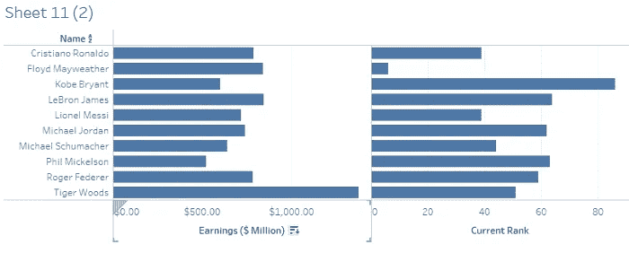

观察轴*收益(百万美元)*附近的排序选项，并单击该选项对视图进行排序。

**单击按升序排序，双击按降序排序，三击得到默认顺序。**

*   **来自标题**

要按标题排序数据，只需将鼠标悬停在标题上并选择排序选项。

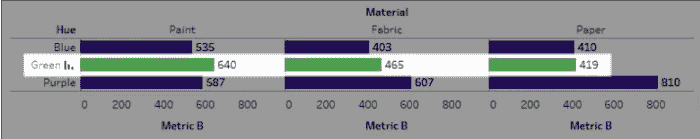

来源:Tableau 文件

*   来自字段标签的

**要从字段标签进行排序，只需将鼠标悬停在字段标签上，然后选择要对视图进行排序的字段。**

****默认情况下，从字段标签排序提供了非嵌套排序。****

**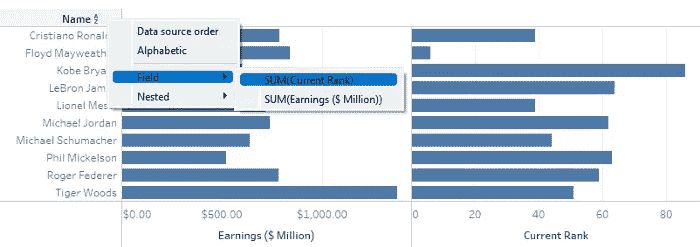**

## **创作排序**

*   **工具栏中的**

****我们可以从工具栏中按升序或降序排序。****

******默认情况下，工具栏中的排序是嵌套排序******

****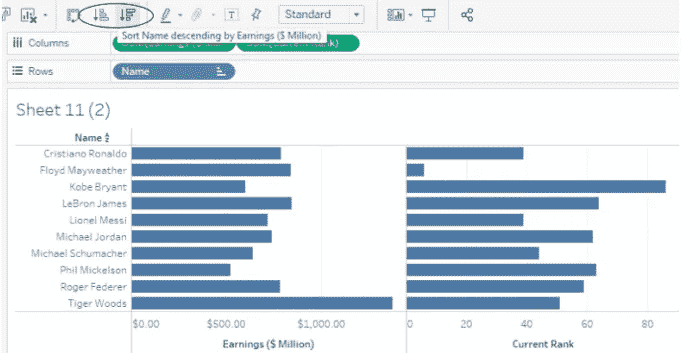****

*   ******通过拖动&放下******

****要手动排序，我们可以将字段拖放到任何我们想要的地方。****

****黑色粗线将指示拖动字段的位置。****

******一旦我们手动排序数据，即使我们刷新数据，顺序也不会改变。******

******启用任何其他类型的排序(字段、字母或嵌套)会清除我们创建的手动排序。******

****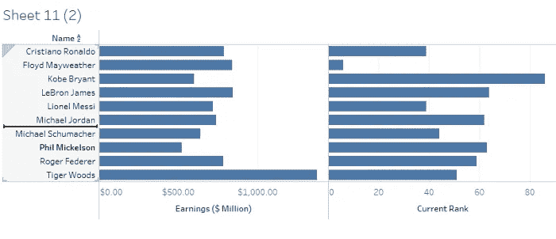****

*   ******指定字段排序******

****要按指定字段对字段进行排序，只需右键单击字段标签。****

****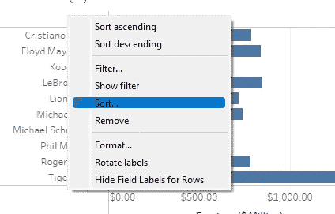****

****我们可以选择以下几种方式进行排序。****

****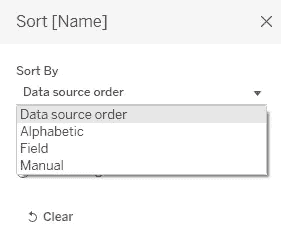****

1.  ******数据源顺序** —它将按照数据最初在我们的数据集中排序的方式对数据进行排序。****
2.  ******字母顺序** —它将按字母顺序对字段排序，A-Z 或 Z-A。****
3.  ******字段** —它可以让你根据特定的字段对数据进行排序。该字段不需要出现在视图/viz 中。****
4.  ******手动** —它将让您创建一个定制的分类顺序。****

## ****清除排序****

****为了清除排序，我们有两个选择:****

1.  ****工作表>清除>排序****

****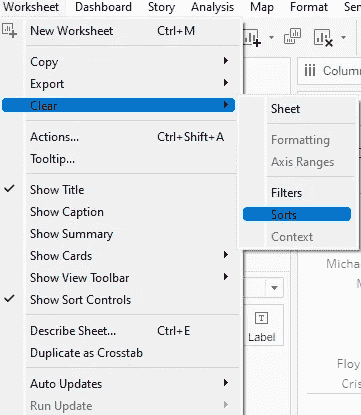****

****2.要清除字段上的指定排序，请右键单击字段并选择“清除排序”。****

****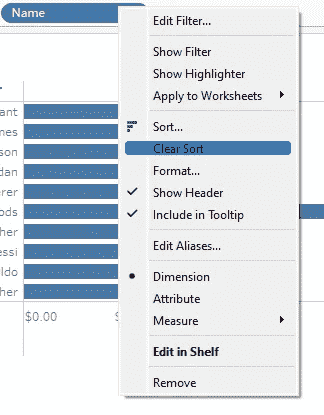****

****我们也可以禁用所有排序，工作表>显示排序控件。****

****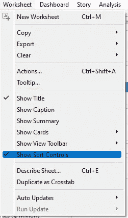****

# ****分析窗格****

****我们可以从分析窗格添加分析对象，可以从视图中利用。****

****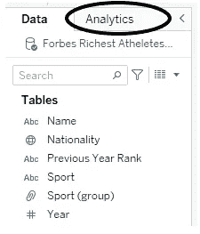****

****分析窗格提供拖放功能，可在视图中添加分析对象，如箱线图、常数线和平均线。****

****可以为表、窗格或单元格定义分析对象的范围。****

****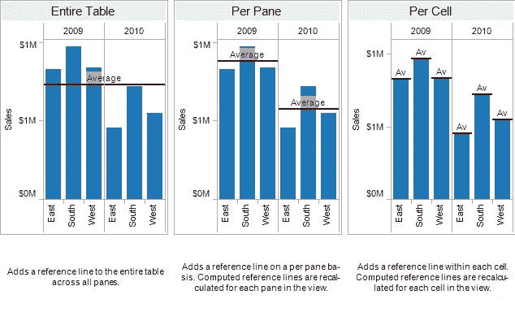****

****来源:Tableau 文件****

****Tableau 提供了以下分析对象:****

****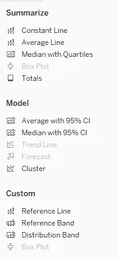****

*****我们可以通过右键单击并选择“格式”来编辑任何分析对象。*****

## ****恒定线****

****它允许您向 viz 添加一条常量线。可以为某些特定度量、所有度量或仅日期维添加常量行。当我们试图添加一个常量行时，Tableau 允许您输入一个常量值。****

****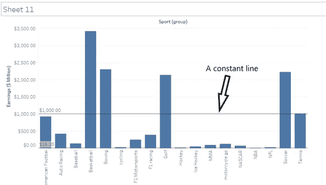****

## ****平均线****

****Tableau 允许您为整个表格、窗格或单元格创建一条平均线。只能为某些**特定测量或所有测量创建平均线。******

****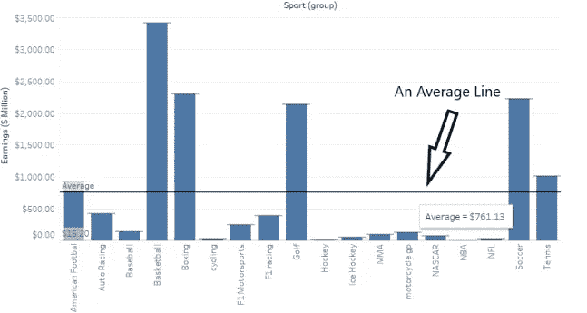****

# ****有四分位数的中位数****

****四分位数将数据分为:上四分位数、中位数、下四分位数。在 Tableau 中，带有四分位数的中值可以添加到整个表格、窗格或单元格中。我们可以为某些特定的衡量标准或所有的衡量标准添加带有四分位数的中位数。****

******下四分位数是包含全部数据点的 25%的区域。上四分位数包含总数据点的 75%。中值表示按升序/降序排序时数据点的中间值。******

****黑黑线表示中间值，两个阴影块分别代表上四分位数和下四分位数。****

****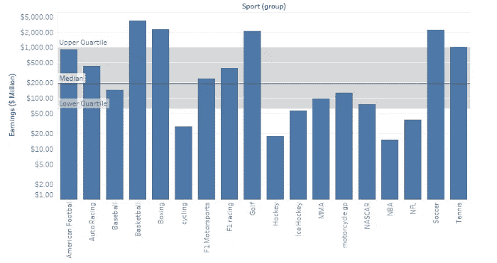****

# ****箱形图****

******箱线图也被称为盒须图。******

******方框图的范围始终是单元格。******

******需要箱线图来检查数据是否有异常值。******

******可以为某些特定测量或所有测量创建盒状图。******

****箱线图可以通过分析窗格或演示窗格制作。****

****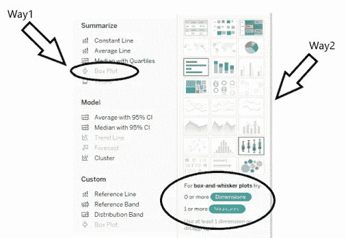****

******盒状图需要列架上的维度和行架上的度量。******

********

******上须和下须分别表示最大值和最小值。******

******上铰链和下铰链分别表示上四分位数(75%的数据点位于此处)和下四分位数(25%的数据点位于此处)。******

****Median 表示按升序/降序排序时数据的中间值。****

## ****总数****

****该选项允许我们根据可以从小计、列总计和行总计中选择的数据点，向视图中添加总计。****

****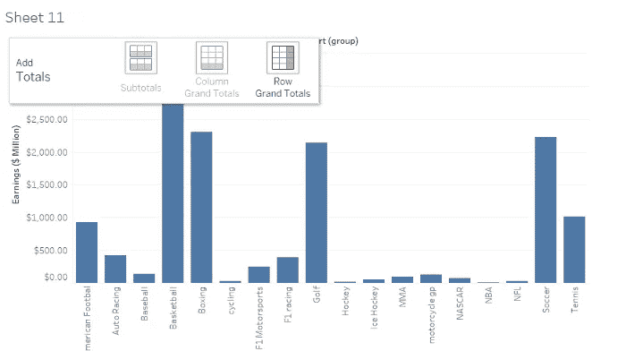****

****在选择了所需的视图后，我们会得到这样的结果。****

****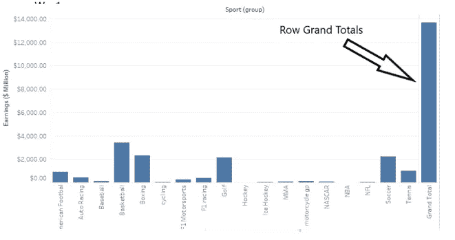****

## ****平均 CLI 为 95%****

****这将在视图中添加一条带有分布带的平均线。分布带被配置为显示 95%的置信区间，即平均人口将在 95%的时间位于该带中。****

****这可以是针对某个特定测量值添加的，也可以是针对所有测量值添加的。****

****可以为表格、窗格或单元格定义范围。****

****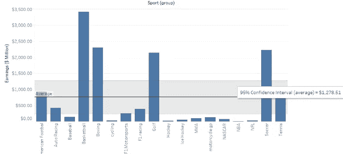****

## ****具有 95% CLI 的中值****

****这将在视图中添加一条带有分布带的中间线。分布带被配置为显示 95%的置信区间，即中位数人口将在 95%的时间内位于该带中。****

****这可以是针对某个特定测量值添加的，也可以是针对所有测量值添加的。****

****可以为表格、窗格或单元格定义范围。****

****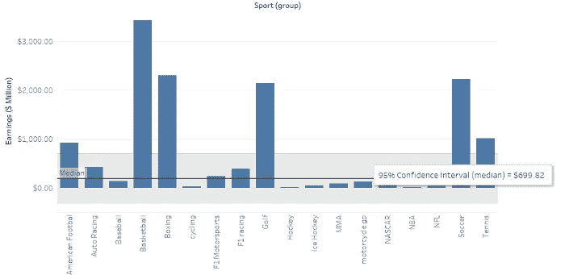****

## ****趋势线****

****要添加趋势线，**行架和列架都必须包含连续数据。******

******趋势线需要在相反的轴上有两个度量值，或者在相反的轴上有一个日期和一个度量值。******

****我们可以给散点图添加一条趋势线。****

****Tableau 中有 5 种趋势线:****

********

****线性趋势线****

> *****Y = b0 + b1*x*****
> 
> *****其中 b0 为斜率，b1 为截距。*****

******对数趋势线******

> *****Y = b0 + b1*ln(x)*****

******指数趋势线******

> *****Y = exp(b0) * exp(b1*x)*****

******功率趋势线******

> *****Y = b0 * (x^b1)*****

******多项式趋势线******

> *****Y = b0 + b1*x + b2*x*****

****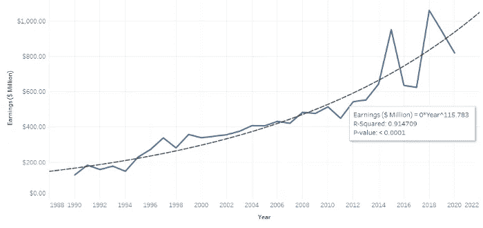****

****右键单击趋势线，对其进行编辑或描述。****

****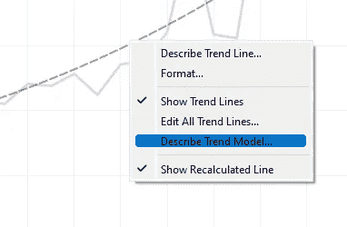********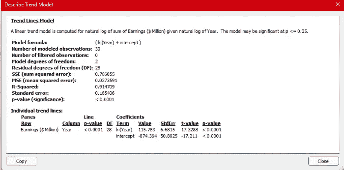****

## ****预报****

******可以对视图中的至少一个日期维和一个度量进行预测。******

****预测仅在 Tableau 桌面上受支持，在多维数据上无效。****

****如果视图中包含以下任何一项，我们就不能在视图中使用预测:****

*   ****表格计算****
*   ****分类措施****
*   ****百分比计算****
*   ****总计或小计****
*   ****聚合设置为精确日期的日期值****

****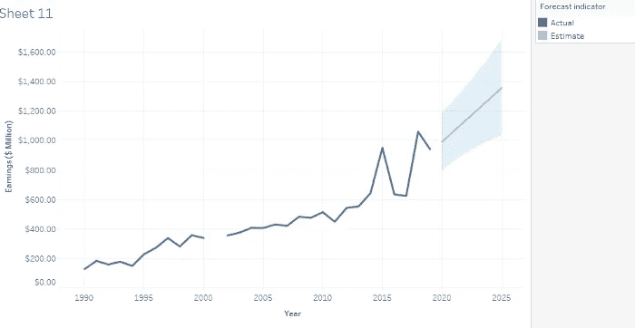****

****我们可以通过右键单击预测行来编辑预测或询问其描述。****

****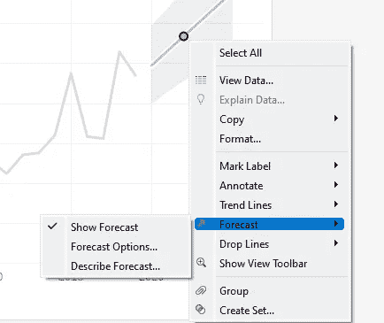****

****当我们提高预测的精确度时，预测的范围也会扩大。****

## ****参考线、参考带、分布带、箱线图****

****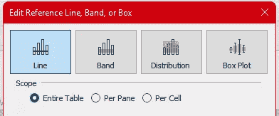****

****我们可以创建自定义参考线、参考带、分布带和箱线图。****

******我们可以给散点图添加一条参考线。******

******参考波段可以基于两个固定点。******

******参考分布图可以沿着连续轴。******

******参考线、参考带、分布图的范围可以是表格、窗格或单元格。******

******盒状图只能在一个单元格上定义。******

# ****本主题中的认证问题示例****

******默认情况下，从字段标签排序会产生 ______ 排序。**
a .嵌套
b .非嵌套
c .手动
d .数据源顺序****

******解决方案**:非嵌套****

******百分位在汇总和计算中都可用？**
a .真
b .假****

******解决方案:**真****

******总计可以通过？**选择 2
a .分析窗格
b .工作表菜单
c .分析菜单
d .在视图中单击右键。****

******解决方案:**分析窗格，分析菜单****

******哪个不是有效的表格计算？**
a .与
的差异 b .排名
c .百分位数
d .合计的差异****

******解决方案:**差异合计****

******只能按维度排序？**
a .真
b .假****

******解:**真****

> ****使用链接访问免费 Tableau 认证转储(有效期至 2022 年 7 月 6 日):****
> 
> ****[https://www . udemy . com/course/tableau-desktop-specialist-certification-dumps-2022/？coupon code = e3f 08189 fa 4 bafae 72 BC](https://www.udemy.com/course/tableau-desktop-specialist-certification-dumps-2022/?couponCode=E3F08189FA4BAFAE72BC)****

# ****参考资料:****

****[1] [Tableau 帮助| Tableau 软件](https://www.tableau.com/support/help)****

****[2] [个人笔记](https://dakshtrehan.notion.site/Tableau-Notes-c13fceda97b94bda940edbf6751cf303)****

****[3] [Tableau 桌面专家考试(新花样— 2021) — Apisero](https://apisero.com/tableau-desktop-specialist-exam-new-pattern-2021/)****

# ****感谢阅读！****

****请随意鼓掌，这样我就知道这篇文章对你有多有帮助，并在你的社交网络上分享它，这对我很有帮助。****

****如果你喜欢这篇文章，想了解更多关于机器学习、数据科学、Python、BI 的知识。请考虑订阅我的时事通讯:****

> ****[*达克什·特雷汗的通迅*](https://mailchi.mp/b535943b5fff/daksh-trehan-weekly-newsletter) *。*****

****在网上找到我:[www.dakshtrehan.com](http://www.dakshtrehan.com/)****

****在 LinkedIn 与我联系:[www.linkedin.com/in/dakshtrehan](http://www.linkedin.com/in/dakshtrehan)****

****阅读我的科技博客:[www.dakshtrehan.medium.com](http://www.dakshtrehan.medium.com/)****

****在 Instagram 和我联系:[www.instagram.com/_daksh_trehan_](http://www.instagram.com/_daksh_trehan_)****

# ****想了解更多？****

****[YouTube 是如何利用 AI 推荐视频的？](/how-is-youtube-using-ai-to-recommend-videos-38a142c2d06d)
[利用深度学习检测新冠肺炎](https://towardsdatascience.com/detecting-covid-19-using-deep-learning-262956b6f981)
[逃不掉的 AI 算法:抖音](https://towardsdatascience.com/the-inescapable-ai-algorithm-tiktok-ad4c6fd981b8)
[GPT-3 向一个 5 岁的孩子解释。](/gpt-3-explained-to-a-5-year-old-1f3cb9fa030b)
[Tinder+AI:一场完美的牵线搭桥？](https://medium.com/towards-artificial-intelligence/tinder-ai-a-perfect-matchmaking-b0a7b916e271)
[一个内部人士的使用机器学习卡通化指南](https://medium.com/towards-artificial-intelligence/an-insiders-guide-to-cartoonization-using-machine-learning-ce3648adfe8)
[谷歌是如何做出“哼哼来搜索？”](/how-google-made-hum-to-search-865f224b70d0)
[一行神奇的代码执行 EDA！](/one-line-magical-code-to-perform-eda-f83a731fbc35)
[给我 5 分钟，我给你深度假！](/give-me-5-minutes-ill-give-you-a-deepfake-ce83a645b0f9)****

> *****欢呼*****