# 声音和声学模式诊断 COVID[第 2 部分]

> 原文：<https://pub.towardsai.net/sound-and-acoustic-patterns-to-diagnose-covid-part-2-85f202d60dcb?source=collection_archive---------4----------------------->


[*将*](https://medium.com/@himanp/speech-and-acoustic-patterns-to-diagnose-covid-part-1-80f5d36be792) 链接到本案例研究的第 1 部分

[将](https://medium.com/@himanp/sound-and-acoustic-patterns-to-diagnose-covid-part-3-624273949804)链接到本案例研究的第 3 部分

# 探索我们的特征

首先，我们将把我们的类标签转换成整数并存储它们。

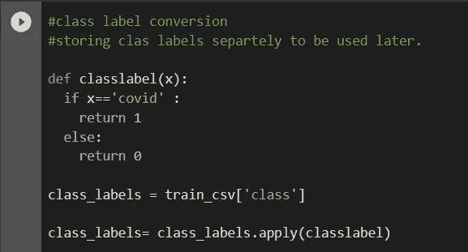

我们将为所有音频文件提取上一部分中讨论的所有特征，并将它们存储在 pandas 数据框中。

所有解释的特征都是从我们的数据集中提取的。音频文件以单声道或单声道的形式被消费。音频也被截短为 5 秒钟，以省去不太重要和异常的声音。提取 20 个 MFCCss，并对每个 MFCC 取平均值。Mean 还接管了其他功能。

我已经使用 Librosa 库从声谱图中提取了所有这些特征，并将它们存储在数据帧中。所有提取的特征都是数字的，因此不需要任何编码策略。

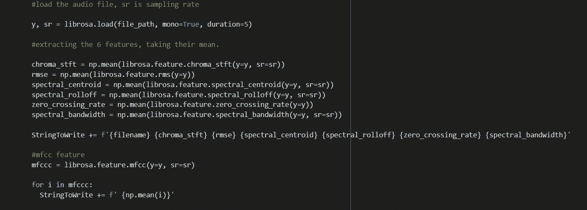

提取音频特征的代码

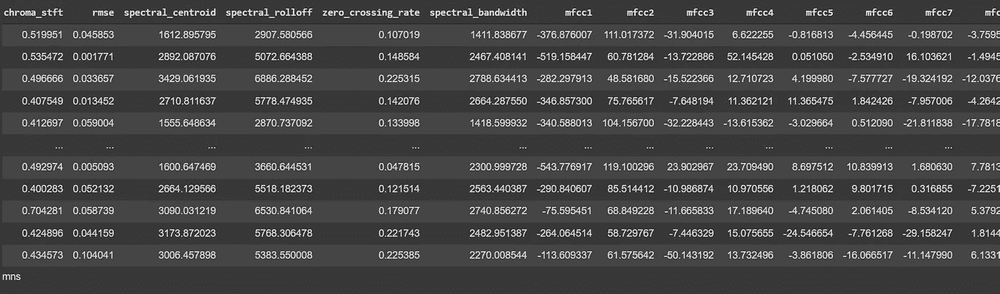

包含要素的最终数据框

一些特征的基本统计。您可以在下面观察“chroma_stft”的统计数据。你也可以看到我们的最终功能列表。

```
#stats of features and final column list
new_df['chroma_stft'].describe()
new_df.columns
```

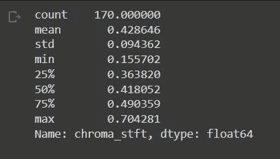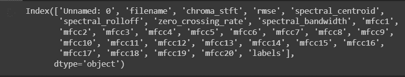

使用一些特征对图进行配对以理解可分性

```
#pair plots of features
#There is not much information in the pair plots.
#there is no clear boundary that separates positives from negativesimport seaborn as snsa = new_df.shape[0]sns.pairplot(new_df[['chroma_stft', 'rmse', 'spectral_centroid', 'spectral_rolloff', 'labels']][0:a],  hue='labels', vars=['chroma_stft', 'rmse', 'spectral_centroid', 'spectral_rolloff'])plt.show()
```


我们的 4 个特征的配对图

下面我们将绘制并查看“光谱滚降”特性的分布。

```
# Distribution of the spectral_rolloff featureplt.figure(figsize=(15, 15))plt.subplot(1,2,1)sns.violinplot(x = 'labels', y = 'spectral_rolloff', data = new_df[0:] , )plt.subplot(1,2,2)sns.distplot(new_df[new_df['labels'] == 1.0]['spectral_rolloff'][0:] , label = "1", color = 'red')sns.distplot(new_df[new_df['labels'] == 0.0]['spectral_rolloff'][0:] , label = "0" , color = 'blue' )plt.show()
```

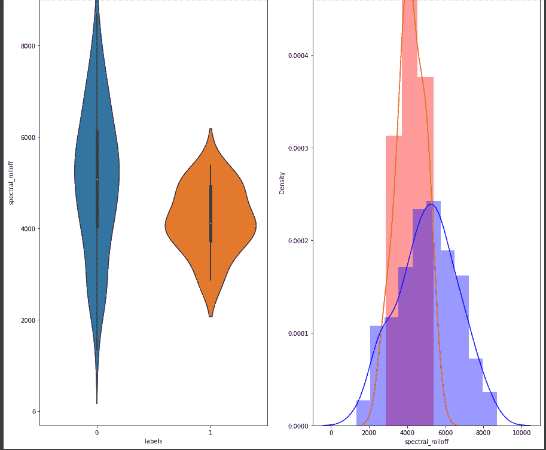

光谱衰减的小提琴图和密度分布图

```
# Distribution of the spectral_centroid featureplt.figure(figsize=(15, 15))plt.subplot(1,2,1)sns.violinplot(x = 'labels', y = 'spectral_centroid', data = new_df[0:] , )plt.subplot(1,2,2)sns.distplot(new_df[new_df['labels'] == 1.0]['spectral_centroid'][0:] , label = "1", color = 'red')sns.distplot(new_df[new_df['labels'] == 0.0]['spectral_centroid'][0:] , label = "0" , color = 'blue' )plt.show()
```

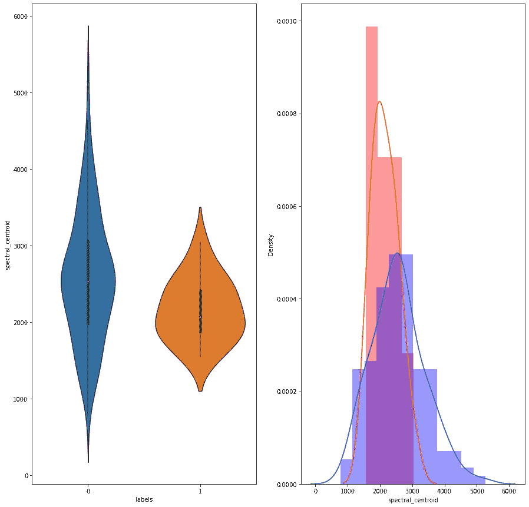

光谱质心的小提琴图和密度分布图

TSNE 情节:

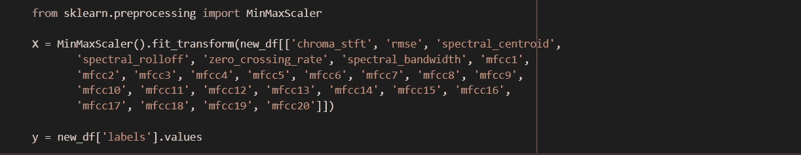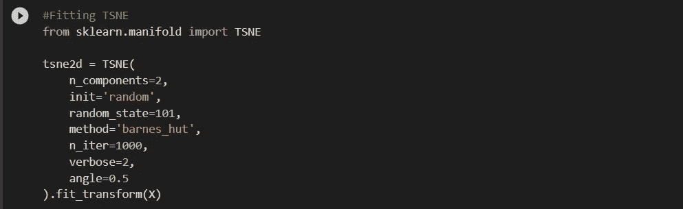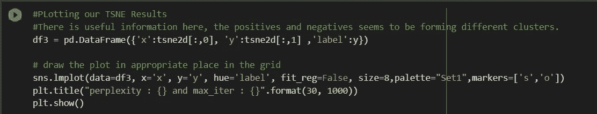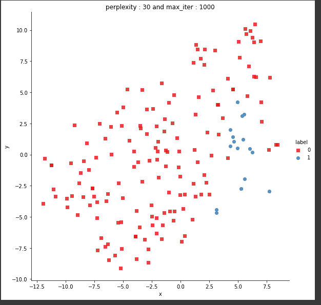

TSNE 图

对一些特征的单变量分析表明，没有足够的分离可用于单个特征进行分类。在分布图中，正类分布和负类分布之间有很多重叠。在结对图中，您可以观察到我们的类之间没有清晰的决策边界或聚类。在 TSNE 图中，我们确实看到了一些聚集现象，这是一个好现象。

# 建模和性能分析

在上一节中，我们提取了色度 STFT、rmse 等特征，并以表格形式存储它们。标签也以文本格式存储，我们将其转换为二进制格式用于建模。0 将被称为“非 covid”，而 1 将被称为“covid”。创建自定义函数来绘制混淆矩阵、精度矩阵和召回矩阵。

当处理像我们这样的不平衡数据时，用上述指标补充准确性指标是很重要的。混淆矩阵、回忆、精确度和 F1 分数使我们对预测结果有了更好的理解。F1 分数只是根据召回率和精确度构建的指标，因此我们不会用它来评估和分析我们的结果。

**混乱矩阵:**

在像我们这样的二进制分类设置中，它是一个 2x2 矩阵，实际值(Y)在一个轴上，预测值(Y_hat)在另一个轴上。混淆矩阵由 4 个部分组成——真阳性(TP)、假阳性(FP)、真阴性(TN)和假阴性(FN)。

True Positive:模型正确预测了正类(有 covid)。例如，模型预测有 6 人实际患有 covid。这个计数被称为真阳性。

假阳性:模型错误地预测了阳性类别。例如，模型预测有 4 个人患有 covid，但实际上他们并没有。在这种情况下，实际的类是负的。

真阴性:模型正确预测了阴性类别。例如，50 个没有 covid 的人被模型预测为没有 covid。在这种情况下，实际类也是负的。

假阴性:模型错误地预测了阴性类别。实际课堂是积极的。例如，模型预测有 5 个人没有 covid，而实际上他们有。

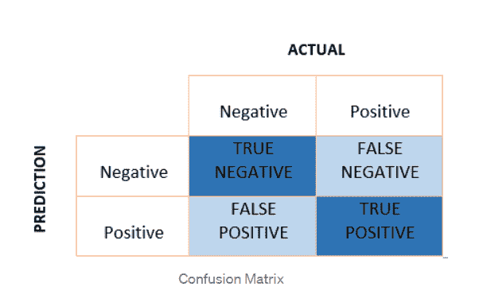

二元混淆矩阵图

使用上述值，可以计算出— TPR(真阳性率)、FPR(假阳性率)、TNR(真阴性率)和 FNR(假阴性率)。所有这些的公式都包含在下图中。

通常，希望具有高的 TPR、TNR 和低的 FPR 和 FNR。然而，在医疗诊断领域，更多地关注 TPR 和 FNR 通常是有意义的。在我们的项目中，更重要的是我们尽可能地增加真阳性率和减少假阴性率，以创造最大的业务影响。

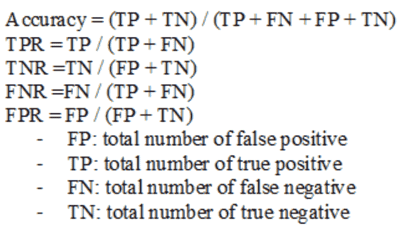

度量公式

**精度:**

它描述了我们积极预测的质量。是百分比或比率告诉我们有多少我们预测的正点数实际上是正的。该值始终介于 0 和 1 之间。为了得到百分比，我们可以用 100 乘以这个比率。

精度= TP/(TP + FP)

**回忆:**

这是一个比率，它告诉我们在所有的实际阳性中，有多少是预测的阳性。例如，如果模型预测 10 名实际阳性受试者中有 5 名 covid 阳性，则召回率为 5/10 或 50%。

召回= TP/(TP + FN)

我们将把数据分成测试和训练子集。训练集有 119 个点，26 个特征，测试集有 51 个点，相同的特征。数据也会保存到 pickle 文件中，以便于将来访问。此外，将数据标准化也很重要。

```
#Train test splitX_train,X_test, y_train, y_test = train_test_split(new_df_1, y_true, stratify=y_true, test_size=0.3)#save our objects to pickleimport picklewith open('/SplitData.pickle', 'wb') as handle:pickle.dump([X_train,X_test, y_train, y_test], handle)#load the objects from pickleimport picklewith open('/SplitData.pickle', 'rb') as handle:X_train,X_test, y_train, y_test = pickle.load(handle)
```

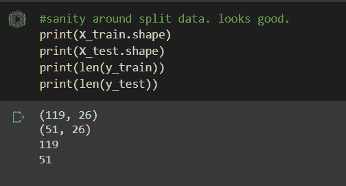

分割周围的健全性检查

现在，我们准备根据我们的数据训练模型。

**逻辑回归:**

在逻辑回归中，目的是找到一个能把我们两个阶层分开的地方。日志丢失用于优化。L2 正则化被用作正则化方法以避免过拟合。Alpha 用作驱动正则化的超参数。值 0.1 用作 alpha。随机梯度下降用于寻找最小值/最大值。

使用 sigmoid 的校准也用于获得输出的精确概率。

在逻辑回归中，模型产生了 0.138 的训练损失和 0.21 的测试损失。训练准确率为 95%，而测试准确率为 88%。值得注意的是，这里的高测试精度并不能给出真实的结果，因为我们的数据集是不平衡的。有可能高精度仅来自不平衡类，即我们数据中的负类。

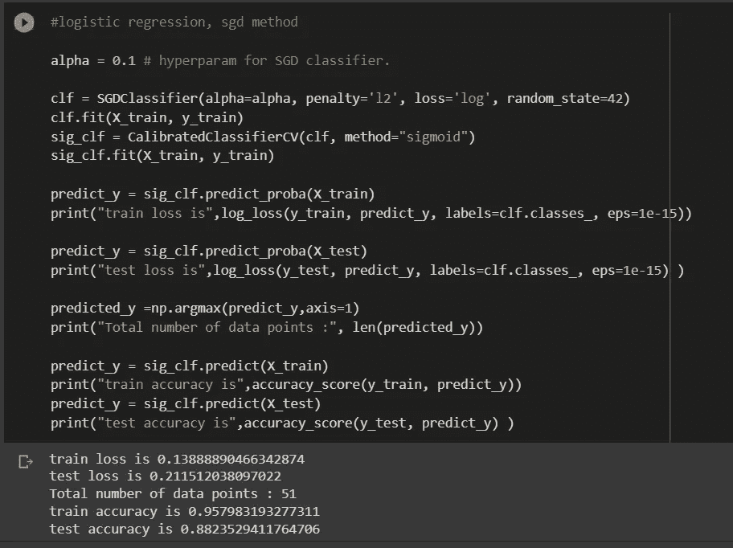

从混淆矩阵中，可以观察到该模型能够正确预测 13 个阳性中的 8 个阳性。真正的负面预测是正确的。这是为了火车数据。

在测试数据中，可以观察到该模型不能正确地预测任何正的点。

```
#Plotting the matrices for Test data
plot_confusion_matrix(y_test, sig_clf.predict(X_test))
```

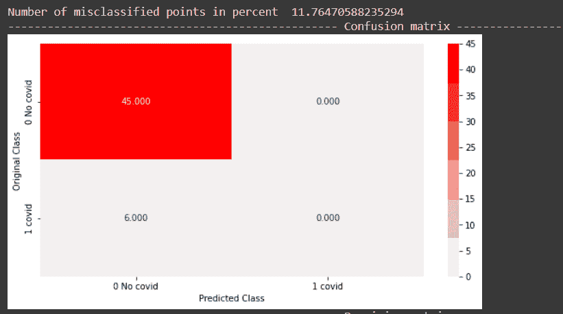

逻辑回归模型的混淆矩阵

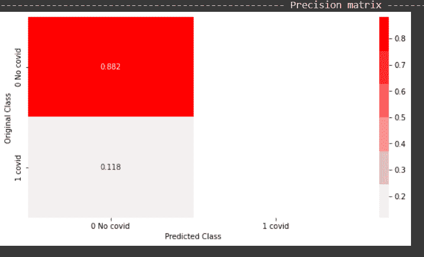

逻辑回归模型的精度图

从上面的精度图可以推断，对于正类，我们有 0 或没有精度，对于负类，精度是 0.882，这意味着，在所有的负预测中，88.2%是正确的负预测。

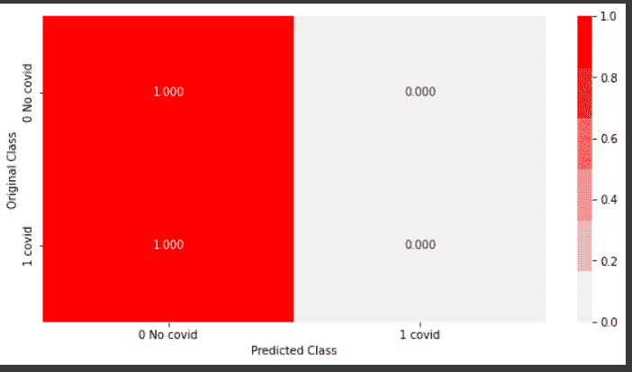

在 python 上绘制的逻辑回归模型的回忆图

从上面的召回图可以推断，正面类的召回是 0，负面类的召回是 1，这意味着，在所有负面点中，100%被正确预测。同样，在所有积极的观点中，没有一个是正确预测的。

总之，像逻辑回归这样的简单模型不能够很好地执行，或者能够识别正类和负类之间的差异。它高度偏向不平衡的阶层——消极阶层。

使用下面的代码，将您的结果保存在一个文件中，该文件可用于以后存储其他结果。


**随机森林:**

下一个实现的模型是随机森林。这是一个基于决策树的集成模型。由于线性模型不能分离数据，所以尝试非线性的、更复杂的模型是有意义的。

使用的基础学习器的数量是 50，并且每个基础学习器树的最大深度被限制为 4。这两个都是超参数，可以使用交叉验证集进行调整。

使用 sigmoid 的校准也用于获得输出的精确概率。

在随机森林模型中，观察到 0.091 的训练日志损失和 0.0229 的测试日志损失。观察到 100%的训练准确度和 94%的测试准确度。根据混淆矩阵，测试数据集中的所有阴性点都被正确分类，并且一半阳性点也被正确分类。

总之，像 Random forest 这样更复杂的模型比简单的线性模型做得更好，并且能够合理地区分类别。

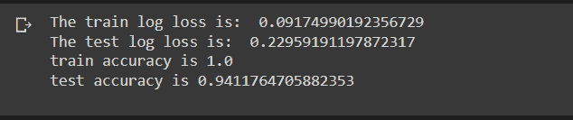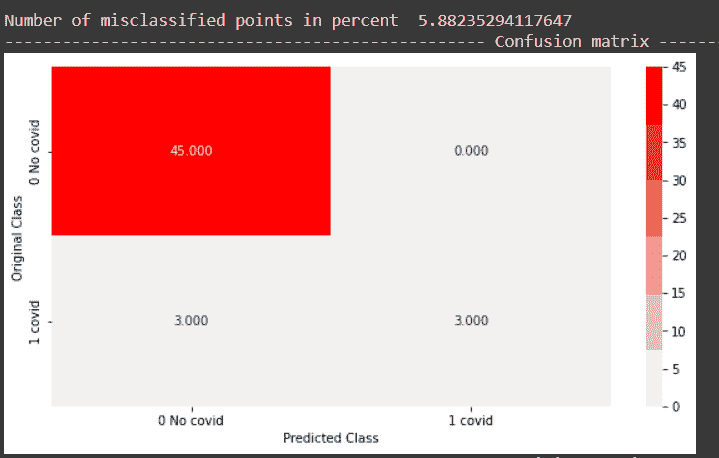

随机森林模型的混淆矩阵

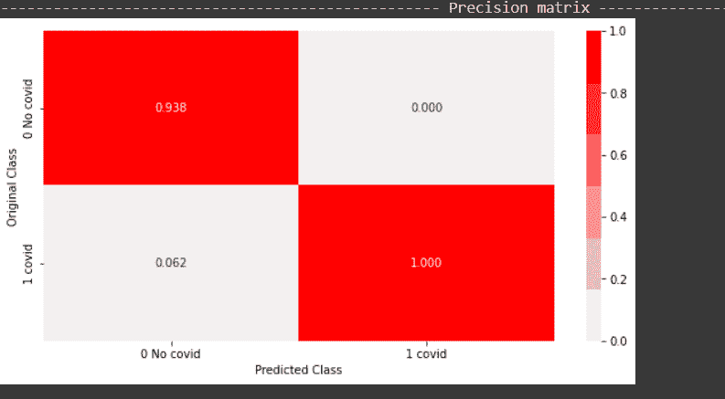

随机森林模型的精确数据

从上面的精度图可以推断出，对于正类，我们有 100%的精度，对于正类，这意味着，在所有的正预测中，它们 100%是正确的。同样，在所有负面预测中，92%是正确的负面预测。

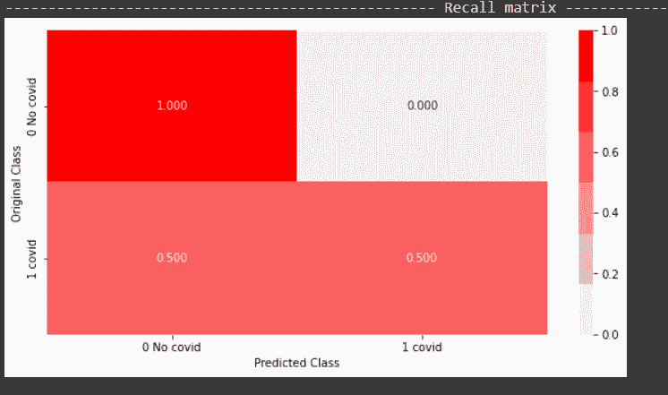

召回随机森林模型的数据

从上面的回忆图中，可以推断正面类的回忆是 50 %,这意味着在所有正面点中，50%被模型正确预测。类似地，否定类的召回率是 100 %,这意味着在测试数据中所有真正的否定点中，所有都被模型正确预测。

结果保存在性能文件中。

**梯度推进决策树**

实现的下一个模型是梯度推进决策树。这也是一个基于集合的复杂模型，它迭代地减少来自决策树的误差。基础学习者使用的数量是 500，这是决策树。校准使用 sigmoid 来调整输出的概率。

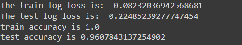

GBDT 的模型结果

训练损失在 0.08 左右，测试损失在 0.22 左右。在训练集上观察到 100%的准确度，而在测试集上观察到 96%的准确度。这是对随机森林模型的改进。

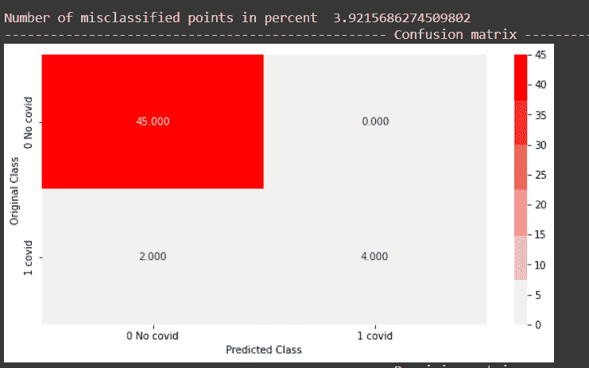

GBDT 模型的混淆矩阵

所有消极点都被正确分类。6 个阳性点中的 4 个也被正确分类，这是对随机森林模型的改进。

总之，GBDT 的表现略好于随机森林模型，能够合理地将积极的点分类。


GBDT 的精确数据

从上面的图可以推断，模型预测的所有正点都是正确的。预测的 95%的消极点实际上是消极的，剩下的 5%实际上是积极的。

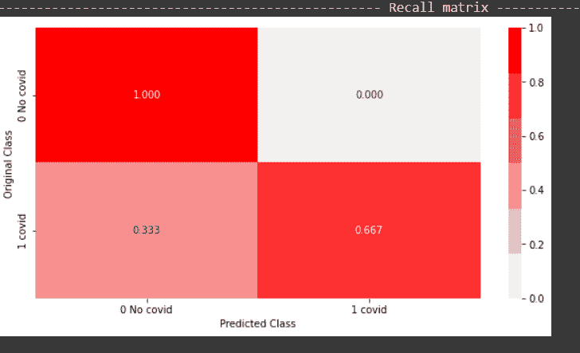

回想用 python 绘制的 GBDT 数据

从上面的回忆图中，可以推断出该模型能够预测所有积极点中 66%的积极点。该模型能够 100%地预测所有负面点。

> 值得注意的是，我们在数据的单一训练测试分割上训练了上述模型。在较小的数据集的情况下，总是在训练测试数据的多个分割上训练和计算度量，以获得结果的整体画面。

**结论:**

在这一部分，我们看到了我们的特点，对它们做了一些 EDA，并建立了一些经典的机器学习模型。

在下一部分:

1.  我们将尝试贝叶斯优化来找到最佳模型
2.  构建深度学习模型
3.  生产一个深度学习模型