# 声音和声学模式诊断 COVID[第 3 部分]

> 原文：<https://pub.towardsai.net/sound-and-acoustic-patterns-to-diagnose-covid-part-3-624273949804?source=collection_archive---------3----------------------->


[*将*](https://medium.com/@himanp/speech-and-acoustic-patterns-to-diagnose-covid-part-1-80f5d36be792) 链接到本案例研究的第 1 部分

[*将*](https://medium.com/@himanp/sound-and-acoustic-patterns-to-diagnose-covid-part-2-85f202d60dcb) 链接到本案例研究的第二部分

在最后一部分中，我们根据我们的训练数据建立了一些模型，并根据我们的测试数据计算了一些指标。

## **贝叶斯优化和超点:**

Hyperopt 是一种基于贝叶斯优化和 SMBO(基于序列模型的全局优化)来寻找最佳模型和超参数的工具。本质上，通过贝叶斯优化，它可以找到 P(得分|配置)，即对于不同的配置，给定特定配置的得分概率，然后确定最佳配置。该配置可以是具有不同超参数值的模型，或者具有不同超参数的不同模型。使用贝叶斯优化，该算法能够缩小搜索空间，以找到这些配置并更快地提供结果。

我已经使用这个工具为我们的数据集找到了最佳的模型和参数，然后实现了它。

使用超点的贝叶斯优化

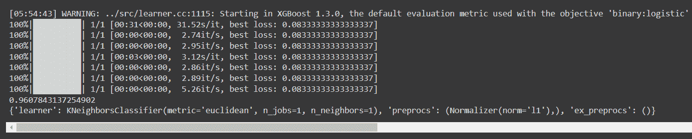

远视结果

根据以上所述，最佳模型是 KNN，具有欧几里得距离并且 K=1。还建议使用 L1 归一化作为预处理步骤。

## k-最近邻:

在 KNN 中，在数据集中找到查询点的邻域，并且大多数邻域的类标签被给定为查询点的类标签。下面是结果。

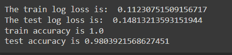

该模型产生了 0.11 的列车对数损失和 0.14 的测试对数损失。训练准确率为 100%，而测试准确率为 98%。值得注意的是，训练损失和测试损失之间的差异较小，表明该模型没有过拟合。

从下面的混淆矩阵图中可以看出，在测试数据中，所有阳性点都被正确分类，而一个阴性点被错误分类。

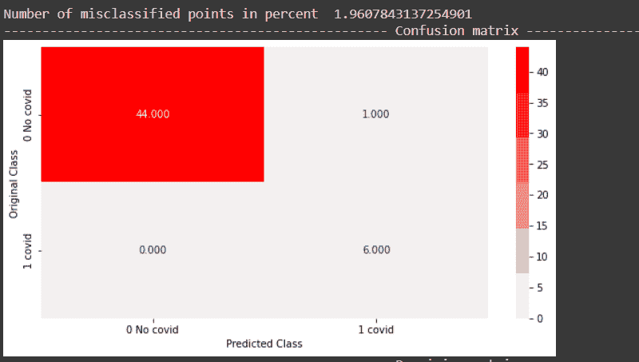

KNN 的困惑矩阵

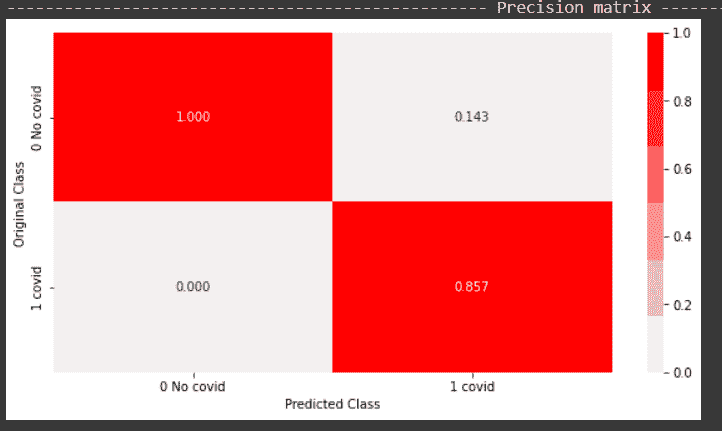

KNN 的精确数据

从上面的精度图可以得出结论，85%的预测阳性是实际阳性，100%的预测阴性是实际阴性。

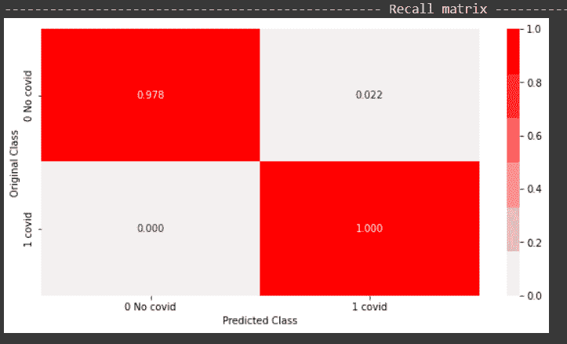

回想用 python 绘制的 KNN 数据

从上面的回忆图可以得出，正面类有 100%的回忆，而负面类有 97%的回忆。

这就结束了我们问题的经典机器学习实现。总之，KNN 表现最好。超参数调整和获得更好结果的空间更大，但是，很明显，经典技术可以在非常有限的容量内对我们的数据进行分类，并且很有可能过度拟合训练数据。

现在，因为这个问题是医学诊断的问题，对我们来说重要的指标是真阳性率和假阴性率。重要的是减少 FNs 并增加 TPs。

下面是所有上述模型的 TP 和 FN 图。

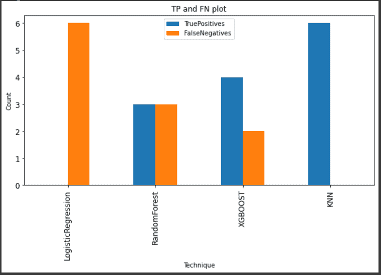

所有型号的 TP 和 FN 图

# 基于深度学习的模型

接下来，我们将实现一些深度学习模型，并分析它们的性能。

## 卷积神经网络

核用于逐个像素地对图像进行卷积，点积存储在另一个矩阵中，该矩阵是该卷积的结果。许多这样的卷积层被用来从输入图像中学习。在我们的例子中，图像是之前详细讨论过的声谱图。我们所有的数据集都被转换成光谱图。对这些频谱图使用 CNN，然后是二进制分类层，以预测频谱图是属于 covid 正声音还是 covid 负声音。

**VGGNet:**

这是基于卷积的架构。整个架构只使用 3x3 内核，stride 2 使用 2x2 最大池。这极大地简化了这个架构。VGG 16 号有 16 层。这用于我们任务的迁移学习。在 Keras 中，有一个在 imagenet 数据集上训练的预先构建的 VGG 16 模型。

迁移学习是指将预先训练好的模型重新用于当前工作，而不是从头开始构建模型。如果我们移除顶层，这些顶层是平坦且完全连接的密集层，则得到的输出是瓶颈特征。初始层的权重被冻结，因此渐变不会穿过它们，权重也不会更新。微调意味着使用较低的学习速率，因此权重不会剧烈更新。

在我们的任务中，将应用瓶颈和微调来查看结果。

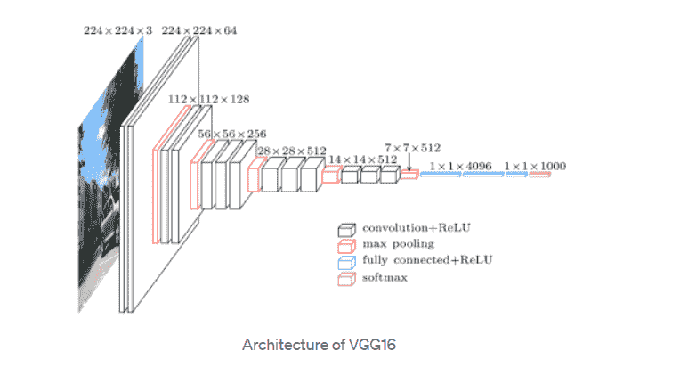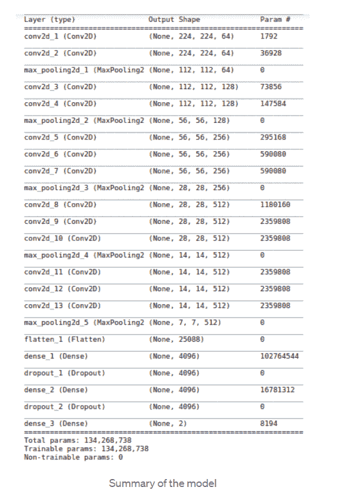

**CNN 模式一:**

图像数据生成器和来自数据帧方法的流用于准备我们的图像以供训练。在进行测试训练分割后，我们在验证集中获得了 30%的图像，在训练集中获得了 70%的图像。对于使用瓶颈特性的第一个任务，所用图像的目标大小是原始光谱图的大小，即 288x432。当 shuffle 为真时，使用的类模式是二进制的，因为我们的任务是二进制分类。

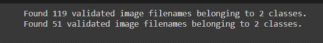

由图像数据生成器创建训练和验证集

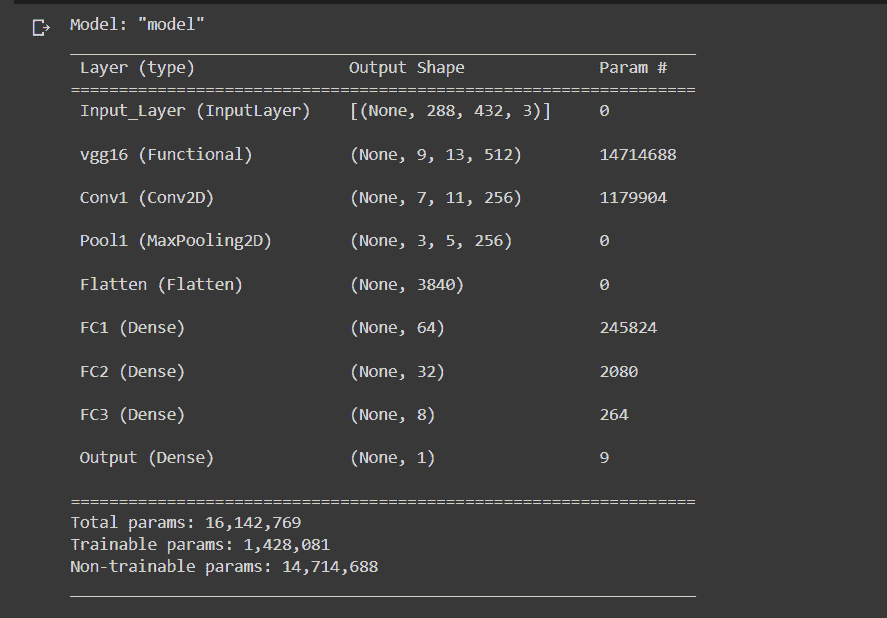

CNN 1 的最终模型总结

在最终的模型中，有一个输入层，然后是顶部被移除的 VGG 16 模型。重物被冻结在这里。权重用 imagenet 数据集初始化。我们有一个卷积层，一个汇集层，然后是平坦和密集的层。最后，我们有一个用于二进制分类的单个 sigmoid 神经元。

模型用 Adam optimizer 编译，学习率为 0.01，二进制交叉熵损失，一组度量。度量包括二进制准确度、TP、FP、TN、FN。

该模型被训练了 50 个时期。

```
30/30 [==============================] — 13s 433ms/step — loss: 3.9778e-07 — binary_accuracy: 1.0000 — tp: 11.0000 — tn: 108.0000 — fp: 0.0000e+00 — fn: 0.0000e+00 — val_loss: 0.8592 — val_binary_accuracy: 0.9412 — val_tp: 5.0000 — val_tn: 43.0000 — val_fp: 0.0000e+00 — val_fn: 3.0000<keras.callbacks.History at 0x7f955de702d0>
```

该模型对训练集产生了 100%的准确率。总共有 3 个假阴性的验证组的准确度为 0.94。

**CNN 模式二:**

对于微调用于迁移学习的 VGG 16 模型的第二个任务，图像被调整为 224x224，这是 VGG 16 模型的标准输入大小。当 shuffle 为真时，使用的类模式是二进制的，因为我们的任务是二进制分类。


由图像数据生成器创建训练和验证集

在这个模型中，基本模型是 VGG 16。我们冻结了这个模型的初始层，但没有冻结后面的层。6 层不冻。

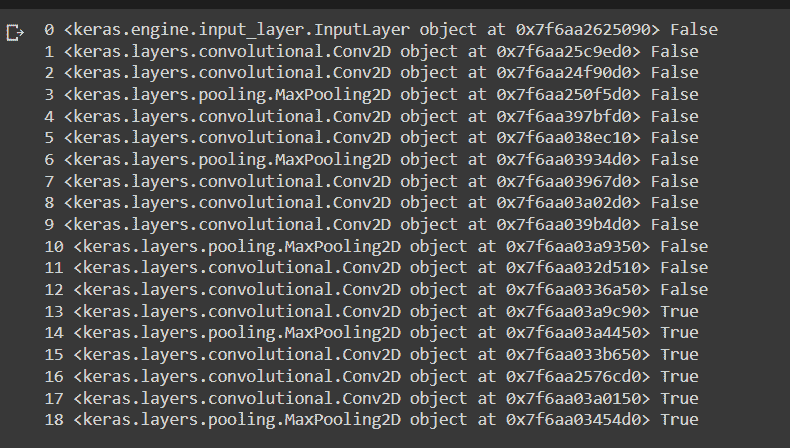

冻结 VGG-16 模型的初始层

最终的模型包含输入层，如上所述的 VGG 16，后面是 2 个卷积层。这里，卷积层用于完全连接的层。这加快了训练的速度。然后是 flatten 层，后面是 sigmoid 激活的输出层。该网络中大约有 1.3 亿个可训练参数。

在编译这个模型时，我们使用了降低学习率的概念。我们使用的 Adam 优化器的学习率较低，为 0.0001。我们还使用了之前描述的相同指标。使用最小为 0.000001 的递减学习率。

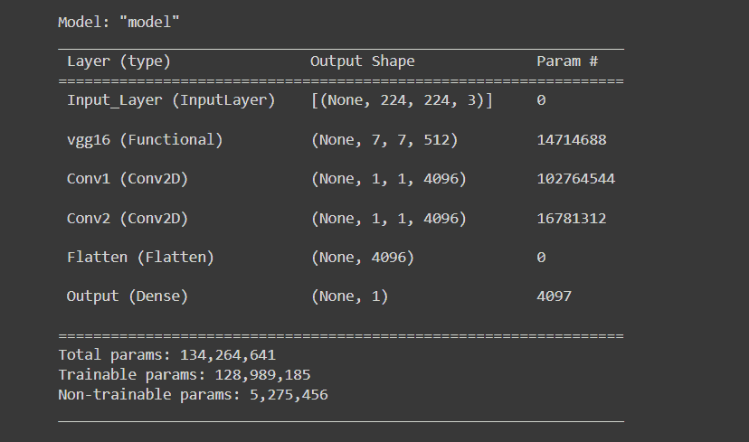

CNN 模型 2 的最终总结

```
Epoch 50/5030/30 [==============================] — 16s 531ms/step — loss: 4.6876e-07 — binary_accuracy: 1.0000 — tp: 16.0000 — tn: 103.0000 — fp: 0.0000e+00 — fn: 0.0000e+00 — val_loss: 0.1338 — val_binary_accuracy: 0.9608 — val_tp: 2.0000 — val_tn: 47.0000 — val_fp: 1.0000 — val_fn: 1.0000 — lr: 1.0000e-06<keras.callbacks.History at 0x7f6aa02ca7d0>
```

如上所述，我们对模型进行了 50 个时期的训练。在训练集上获得了 100%的准确率，在验证集上获得了 96%的准确率。但是，假阴性只有 1，假阳性是 1。这比 CNN 模型 1 好得多，因为我们最关心的是减少 FN 和增加 TP，这是在该模型中实现的。

## 多层感知器

多层感知器由 4 个密集层，一个输入层和一个输出层组成。输出包括 1 个 sigmoid 单元，因为我们的任务是二元分类。作为度量，使用二进制准确度和混淆矩阵分量。二进制交叉熵被用作损失函数。Adam optimizer 用作学习率为 0.01 的优化器。

这里，我们使用了用于经典机器学习模型的表格特征。

下面是模型总结。我们的模型有大约 186，000 个可训练参数。

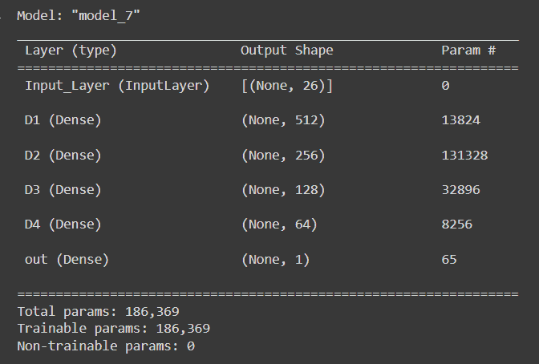

模型摘要

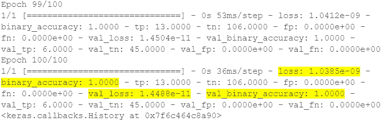

如上所述，该模型被训练了 100 个时期，并且最后的损失非常低。该模型实现了 100%训练和验证准确性。

> 然而，对于结果的整体视图，我们需要在数据的多个训练/测试分割上训练和测试上述模型。

**重新运行基于 MLP 的模型，使用几次列车测试分割，以了解平均性能**

在该实验中，创建了多个列车测试分段，并在其上运行了 MLP 模型。性能指标被捕获和记录。

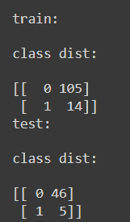

第一次运行中分类标签的训练测试分割

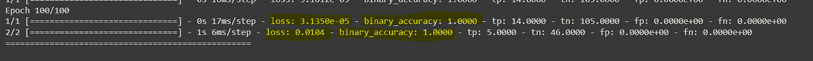

第一次运行的结果

如上所述，这是 5 次运行的第一次运行，其中在训练数据集中我们有 14 个正点，而在测试数据集中，我们有 5 个正点。在运行模型 100 个时期后，测试损失为 0.014，准确率为 100%。

类似的过程在不同的列车测试分段上重复了 5 次。下面是最终结果。正如所观察到的，精确度在 90%以上，并且在许多运行中接近 100%。更重要的是，我们有低的假阴性和高的真阳性。

因此，我们将把这款车型作为最终车型进行生产。

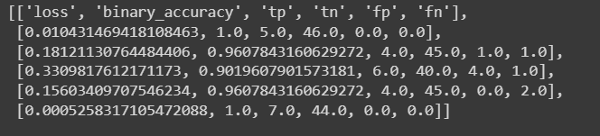

5 次运行的最终结果

# 部署和生产

最后使用的模型是深度学习 MLP 模型。部署和产品电离所需的两个关键文件是保存的模型文件和用于数据标准化的 pickle 文件。围绕该模型创建了一个 API，它将音频文件作为输入，并将标签作为输出返回。输出是 JSON 格式的。

用户界面很简单。文件被上传，点击分类按钮。这将把文件发送到服务器，并将一个类标签返回给客户机。这是通过使用**烧瓶 API 模块**实现的。

我们将使用 AWS 云来部署这个应用程序。我们将使用弹性云计算服务。首先，将启动 EC2 实例并安装所需的库。然后使用安全副本，我们将所需的文件从本地传输到 EC2 箱。然后在 EC2 服务器上运行 app.py 文件。

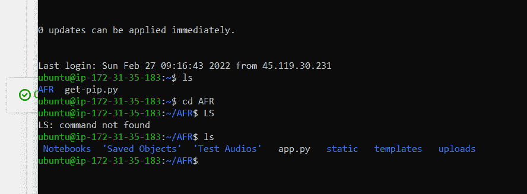

显示复制文件的 EC2 框

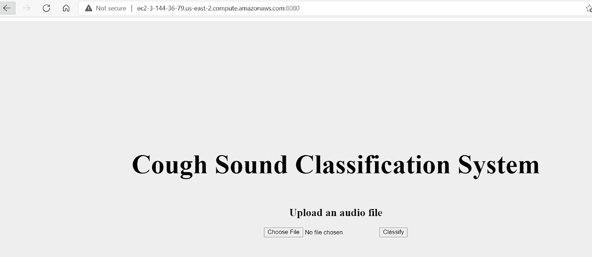

从 EC2 机器打开的 UI

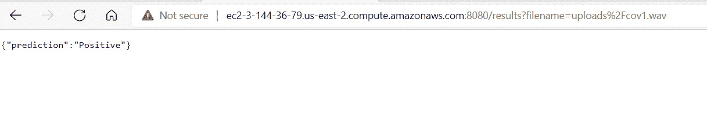

EC2 主机返回的预测

# 结论

在这个案例研究中，我们试图创建一个可以对咳嗽声进行分类的工作模型。即使只有很小的数据集，结果也很好，很有希望。采用了经典的机器学习方法和深度学习方法。在经典方法中，KNN 给出了最好的结果。为了找到最佳模型，我们还利用了贝叶斯优化。

在深度学习方法中，实现了多层感知器和卷积神经网络。对于经典方法和 MLP，我们使用表格数据。这些数据是从音频信号的时间序列中设计出来的。对于 CNN，我们使用光谱图。

作为最终模型，我们选择了 MLP，因为它给出了很好的结果，而且训练速度更快。与 CNN 相比，它具有相对较短的预测时间和较低的预测成本。

该模型部署在 AWS EC2 服务上。围绕该模型，使用 Flask 开发了一个 API。

希望你喜欢阅读它！！