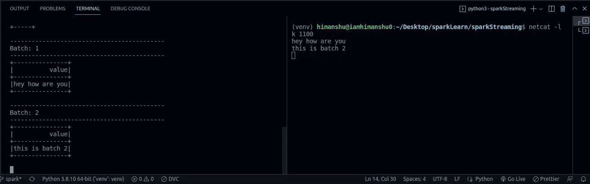

# 火花流第 1 部分|| Python

> 原文：<https://pub.towardsai.net/spark-streaming-part-1-python-9658a292005?source=collection_archive---------1----------------------->


克里斯托夫·高尔在 [Unsplash](https://unsplash.com/s/photos/data-science?utm_source=unsplash&utm_medium=referral&utm_content=creditCopyText) 上拍摄的照片

在你的房子被闯入后醒来有什么意义？难道你不觉得在大灾难已经重创你之后再警醒自己是没有用的吗？我们需要实时了解这些事情。对吗？？？

我们有一个非常好的印度语短语

> “अब पछताये होत क्या जब चिड़ियाँ चुग गई खेत”

这意味着:- **当鸟儿糟蹋了田野，它们吃掉了种子，什么也没有留下，**

**为什么现在觉得难过。**

这个故事的寓意是“及时做好每一件事。”

不要等到太晚的时候再行动。到时候你会后悔的。

为了解决这些问题，我们推出了“火花流”来帮助您。

> ***这篇文章我们要讲什么？***

*   什么是数据流？
*   流式数据的重要性
*   数据流应用面临的挑战
*   什么是火花流？
*   使用 Socket || Python 的实时数据流

**我们出发吧！！（🌟)**

> **什么是数据流？**

单词“流”用于描述连续的、永不结束的数据流，没有起点和终点，

数据流是传输称为流的连续数据流的过程，

数据流由一系列按时间顺序排列的数据组成。例如，数据流包括传感器数据、交易日志、IOT 数据、网络浏览器日志等等。

我们可以将数据流视为一条传送带，它携带数据并将其存储在数据库中，随后可用于实时检测欺诈、监控健康状况、发送警报并实时可视化数据，这非常有帮助。

> **流数据的重要性:**

今天的数据是由无限量的来源生成的，它们可以是 IOT 数据传感器、网络日志、游戏应用程序、安全日志、服务器等等，几乎不可能控制和管理数据。

所以处理数据流的应用程序需要一些功能:存储和数据处理，

存储必须能够处理大量实时数据

数据处理必须能够相应地处理和发送要求

> **实时数据流的真实世界示例**


拉斯·金勒在 [Unsplash](https://unsplash.com/s/photos/data-streaming?utm_source=unsplash&utm_medium=referral&utm_content=creditCopyText) 上拍摄的照片

*   欺诈检测
*   实时多人游戏
*   物联网传感器数据
*   客户活动
*   实时检测仇恨言论(社交媒体)
*   社交媒体推送
*   AL/ML 实时预测

如此等等，不胜枚举…

> **数据流应用面临的挑战**

*   **可扩展性:-** 我们需要一个能够根据需要存储和扩展的系统，因为我们有大量的数据。
*   **容错和数据保证:-** 对于来自不同来源、位置、格式和不同速度的数据，为了处理和存储所有这些数据，我们的系统必须具有容错能力，并确保用户发送的任何数据都能被我们的流管道接收，从而确保数据保证。
*   **排序:-** 由于我们的数据以不同的速度到来，我们需要确保数据有序，否则就没有任何意义，并且我们的流处理管道必须知道数据事务属性。

为了维护所有这些属性，我们将使用众所周知的“Apache Spark ”,并且我们使用套接字处理实时传入的数据。

> **什么是火花流:-**


[https://spark.apache.org/docs/latest/img/streaming-arch.png](https://spark.apache.org/docs/latest/img/streaming-arch.png)

Spark Streaming 是处理高列数据的高速引擎，它比谷歌的 MapReduce 快 100 倍，原因是它使用分布式数据处理，可以生成小块数据，并在服务器上并行计算。

Spark Streaming 使用 Spark Core 的快速调度功能来执行流分析。它以小批量的方式接收数据，并对这些小批量的数据执行 RDD 变换。这种设计使得为批量分析编写的同一组应用程序代码能够用于流分析，从而有助于 lambda 架构的轻松实现。

然而，这种便利伴随着等待时间等于小批量持续时间的代价。其他逐事件处理而不是小批量处理的流数据引擎包括 Storm 和 Flink 的流组件。Spark Streaming 内置了对 Kafka、Flume、Twitter、ZeroMQ、Kinesis 和 TCP/IP 套接字消费的支持。[维基]

Spark 流是大数据最重要的部分之一。其实时地从不同的源接收数据并对其进行处理，并对其应用 Al/ML 模型和其他功能，以将其存储在数据库中或进行实时操作。

> **使用 Socket || Python 的实时数据流**


【https://spark.apache.org/docs/latest/img/streaming-flow.png 号

**步骤 1:-创建 Spark 会话:**

Spark session 是 Spark 应用程序的入口点，在这里我们可以定义我们的 spark 应用程序名称，这个名称应该是唯一的，因为 spark 根据应用程序名称来识别运行的集群。创建 spark 会话

```
# creating spark sessionspark = SparkSession.builder.appName(“SocketExample”).master(‘local[*]’).getOrCreate()
```

**步骤 2:-创建一个从套接字读取数据的函数:-**

*   需要创建 stream_df，它包含来自某个端口和主机名的套接字的数据

```
# loading/reading data from socketstream_df = spark.readStream.format(‘socket’).option(“host”,host).option(“port”,port).load()
```

**步骤 3:-检查数据是否为流，并打印模式**

```
# check if still streamingprint(stream_df.isStreaming)
stream_df.printSchema()
```

**步骤 4:-将接收到的数据写入控制台(我们也可以保存该数据，我们将在后续文章中看到)**

```
# write stream in consolewrite_query = stream_df.writeStream.format(‘console’).start()
```

**步骤 5:等待插座关闭**

```
write_query.awaitTermination()
```

好了，现在让我们看看完整的代码

> **完整代码:-**

之后，打开两个终端，在一个终端使用“netcat -lk 1100”启动服务器，在另一个服务器上运行“socket_streaming.py”和 WALLA！！



如您所见，我们能够发送数据，并且能够批量实时获取数据。

因此，在接下来的文章中，我们将了解如何使用触发器来执行某些操作，以及如何实时执行数据转换，等等，敬请关注…

就这样吧，下一篇文章再见。

我已经为那些不属于我的图片提供了图片链接。

**我们来连线一下**[**Linkedin**](https://www.linkedin.com/in/iamhimanshu0/)**[**Twitter**](https://twitter.com/iam_himanshu0)**[**insta gram**](https://instagram.com/iamhimanshu0/)**[**Github**](https://github.com/iamhimanshu0)**，以及** [**脸书**](https://www.facebook.com/iamhimanshu0) **。********

******感谢阅读！******