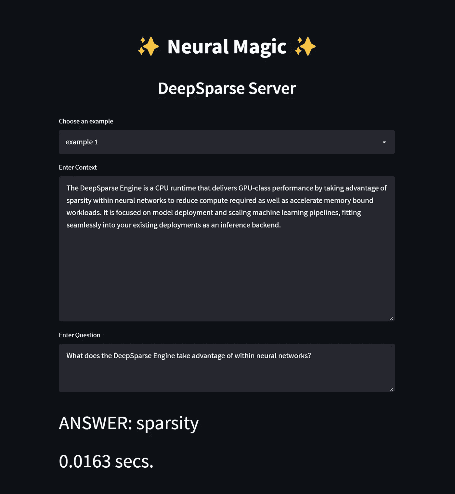
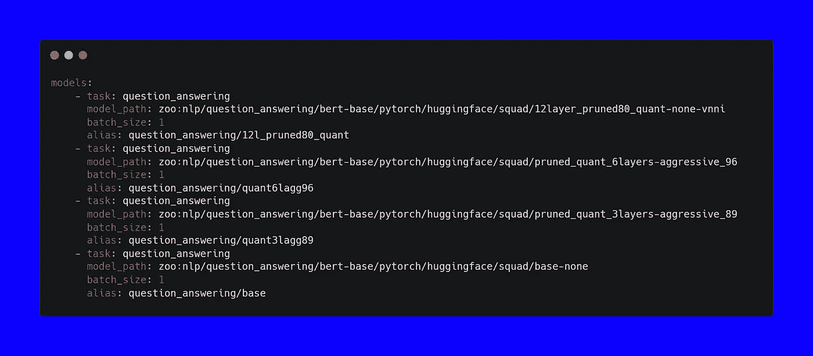
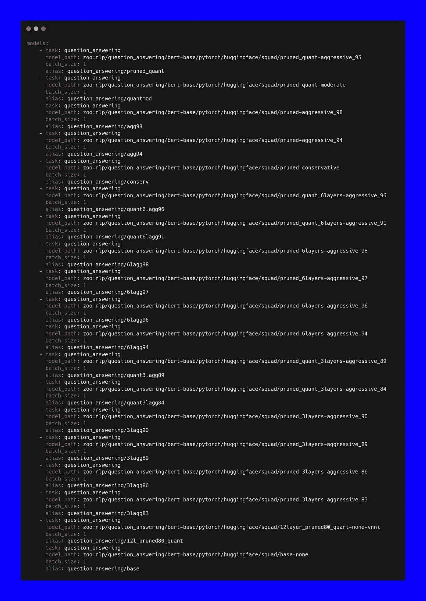
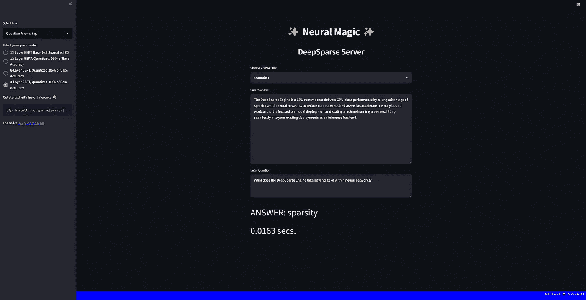

# 稀疏变形金刚|演示

> 原文：<https://pub.towardsai.net/sparse-transformers-a-demo-58b6b1ebf3e4?source=collection_archive---------2----------------------->


在 [Unsplash](https://unsplash.com?utm_source=medium&utm_medium=referral) 上由 [Rishabh Pandoh](https://unsplash.com/@_rishabhpandoh_?utm_source=medium&utm_medium=referral) 拍摄的照片

## 稀疏情况下 BERT 能走多快？

# 这里有个小秘密:

如果你想分析 19 个稀疏 BERT 模型执行推理的速度，你只需要一个 YAML 文件和 16GB 的内存就可以知道。剧透警告:

…它们在 CPU 上运行。

…而且它们超级快！



来自 Neural Magic 的[**DeepSparse**](https://github.com/neuralmagic/deepsparse)**repo 的最新功能就是 deep sparse 服务器！本文的目的不仅是展示为多达 19 个稀疏 BERT 模型提供服务的无缝性，还展示稀疏性对模型性能的影响。作为一点背景，稀疏化是采用经过训练的深度学习模型并从过度参数化的网络中移除冗余信息的过程，从而产生更快、更小的模型。对于这个演示，我们将使用各种 BERT 模型并加载它们进行推理，以显示相对于模型稀疏化的准确性和速度之间的权衡。**

**DeepSparse 服务器建立在我们的 DeepSparse 引擎和流行的 FastAPI web 框架之上，允许任何人以 GPU 级的速度在生产中部署稀疏模型，但在 CPU 上！借助 DeepSparse 引擎，我们可以集成到流行的深度学习库(例如，Hugging Face、Ultralytics)中，从而允许您使用 ONNX 部署稀疏模型。**

**如前所述，在生产中运行模型所需的所有配置只需要一个 YAML 文件和少量内存(由于稀疏性)。为了快速开始为四个经过问答任务训练的 BERT 模型提供服务，下面是配置 YAML 文件的样子:**

****

**config.yaml**

**如果您想变大并加载所有 19 个神经魔术稀疏 BERT 模型:这是配置文件看起来像什么👀：**

****

**为了便于使用，我们在 Streamlit 上构建了一个演示，任何人都可以在 NLP 中演示问答任务的服务器和模型。为了同时测试 19 个模型，该应用程序在谷歌云平台的虚拟机上进行测试。**

**为了给我在测试中使用的计算提供一些基础，下面是一些细节:**

***请记住，在本文描述的相同计算限制下，裸机实际上会执行得更快。然而，由于这些模型已经非常快了，我很乐意通过虚拟化来展示它们的速度。***

**我们不仅强烈建议您在一台虚拟机上运行相同的测试来进行性能基准测试，而且这样您就有了将所有 19 个 BERTs 加载到内存中所需的 RAM，否则您会得到这个👇：**

**伯父**

**如果您喜欢在本地机器上快速启动，而不用担心内存不足的问题，那么您应该尝试只将一些模型加载到内存中。下面的代码将向你展示如何用 4 个模型做到这一点(尽管大多数稀疏模型都是超轻的，你可以随意添加更多)。**

# **开始使用 SparseServer。用户界面**

**我们将我们的应用程序分成单独的服务器和客户端目录。服务器目录包含用于加载模型的 YAML 文件，客户端包含 Streamlit 应用程序的逻辑:**

```
~sparseserver-ui/
    |__client/
       |__app.py
       |__pipelineclient.py
       |__samples.py
       |__settings.py     
    |__server/
       |__big-config.yaml
       |__config.yaml
    |__requirements.txt
    |__README.md
```

## **1.克隆深度稀疏存储库:**

```
>>> git clone [https://github.com/neuralmagic/deepsparse.git](https://github.com/neuralmagic/deepsparse.git)
```

## **2.安装 DeepSparse 服务器并简化:**

```
>>> cd deepsparse/examples/sparseserver-ui>>> pip install -r requirements.txt
```

**在我们运行服务器之前，您可以在我们的启动 CLI 命令中配置`host`和`port`参数。如果您选择使用默认设置，它将在`localhost`和端口`5543`上运行服务器。有关 CLI 参数的更多信息，请运行:**

```
>>> deepsparse.server --help
```

## **3.运行 DeepSparse 服务器:**

**好吧！是时候为`config.yaml`中定义的所有模型提供服务了。这个 YAML 文件将从 Neural Magic 的 [SparseZoo](https://sparsezoo.neuralmagic.com/?domain=nlp&sub_domain=question_answering&page=1) 🦾.下载四个模型**

```
>>> deepsparse.server --config_file server/config.yaml
```

**下载完模型并且您的服务器启动并运行后，打开第二个终端来测试客户端。**

**⚠️ *如果您在第一次运行服务器时更改了* `*host*` *和* `*port*` *配置，请同时调整* `*pipelineclient.py*` *模块中的这些变量。***

## **4.运行 Streamlit 客户端:**

```
>>> streamlit run client/app.py --browser.serverAddress="localhost"
```

**就是这样！点击终端中的 URL，您就可以开始与演示交互了。您可以从列表中选择示例，也可以添加自己的上下文和问题。**

****

**在未来，我们将扩展 NLP 任务的数量，不仅仅是回答问题，这样你就可以在稀疏性方面获得更大的性能。**

**完整代码:查看 [SparseServer。用户界面](https://github.com/neuralmagic/deepsparse/tree/main/examples/sparseserver-ui) …**

**…别忘了给深度稀疏回购一个 GitHub⭐！**

*   **瑞奇科斯塔| [神经魔法](https://neuralmagic.com/) 🧙**