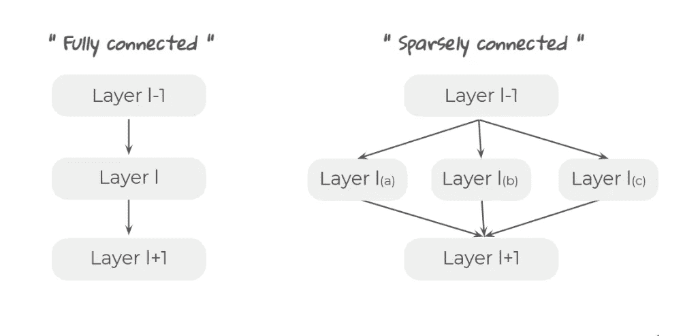
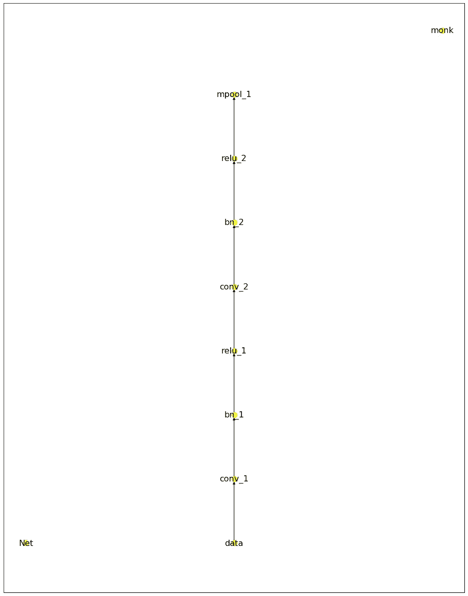
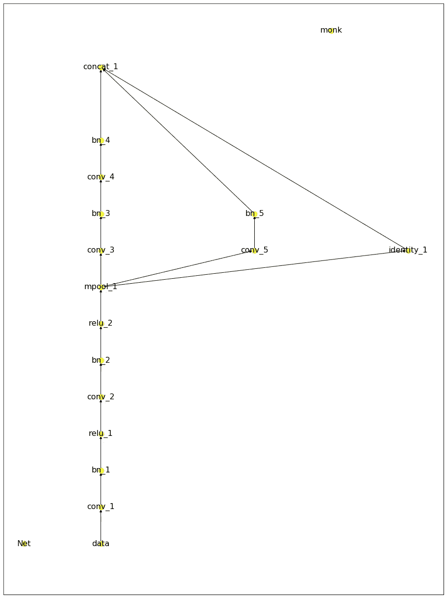
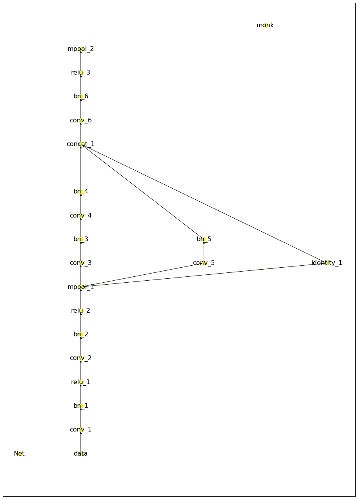
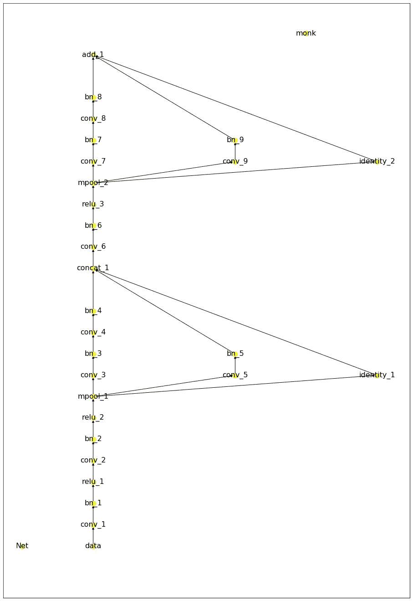
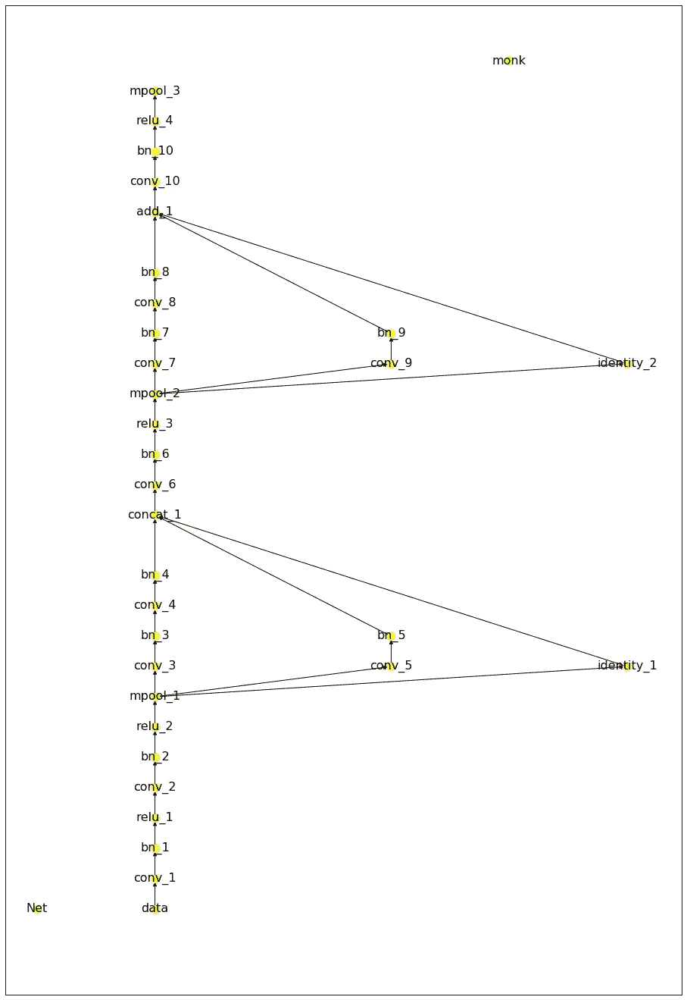
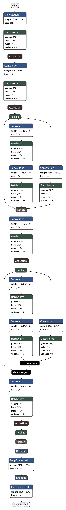

# 稀疏连接的定制模型——最简单的方法

> 原文：<https://pub.towardsai.net/sparsely-connected-custom-model-the-simplest-way-a7541f7db02e?source=collection_archive---------3----------------------->

## 使用 Monk，低代码深度学习工具和计算机视觉的统一包装器，使计算机视觉变得简单。

**GoogLeNet** 架构有稀疏连接的层，而不是密集连接的层。



参考: [TDS](https://towardsdatascience.com/deep-dive-into-the-computer-vision-world-f35cd7349e16)

你有没有尝试过构建一个稀疏连接的定制模型？如果是的话，我会告诉你最简单的方法。如果没有，那你就来对地方了。

# 目录

1.  **安装**
2.  **加载数据**
3.  **创建和调试网络**
4.  **列车**

# **安装**

安装 Monk，一个低代码深度学习工具，也是计算机视觉的统一包装器。

```
git clone [https://github.com/Tessellate-Imaging/monk_v1.git](https://github.com/Tessellate-Imaging/monk_v1.git)#Select the requirements file as per OS and CUDA versioncd monk_v1/installation/Linux && pip install -r requirements_cu9.txt
```

# **加载数据**

这里我们使用的是[斯坦福狗分类数据集](https://www.kaggle.com/jessicali9530/stanford-dogs-dataset)。

```
! wget --load-cookies /tmp/cookies.txt "https://docs.google.com/uc?export=download&confirm=$(wget --save-cookies /tmp/cookies.txt --keep-session-cookies --no-check-certificate 'https://docs.google.com/uc?export=download&id=1b4tC_Pl1O80of7U-PJ7VExmszzSX3ZEM' -O- | sed -rn 's/.*confirm=([0-9A-Za-z_]+).*/**\1\n**/p')&id=1b4tC_Pl1O80of7U-PJ7VExmszzSX3ZEM" -O dogs-species-dataset.zip && rm -rf /tmp/cookies.txt
```

# **创建并调试网络**

**调试定制模型**

```
gtf.debug_custom_model_design(network);
```



从下往上看

在这里，我们将创建一个有三个分支的子网，并将其添加到基础网络中。

**调试定制模型**

```
gtf.debug_custom_model_design(network);
```



从下往上看

**调试**

```
gtf.debug_custom_model_design(network);
```



从下往上看

我们将添加另一个有三个分支的子网，并添加到基本网络中。

**调试定制模型**

```
gtf.debug_custom_model_design(network);
```



从下往上看

**调试定制模型**

```
gtf.debug_custom_model_design(network);
```



从下往上看

# 用 Netron 可视化

让我们用 Netron 将模型可视化。



# 火车

*设置时期、优化器、损耗和学习率调度程序。*

你可以在 [Github](https://github.com/Tessellate-Imaging/monk_v1/blob/master/study_roadmaps/1_getting_started_roadmap/9_custom_network_builder/2)%20Create%20a%20branched%20custom%20network%20while%20debugging%20it.ipynb) 上找到完整的 jupyter 笔记本。

有问题可以联系[阿布舍克](https://www.linkedin.com/in/abhishek-kumar-annamraju/)和[阿卡什](https://www.linkedin.com/in/akashdeepsingh01/)。请随意联系他们。

我对计算机视觉和深度学习充满热情。我是 [Monk](https://github.com/Tessellate-Imaging/Monk_Object_Detection) 库的开源贡献者。

你也可以在以下网址看到我的其他作品:

[](https://medium.com/@akulahemanth) [## 阿库拉·赫曼思·库马尔培养基

### 阅读阿库拉·赫曼思·库马尔在媒介上的作品。计算机视觉爱好者。每天，阿库拉·赫曼思·库马尔和…

medium.com](https://medium.com/@akulahemanth) 

[FOODISM360](https://unsplash.com/@foodism360?utm_source=unsplash&utm_medium=referral&utm_content=creditCopyText) 在 [Unsplash](https://unsplash.com/?utm_source=unsplash&utm_medium=referral&utm_content=creditCopyText) 上拍摄的照片