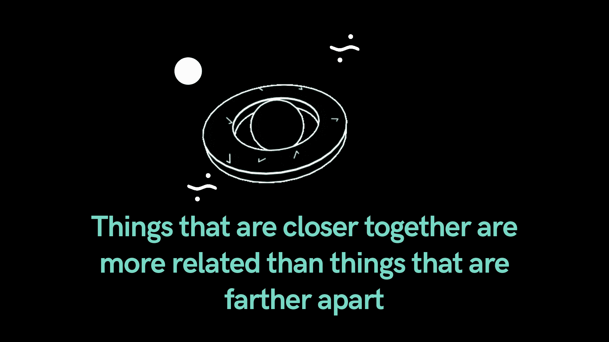
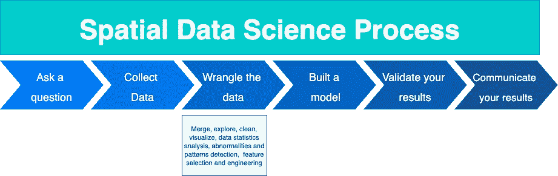

# 简化的空间数据科学

> 原文：<https://pub.towardsai.net/spatial-data-science-simplified-7c5dbe843f15?source=collection_archive---------0----------------------->

## 用于执行它的工具以及在哪里学习它

被困在付费墙后面？ [*阅读此处与我的朋友链接*](https://medium.com/towards-artificial-intelligence/spatial-data-science-simplified-7c5dbe843f15?source=friends_link&sk=399d37c11abd06cc0d1d45f6b8bc53a6)

几十年来，来自各种领域的地理学家、地质学家、研究人员和分析人员一直将位置作为他们分析的一个重要部分。但现在我们正在经历越来越多的具有其他非传统空间数据背景(如市场营销)的数据科学家如何开始理解如何在建立一个伟大的模型时使用位置并集成它。

空间数据科学的一个重要区别在于，数据科学家不只是使用传统的建模方法，并将它们应用于恰好是空间的数据。现在，我们正在使用将空间特征或位置的一些元素直接整合到算法数学中的技术。

除了传统的位置或坐标之外，形状、面积、大小、方向和邻近度在模型中也起着至关重要的作用。

# 数据科学和空间数据科学有什么区别？

一个简单直接的答案是:**没有区别。**

空间数据科学是关于使用统计学、机器学习、基于空间的算法和深度学习以及一些更传统的技术的混合，其目标是:将数据转化为有用的、可操作的信息。

几周前，我参加了由 ArcGIS 主办的为期 3 天的会议。在一次统计学研讨会上，我重温了地理第一定律:**距离较近的事物比距离较远的事物更相关。**

这听起来可能很简单，但对于空间数据科学和数据行为的预测来说，这是必不可少的。

与常规数据科学流程一样，空间数据科学包含以下步骤:

每个数据科学家都知道，所有这些过程都不是线性的。这是一个反复的过程。你尝试，你失败，你再试一次。你可以比较不同的算法和方法，看看哪一个可以回答你的问题。你可能会回到之前的步骤，在那里你要改变或改进一些事情。这都是过程的一部分。

# 您使用什么工具来执行空间数据科学？

空间数据科学可以用 Python、R 或任何能完成工作的工具和语言来完成。

[Esri](https://www.esri.com/) 开发了 [ArcGIS](https://www.arcgis.com/) 。执行空间数据科学的引人注目的平台和软件包。他们拥有广泛的工具，从不需要类似代码的工具，到集成到 Jupyter 笔记本和 Python 以实现深入分析和灵活性的工具。

# 总结一下:

空间数据科学，作为“常规”数据科学，从根本上讲是关于一件事:**解决问题。**

如果你有兴趣了解更多关于空间数据科学的知识，我强烈推荐 Esri 的新 MOOC“空间数据科学:分析的新前沿”我个人服用。MOOC 是全新的，它深入研究了空间数据科学，更新了基本概念，最棒的是:它是免费的。