# 声音和声学模式诊断 COVID[第 1 部分]

> 原文：<https://pub.towardsai.net/speech-and-acoustic-patterns-to-diagnose-covid-part-1-80f5d36be792?source=collection_archive---------1----------------------->


[*将*](https://medium.com/@himanp/sound-and-acoustic-patterns-to-diagnose-covid-part-2-85f202d60dcb) 链接到本案例研究的第 2 部分

[将](https://medium.com/@himanp/sound-and-acoustic-patterns-to-diagnose-covid-part-3-624273949804)链接到本案例研究的第 3 部分

# 理解问题和背景

在这个案例研究中，我们将尝试建立一个模型，可以使用声音和音频波诊断 COVID。这将需要我们设计和构建定制的深度学习模型，可以检测语音/音频的微小变化，以检测出有问题的医疗状况。

任何疾病的早期诊断都是成功治疗的关键。未确诊的疾病每年耗费数百万人的生命和积蓄。如果我们能够找到一种经济、简单的方法来提醒用户他们可能患有的疾病，这将有助于他们尽早寻求医疗咨询，并有效地解决问题。今天，我们可以获得大量数据、大量计算资源，以及深度学习方法的足够进步，可以帮助我们解决这些问题。

有一些研究表明，生理变化和生物化学的变化会影响人体发出的声音。在人类历史上，身体的噪音长期用于疾病的诊断。医学研究文献建立了这种联系，从而成为开发基于语音、声音和声学数据的 ML 解决方案的基础。

高精度的 ML 模型将是传统的基于化学的测试的廉价和快速的替代方案，并且可以大规模生产。我们的目标应该是建立一个由技术驱动的解决方案和当前流行的检测方法组成的生态系统，以有效应对未来的流行病，并改善人们可以获得的医疗服务。

# **数据集:**

理想情况下，对于疾病检测，我们希望用户在他们的智能设备中以以下形式记录声音——咳嗽、朗读一段话以记录语音、定向呼吸声。这可以通过指导主动完成，也可以通过手机或智能助理等智能设备被动记录。我们的数据集将包括咳嗽声，用户可以记录和测试。

***咳嗽声* :**

核心气道——支气管和气管——通过一种称为咳嗽的强烈反射机制清除分泌或吸入的颗粒。在正常情况下，反射遵循从吸气到呼气的标准过程。它通常由物理和化学输入引发。胸腔压力随着声音和液体的爆炸而释放。这种压力排出导致流体运动、空气湍流和质量振动，从而产生独特的声音。这种声音的频率和带宽取决于许多因素，例如气道路径的直径、密度和排出空气的强度。声音由 3 个时间阶段组成——爆发、中间和发声。频谱在 500 赫兹到 3.8 千赫兹之间。对于使用麦克风记录咳嗽声来说，这已经足够了——这是我们案例研究的一个关键观察点。像 COVID 和肺炎这样的肺部疾病改变了呼吸道的物理结构，使我们有可能利用咳嗽声来识别它们。围绕使用咳嗽声准确识别百日咳、COPD(慢性阻塞性肺病)、结核病、哮喘和肺炎等疾病，已经有很多积极的研究。

**现实世界的挑战和限制**

数据不容易获得。人们必须花时间提供录音和元数据，以创建一个足够大的数据库。此外，为了让我们的解决方案在现实世界中发挥作用，该模型也应该可以在少量数据上进行训练，这样，在出现新的疫情病毒或新的病毒株时，我们可以快速创建和部署解决方案来解决问题。

我们必须确保为我们的产品部署的 web 应用程序应该能够在合理的时间内处理录音。

此外，能够向使用我们的 web 应用程序的用户提供准确的结果是绝对关键的。假阴性将很快摧毁解决方案的可信度。

在本案例研究中，我们将使用一个小型数据集。

数据集可从以下网址下载:

https://data.mendeley.com/datasets/ww5dfy53cw/1

```
#class label distributionx.plot.bar()
```

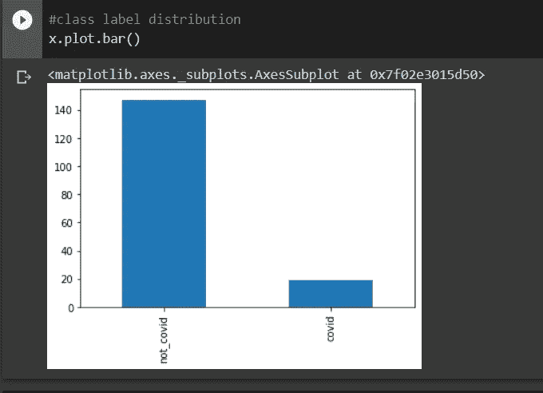

数据点的分类分布

```
#visualise the wave fileimport librosa as lb
import librosa.displaya,b = lb.load('/gdrive/MyDrive/Kaggle/trial_covid/--U7joUcTCo_ 0.000_ 10.000.wav', mono=True)librosa.display.waveplot(y=a, sr=b, max_points=100000.0, color='r', alpha=0.5)
```

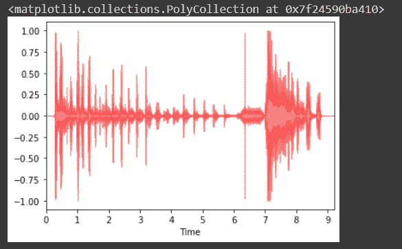

想象波形

# EDA、特征提取和对特征的理解

特征的提取和分析对于发现数据点之间的关系是很重要的。音频不能直接提供给模型，因此提取特征是非常重要的。它以可解释的形式解释嵌入在音频信号中的大部分信息。分类、回归或聚类任务需要从音频中提取特征。时间、频率和振幅是声音信号的三个重要维度。

一个波完成一个完整周期所需的时间称为它的周期。信号在一秒钟内循环的次数就是频率。频率的倒数是时间周期。频率的度量单位是赫兹。自然界中的许多声音是复杂的，由许多频率合成的，它们可以表示为这些不同频率的叠加。机器学习需要对声音进行矢量化，这是通过测量不同时间声音的振幅来实现的。这种测量称为样本，每秒采集的样本数就是采样率。

**声谱图:**

频谱图是音频的可视化，是一种以图像形式查看音频波的方法。嵌入音频的频率形成频谱。频谱是在频域中观察声音的一种方式。声谱图有这些颜色，它们代表了频谱。每种颜色代表频率的强度或振幅。因此，它以色带的形式代表了一段时间内音频波的频谱。较浅的颜色代表高浓度的频率，而较深的颜色意味着低浓度或无浓度。

通过将音频分成时间窗口并在每个窗口上进行傅立叶变换来创建频谱图。每个窗口都转换为分贝单位，以获得更好的结果。

有趣的是，声音是以一系列数字的形式存储在内存中的，这些数字是振幅。如果我们在一秒钟内采集 100 个样本，那么 1 秒钟的音频将被存储为一系列 100 个数字。

```
#Plot wave and its spectrogramy,sr = librosa.load('trial_covid/--U7joUcTCo_ 0.000_ 10.000.wav', mono=True)librosa.display.waveplot(y=y, sr=sr, max_points=100000.0, color='b', alpha=0.5)print('\n\n')#short time fourier transform of y, taking absolute values.y_t = np.abs(librosa.stft(y))#conversion to deciblesy_t_d = librosa.amplitude_to_db(y_t, ref=np.max)#plottingfigure, ax = plt.subplots(figsize=(6,5))
spectrogram = librosa.display.specshow(y_t_d, sr=sr, y_axis='linear', x_axis='time', ax=ax )ax.set(title='spectrogram')figure.colorbar(spectrogram)
```

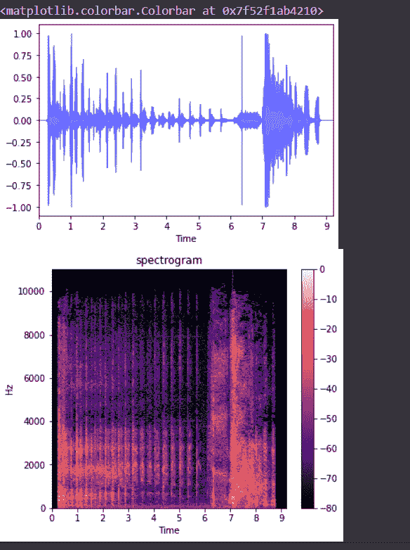

来自数据集的咳嗽声的声谱图

**过零率:**

这表示信号前进时符号的变化率。这个特征记录了波从正变到负的次数。这在语音识别中被大量使用。对于打击乐来说，过零率更高，例如开枪、演奏乐器等。

```
#Visualizing zero crossing#pad false means, y[0] will not be considered as a zero crossingy, sr = librosa.load('trial_covid/--U7joUcTCo_ 0.000_ 10.000.wav', mono=True)#zooming into the wave
plt.plot(y[8000:8015])
zero_cross_count = librosa.zero_crossings(y[8000:8015], pad=False)
```

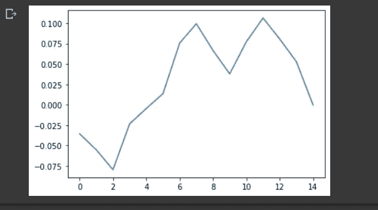

可视化零交叉

在这部分波中有两个交叉点。

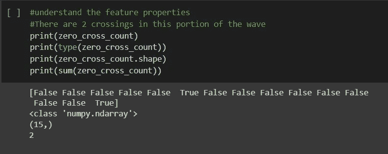

**光谱质心:**

频谱质心代表音频信号的质量中心，它是使用声音中所有频率的加权平均值计算的。如果声音信号是均匀的，并且从开始到结束具有相同的频率分布，则质心将在中间，然而，如果开始处的频率比结束处的频率高，则质心将向左移动。

质心在开始时上升，因为那里的振幅低，给高频部分一个支配的机会。

```
# Spectral centroid
# t frames of the spectrogram will give t centroids.import sklearn #need for normalizationspec_cent = librosa.feature.spectral_centroid(y,sr=sr)[0]#frames for visualizationl = range(len(spec_cent))frames = librosa.frames_to_time(l)spec_cent_nor = sklearn.preprocessing.minmax_scale(spec_cent, axis=0)librosa.display.waveplot(y,sr=sr,alpha=0.5)plt.plot(frames, spec_cent_nor, color='b')
```

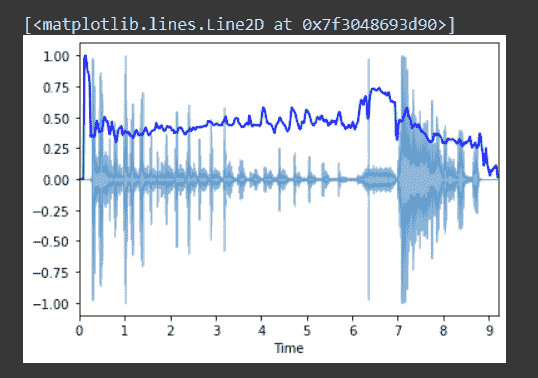

波浪图上的光谱质心图

**频谱衰减:**

频谱滚降是总频谱能量低于某一百分比的频率。这是可配置的。例如，在频率“F”处，90%的光谱能量位于 F 以下。

```
#spectral rolloff - similar to centroid in implementation.spec_rolloff = librosa.feature.spectral_rolloff(y,sr=sr)[0]spec_rolloff_nor = sklearn.preprocessing.minmax_scale(spec_rolloff, axis=0)
```

**梅尔光谱图:**

这些是基于梅尔标度而不是赫兹标度的光谱图。mel 标度使用对数变换频率。转换如下所示:

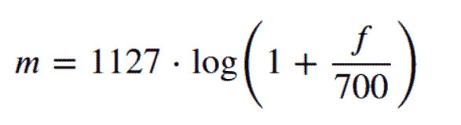

对于上面使用的自然对数，系数是 1127。如果使用基数为 10 的对数，系数将会改变。随着频率的增加，mel 刻度从赫兹刻度逐渐变小。换句话说，对于以赫兹为单位的较高频率，mel 值将会非常缓慢地变化，类似于在 s 形曲线中发生的情况。这类似于人类对声音的感知。对于人类来说，区分较低频率的声音更容易，但区分较高频率的声音要困难得多。例如，对于人类来说，区分 150 赫兹的声音和 250 赫兹的声音比区分 1100 赫兹和 1200 赫兹的声音更容易。即使两组声音相差相同，我们对它们的感知也不同。这就是 mel scale 在机器学习中有用的原因，因为它在声音方面更接近人类的感知。mel 标度是赫兹标度的非线性变换，它将赫兹标度划分为多个频段，然后将它们变换为 Mel 标度中的相应频段。

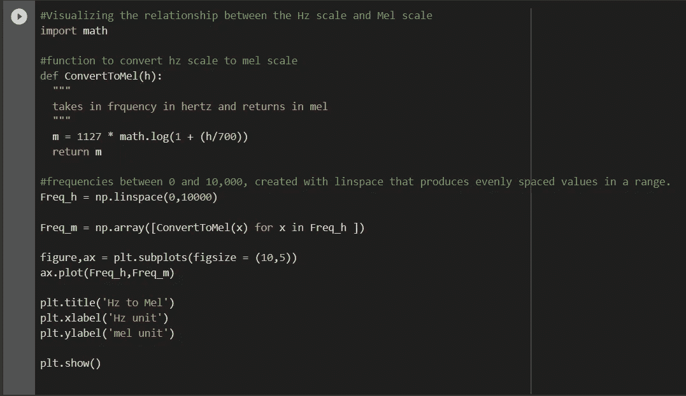

可视化 mel 和 hz 标度之间关系的代码

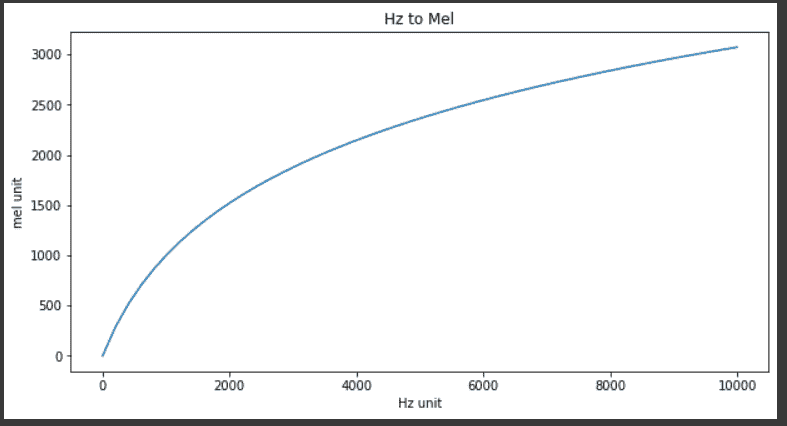

hz 与 mel 的关系

从上图中可以看出，随着频率的增加，频率之间的距离在 mel 标度上减小，这很像人类对声音的感知。较低的频率在 mel 中具有较高的间隙，而较高的频率具有较小的间隙，例如在 0 和 2000 之间，以及 6000 到 8000 之间。

mel 光谱图是在 Mel 标度上可视化的，与频率标度相反。这是根本的区别。

我们还将振幅转换为分贝，以获得更清晰、更好的输出。

Db = 20 * log10(振幅)

当谈到对声音的感知时，分贝尺度是一个指数尺度。每增加 10 分贝，对响度的感知就增加 10 倍。20 分贝的声音比 10 分贝的声音大十倍。使用 mel 标度表示频率，分贝标度表示能力，我们将声音转换为更接近人类感知，这是深度学习的关键。颜色是用分贝标度表示的，而不是振幅。

```
#create mel spectrograms and conver to decibel scale.y_spec = librosa.amplitude_to_db(librosa.feature.melspectrogram(y))#plot mel spectrogramfigure, ax = plt.subplots(figsize=(10,5))ax.set(title = 'mel spectrogram' )f= librosa.display.specshow(y_spec,ax=ax)plt.colorbar(f)
```

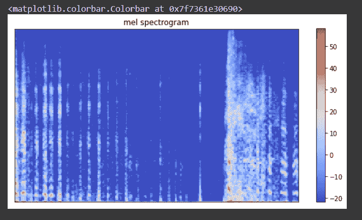

梅尔光谱图

创建频谱图时，最小频率、最大频率、时间窗口长度、频带数量和跳跃长度(每步滑动时间窗口的样本数量)成为超参数。

**Mel 频率倒谱系数(MFCC)**已经被广泛用于处理音频信号，尤其是语音。从而使它成为我们案例研究中的一个候选特征。对 mel 谱图值使用离散余弦变换来生成 MFCCs。系数的数量是一个超参数，并调整到一个问题。MFCCs 被成功地应用于语音识别问题。Libros 库的默认值是 20。MFCC 从声谱图中提取最重要的特征，声谱图定义了人类感知的音频质量。

```
#Visualising Mel frequecy cepstral coeffs#create MFCCy_mfcc = librosa.feature.mfcc(y)#plot MFCCfigure, ax = plt.subplots(figsize=(10,5))ax.set(title = 'MFCCS' )f= librosa.display.specshow(y_mfcc,ax=ax,x_axis='time')plt.colorbar(f)
```

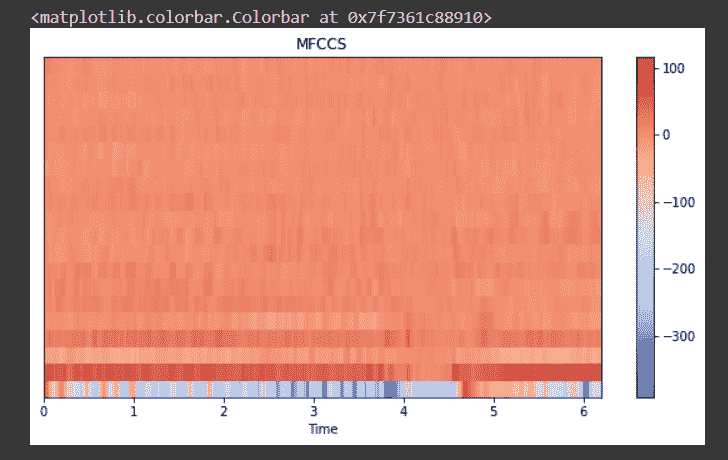

可视化 MFCCs

**色谱图和色度频率:**

音高是声音高度的度量。高音有高音，低音有低音。每种声音属于七个音高等级。

色度过滤器用于创建色谱图。滤波器将录制声音的能量投射到 12 个箱中——音符和按键。热图可以用来显示音高随时间的变化。通过在滤波器和傅立叶变换频谱图之间取点积，声音可以用一组音高来映射。

```
#chroma filter banks# taking 'sr' and 'n_fft' as 22050 and 4096 respectivelychroma_filter_bank = librosa.filters.chroma(22050 , 4096)librosa.display.specshow(chroma_filter_bank)
```


色度过滤器

```
#chroma features of our sound wavey_chroma = librosa.feature.chroma_stft(y, sr=sr)librosa.display.specshow(y_chroma, y_axis='chroma', x_axis='time')
```

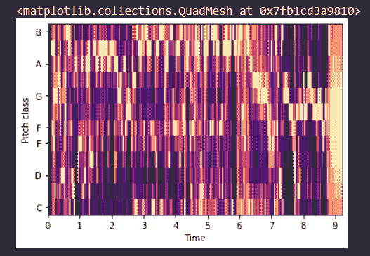

色谱图

**结论:**

在这一部分中，我们看到了问题、数据集，并看到了有助于我们在其上建立机器学习模型的特征。

在下一部分中，我们将提取这些特性，并对它们进行一些 EDA。

**参考文献:**

1.  使用梅尔频率倒谱系数和卷积神经网络对新冠肺炎咳嗽进行高精度分类，使用案例为 Dunne 等人的智能家居设备 [*链接此处*](https://www.researchgate.net/publication/343896485_High_accuracy_classification_of_COVID-19_coughs_using_Mel-frequency_cepstral_coefficients_and_a_Convolutional_Neural_Network_with_a_use_case_for_smart_home_devices)
2.  cos wara-Sharma 等人的用于新冠肺炎诊断的呼吸、咳嗽和声音数据库 [*链接此处*](https://arxiv.org/abs/2005.10548)
3.  新冠肺炎人工智能诊断仅使用 Laguarta 等人的咳嗽录音 [*链接此处*](https://www.researchgate.net/publication/344930557_COVID-19_Artificial_Intelligence_Diagnosis_using_only_Cough_Recordings)