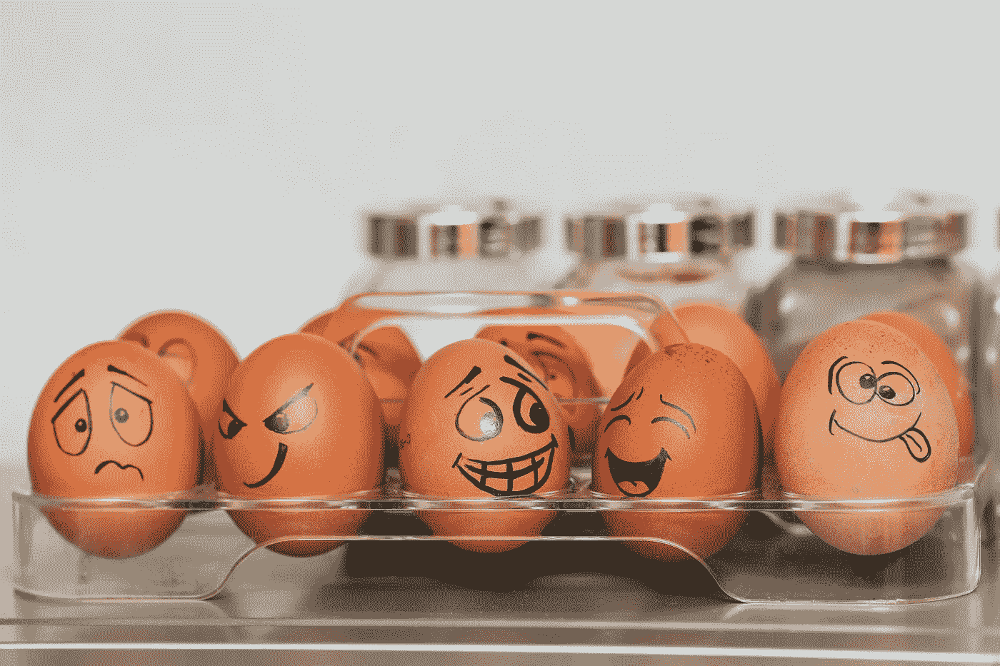
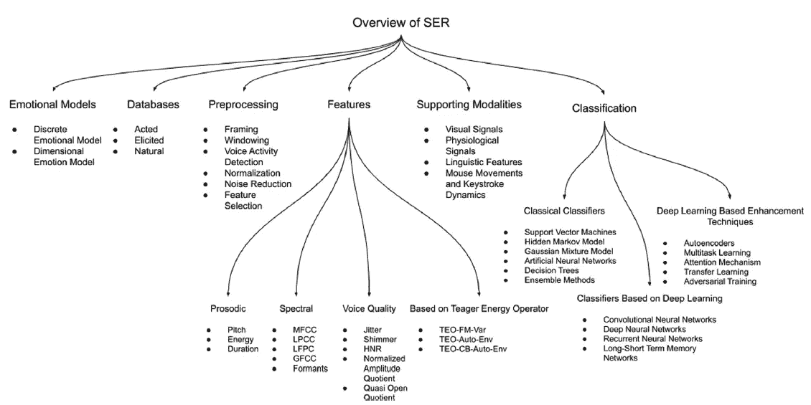
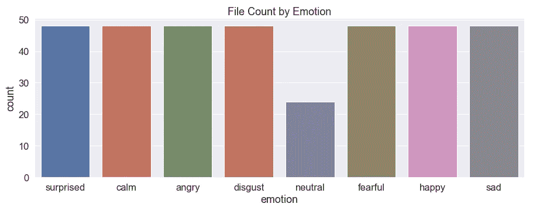
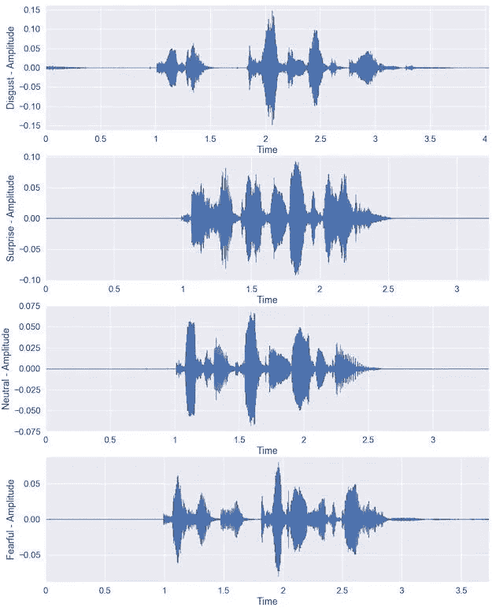
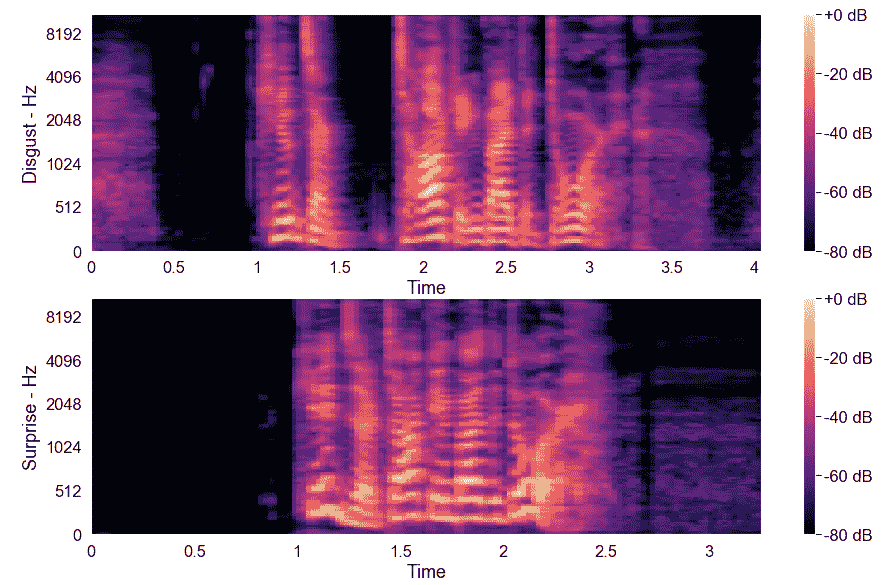
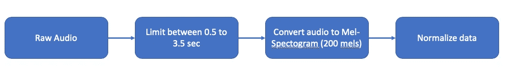
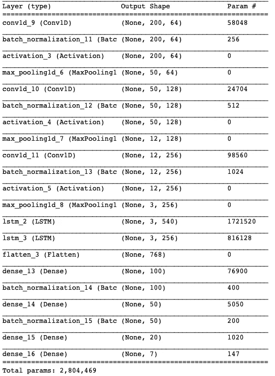
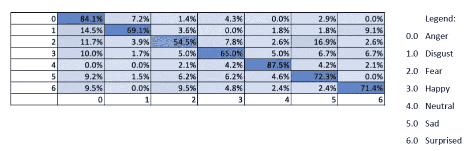

# 基于 CNN 和 LSTMs 的语音情感识别

> 原文：<https://pub.towardsai.net/speech-emotion-recognition-ser-using-cnn-and-lstms-4a5dc4c314fd?source=collection_archive---------1----------------------->

## [深度学习](https://towardsai.net/p/category/machine-learning/deep-learning)，[自然语言处理](https://towardsai.net/p/category/nlp)

## 通过言语表达的情感对人类的行为和推理有着额外的洞察力。



情绪是人类心理的基本组成部分，直接转化为人类的行动。人类的声音是一种能反映这些情绪的神奇工具。通过言语表达的情感对人类的行为和推理有着额外的洞察力。深入研究这些关系，可以帮助我们更好地理解人的动机。因此，情感识别在人机交互中起着重要的作用。

我对这个主题的兴趣促使我创建了一个可以帮助分类人类基本情绪的模型。在这篇文章中，我将分享我是如何做到的。

该模型在来自 Ryerson 情感语音和歌曲视听数据库(RAVDESS)数据集的英语语言数据集上创建。基于最近的研究，Mel-Spectrogram 有助于从音频数据中提取重要的特征，这些特征被用于 CNN+LSTM 模型。

我把我所有的代码都保存在了 GitHub、【https://github.com/msaleem18/Speech_Emotion_Recognition 上

# 资料组

对于我的模型，我使用了以下数据集:

[](https://zenodo.org/record/1188976#.Xo0dCFNKjOS) [## 瑞尔森情感语音和歌曲视听数据库

### 引用 ravdes ravdes 是在知识共享署名许可下发布的，所以如果…

zenodo.org](https://zenodo.org/record/1188976#.Xo0dCFNKjOS) 

为了在 Python 中读取和处理音频数据，我使用了 Librosa 库；最终数据存储为 NumPy 数组。

```
**import** **numpy** **as** **np**
**import** **pandas** **as** **pd**
**import** **librosa** **as** **lib**
**import** **librosa.display**path = "/Users/saad/Saad/Education/Ryerson/MRP/Dataset/Audio_Speech_Actors_01-24/ALL"*#READ ENGLISH FILES*

files = []
modality =[]
vocal =[]
emotion =[]
intensity =[]
statement =[]
repetition =[]
actor =[]
gender = []
time = []
audio_data = []
sr = []

max_row = 0
max_col = 0
min_row = 1000
min_col = 1000

n_fft = 2048
hop_length = 512
n_mels = 200

**for** file_name **in** file_list:
    file_path = path+'/'+file_name
    mod, voc, emo, inten, state, repe, act = file_name.split('-')
    act = act.split('.')[0]

    **if** emo != '02':
        *#store metadata*
        files.append(file_name)
        modality.append(mod)
        vocal.append(voc)
        *#emotion.append(emo)*
        intensity.append(inten)
        statement.append(state)
        repetition.append(repe)
        actor.append(act)

        **if** (emo == '01'):
            emotion.append('neutral')
        **elif** (emo == '03'):
            emotion.append('happy')
        **elif** (emo == '04'):
            emotion.append('sad')
        **elif** (emo == '05'):
            emotion.append('angry')
        **elif** (emo == '06'):
            emotion.append('fearful')
        **elif** (emo == '07'):
            emotion.append('disgust')
        **elif** (emo == '08'):
            emotion.append('surprised')

        **if** (int(act) % 2 == 0):
            gender.append(1) *#female*
        **else**:
            gender.append(2) *#male*

        audio, sfreq = lib.load(file_path, sr=44100,offset=0.5,duration = 3.5)
        time_line = np.arange(0,len(audio)) / sfreq
        time.append(time_line)
        audio_data.append(audio)
        sr.append(sfreq)

        *#mfccs = lib.feature.mfcc(y=audio,sr=sfreq,n_mfcc=25)*
        mfccs = librosa.feature.mfcc(y=audio, sr=sfreq, n_mfcc=13)
        mel_spec = lib.feature.melspectrogram(audio, sr=sfreq, n_fft=n_fft, hop_length=hop_length, n_mels=n_mels)
        S_DB = lib.power_to_db(mel_spec, ref=np.max)

        **if** (S_DB.shape[0] > max_row):
            max_row = S_DB.shape[0]

        **if** (S_DB.shape[1] > max_col):
            max_col = S_DB.shape[1]

        **if** (S_DB.shape[0] < min_row):
            min_row = S_DB.shape[0]

        **if** (S_DB.shape[1] < min_col):
            min_col = S_DB.shape[1]

print("DONE !")
```

# SER 的研究现状

语音情感识别(SER)已经存在了二十多年，尽管它有许多应用，但 SER 仍然是一项具有挑战性的任务，主要因为情感是主观的。对于我们如何对不同的人类情感进行分类，几乎没有共识。akay 和团队在提供 SER 系统概述方面做得非常出色，如图 1-SER 系统概述所示。



阿卡伊，文学学士(2020 年)

# 探索性数据分析

该数据集包含 7356 个文件，其中 24 个专业演员(12 个女性，12 个男性)正在用中性北美口音发出两个词汇匹配的语句。语音包括平静、快乐、悲伤、愤怒、恐惧、惊讶和厌恶的表情，歌曲包含平静、快乐、悲伤、愤怒和恐惧的情绪。

由于数据集包含音频文件，大多数探索性数据分析都是围绕波形和梅尔频率倒谱系数(MFCC)进行的。

有 24 个演员，每个人记录每一种情绪，除了中性情绪，有两种不同的声音强度，正常和强烈。所以除了中性情绪，我们每个情绪有 48 个文件。



情感的文件计数

我们可以用多种方法来分析音频数据，我从分析每种情绪的波形开始。我随机选择了一个正常强度的男演员来研究每种情绪的波形会有什么不同。



基本情绪的波形

有趣的是，每个波形之间都有细微的差别；一些在振幅上变化，一些在频率(1 /时间)上变化，一些在波的整体形状上变化。

理解人类发出的声音被包括舌头和牙齿在内的声道的形状过滤是很重要的。如果我们能准确地确定这种形状，这将会给我们一个正在产生的音素的准确表示。声道的形状在短时功率谱的包络中表现出来，而 MFCCs 的工作就是精确地表示这个包络。MFCC 特征表示语音信号的短时功率谱。



比较厌恶和惊讶情绪

以下代码用于创建上述图形:

```
*#ANALYZING WAVEFORM*
file_path0 = path+'/'+files[0]

X0, sample_rate0 = librosa.load(file_path0)

mfcc0 = librosa.feature.mfcc(y=X0, sr=sample_rate0, n_mfcc=13)

*#n_fft = 2048*
*#hop_length = 512*
*#n_mels = 128*

S0 = librosa.feature.melspectrogram(X0, sr=sample_rate0, n_fft=n_fft, hop_length=hop_length, n_mels=n_mels)
S_DB0 = librosa.power_to_db(S0, ref=np.max)

*# audio wave*
plt.figure(figsize=(15, 20))

plt.subplot(4,1,1)
*#plt.legend(loc="upper right")*
plt.ylabel('Disgust - Amplitude')
librosa.display.waveplot(X0, sr=sample_rate0)
*#plt.title('Audio sampled at 44100 hrz')*

plt.subplot(4,1,2)
*#plt.legend(loc="upper right")*
librosa.display.specshow(mfcc0, x_axis='time')
plt.colorbar()
plt.ylabel('Disgust - MFCC')

plt.subplot(4,1,3)
librosa.display.specshow(S_DB0, sr=sample_rate0, hop_length=hop_length, x_axis='time', y_axis='mel');
plt.colorbar(format='**%+2.0f** dB');
plt.ylabel('Disgust - Hz')
```

# 预处理

预处理是在 SER 系统中收集用于训练分类器的数据之后的第一步。最近的大多数研究都使用梅尔频率倒谱系数(MFCC)来提取情感特征，然后将其输入分类模型。MFCC 特征表示语音信号的短期功率谱，有助于更好地提取重要的音频特征。

我利用 Python 的 Librosa 库，使用 mel-spectogram 函数来提取 mel 值。提取 Mel 值后，我对所有值进行了归一化处理，以消除任何可能会使模型产生偏差的极端异常值



预处理管道粗流程

## 列车测试分离

数据集被随机分成两组，一组用 80%的数据进行训练，另一组用 20%的数据进行测试。

## 数据扩充

增加数据集的常见做法是使用数据扩充。从现有的训练数据中人工创建新的训练数据。这是通过将特定于领域的技术应用于来自训练数据的示例来实现的，这些示例创建新的不同的训练示例。此过程有助于更好地训练模型，因为它能够更好地概化数据集。

在这个项目中，我使用了两种音频数据增强技术:

1.  添加噪声:使用 numpy，我将在音频波形中添加随机噪声
2.  修改音高:使用 Librosa 库来修改随机音频文件的音高

以下代码用于预处理音频文件的管道:

```
*# EXTRACT ONLY AUDIO DATA AND LABELS FROM DATAFRAME*

audio_list = []
audio_list_fr = []

**for** file_name **in** file_list:
    file_path = path+'/'+file_name
    mod, voc, emo, inten, state, repe, act = file_name.split('-')
    act = act.split('.')[0]

    **if** emo != '02':     
        *#print(result.shape)*
        *#X, sample_rate = librosa.load(path,duration=2.5,sr=44100,offset=0.5)*
        X, sample_rate = lib.load(file_path,sr=44100,offset=0.5,duration = 3.5)
        audio_list.append(X)

**for** file_name **in** file_list_fr:
    file_path = path_fr+'/'+file_name

    **if** file_name != '.DS_Store':
        *#print(result.shape)*
        *#X, sample_rate = librosa.load(path,duration=2.5,sr=44100,offset=0.5)*
        X, sample_rate = lib.load(file_path,sr=44100,offset=0.5,duration = 3.5)
        audio_list_fr.append(X)

only_audio_array = np.asarray(audio_list)
only_audio_array_fr = np.asarray(audio_list_fr)

*#df_features = df_final.drop(['file_name', 'emotion','intensity','actor'], axis=1)*
df_label = df_files[['emotion']].copy()
df_label_fr = df_files_fr[['emotion']].copy()

le = preprocessing.LabelEncoder()
df_label.emotion = le.fit_transform(df_label.emotion)
df_label_fr.emotion = le.transform(df_label_fr.emotion)

print(only_audio_array.shape)
le.classes_*# Split between train and test AND PERFORM DATA AUGMENTATION -----------------------------------*

random_num = 42
X_train, X_test, y_train, y_test = train_test_split((only_audio_array)
                                                    , df_label
                                                    , test_size=0.2
                                                    , shuffle=**True**
                                                    , random_state=random_num)
print("FIRST ARRAY SHAPES")
print(X_train.shape)
print(X_test.shape)
print(y_train.shape)
print(y_test.shape)

enc = OneHotEncoder()
label_onehot_train = enc.fit_transform(y_train).toarray()
label_onehot_test = enc.fit_transform(y_test).toarray()
print(enc.categories_)

*#AUGMENT DATA WITH NOISE -----------------------------------*
**def** manipulate_noise(data, noise_factor):
    noise = np.random.randn(len(data))
    augmented_data = data + noise_factor * noise
    *# Cast back to same data type*
    augmented_data = augmented_data.astype(type(data[0]))
    **return** augmented_data

a_list = [1, 2]
distribution = [0.0, 1.0]

manipulated_audio = []
manipulated_onehot_label = []

**for** i **in** range(len(X_train)):
    random_number = np.random.choice(a_list, p = distribution)
    **if** random_number == 2:
        data = manipulate_noise(X_train[i],0.008)
        manipulated_audio.append(data)
        manipulated_onehot_label.append(label_onehot_train[i])

a_list = [1, 2]
distribution = [0.0, 1.0]

manipulated_audio2 = []
manipulated_onehot_label2 = []

**for** i **in** range(len(X_train)):
    random_number = np.random.choice(a_list, p = distribution)
    **if** random_number == 2:
        data = manipulate_noise(X_train[i],0.008)
        manipulated_audio2.append(data)
        manipulated_onehot_label2.append(label_onehot_train[i])

*#AUGMENT DATA WITH PITCH -----------------------------------*
**def** manipulate_pitch(data):
    **return** lib.effects.pitch_shift(data, sr=44100, n_steps=4)

a_list = [1, 2]
distribution = [0.1, 0.9]

manipulated_audio_pitch = []
manipulated_onehot_label_pitch = []

*#y_train_array = np.array(y_train)*
**for** i **in** range(len(X_train)):
    random_number = np.random.choice(a_list, p = distribution)
    **if** random_number == 2:
        data = manipulate_pitch(X_train[i])
        manipulated_audio_pitch.append(data)
        manipulated_onehot_label_pitch.append(label_onehot_train[i])

*#CONCATENATE DATA -----------------------------------*
X_train_manu = np.concatenate((X_train,np.asarray(manipulated_audio),
                               np.asarray(manipulated_audio_pitch),
                              np.asarray(manipulated_audio2)),axis = 0)

*#y_train_dup = np.concatenate((y_train,y_train,y_train,y_train),axis = 0)*
label_onehot_train_manu = np.concatenate((label_onehot_train,np.asarray(manipulated_onehot_label),
                                          np.asarray(manipulated_onehot_label_pitch),
                                         np.asarray(manipulated_onehot_label2)),axis = 0)

print("**\n**CONCAT ARRAY SHAPES")
print(X_train_manu.shape)
print(X_test.shape)
print(label_onehot_train_manu.shape)
print(label_onehot_test.shape)

*#CHANGE DATA TO SPECTOGRAM -----------------------------------*
spectogram_list_train = []
**for** item **in** X_train_manu:
    mel_spec = lib.feature.melspectrogram(item, sr=44100, n_fft=n_fft, hop_length=hop_length, n_mels=n_mels)
    S_DB = lib.power_to_db(mel_spec, ref=np.max)

    **if** S_DB.shape[1] < max_col:
        result = np.zeros((max_row,max_col - S_DB.shape[1]),dtype=float)
        *#print(mfccs.shape)*
        *#print(mfccs)*
        a = np.hstack((S_DB,result))
        spectogram_list_train.append(a)
    **else**:
        spectogram_list_train.append(S_DB)

spectogram_array_train = np.asarray(spectogram_list_train)

spectogram_list_test = []
**for** item **in** X_test:
    mel_spec = lib.feature.melspectrogram(item, sr=44100, n_fft=n_fft, hop_length=hop_length, n_mels=n_mels)
    S_DB = lib.power_to_db(mel_spec, ref=np.max)

    **if** S_DB.shape[1] < max_col:
        result = np.zeros((max_row,max_col - S_DB.shape[1]),dtype=float)
        *#print(mfccs.shape)*
        *#print(mfccs)*
        a = np.hstack((S_DB,result))
        spectogram_list_test.append(a)
    **else**:
        spectogram_list_test.append(S_DB)

spectogram_array_test = np.asarray(spectogram_list_test)

*#DO DATA NORMALIZATION -----------------------------------*
mean = np.mean(spectogram_array_train,axis = 0)
std = np.std(spectogram_array_train,axis = 0)

x_train_temp = spectogram_array_train.reshape(spectogram_array_train.shape[0],spectogram_array_train.shape[1]*spectogram_array_train.shape[2])
x_test_temp = spectogram_array_test.reshape(spectogram_array_test.shape[0],spectogram_array_test.shape[1]*spectogram_array_test.shape[2])

scaler = preprocessing.StandardScaler().fit(x_train_temp)

X_train_norm = scaler.transform(x_train_temp) *#(X_train - mean)#/std*
X_test_norm = scaler.transform(x_test_temp) *#(X_test - mean)#/std*

X_train_norm_re = X_train_norm.reshape(X_train_norm.shape[0],spectogram_array_train.shape[1],spectogram_array_train.shape[2])
X_test_norm_re = X_test_norm.reshape(X_test_norm.shape[0],spectogram_array_test.shape[1],spectogram_array_test.shape[2])

print("**\n**NORM ARRAY SHAPES")
print(X_train_norm_re.shape)
print(X_test_norm_re.shape)
print(label_onehot_train_manu.shape)
print(label_onehot_test.shape)

X_test_norm_re_n, X_vald, label_onehot_test_n, y_vald = train_test_split((X_test_norm_re)
                                                    , label_onehot_test
                                                    , test_size=0.1
                                                    , shuffle=**True**
                                                    , random_state=random_num)*# CONVERT TO ARRAY* 
y_train = np.array(y_train)
y_test = np.array(y_test)
```

# 模型

我使用的 CNN + LSTM 模型基于 Jianfeng 及其团队的论文《生物医学信号处理与控制》。根据他们研究中使用的数据集，他们能够达到 89%或更高的准确率。这种架构背后的想法是，CNN 层将能够捕捉更精细的特征，而 LSTM 层将考虑音频的时间序列部分。

```
*#MODEL BASED ON PAPER*

*#LOCAL FEATURE LEARNING BLOCK*
model_paper = keras.Sequential()
model_paper.add(keras.Input(shape=(X_train_norm_re.shape[1],X_train_norm_re.shape[2])))

model_paper.add(layers.Conv1D(64,3, activation="relu",padding="same",strides = 1))
*#model_cnn1.add(layers.Conv1D(num_filter,kernel_size, activation="relu",padding="same"))*
model_paper.add(layers.BatchNormalization())
model_paper.add(layers.Activation(activations.elu))
model_paper.add(layers.MaxPooling1D(pool_size = 4))

model_paper.add(layers.Conv1D(128,3, activation="relu",padding="same",strides = 1))
*#model_cnn1.add(layers.Conv1D(num_filter,kernel_size, activation="relu",padding="same"))*
model_paper.add(layers.BatchNormalization())
model_paper.add(layers.Activation(activations.elu))
model_paper.add(layers.MaxPooling1D(pool_size = 4))

model_paper.add(layers.Conv1D(256,3, activation="relu",padding="same",strides = 1))
*#model_cnn1.add(layers.Conv1D(num_filter,kernel_size, activation="relu",padding="same"))*
model_paper.add(layers.BatchNormalization())
model_paper.add(layers.Activation(activations.elu))
model_paper.add(layers.MaxPooling1D(pool_size = 4))

model_paper.add(layers.LSTM(540,return_sequences=**True**))
model_paper.add(layers.LSTM(256,return_sequences=**True**))

model_paper.add(layers.Flatten())
model_paper.add(layers.Dense(100, activation="relu"))
model_paper.add(layers.BatchNormalization())
model_paper.add(layers.Dense(50, activation="relu"))
model_paper.add(layers.BatchNormalization())
model_paper.add(layers.Dense(20, activation="relu"))
model_paper.add(layers.Dense(num_of_emotions, activation="softmax"))

model_paper.summary()
```



模型架构

# 结果

CNN+LSTM 模型达到了 73%的准确率，由于硬件限制，我无法添加更多的层来测试更复杂的模型，这可能有助于提高整体准确性。

对于 CNN + LSTM，我期望 CNN 和 LSTM 的结合能让我提取更好的特征，同时记住数据的时间敏感性。在我测试的其他深度学习模型中，这个模型表现最好，但是任何进一步改变层数或神经元数量都会导致模型崩溃。硬件限制极大地阻碍了我的模型的性能。

此外，人们注意到厌恶和恐惧的情绪表现最差。通过进一步分析可以看出，愤怒、厌恶和恐惧这三种情绪具有共同的谱图模式，这使得模型难以区分。



CNN + LSTM 混乱矩阵

对于进一步的研究，我想:

*   使用 GPU 和更高 RAM 的机器来帮助提高整体模型精度
*   增加愤怒、厌恶和恐惧情绪的数据，以便更好地对这些情绪进行分类

链接到 github:[https://github.com/msaleem18/Speech_Emotion_Recognition](https://github.com/msaleem18/Speech_Emotion_Recognition)

[1]akay，M. B. (2020)。peech 情感识别:情感模型、数据库、特征、预处理方法、支持模态和分类器。语音通信，116

[2]詹姆斯。(2012).检索自实用密码学:[http://Practical Cryptography . com/miscellaneous/machine-learning/guide-Mel-frequency-ceps tral-coefficients-mfccs/](http://practicalcryptography.com/miscellaneous/machine-learning/guide-mel-frequency-cepstral-coefficients-mfccs/)

[3]赵军，毛，谢，陈等(2019).使用深度 1D 和 2D CNN LSTM 网络的语音情感识别。*生物医学信号处理与控制*， *47* ，312–323