# 使用智能 Lux 加速 EDA

> 原文：<https://pub.towardsai.net/speed-up-eda-with-the-intelligent-lux-37f96542527b?source=collection_archive---------0----------------------->


科林·伯伦斯来自[的图片](https://pixabay.com/?utm_source=link-attribution&utm_medium=referral&utm_campaign=image&utm_content=3104355)

## [数据分析](https://towardsai.net/p/category/data-analysis)

## 使用新的 Python 库 **Lux** 自动化您的可视化数据探索💡。

*在 EDA 期间，你有没有厌倦过哪怕是为了一个简单的图，也要写多行代码？*

*您是否曾希望 jupyter 笔记本本身拥有基于推荐的交互式图表？*

如果这是一个很大的是！

谢天谢地！我们现在有了新的 Python 库， **Lux。**

*本文根据****Doris Lee Jung-Lin 的****[*session*](https://youtu.be/IDhzRghCDJE)*in****WiCDS****2021。**

*L[**UX**](https://pypi.org/project/lux-api/)**是一个用于**智能视觉发现的 Python API，**自带了一个内置的交互式 jupyter **widget** 。***

*   ***Lux 可以成为您的智能助手，使探索性数据分析的可视化方面实现自动化。***
*   ***数据框显示在 jupyter 笔记本上后，只需点击一下，它就能提供强大的可视化抽象。***
*   ***Lux 是一种非常丰富的基于用户意图的语言。***

> ***Lux 库的主要意图是让可视化像加载数据帧一样简单。***

***交互式 Lux 小部件帮助用户快速浏览数据并查看重要的趋势和模式。它为用户提供建议以供进一步分析。Lux 还可以为那些你不清楚的数据创建可视化效果。***

***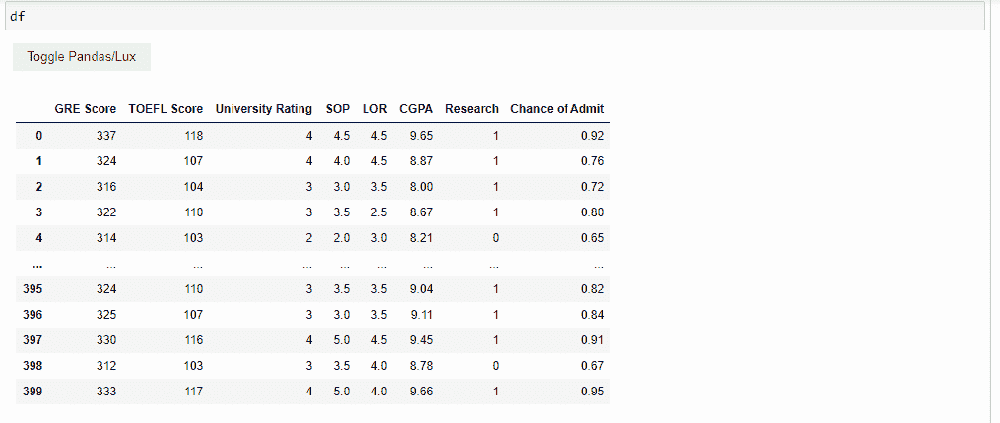***

***来源:作者图片***

***[](https://pypi.org/project/lux-api/)**与 [**熊猫**](https://pandas.pydata.org/) 配合得很好，你不必担心修改代码。事实上，Lux 是以这样一种方式开发的，它保留了 pandas 数据帧的语义。这意味着它的行为与熊猫指令本身同步。*****

*****太棒了，对吧！*****

*****让我们开始吧，让我们的智能视觉助手由 **Lux** 驱动。*****

## *****安装要求*****

1.  *****Lux 可以通过 PyPI 安装。*****

```
*****pip install lux-api*****
```

*****2.如果使用 [conda](https://docs.conda.io/en/latest/) ，Lux 可以通过，*****

```
*****conda install -c conda-forge lux-api*****
```

*****3.对于 jupyter 笔记本中的设置，您还需要添加以下扩展。*****

```
*****jupyter nbextension install --py luxwidget
jupyter nbextension enable --py luxwidget*****
```

*****就是这样！我们准备好出发了…*****

## *****个案研究*****

*****让我们考虑一个示例数据集来探索 Lux 库的特性。*****

*****我将使用来自 [Kaggle 数据](https://www.kaggle.com/mohansacharya/graduate-admissions)库的研究生入学数据集。*****

*****该数据集包含几个参数，这些参数在申请硕士课程时被认为是重要的。*****

********数据字典********

1.  ******GRE 成绩(满分 340 )******
2.  ******托福成绩(满分 120 )******
3.  ******大学评级(满分 5 分)******
4.  ******目的陈述和推荐信实力(满分 5 分)******
5.  ******本科 GPA(满分 10 分)******
6.  ******研究经验(0 或 1 )******
7.  ******录取几率(范围从 0 到 1 )******

## *****1.导入所有必需的库*****

*****既然软件包已经成功安装。我们只需将 lux 库导入到我们的 jupyter 笔记本中。*****

## *****2.加载数据集并检查简明摘要*****

*****让我们加载数据集并检查前 5 行。*****

*****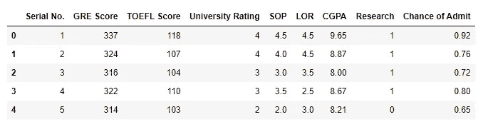*****

*****来源:作者图片*****

*****检查数据集的形状。*****

```
*****(400, 9)*****
```

*****总共有 400 行和 9 列。*****

*****删除第一列`Serial No.`并用`info()`检查数据集的简明摘要*****

*****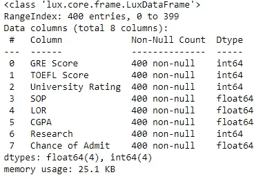*****

*****来源:作者图片*****

*****我们观察到数据集中所有 8 列的数据类型都是数字。*****

## *****3.Lux 的视觉数据探索💡*****

*****现在，我们来显示数据框并探索 Lux 微件。*****

*****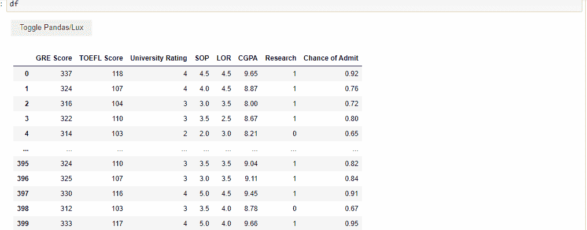*****

*****来源:作者图片*****

*****当数据框显示时，Lux 默认为我们提供了 **3 个标签**，分别是关联、分布和发生。*****

*****让我们来了解一下这些*****

1.  *******相关性*******

*****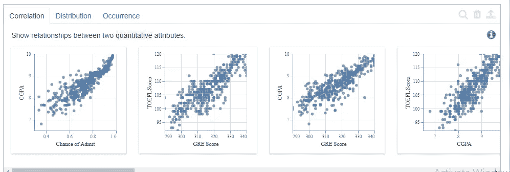*****

*****来源:作者图片*****

*****“相关性”选项卡显示数据集中存在的定量变量之间的关系。*****

*****它显示的顺序是从最相关的到最不相关的。*****

*****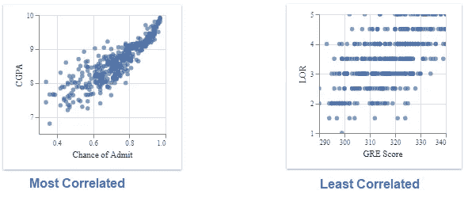*****

*****来源:作者图片*****

*******2。分布*******

*****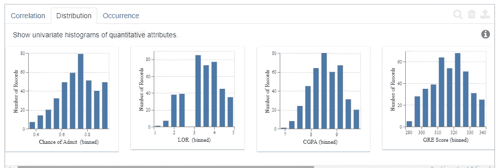*****

*****来源:作者图片*****

*****“分布”选项卡显示数据集中定量变量的直方图。*****

*****它的显示顺序是从高倾斜到低倾斜。*****

**********

*****来源:作者图片*****

*******3。事件*******

*****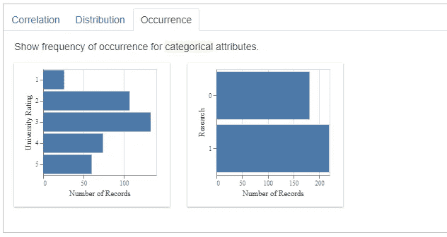*****

*****来源:作者图片*****

*****“事件”选项卡显示分类属性的条形图。*****

*****它遵循的顺序是最不均匀分布到均匀分布。*****

*****尽管我们的数据集不包含任何分类数据类型的特征。对于那些它认为可能对我们的分析有用的特性，它推荐了条形图。*****

## *****4.基于用户意图的可视化和推荐。*****

*****假设您想了解某个特定特性或多个特性的更多信息。在`intent`的帮助下，您可以获得与这些属性相关的所有可视化效果*****

*****lux 小部件不仅显示该功能的可视化效果。而且还会在`Filter`和`Enhance`选项的帮助下为您提供进一步分析的额外建议。*****

1.  *******增强*******

*****lux 的增强功能为用户指定的可视化预期属性添加了一个附加属性。*****

*****它允许用户将添加属性的效果与预期的可视化效果进行比较。这类似于添加色调。*****

*******2。过滤器*******

*****该过滤器让用户可视化不同数据子集的预期属性。*****

*****下面的例子让我们更好的理解。*****

*****考虑**一个**属性 CGPA，*****

```
*****df.intent=[“CGPA”]
df*****
```

*****1.**增强一个属性的建议*******

*****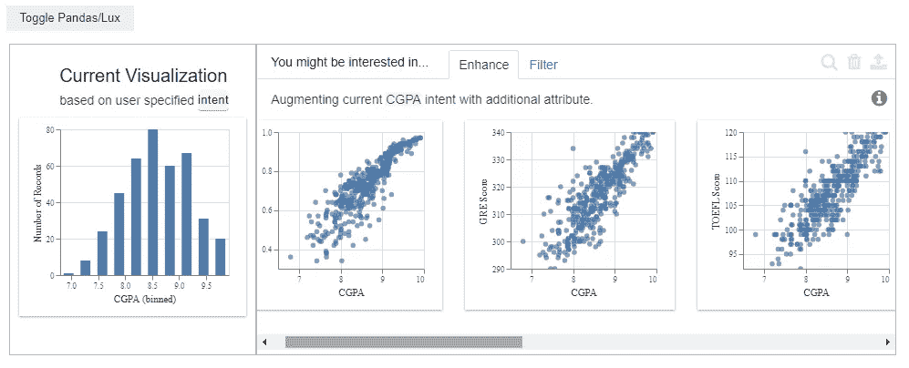*****

*****当预期属性为 CGPA 时，增强选项卡建议，来源:作者提供的图片*****

*****当给定输入是一个特征“CGPA”时,**增强选项卡**将预期变量“CGPA”固定在 **x 轴**上，并通过与不同属性进行比较给出建议。*****

*****2.**针对一个属性的过滤建议*******

*****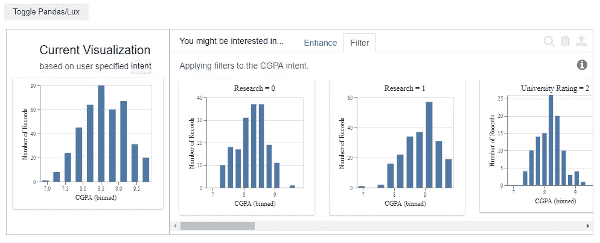*****

*****当目标属性为 CGPA 时的过滤器选项卡建议，来源:按作者分类的图像*****

*****过滤器**选项卡**将预期变量“CGPA”固定在 **x 轴**上，并通过与数据集的不同子部分进行比较，为我们提供建议。*****

*****考虑**两个**属性“**托福成绩**”和“ **GRE 成绩**”，*****

```
*****df.intent=[“TOEFL Score”,”GRE Score”]
df*****
```

*****1.**针对两个属性的增强建议*******

*****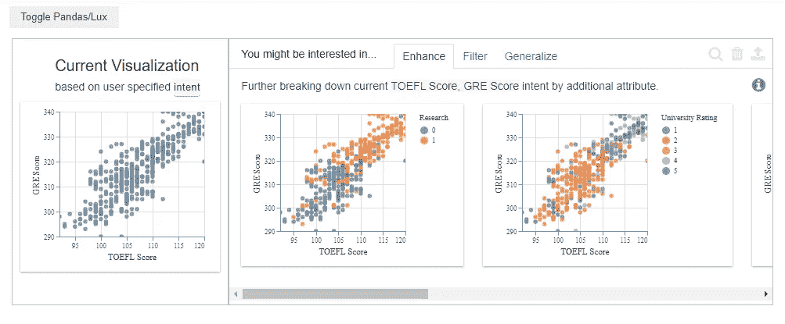*****

*****当预期属性是 TOEFEL 分数和 GRE 分数时，增强选项卡推荐，来源:作者图片*****

*******增强标签**当给定的输入是两个属性“托福成绩”、“GRE 成绩”时。它将预期变量“托福分数”固定在 **x 轴**上，将“GRE 分数”固定在 **y 轴**上。然后通过与**不同属性**的比较，给我们推荐。*****

*****2.**过滤** **建议**为两个属性*****

*****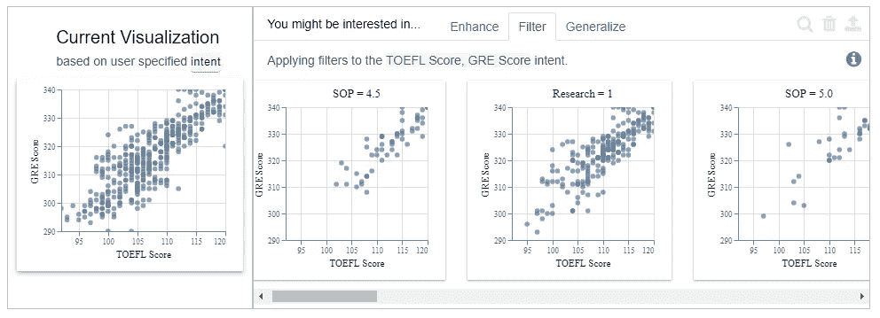*****

*****当预期属性为 TOEFEL 分数和 GRE 分数时，筛选选项卡建议，来源:作者图片*****

*******过滤标签**当给定输入是两个属性“托福成绩”、“GRE 成绩”时。它将预期变量“托福分数”固定在 **x 轴**上，将“GRE 分数”固定在 **y 轴**上。然后，它通过将两者与数据的不同子部分进行比较来给出建议。*****

**********

*****来源:作者图片*****

## *****5.导出可视化效果。*****

*****Lux 让分享可视化变得非常容易。要将可视化导出为静态 HTML，必须使用以下命令。*****

```
*****df.save_as_html(“File name.html”)*****
```

## *****结论*****

*****新的 Python 开源库无疑使数据探索变得更加容易。这篇文章展示了 Lux 是如何用最少的代码实现大部分可视化自动化的。它还解释了勒克司图书馆的一些突出特点。*****

*******Lux 项目现状**:目前 Lux 处于早期开发阶段。*****

*****资源*****

*****要了解更多关于 Lux 库的信息，你可以在 [lux-API](https://pypi.org/project/lux-api/) 找到详细信息。*****

*****你也可以在[活页夹](https://mybinder.org/v2/gh/lux-org/lux-binder/master)上尝试他们的动手[练习](https://mybinder.org/v2/gh/lux-org/lux-binder/master?urlpath=tree/exercise)或[教程](https://mybinder.org/v2/gh/lux-org/lux-binder/master?urlpath=tree/tutorial)。*****

*****希望你喜欢阅读这篇文章！*****

******请随时查看我在*[*pranaviduvva at medium*](https://pranaviduvva.medium.com/)*上的其他文章。******

******感谢阅读！******