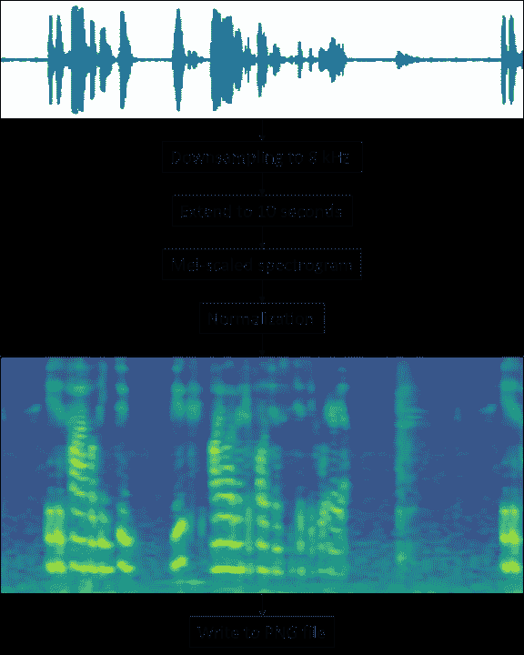
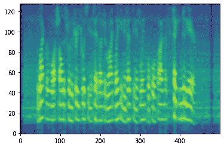
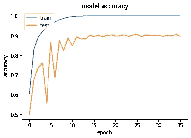

# 使用卷积神经网络的口语识别

> 原文：<https://pub.towardsai.net/spoken-language-recognition-using-convolutional-neural-networks-6aec5963eb18?source=collection_archive---------0----------------------->

## [深度学习](https://towardsai.net/p/category/machine-learning/deep-learning)，[自然语言处理](https://towardsai.net/p/category/nlp)

## 用张量流从语音音频信号中自动识别口语


照片由[苏三·李](https://unsplash.com/@blackodc?utm_source=medium&utm_medium=referral)在 [Unsplash](https://unsplash.com?utm_source=medium&utm_medium=referral) 上拍摄

# 介绍

## 应用程序

在弗劳恩霍夫 IAIS 公司，我们致力于各种语音技术，如自动语音识别、说话人识别等。在最近的工作中，我开发了一项新的服务，直接从音频流中预测口语。如果语言是已知的，可以自动选择用于语音识别步骤的合适模型。这方面的潜在应用可以是 [*自动转录软件*](https://www.iais.fraunhofer.de/en/business-areas/speech-technologies/audio-mining-ard.html) 和 [*对话式 AI*](https://www.speaker.fraunhofer.de/en.html) 。

## 开源代码

我准备了一个 [*GitHub 知识库*](https://github.com/fraunhofer-iais/language-recognition) 包括 Jupyter 笔记本，可以用来实验和训练自己的口语识别器。在当前状态下，它能够区分德语和英语。您可以将此视为实现自己的语言识别器的起点。我们主要用的是 Python 3，TensorFlow 2，和 librosa。

## 方法

这个概念是基于 Bartz 等人的出版物。al [1]和 Sarthak 等人。al [2]，他们正在利用*卷积神经网络* (CNN)实现口语识别系统。其思想是用巨大的 CNN 分析包含语音信号的短音频段的声谱图，用于分类。我们使用的*是梅尔标度的声谱图*类似于 prve【4】。

## 结果

基于普通语音数据的 my 语言识别的开源变体产生了 93.8 %的英语和德语分类准确率。在我们的研究所，我们使用自己的媒体数据集，并在 152 小时的增强测试数据上测试了相同的代码，获得了 98.2 %的总体准确性。我们的算法可以区分英语、德语和“其他”(未知类别)。

# 资料组

笔记本中使用的数据集基于 Mozilla 的常用语音[](https://commonvoice.mozilla.org)*。您需要下载英语和德语数据集，然后运行[第一个笔记本](https://github.com/fraunhofer-iais/language-recognition/blob/master/src/0_prepare-dataset.ipynb)中的脚本，以提取包含持续时间在 7.5 到 10 秒之间的语音信号的训练和评估数据集。*

# *数据扩充*

*可以通过添加噪声来扩充训练数据集。这将有助于提高最终模型对受噪声影响的记录的鲁棒性。对于正态(高斯)分布，我们使用 Numpy 函数 random.normal，这会产生白噪声。*

```
***def** add_noise(audio_segment, gain):
    num_samples = audio_segment.shape[0]
    noise = gain * [numpy.random.normal](https://numpy.org/doc/stable/reference/random/generated/numpy.random.normal.html)(size=num_samples)
    **return** audio_segment + noise*
```

# *数据预处理*

*对所有音频文件进行预处理以提取 Mel 缩放的声谱图。这是通过以下步骤完成的。*

**

*图 1:从语音音频到声谱图的数据预处理*

## *加载音频文件*

```
***def** load_audio_file(audio_file_path):
    audio_segment, _ = [librosa.load](https://librosa.org/doc/main/generated/librosa.load.html?highlight=load)(audio_file_path, sr=sample_rate)
    **return** audio_segment*
```

*在此步骤中，音频被载入并下采样至 8 kHz，以将带宽限制在 4 kHz。这有助于使算法对较高频率的噪声具有鲁棒性。如[1]所述，英语中的大多数音素不超过 3 kHz。*

## *将持续时间固定为 10 秒*

```
***def** fix_audio_segment_to_10_seconds(audio_segment):
    target_len = 10 * sample_rate
    audio_segment = numpy.concatenate([audio_segment]*2, axis=0)
    audio_segment = audio_segment[0:target_len]

    **return** audio_segment*
```

*我们复制 7.5 到 10 秒长的信号，并将其缩短到 10 秒。*

## *梅尔标度谱图*

*Mel 缩放的声谱图是根据音频计算的。它有助于用神经网络分析语音频率。Mel-scaling 以比较高频率更高的分辨率表示较低频率，并考虑了人类感知频率的方式。*

```
***def** spectrogram(audio_segment):
    *# Compute Mel-scaled spectrogram image*
    hl = audio_segment.shape[0] // image_width
    spec = [librosa.feature.melspectrogram](https://librosa.org/doc/main/generated/librosa.feature.melspectrogram.html)(audio_segment,
                                     n_mels=image_height, 
                                     hop_length=int(hl))

    *# Logarithmic amplitudes*
    image = [librosa.core.power_to_db](https://librosa.org/doc/main/generated/librosa.power_to_db.html?highlight=power_to_db#librosa.power_to_db)(spec)

    *# Convert to numpy matrix*
    image_np = numpy.asmatrix(image)

    *# Normalize and scale*
    image_np_scaled_temp = (image_np - numpy.min(image_np))

    image_np_scaled = image_np_scaled_temp / 
                      numpy.max(image_np_scaled_temp)

    **return** image_np_scaled[:, 0:image_width]*
```

*进行归一化以在 0 和 1 之间调整谱图中的值。此步骤将安静和大声录音均衡到一个共同的水平。*

## *转换为 PNG*

*所有文件最终都存储为大小为 500 x 128 的 PNG 文件，但首先，归一化光谱图需要从 0 到 1 之间的十进制值转换为 0 到 255 之间的整数值。*

```
***def** to_integer(image_float):
    *# range (0,1) -> (0,255)*
    image_float_255 = image_float * 255.0

    *# Convert to uint8 in range [0:255]*
    image_int = image_float_255.astype(numpy.uint8)

    **return** image_int*
```

**

*图 2:作者的语音|图像的 Mel 比例谱图*

# *模特培训*

## *访问数据集*

*为了使模型训练算法可以访问数据集，我们首先需要实例化生成器，这些生成器以内存高效的方式迭代数据集。这一点很重要，因为我们有 60，000 张图像用于训练和评估数据，我们不能只将其加载到内存中。幸运的是，作为 TensorFlow 的一部分，Keras 具有处理图像数据集的惊人功能。我使用 [ImageDataGenerator](https://www.tensorflow.org/api_docs/python/tf/keras/preprocessing/image/ImageDataGenerator) 作为模型训练的数据输入源。*

```
*image_data_generator = ImageDataGenerator(
                                  rescale=1./255,      
                                  validation_split=validation_split)train_generator = image_data_generator.flow_from_directory(
                        train_path,
                        batch_size=batch_size,
                        class_mode='categorical',
                        target_size=(image_height, image_width), 
                        color_mode='grayscale',
                        subset='training')validation_generator = image_data_generator.flow_from_directory(
                            train_path,
                            batch_size=batch_size,
                            class_mode='categorical',
                            target_size=(image_height, image_width), 
                            color_mode='grayscale',
                            subset='validation')*
```

*合适的批量大小是 128，这足够大以帮助减少过拟合并保持模型训练的效率。*

## *模型定义初始版本 3*

*正如[1]中所建议的，建议使用庞大的 CNN(如 Inception V3)来解决这一任务。口语识别是一项非常复杂的任务，需要一个大容量的模型。较小的网络性能较差，因为它们无法处理复杂的数据。*

*最初的 Inception V3 模型 [3】，已经可以从 Keras 应用程序中获得，必须稍加修改以处理我们的数据集。它预计处理 3 个不同颜色层的图像，但我们的图像是灰度。以下代码行将单个图像颜色层复制到 Inception V3 的输入张量的所有三个通道。*

```
*img_input = [Input](https://www.tensorflow.org/api_docs/python/tf/keras/Input)(shape=(image_height, image_width, 1))

img_conc = [Concatenate](https://www.tensorflow.org/api_docs/python/tf/keras/layers/concatenate)(axis=3, name='input_concat')([img_input, img_input, img_input])

model = [InceptionV3](https://keras.io/api/applications/inceptionv3/)(input_tensor=img_conc, weights=**None**, include_top=**True**, classes=2)*
```

*该模型有近 22 个 mio 参数。*

## *编译模型*

```
*model.compile(
         optimizer=[RMSprop](https://www.tensorflow.org/api_docs/python/tf/keras/optimizers/RMSprop)(lr=initial_learning_rate, clipvalue=2.0),       
         loss='categorical_crossentropy',
         metrics=['accuracy'])*
```

*在我的评估中， [RMS-Prop 优化器](https://towardsdatascience.com/understanding-rmsprop-faster-neural-network-learning-62e116fcf29a)产生了良好的结果。[亚当](https://medium.com/@nishantnikhil/adam-optimizer-notes-ddac4fd7218)是在【1】中暗示的。*

## *提前停止*

*学习结束时自动停止可以加快训练速度。我使用 Keras 的 [EarlyStopping](https://www.tensorflow.org/api_docs/python/tf/keras/callbacks/EarlyStopping) 方法来实现。*

```
*early_stopping = [EarlyStopping](https://www.tensorflow.org/api_docs/python/tf/keras/callbacks/EarlyStopping)(monitor='val_accuracy', mode='max', patience=5, restore_best_weights=**True**)*
```

## *学习率衰减*

*正如[1]中所建议的，我实现了一个指数学习率衰减[。](https://towardsdatascience.com/learning-rate-schedules-and-adaptive-learning-rate-methods-for-deep-learning-2c8f433990d1)*

```
***def** step_decay(epoch, lr):
    drop = 0.94
    epochs_drop = 2.0
    lrate = lr * math.pow(drop, math.floor((1+epoch)/epochs_drop))
    **return** lrate

learning_rate_decay = [LearningRateScheduler](https://www.tensorflow.org/api_docs/python/tf/keras/callbacks/LearningRateScheduler)(step_decay, verbose=1)*
```

## *培养*

*现在，使用下面的命令进行实际的训练。*

```
*model.fit(train_generator,
          validation_data=validation_generator,
          epochs=60,
          steps_per_epoch=steps_per_epoch,
          validation_steps=validation_steps,
          callbacks=[early_stopping, learning_rate_decay])*
```

*历元数非常多，但由于我使用了提前停止，幸运的是，算法在 36 个历元后停止。*

**

*图 3:训练和评估准确度|作者图片*

*当查看 36 个时期的训练和评估精度时，我们可以看到存在过度拟合，这意味着该模型在分类训练数据集方面比评估数据集更准确。这是因为 Inception V3 模型是巨大的，并且具有巨大的容量。使用如此大的网络意味着多样化的训练数据量也应该非常大。因此，为了克服这个问题，您可以增加训练数据的数量，直到不再出现过度拟合。在图中，你还可以看到学习率衰减的影响。在前 10 个时期可以看到最陡的学习曲线。*

## *估价*

*最后，我为测试数据实例化了一个新的 ImageDataGenerator，并使用*

```
*_, test_accuracy = model.evaluate(evaluation_generator, 
                                  steps=evaluation_steps)*
```

*来评估这个模型。测试结果的准确率为 93.8 %。*

# *调整和改进模型*

*请随意使用代码来改进模型。例如，您可以添加更多的类，并从其他语言中获取更多的数据。此外，建议根据您的应用调整数据和增强。我们弗劳恩霍夫有一个针对媒体数据的优化版本。我们正在使用两个额外的增强步骤来改善双向通话(overdub)和背景音乐的效果。您还可以[改变音调和速度来执行数据扩充](https://medium.com/@makcedward/data-augmentation-for-audio-76912b01fdf6)。此外，建议使用更多的数据。如果训练数据集的数量和多样性不足，可能会出现过度拟合。*

# *摘要*

*我在 GitHub 上介绍了我的开源代码，以及直接从语音音频中识别口语的实现方法。在给定的基于普通语音的数据集上，模型的准确率为 93.8 %。这个想法是使用高容量的 CNN 来分析 10 秒长的音频片段的 Mel 标度的频谱图。由于语言识别是一项复杂的任务，网络需要足够大，以便在训练期间捕捉复杂性并获得有意义的特征。我建议通过扩展数据集和增强技术来进一步改进模型。然后，在不改变训练实现本身的情况下，测试准确率超过 98 %是可能的。*

# *参考*

*[1] C. Bartz，T. Herold，H. Yang 和 C. Meinel，(2015)，Proc .国际神经信息处理会议*

*[2] S. S. Sarthak，G. Mittal，[使用 ConvNets 进行口语识别](https://deeplearn.org/arxiv/97126/spoken-language-identification-using-convnets) (2019)，Ambient Intelligence，vol. 11912，Springer Nature 2019，第 252 页*

*[3] C. Szegedy，V. Vanhoucke，S. Ioffe，J. Shlens 和 Z. Wojna，[重新思考计算机视觉的初始架构](https://www.cv-foundation.org/openaccess/content_cvpr_2016/papers/Szegedy_Rethinking_the_Inception_CVPR_2016_paper.pdf) (2015)，CoRR，abs/1512.00567*

*[4]p .-l . prve，[口语识别](https://github.com/pietz/language-recognition) (2017)，GitHub 知识库*