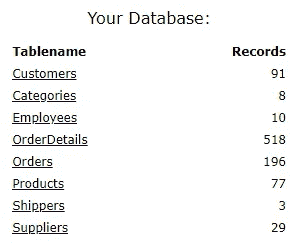
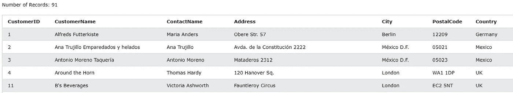
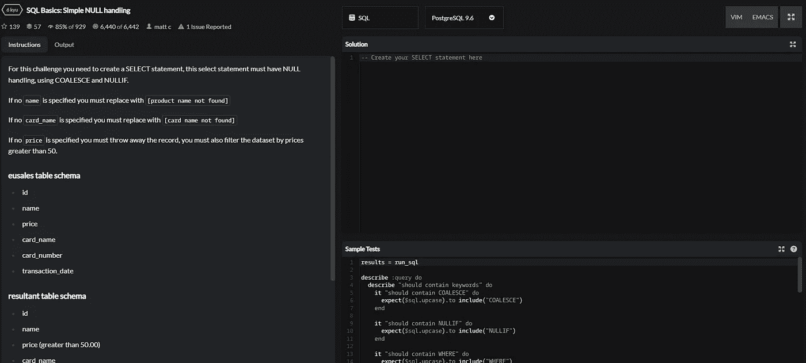

# 用于数据科学面试的 SQL

> 原文：<https://pub.towardsai.net/sql-for-data-science-interviews-bb9942292bd2?source=collection_archive---------2----------------------->

## 这里有一个 SQL 面试中你需要知道的最常见的命令、关键字和操作符的简明指南。我还包括了如何学习和面试技巧的部分。


托拜厄斯·菲舍尔在 [Unsplash](https://unsplash.com/s/photos/database?utm_source=unsplash&utm_medium=referral&utm_content=creditCopyText) 上的照片

如果你是数据科学家，你需要了解 SQL。至少是最基本的。

几乎所有的数据科学职位描述都需要 SQL。这是一篇关于如何确保你知道足够多的 SQL 来粉碎 SQL 数据科学面试的文章。当然，要成为一名伟大的数据科学家，你通常需要比 SQL 更多的东西，但是你可以将 SQL 视为先决条件。

我将通过一些例子向您介绍 SQL 的基础知识，并介绍通过面试所需的所有关键词和想法。

# 什么是 SQL？

简单地说，SQL 是一种在数据库中存储、操作和检索数据的标准语言。

SQL 可以完成以下所有任务:

*   SQL 可以对数据库执行查询
*   SQL 可以从数据库中检索数据
*   SQL 可以将记录插入数据库
*   SQL 可以更新数据库中的记录
*   SQL 可以从数据库中删除记录
*   SQL 可以创建新的数据库
*   SQL 可以在数据库中创建新表
*   SQL 可以在数据库中创建存储过程
*   SQL 可以在数据库中创建视图
*   SQL 可以设置表、过程和视图的权限

SQL 有不同的版本，但它们都以相同的语法支持相同的主关键字(即 SELECT、WHERE 等)。)

# SQL 基础知识

SQL 数据库由表组成。这些表格由字段(列)和记录(行)组成。大多数数据库由许多表组成。这些表中的每一个都可以通过名称来识别。



由许多表组成的数据库—【https://www.w3schools.com/sql/trysql.asp? filename=trysql_asc



数据库中的表格示例—[https://www.w3schools.com/sql/trysql.asp?filename=trysql_asc](https://www.w3schools.com/sql/trysql.asp?filename=trysql_asc)

因此，我们使用 SQL 来操作数据库中的这些表。我们可以提取信息，删除信息，添加信息，等等。

# SQL 关键字

在我们开始研究 SQL 关键字之前，我需要说一些关于它们的事情。

SQL 关键字**不**区分大小写。但是你绝对应该把它们作为标准符号大写。

您应该始终以分号结束每条 SQL 语句。

现在让我们进入关键词。

## 挑选

大多数 SQL 语句完全按照它们在 tin 上所说的去做。一个明显的例子是 SELECT 关键字——最常用的关键字。大多数语句将以 SELECT 关键字开始。

SELECT 关键字用于从一个或多个表中返回数据。返回的数据存储在结果表中，称为结果集。

```
SELECT column1, column2
FROM table_name;
```

或者

```
SELECT column1, column2 FROM table_name;
```

上述代码从表“table_name”中提取字段 column1 和 column2。

如果您想从表中选择所有列，可以使用下面的

```
SELECT * FROM table_name;
```

## 选择不同

您可以使用 SELECT DISTINCT 仅返回不同的值。

```
SELECT DISTINCT column1, column2
FROM table_name;
```

如果你想计算你有多少不同的条目，你可以使用；

```
SELECT(COUNT(DISTINCT column1) FROM table_name;
```

## 在哪里

您可以使用 WHERE 有条件地筛选记录。

```
SELECT column1, column2,
FROM table_name
WHERE condition;
```

例如，假设您想要一个特定人(或 id)的记录。

```
SELECT * FROM table_name
WHERE id = 5;
```

当条件是寻找一个数字或整数时，你可以像上面一样指定这个数字。然而，在查找文本时，应该用单引号将文本括起来(有些系统允许使用双引号，但坚持使用单引号是有意义的)。

在 WHERE 子句中可以使用许多运算符。

*   **=** 相等
*   **>** 大于
*   **>** 小于
*   **>** =大于或等于
*   **< =** 小于或等于
*   **< >(！=)** 不相等(取决于 SQL 版本)
*   **之间**之间一定的范围。
*   **像**一样搜索一个模式
*   **在**中指定某些潜在值

## AND 或& NOT 运算符

您可以将 WHERE 与 AND 或 NOT 运算符配合使用，以便在多个条件下进行进一步筛选。

*   **和**显示所有条件为真时的记录
*   **或**显示任一条件为真时的记录
*   **NOT** 如果条件不成立，则显示记录。

```
SELECT column1, column2
FROM table_name
WHERE condition1 AND condition2 AND condition3;SELECT column1, column2
FROM table_name
WHERE condition1 OR condition2 OR condition3;SELECT column1, column2
FROM table_name
WHERE NOT condition;
```

比如说；

```
SELECT * FROM table_name
WHERE id = 5 AND location = 'London';SELECT * FROM table_name
WHERE hometown = 'London' OR location = 'London';
```

您可以组合 and 或 AND 而不使用括号。

```
SELECT * from table_name
WHERE hometown = 'London' AND (location = 'London' OR 'Paris');
```

这将返回此人的家乡是伦敦，并且他们目前居住在伦敦或巴黎的所有记录。

## 以...排序

可以使用 ORDER BY 按升序或降序对结果集进行排序，默认情况下是升序，也可以添加 DESC 来按降序排序。

```
SELECT column1, column2
FROM table_name
ORDER BY column2, column1 DESC;
```

只需删除 DESC，将其按升序排列。

只需指定列，就可以按多个列对结果集进行排序。例如，如果我们先按国家再按家乡对下表进行排序，如果许多记录属于同一个国家，那么它们将按家乡排序。

```
SELECT country, hometown
FROM Countries
ORDER BY country, hometown;
```

您甚至可以将一列按升序排序，然后将另一列按降序排序。

```
SELECT country, hometown
FROM Countries
ORDER BY country ASC, hometown DESC;
```

## 插入

正如所料，我们使用 INSERT INTO 向表中添加新记录。

使用 INSERT INTO 时，如果不想指定列名，则必须按照表中已有的顺序传递信息。

例如，如果我们有一个包含三列的表；id、姓名和电话号码，您必须像这样传递信息。

```
INSERT INTO table_name 
VALUES (27, 'James Asher', 07123123123) 
```

但是如果您想要更具体，或者如果您没有所有的列信息，您可以如下传递它。

```
INSERT INTO table_name (id, phone_number)
VALUES (1, 07123123123)
```

这将插入数据，使 name 列为空。

## 更新

您可以使用 UPDATE 关键字来修改数据库表中的记录。它通常与特定记录的目标位置一起使用。如果你忘记了它将在哪里更新所有记录！

```
UPDATE table_name
SET column1 = value1, column2 = value2
WHERE condition;UPDATE table_name
SET name = 'James Asher'
WHERE id = 27;UPDATE table_name
SET country = 'Scotland'
WHERE city = 'Edinburgh';
```

## 删除

DELETE 是不言自明的——它也通常与 WHERE 一起使用。

```
DELETE FROM table_nameWHERE *condition*;
```

并删除所有记录，但不删除表；

```
DELETE FROM table_name;
```

## 选择顶部，限制，先取，行数

有时候你不想要所有的记录。有时候你只是想要最初的几个或者结果的一个样本。这些子句在处理大型表时特别有用，因为返回整个结果集可能会对性能产生负面影响。

每个数据库系统对此使用不同的语法。不过，完整的名单可以在这里看到[。](https://www.w3schools.com/sql/sql_top.asp)

例如，MySQL 语法是:

```
SELECT *column_name(s)*
FROM *table_name* WHERE *condition*
LIMIT *number*;
```

## 最小和最大

如果只想从列中选择最高或最低值，可以使用 MIN 和 MAX 函数。

```
SELECT MIN(*column_name*)
FROM *table_name*
WHERE *condition*;SELECT MAX(*column_name*)
FROM *table_name*
WHERE *condition*;
```

## 计数、平均值、总和

可以像使用 MIN 和 MAX 函数一样使用 COUNT、AVERAGE 和 SUM 函数。

COUNT 返回符合指定条件的行数。

```
SELECT COUNT(*column_name*)
FROM *table_name*
WHERE *condition*;
```

AVERAGE 返回指定列的平均值。

```
SELECT AVG(*column_name*)
FROM *table_name*
WHERE *condition*;
```

SUM 返回指定列的总和。

```
SELECT SUM(*column_name*)
FROM *table_name*
WHERE *condition*
```

## 喜欢

您可以将 LIKE 运算符与 WHERE 运算符结合使用来查找特定的模式。

LIKE 操作符中使用了两个常见的[通配符](https://www.w3schools.com/sql/sql_wildcards.asp)来帮助寻找模式。

“%”—表示任意数量的字符(包括 0)。

“_”—代表一个字符。

一些例子:

“%a”表示任何以 a 结尾的值。

“a%”表示任何以 a 开头的值。

“a__”代表任何以 a 开头的三个字母的单词。

“a___e”代表任何以 e 结尾、以 a 开头的五个字母的单词。

## 在…里

IN 运算符允许您在 WHERE 子句中指定多个值。

IN 运算符是多个 or 条件的简写。

```
SELECT *column_name(s)*
FROM *table_name*
WHERE *column_name* IN (*value1*, *value2*, ...);or SELECT *column_name(s)*
FROM *table_name*
WHERE *column_name* IN (*SELECT STATEMENT*);for example:SELECT * FROM table_name
WHERE city IN (SELECT city FROM customers)
```

## 在...之间

BETWEEN 类似于 IN，但指定了值的范围。这些范围可以是数字、文本甚至日期。

数字范围是不言自明的，文本范围按字母顺序排列，日期范围也是不言自明的。

```
SELECT * FROM People
WHERE height BETWEEN 180 AND 200;SELECT * FROM People
WHERE name BETWEEN "James" AND "Zach";SELECT * FROM People
WHERE Birthday BETWEEN '1936-12-12' AND '1966-12-12';
```

# SQL 连接

连接是 SQL 极其重要的一部分。数据库中的大多数表需要链接到另一个表才能提供值。例如，您可能在一个表中有一个人的人口统计数据，而在另一个表中有他们的购买历史记录。如果您想要分析这些数据，您将需要这两个数据集-因此您需要连接它们。通常情况下，您会在所有表中都不变的 Id 列上进行联接。

```
SELECT Orders.OrderID, Customers.CustomerName, Orders.OrderDate
FROM Orders
INNER JOIN Customers ON Orders.CustomerID=Customers.CustomerID;
```

上面是一个内部连接的例子(最常见的连接类型)。我们使用点符号来表示每一列来自的表。因此，命令。OrderID 是 Orders 表中的 OrderID 列。

最后一行是引用用于匹配表的两列的行。

*   内部联接-返回在两个表中都有匹配值的记录
*   左连接-返回左表中的所有记录和右表中的匹配记录
*   右连接-返回右表中的所有记录和左表中的匹配记录
*   完全连接-当左表或右表中有匹配项时，返回所有记录

## 联盟

UNION 用于组合两个或多个 SELECT 语句的结果。

默认情况下，UNION 只接受不同的值，您可以使用 UNION ALL 来覆盖这一点。

这些表必须具有相同的列数，并且每列的数据类型必须与它们要匹配的数据类型相同。结果列将以第一个 SELECT 语句中的列命名。

```
SELECT *column_name(s)* FROM *table1*
UNION
SELECT *column_name(s)* FROM *table2*;
```

## 分组依据

GROUP BY 语句用于根据值对列进行分组。之后通常会跟一个聚合函数，如 AVERAGE()或 COUNT()。

```
SELECT *column_name(s)*
FROM *table_name*
WHERE *condition*
GROUP BY *column_name(s)* ORDER BY *column_name(s);*SELECT COUNT(CustomerID), City
FROM Clients
GROUP BY City
ORDER BY COUNT(CustomerID) DESC;
```

## 拥有

SQL 添加了 HAVING 子句，用于 where 子句不能与聚合函数一起使用的情况。

```
SELECT *column_name(s)*
FROM *table_name*
WHERE *condition*
GROUP BY *column_name(s)* HAVING *condition* ORDER BY *column_name(s);*SELECT COUNT(id), City
FROM Clients
GROUP BY City
HAVING COUNT(Id) > 5;
```

此处的示例返回拥有 5 个以上客户的城市。

## 存在

EXISTS 运算符用于测试子查询中是否存在任何记录。

```
SELECT *column_name(s)*
FROM *table_name*
WHERE EXISTS
(SELECT *column_name* FROM *table_name* WHERE *condition*);
```

## 选择进入

该语句只是将一个表中的数据复制到一个新表中。

```
SELECT *
INTO *newtable* [IN *externaldb*]
FROM *oldtable* WHERE *condition*;
```

# CASE WHEN 语句

这种情况下，陈述会在很多面试中出现，并且非常常用。它们类似于 if-else 语句——当第一个条件为真时，它们返回值，并持续到返回值为真为止。如果不满足任何条件，它们将返回 ELSE 语句。如果没有传递 ELSE 语句，则返回 NULL。

```
CASE
    WHEN *condition1* THEN *result1*
    WHEN *condition2* THEN *result2*
    WHEN *conditionN* THEN *resultN*
    ELSE *result*
END;
```

例如，如果您想基于以前的变量创建一个新变量，您可以执行以下操作。

```
SELECT id, Age
CASE 
     WHEN Age > 40 THEN 'Old'
     WHEN Age <= 40 THEN 'Young' 
     ELSE 'Dead'
END AS AgeBracket
FROM People
```

此示例创建了一个新变量，并根据年龄将人们分组到不同的年龄段。使用 END，因为我们可以将它作为一个新变量返回。

# 空函数

当从其他变量创建新变量时，空变量通常会破坏您的查询。如果一个变量为空，那么这个变量的倍数也将为空。SQL 给了你一个函数来帮助你。

## IFNULL

允许您在值为空时指定替代值。

```
SELECT id, sales * (price + IFNULL(units, 0))
FROM Products;
```

# 怎么准备？


照片由[菲利普·布特](https://unsplash.com/@flipboo?utm_source=medium&utm_medium=referral)在 [Unsplash](https://unsplash.com?utm_source=medium&utm_medium=referral) 拍摄

## 代码战争

我最喜欢的练习方式是使用 [Codewars。](https://www.codewars.com/dashboard)它用你选择的语言向你提问(这里，我们显然是用 SQL，但你可以用任何你想用的语言)。尽管如此，我还是建议你为 SQL 面试练习 SQL

他们给你这样的挑战来训练你，如果你卡住了，你可以看到专家的解决方案。



我建议不要去看解决方案，直到你完成了问题或者你已经被卡住了一段不合理的时间。

不要担心要花多长时间。你需要一段时间来适应这一切。

个人偏好也是拿着身边的记事本做。就我个人而言，我发现用笔和纸更容易理解事物，然后用代码将其形式化。

## 像面试一样练习

你可以通过编码挑战来通过面试。正确应对挑战并不是他们所寻求的全部。通常，你会面临比在工作场所更困难的挑战。

他们寻找的是语言知识和你如何解决问题。

所以这里有一些建议。

**大声思考。大声思考对你和面试官都有好处。这表明你知道自己在说什么，知道自己是如何思考问题的。即使你不能解决眼前的问题，你仍然可以通过你大声说出来的话来展示你的知识。**

**做些笔记。如果你边工作边记笔记，这比试图在脑子里应付要容易得多。当把任何令人畏惧的任务分解成更小的任务时，它就不那么令人畏惧了。**

我倾向于把问题的目的写在这一页的顶部。然后我会记下这个问题需要的所有子目标。在此基础上，我将尝试将这些子目标按照需要的顺序重新排序。这将极大地帮助你思考问题和组织你的想法。在面试中试图平衡你头脑中的许多想法不是一个好主意。

解决问题——然后重构。总是简单地开始。不要试图去想最复杂的解决方案或炫耀的解决方案。先用任何可能的方法解决问题。然后，如果你能想到更好的方法，就回去重构你的代码。将一般代码改进为好代码比直接跳到好代码要容易得多。

祝你好运！

感谢您的阅读，希望这对您有所帮助。

```
If I’ve inspired you to join medium I would be really grateful if you did it through this [link](https://jamesasher4994.medium.com/membership) — it will help to support me to write better content in the future.If you want to learn more about data science, become a certified data scientist, or land a job in data science, then checkout [365 data science](https://365datascience.pxf.io/c/3458822/791349/11148) through my [affiliate link.](https://365datascience.pxf.io/c/3458822/791349/11148)
```

这是我写的其他一些东西:

[](https://towardsdatascience.com/how-to-easily-run-python-scripts-on-website-inputs-d5167bd4eb4b) [## 如何在网站输入上轻松运行 Python 脚本

### 这是我建立的一个网站的演示，它将动态分析文本情感

towardsdatascience.com](https://towardsdatascience.com/how-to-easily-run-python-scripts-on-website-inputs-d5167bd4eb4b) [](https://towardsdatascience.com/econometrics-is-the-original-data-science-6725d3f0d843) [## 计量经济学是原始的数据科学

### 这就是你应该多了解它的原因

towardsdatascience.com](https://towardsdatascience.com/econometrics-is-the-original-data-science-6725d3f0d843)