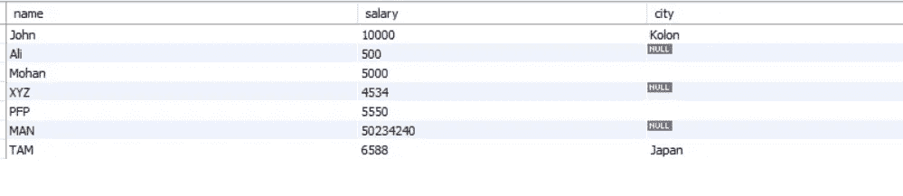
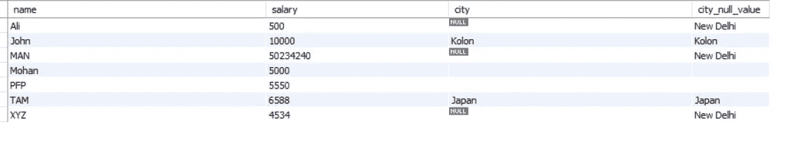
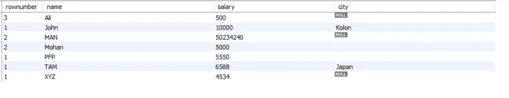
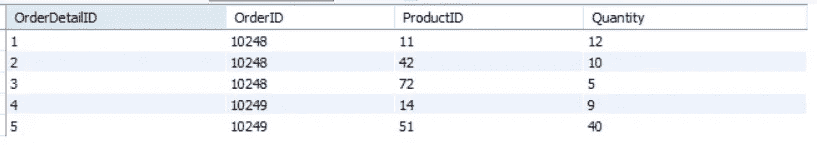
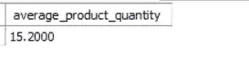
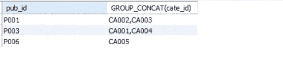

# 面向数据科学家/分析师的 SQL

> 原文：<https://pub.towardsai.net/sql-for-data-scientists-analysts-e4912b26cd5b?source=collection_archive---------1----------------------->


# 介绍

SQL 是数据和数据科学的重要组成部分，用于存储和检索数据。随着各行各业每天收集和产生大量数据，只要数据保留在符合 SQL 的数据库中，SQL 仍然是帮助调查、过滤和聚合数据以全面了解数据的最有效工具。

我多次看到 SQL 是数据科学中被低估的技能，因为它被认为是从数据库中获取数据的必要而不酷的方式。人们认为 SQL 只是 SELECT、JOIN 和 ORDER BY。但是，它不仅仅是 SELECT、JOIN 和 ORDER By 语句。

# 每天的 SQL 技巧

## COALESCE()函数

该函数用于处理空值。它用另一个所需的值替换空值。

让我们以一个雇员表为例:



图 1:具有空值的城市

在上表中，城市行有许多空值。让我们用默认值查询城市的空值。

```
SELECT name, salary, city,
COALESCE(city, 'New Delhi') AS city_null_value
FROM  
Employee    
ORDER BY name;
```



图 2:具有空值的城市的默认值

## **ROW_NUMBER()函数**

该函数为结果的每一行创建一个唯一的递增整数值。这一列值被认为是伪列，因为它并不自然地存在于我们的数据表中。因此，结果按照分析师在`ORDER BY`子句中确定的顺序返回。

让我们在雇员表中创建一个 rownumber。

```
SELECT 
  rownumber, 
  name, 
  salary,
  city
FROM 
(
  SELECT 
    ROW_NUMBER() OVER (PARTITION BY city ORDER BY name DESC) AS rownumber, 
    tab.*
  FROM Employee tab    
)    dat
ORDER BY name, rownumber;
```



图 3:基于分区城市的行号

## WITH 语句

它用于定义“语句作用域视图”。这些不存储在数据库模式中。它也被称为公用表表达式(CTE)和子查询分解。

让我们以订单明细表为例，如下所示:



图 4:订单明细表

现在，查询返回每个 ProductId 的平均订购数量。

```
WITH cte_quantity
AS
(SELECT
    SUM(Quantity) as Total
FROM OrderDetails
GROUP BY ProductID)

SELECT
    AVG(Total) average_product_quantity
FROM cte_quantity;
```

输出:



图 5:每个产品 Id 的平均订购数量

## GROUP_CONCAT()函数

它用于将多行数据连接到一个字段中。它从一个组中返回一个带有串联的非空值的字符串。当没有非空值时，它返回 NULL。

让我们以下面的“图书管理员”表为例:


图 6:图书主表

查询以返回每组' pub_id '的逗号(，)分隔的' cate_id '列表。

```
SELECT pub_id,GROUP_CONCAT(cate_id)
FROM book_mast
GROUP BY pub_id;
```



图 7:逗号分隔的值

## 将 SQL 查询与 Python 集成

Panda 是一个很棒的库，它给出了一行代码来从 SQL 查询。下面的代码用于从 Pandas 查询:

```
query **=** "SELECT * FROM CURRENT_TABLE"
sql_data **=** pandas.read_sql(query, **connection**)
```

# 结论

数据科学家或分析师应该了解 SQL。事实上，所有处理数据和分析的专业人员都应该了解 SQL。SQL 仍然是最强大的工具，可以帮助您调查、过滤和汇总数据，从而彻底了解您的数据。