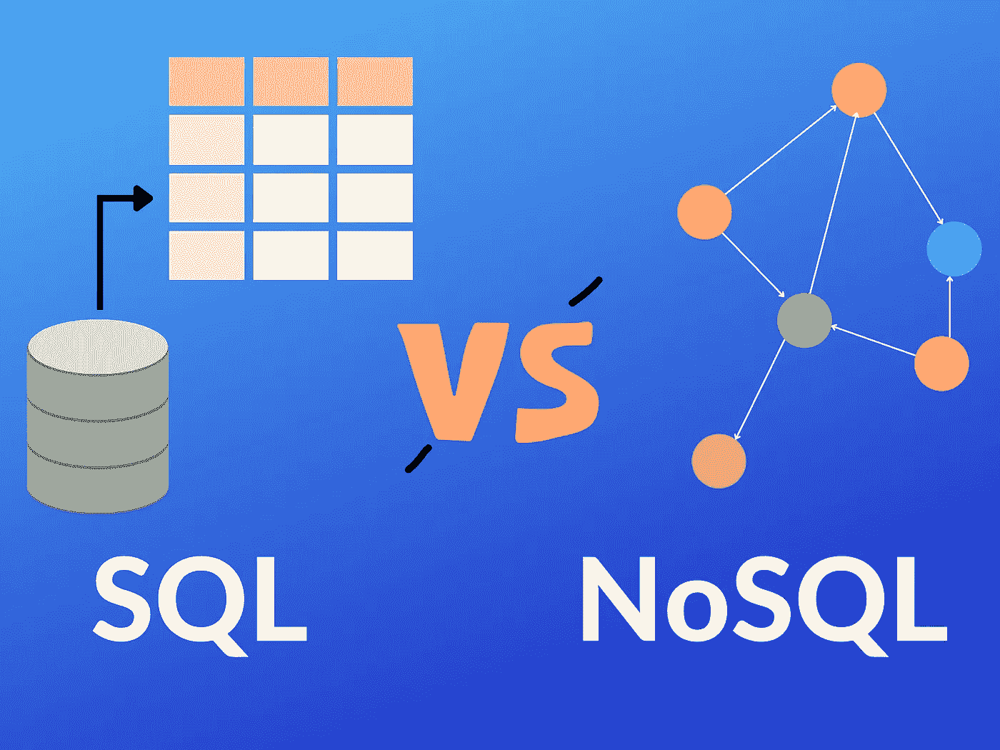
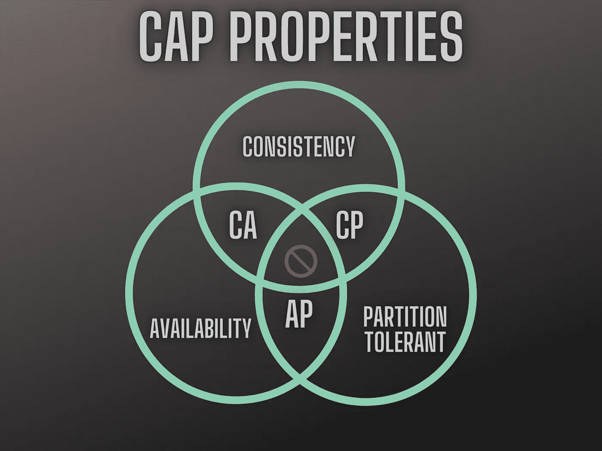
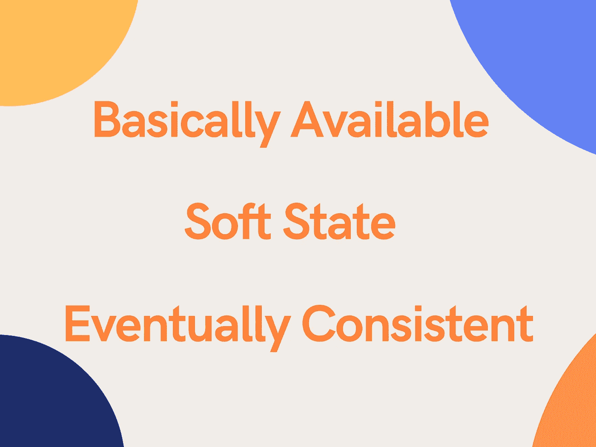

# SQL 与 NoSQL:选择最方便的技术

> 原文：<https://pub.towardsai.net/sql-vs-nosql-choose-the-most-convenient-technology-4506d831b6e4?source=collection_archive---------0----------------------->

## 数据库的酸碱属性

SQL 与 NoSQL 数据库。图片由作者提供。

关系数据库保证了 **ACID 属性**，这是可取的，但在**大数据**时代，**需要采用可更好扩展的技术**。NoSQL 数据库**以一种**更高效的方式**处理大而复杂的数据**。酸不能保证，但是**碱属性**甚至比**更好**用于**多种应用**。我们来了解一下原因。

## 概述

1.  ***RDBMSs 的酸性属性***
2.  ***RDBMSs 的主要问题***
3.  ***NoSQL 数据库***
4.  ***数据库的 CAP 定理***
5.  ***NoSQL 数据库的基本属性***
6.  ***SQL vs NoSQL:如何选择？***
7.  ***结论***

酸性。图片由作者提供。

## 1.RDBMS 的酸性

**关系数据库**仍然在使用，实际上，它们对于大量的应用程序来说已经非常好了。在 RDBMSs 中，**数据按照*关系模型*** 存储，其中数据以表(关系)**的形式表示**，用键**(主键和外键)连接在一起。**

**使用 RDBMS 的优势**在于**酸性**:

*   ***A****tomi city:***交易**被认为是**单个单位**。如果操作失败，整个事务将回滚。
*   ***C*** *一致性:* **破坏一致性**的交易不被允许，**将失败**。
*   ***I****solation:***事务不能同时发生**。想象一种访问数据的“交通灯”。
*   ***D*** *可用性:*如果出现故障，通过备份和日志可以**恢复提交的事务**。

ACID 属性通常是我们所期望的，但是它是以灵活性和可伸缩性为代价的。

## 2.关系数据库管理系统的主要问题

如果说**RDBMS**有不同的优点，那么它们也**有** **一些缺点**。首先，**RDBMS 不灵活**:修改模式很难，如果**数据快速发展，**这可能会造成**问题**。

另一点是关于**半结构化数据**和**复杂对象**。事实上，**常规表格**或**关系表**中的**而非**的**数据**无法存储在 RDBMSs 中，**需要不同的存储解决方案**。

最后，**RDBMS 由于 ACID 属性而不能很好地扩展**。

那么，我们怎样做才能**克服这些问题**？ **NoSQL 数据库来帮助**，允许**可伸缩性**和**灵活性**。

## 3.NoSQL 数据库

NoSQL、非关系、无模式、非 acid 和水平可伸缩都是同义词，表示不基于*关系模型* 的**存储解决方案。因此，这些解决方案**不使用表格关系**。**

NoSQL 数据库有四个类别:

1.  ***键值存储:*** 简单地存储**键值对**。API 一般提供`put()`、`get()`和`delete()`功能。例如 Memcache 和 Redis。
2.  ***列存储:*** 这里的数据是按列而不是按行**存储的。这允许**数据**压缩**和**更快的读取速度**。比如 Bigtable 和 Cassandra。****
3.  ***文档存储:*** 在这些数据库中，值为**整个文档**。数据一般存储在 **JSON** 或 **BSON** 中。例如 CouchDB 和 MongoDB。
4.  ***图形数据库:*** 这些数据库使用**节点**、**边**、**属性**。**节点**(实体)**用表示节点**之间**关系的边**连接。**属性**用于**描述节点或关系**。图形数据库最适合高度互联的数据。

这个列表是根据 NoSQL 解决方案能够处理的数据的复杂性排序的。特别是，键值解决方案可以简单地存储键值对，而图数据库可以处理**复杂网络**。

CAP 属性。图片由作者提供。

## 4.数据库的上限定理

Eric Brewer 的 CAP 定理指出，数据库系统不可能同时实现一致性、可用性和分区容差。特别是，**我们可以实现**:

*   ***CA:*** 一致性&可用性或
*   ***CP:*** 一致性&分区公差或
*   ***AP:*** 可用性&分区公差

其中这些属性是由定义的**:**

*   ***C*** *一致性:数据的* **正确性**。
*   ***A*** *可用性:*每一个请求**都会收到一个响应**(始终开启)。
*   ***P*** *分区容错:* **容错**分布式环境(系统保持运行)。

当**RDBMS**处于**一致性&可用性**方时， **NoSQL** 数据库允许**可用性和分区容差** (AP)。

**AP 模型**反映了 NoSQL 数据库的**基本属性**。

基本属性。图片由作者提供。

## 5.NoSQL 数据库的基本属性

如果酸属性属于 RDBMSs，**碱属性属于 NoSQL** 数据库。正如我在上一节中所说的，有时我们以牺牲一致性为代价来选择可用性。特别是，**底座代表**:

*   ***B****asily，* ***A*** *可用:*系统**一直工作**(故障时可用)。
*   ***S*** *oft 状态:*数据源**不必一直保持一致**。
*   ***E*** *最终一致:*不会立即一致，但**在某个时间点**，数据**会一致**——不保证这何时会发生。

在**酸模型过度杀伤**的系统中，优选碱属性。

## 6.SQL 与 NoSQL:如何选择？

这个问题没有明确的答案。

**根据商业模式**和**应用领域**，一个选择可能**比另一个**更适合。一般来说，如果你需要一个**快速** & **灵活** & **可扩展**的环境，**去寻找 NoSQL** 的解决方案。

如果你需要**一致性**并且更喜欢**刚性结构**，那么**就去找关系型**解决方案。

记住**有时你不需要选择**:许多系统在它们的架构中同时使用**SQL 和 NoSQL** 解决方案。

## 7.结论

到底什么是**带回家的消息**？

今天，我们处理了**多种存储解决方案**和技术。谈论“正确的那个”是不正确的:**没有确定的解决方案**。技术的选择**总是一个取舍**，这个案例也不例外。

当然，**了解**和**知道如何使用两种**选择方案，使得**有可能在每种情况下更加自信地选择**最佳选择**。**

*感谢阅读，祝数据库管理愉快！*

您可能还对以下内容感兴趣:

 [## Google AI 有知觉吗？以下是我对 LaMDA 的真实想法

### 让我们试着弄清楚人工智能是否能感受情感

pub.towardsai.net](/is-google-ai-sentient-heres-what-i-really-think-about-lamda-63fe31c2b7ac)  [## 通过阈值调整改进您的分类模型

### 实用而重要的指南

pub.towardsai.net](/improve-your-classification-models-with-threshold-tuning-bb69fca15114)