# 基于稳定扩散的图像压缩

> 原文：<https://pub.towardsai.net/stable-diffusion-based-image-compresssion-6f1f0a399202?source=collection_archive---------0----------------------->

## 稳定的扩散是非常强大的有损图像压缩编解码器。

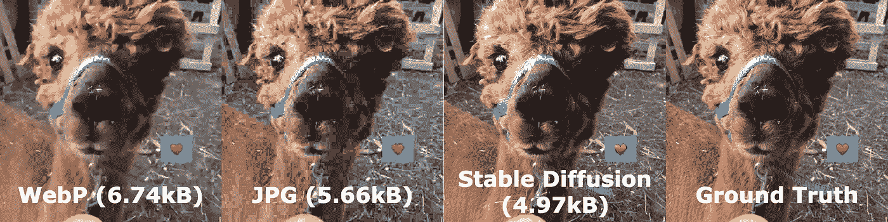

# 介绍

稳定的扩散目前正在激励开源机器学习社区，也让世界各地的艺术家感到不安。我很好奇，除了让专业艺术家和设计师思考他们的工作保障之外，这种有影响力的技术发布还能用于什么。

在试验这个模型时，我发现它是一个非常强大的有损图像压缩编解码器。在描述我的方法和分享一些代码之前，这里有一些在高压缩因子下与 JPG 和 WebP 进行比较的结果，所有结果都是 512x512 像素的分辨率:

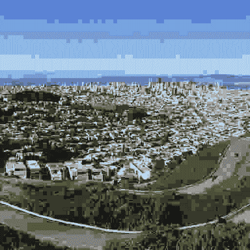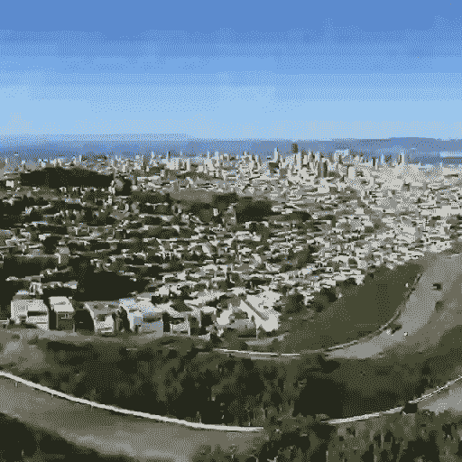

三藩市，从左到右:JPG (6.16kB)，WebP (6.80kB)，稳定扩散:(4.96kB)

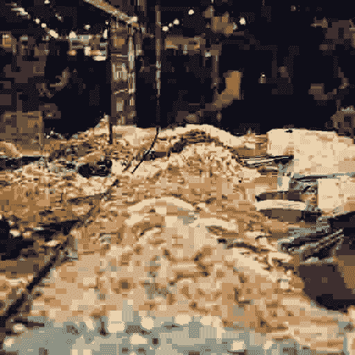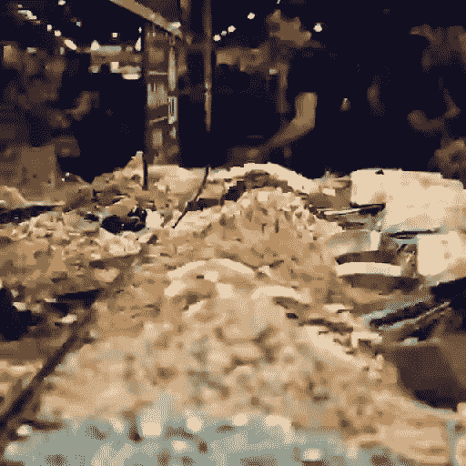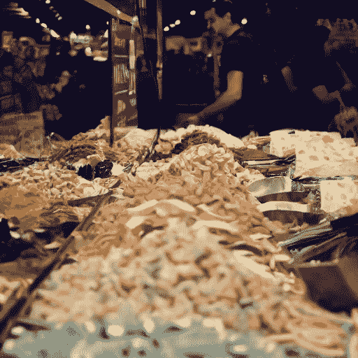

糖果店，从左到右:JPG (5.68kB)、WebP (5.71kB)、稳定扩散(4.98kB)

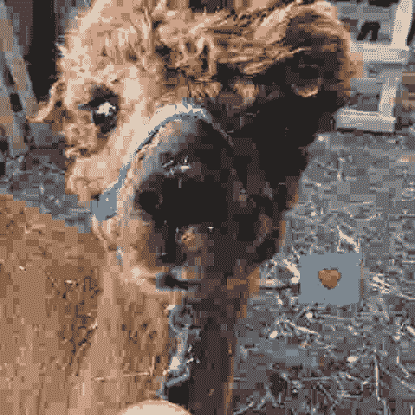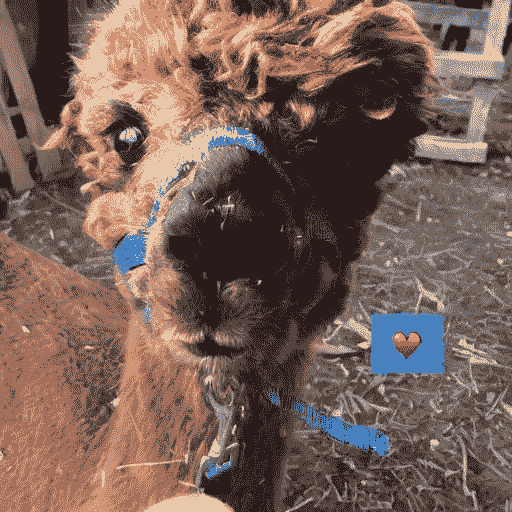

安娜，从左到右:JPG (5.66kB)，WebP (6.74kB)，稳定扩散(4.97kB)

这些例子表明，与 JPG 和 WebP 相比，使用稳定扩散压缩这些图像可以在更小的文件大小下产生更好的图像质量。这种质量带来了一些必须考虑的重要警告，我将在评估部分解释，但乍一看，这是一个非常有前途的积极有损图像压缩选项。

# 稳定扩散的潜在空间

稳定扩散串联使用三个经过训练的人工神经网络:

*   一个[变型自动编码器](https://en.wikipedia.org/wiki/Variational_autoencoder)
*   一个 [U 网](https://en.wikipedia.org/wiki/U-Net)
*   文本编码器

**变分自动编码器(VAE)** 将图像从图像空间编码和解码成某种潜在的空间表示。潜在空间表示是任何源图像(512 x 512，3×8 或 4×8 位)的较低分辨率(64×64)、较高精度(4×32 位)的表示。

VAE 如何将图像编码到这个潜在空间中，它在训练过程中自己学习，因此随着模型被进一步训练，模型的不同版本的潜在空间表示可能看起来不同，但是稳定扩散 v1.4 的表示看起来像这样(当被重新映射和解释为 4 通道彩色图像时):

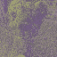

当重新缩放并将潜影解释为颜色值(使用 alpha 通道)时，图像的主要特征仍然可见，但是 VAE 也将较高分辨率的特征编码到这些像素值中。

VAE 的一次编码/解码往返如下所示:

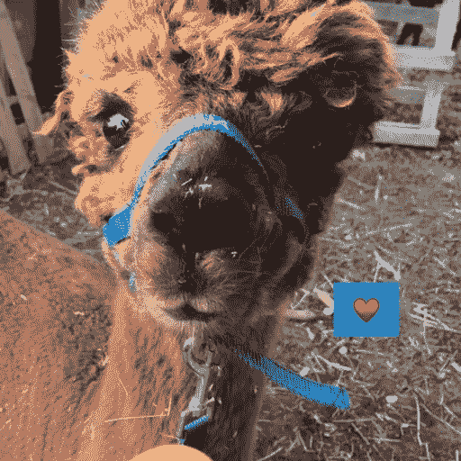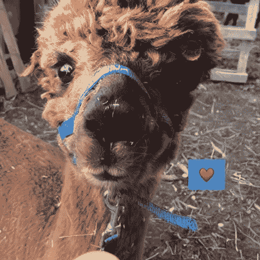

VAE 往返，从左到右:512x512@24bpp 地面真实，64x64@128bpp 潜在空间表示，512x512@24bpp 解码图像

注意，这个往返不是无损的。例如，在解码后，安娜在她头环上的名字稍微不太可读。1.4 稳定扩散模型的 VAE 通常不太擅长表示小文本(以及人脸，我希望 1.5 版本的训练模型会有所改善)。

稳定扩散的主要算法是根据简短的文本描述生成新图像，该算法对图像的潜在空间表示进行操作。它从潜在空间表示中的随机噪声开始，然后通过使用经过训练的 **U-Net** 对这个潜在空间图像进行迭代去噪，简单来说，它输出它认为它在噪声中“看到”的预测，类似于我们有时在看云时看到的形状和面孔。当使用稳定扩散来生成图像时，该迭代去噪步骤由第三 ML 模型(文本编码器)指导，该第三 ML 模型向 U-Net 提供关于它应该试图在噪声中看到什么的信息。对于这里介绍的实验图像编解码器，不需要文本编码器。下面分享的 Google Colab 代码仍然利用了它，但只是创建了一个空字符串的一次性编码，用于告诉 U-Net 在图像重建期间进行无指导去噪。

# 压缩法

为了使用稳定扩散作为图像压缩编解码器，我研究了如何有效地压缩 VAE 生成的潜在表示。在我的实验中，对潜伏时间进行下采样或对潜伏时间应用现有的有损图像压缩方法被证明会大大降低重建图像的质量。然而，我发现 VAE 解码似乎对潜在的[量化](https://en.wikipedia.org/wiki/Color_quantization)非常鲁棒。

通过缩放、箝位并随后重新映射将潜伏从浮点量化为 8 位无符号整数仅导致非常小的可见重构误差:

左:从 32 位浮点潜伏解码—中:地面真实—右:从 8 位整数潜伏解码

为了量化 VAE 产生的延迟，我首先用 1 / 0.18215 对它们进行缩放，这个数字你可能已经在稳定扩散源代码中见过了。似乎用这个数除 latents 可以很好地将它们映射到[-1，1]范围，尽管仍然会发生一些箝位。

通过将潜在位量化为 8 位，图像表示的数据大小现在是 64*64*4*8 位= 16 kB(低于未压缩基本事实的 512*512*3*8 位= 768 kB)

在我的实验中，将延迟量化到 8 位以下并没有产生好的结果，但令人惊讶的是，通过对它们进行[调色板化](https://en.wikipedia.org/wiki/Palette_(computing))和[抖动](https://en.wikipedia.org/wiki/Dither)来进一步量化。我用 256 个 4*8 位向量的潜在调色板和[弗洛伊德-斯坦伯格抖动](https://en.wikipedia.org/wiki/Floyd%E2%80%93Steinberg_dithering)创建了一个调色板式的表示。使用具有 256 个条目的调色板允许使用单个 8 位索引来表示每个潜在向量，使数据大小达到 64*64*8+256*4*8 位= 5 kB

然而，当直接用 VAE 解码时，palettized 表示现在确实导致一些可见的伪像:

从左开始解码:32 位潜在位—中间:8 位量化潜在位—右:带 Floyd-Steinberg 抖动的调色板式 8 位潜在位(注意可见失真)

调色板式潜伏时间的抖动引入了噪声，使解码结果失真。但是由于稳定扩散是基于潜在噪声的消除，我们可以使用 U-Net 来消除抖动引入的噪声。仅仅 4 次迭代之后，重建结果在视觉上非常接近未量化的版本:

左图:调色板化和抖动延迟后——中图:4 个去噪步骤后——右图:地面真实情况

虽然考虑到数据大小的极大减少(相对于未压缩的基本事实，压缩因子为 155 倍)，结果非常好，但也可以看到引入了伪像，例如压缩前不存在的心形符号上的光泽阴影。然而，有趣的是，这种压缩方案引入的伪像对图像内容的影响比对图像质量的影响更大，记住以这种方式压缩的图像可能包含这些类型的压缩伪像是很重要的。

最后，我使用 zlib 无损压缩调色板和索引，对于我测试的大多数样本来说，结果略低于 5kB。我研究了游程编码，但是抖动对于大多数图像只留下非常短的相同索引游程(即使对于那些在图像空间中压缩时对于游程编码非常有用的图像，例如没有很多渐变的图形)。我很确定，尽管在未来仍然有更多的优化潜力有待探索。

# 估价

为了评估这个实验性的压缩编解码器，我没有使用任何标准的测试图像或在线找到的图像，以确保我没有对可能在稳定扩散模型的训练集中使用的任何数据进行测试(因为这样的图像可能会获得不公平的压缩优势，因为它们的部分数据可能已经在训练模型中进行了编码)。此外，为了尽可能公平地进行比较，我对 Python 图像库的 JPG 和 WebP 压缩器使用了最高的编码器质量设置，并且我还使用 [mozjpeg](https://github.com/wanadev/mozjpeg-lossless-optimization) 库对压缩后的 JPG 数据进行了无损压缩。然后，我使用的压缩强度 1 小于会导致数据大小小于稳定扩散结果的压缩强度，或者最大强度(即使在最大有损 JPG 或 WebP 压缩下，许多图像也不会小于 SD 结果)。

值得注意的是，虽然稳定扩散结果在主观上看起来比 JPG 和 WebP 压缩图像好得多，但就 PSNR 或 SSIM 等标准测量指标而言，它们并没有明显更好(但也没有更差)。只是引入的伪像种类不太明显，因为它们对图像内容的影响比对图像质量的影响更大，然而这也是这种方法的一点危险:人们不能被重建特征的质量所欺骗，内容可能会受到压缩伪像的影响，即使它看起来非常清晰。例如，查看旧金山测试图像中的一个细节:

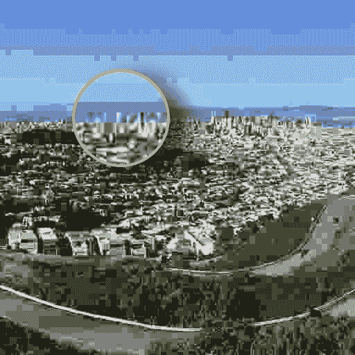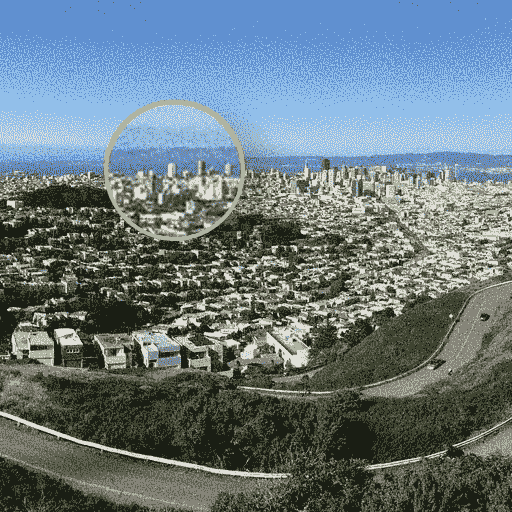

左:JPG 压缩—中:地面实况—右:稳定扩散压缩

正如您所看到的，虽然作为编解码器的稳定扩散在保留图像的定性方面更好(这是大多数传统压缩算法难以解决的问题)，但内容仍会受到压缩伪像的影响，并且建筑物形状等细微特征可能会发生变化。虽然在 JPG 压缩图像中肯定不可能比在稳定扩散压缩图像中识别出更多的基本事实，但是 SD 结果的高视觉质量可能具有欺骗性，因为 JPG 和 WebP 中的压缩伪像更容易被识别。

# 限制

稳定扩散 VAE 目前没有很好地保留一些特征，特别是小文本和人脸似乎是有问题的(这与在其模型卡上列出[的 V1.4 SD 模型的限制和偏见一致)。这里有三个例子可以说明这一点:](https://huggingface.co/CompVis/stable-diffusion-v1-4)

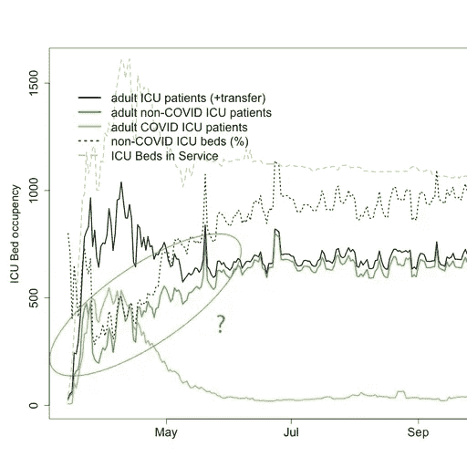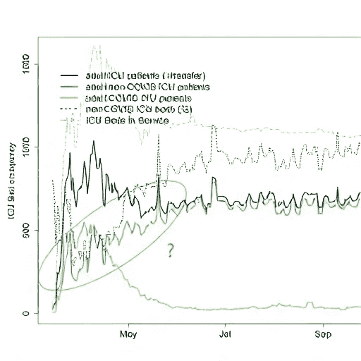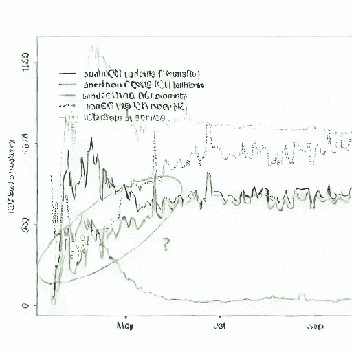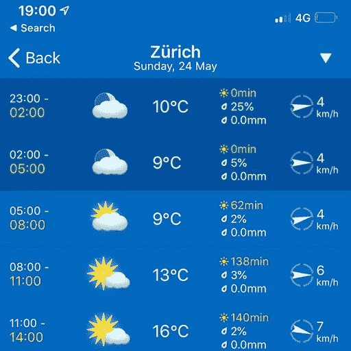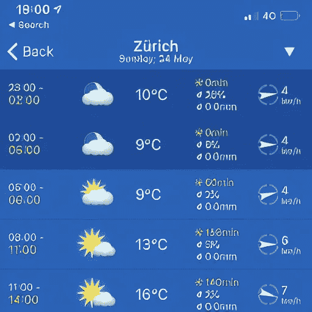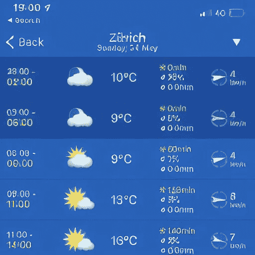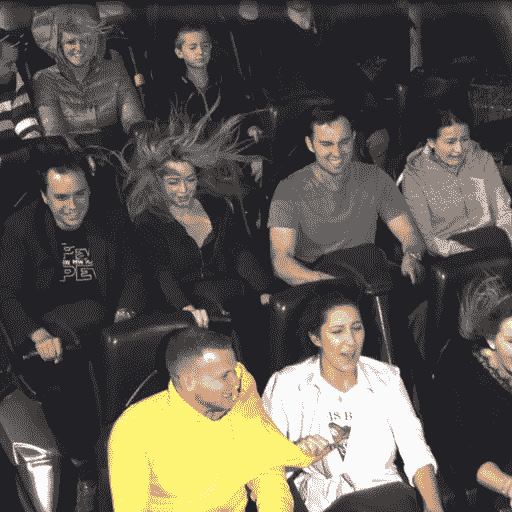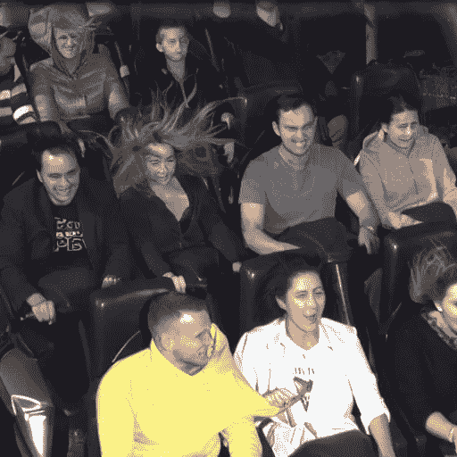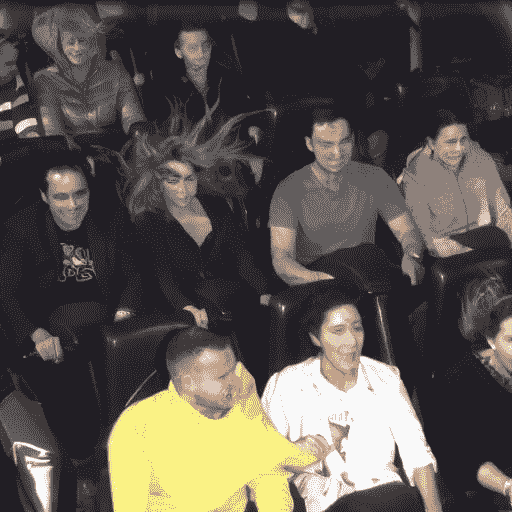

左:地面实况—中:直接 VAE 往返(32 位延迟)—右:从调色板化和去噪声的 8 位延迟中解码

正如您在中间一栏中看到的，当前的稳定扩散 1.4 VAE 模型不保留小文本，并且在其潜在空间中表现非常好，因此这种压缩方案继承了这些限制。但由于 1.5 版本的稳定扩散(目前仅在 stability.ai 的 Dreamstudio 中可用)似乎在人脸方面做得更好，我期待着在 1.5 模型公开发布后更新这篇文章。

# 这种方法与基于 ML 的图像恢复有何不同？

深度学习非常成功地用于恢复降级的图像和视频，或者将其放大到更高的分辨率。这种方法与恢复因图像压缩而降级的图像有何不同？

重要的是要理解，这里不使用稳定扩散来恢复图像空间中因压缩而降级的图像，而是将有损压缩应用于稳定扩散对该图像的内部理解，然后尝试“修复”有损压缩对内部表示造成的损坏(这与修复降级的图像不同)。

例如，这保留了相机颗粒(定性地)以及任何其他定性的退化，而高度压缩的 jpg 的 AI 恢复将不能恢复该相机颗粒，因为关于它的任何信息已经从数据中丢失。

为了给这种差异打个比方:假设我们有一个拥有摄影记忆的高技能艺术家。我们给他们看一个图像，然后让他们重新创建它，他们可以根据自己的记忆创建一个几乎完美的副本。这位艺术家的过目不忘是稳定扩散的 VAE。

在修复的情况下，我们会给这位艺术家看一张由于图像压缩而严重退化的图像，然后让他们根据记忆重建这张图像，但在某种程度上，他们认为这张图像应该是退化前的样子。

然而，在这里实现的例子中，我们向他们展示原始的、未压缩的图像，并要求他们尽可能好地记住它。然后，我们对他们进行脑部手术，通过有损压缩来缩小他们记忆中的数据，这种压缩去除了看起来不重要的细微差别，并用相同的变化替换了记忆图像中非常相似的概念和方面的变化。

手术后，我们要求他们根据记忆创建一个完美的图像重建。他们仍然会记得图像的所有重要方面，例如从内容到相机颗粒的定性属性，以及他们看到的每个建筑物的位置和总体外观，尽管相机颗粒的每个点的确切位置不再相同，并且他们现在会记得一些建筑物有奇怪的缺陷，这些缺陷实际上没有意义。

最后，我们要求他们再次绘制图像，但这一次，如果他们以一种非常奇怪的方式记住了一些对他们来说没有多大意义的方面，他们应该利用他们的经验以一种有意义的方式绘制这些东西(注意，“没有意义”并不等同于“不好”——模糊或有划痕的照片是不好的，但这种缺陷非常有意义)。

因此，在这两种情况下，艺术家被要求根据他们的经验画出他们认为应该看起来的东西，但是由于这里的压缩已经应用于他们对图像的记忆表示，其存储的概念多于像素，因此只有概念的信息内容被减少，而在恢复由图像压缩降级的图像的情况下，图像的视觉质量和概念内容都被降低，并且必须由艺术家发明。

这个类比也清楚地表明，这种压缩方案受到艺术家的摄影记忆效果的限制。在稳定扩散 v1.4 的情况下，他们不太擅长记住面孔，也患有阅读障碍。

# 密码

如果你想亲自尝试这个实验性的编解码器，你可以使用下面的 Google Colab:

[https://colab . research . Google . com/drive/1 ci 1 vyhufjk 5 eox 9 TB 0 MQ 4 nsqkedrmaah？usp =共享](https://colab.research.google.com/drive/1Ci1VYHuFJK5eOX9TB0Mq4NsqkeDrMaaH?usp=sharing)

# 结论

稳定扩散看起来非常有希望作为有损图像压缩方案的基础。

我在这里的实验非常浅，我希望除了这里描述的技术之外，还有更多压缩潜在空间表示的潜力，但是即使是这种相对简单的量化和抖动方案也已经产生了非常令人印象深刻的结果。

虽然专门为图像压缩设计和训练的 VAE 可能在这项任务中表现得更好，但使用稳定扩散 VAE 的巨大优势是，可以直接利用已经投入稳定扩散训练的 6-7 位数，而不必投入大量资金来训练这项任务的新模型。

# 附录:附加结果

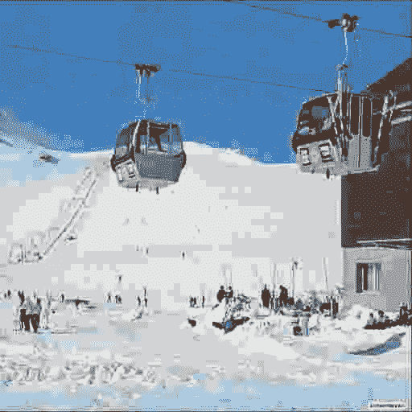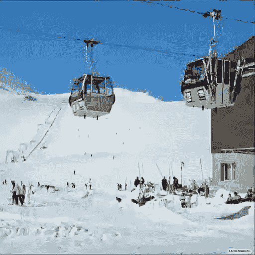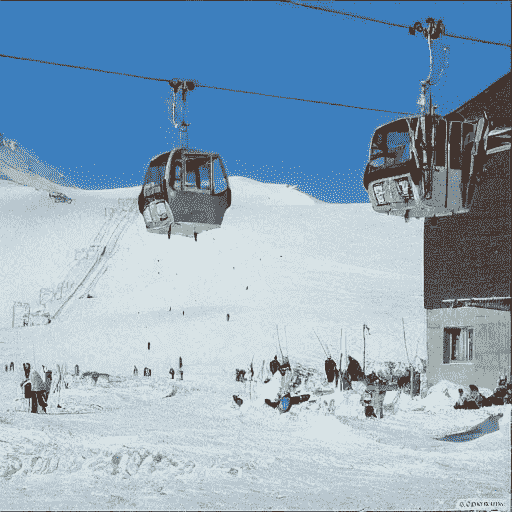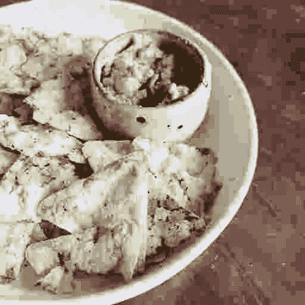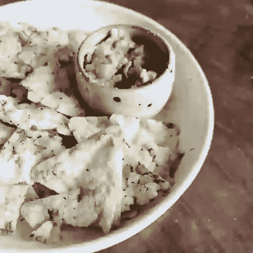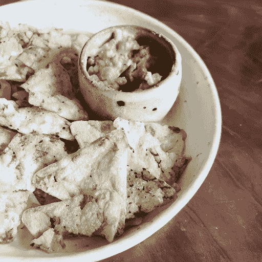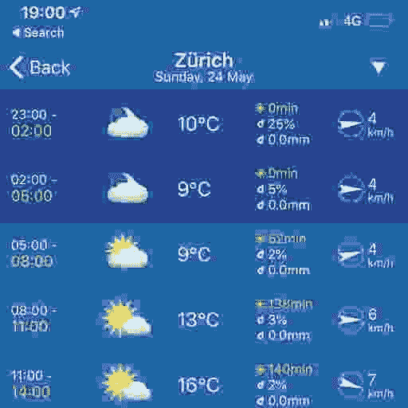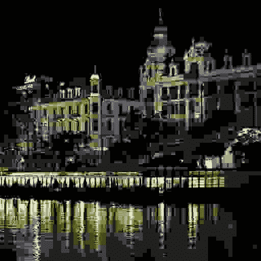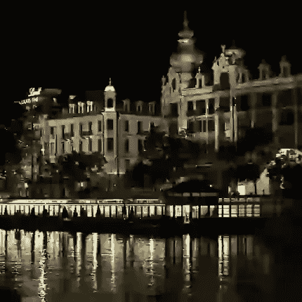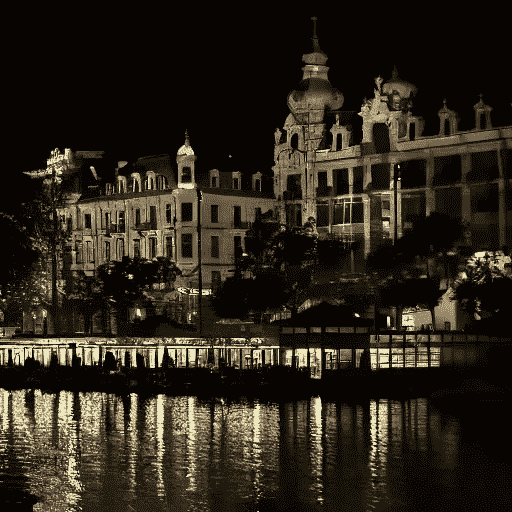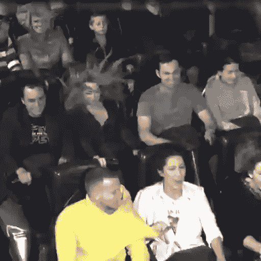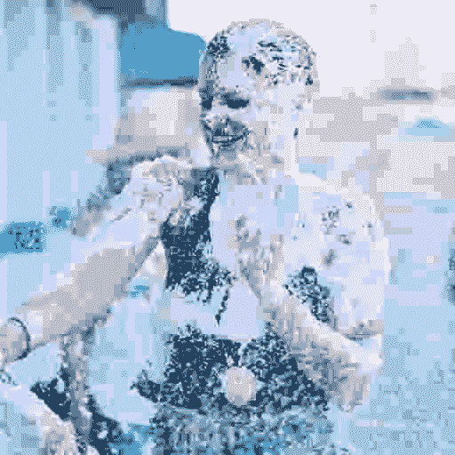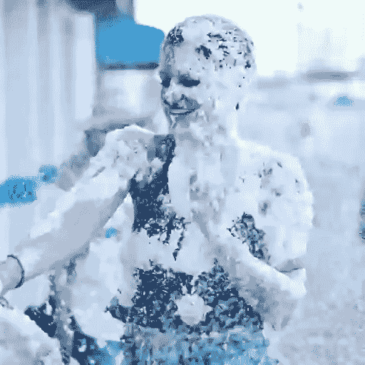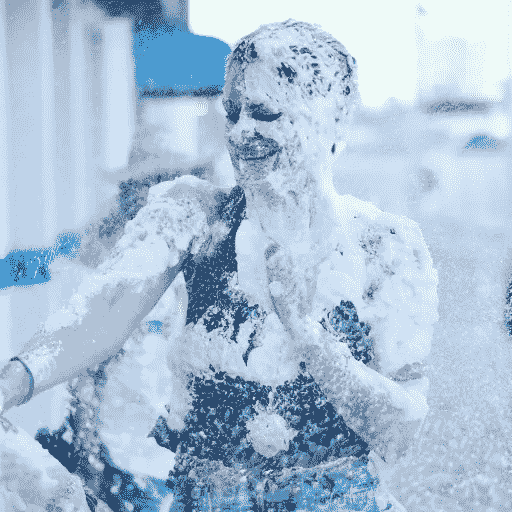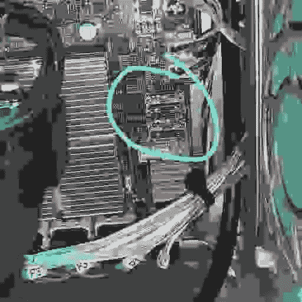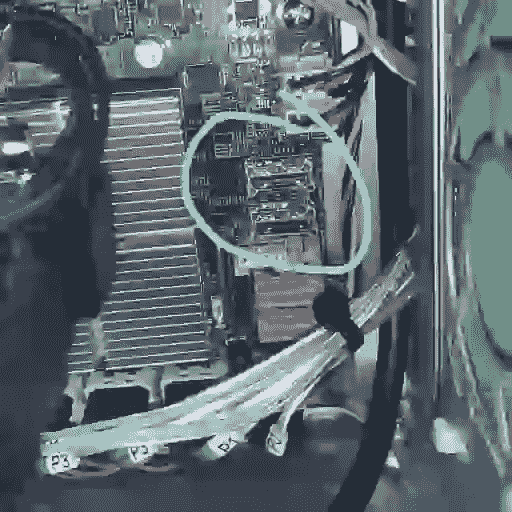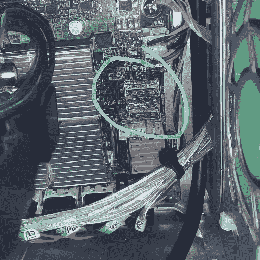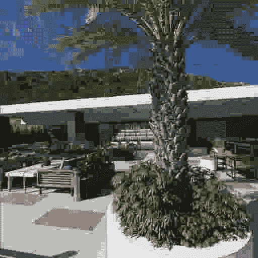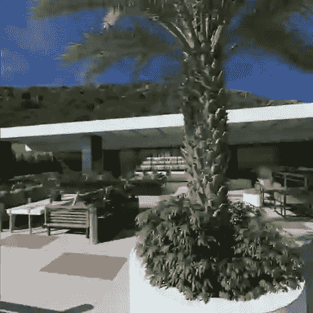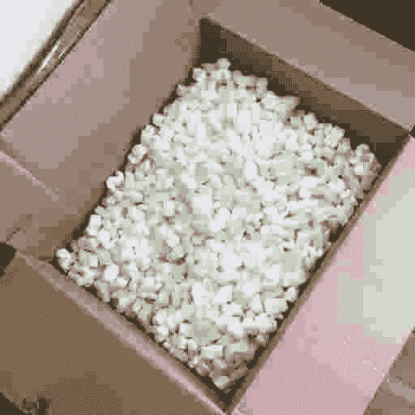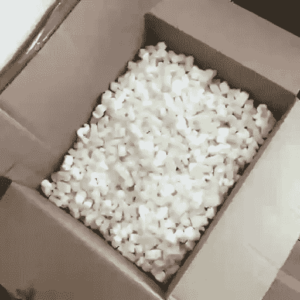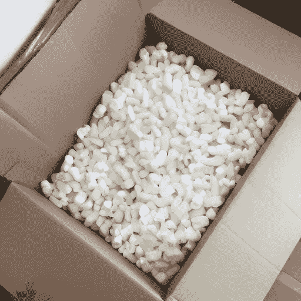

左:JPG —中:WebP —右:稳定扩散。在所有情况下，SD 图像被压缩成比相应的 JPG 和 WebP 图像更小的文件大小。没有樱桃采摘的结果。