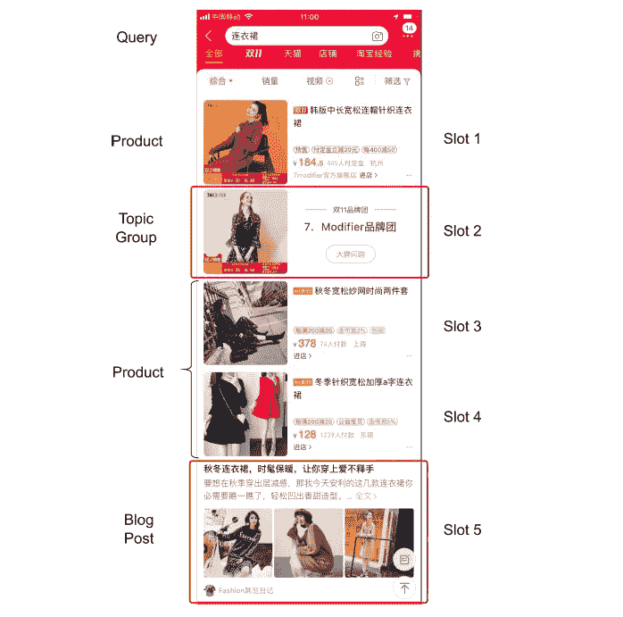
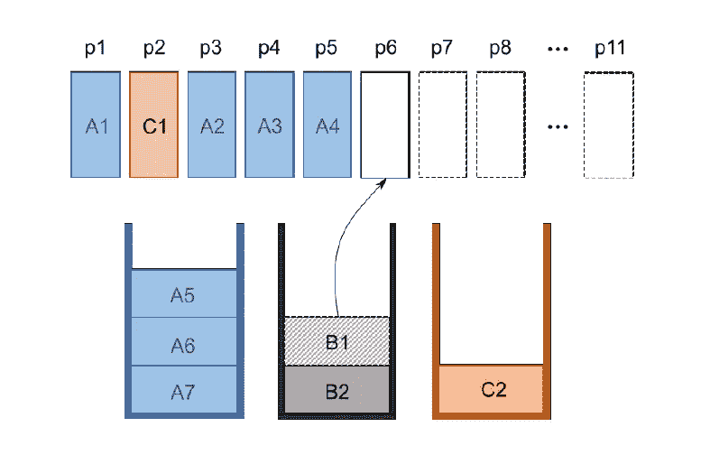
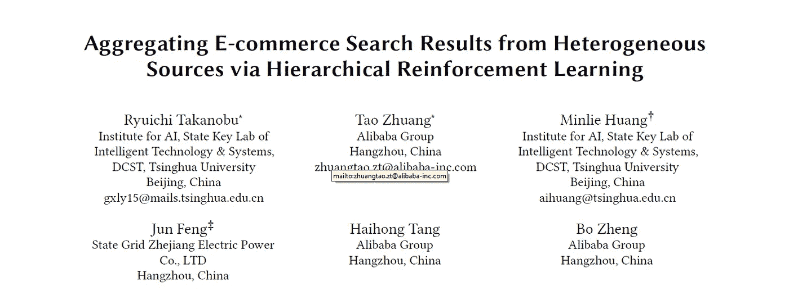

# 堆叠结果:阿里巴巴改善了网上购物者的搜索服务

> 原文：<https://pub.towardsai.net/stacking-results-alibaba-improves-search-services-for-online-shoppers-b8feae029e6c?source=collection_archive---------0----------------------->

## 学术阿里巴巴，WWW 系列| [走向 AI](https://towardsai.net)

## 尝试分层强化学习以获得显著的客户满意度结果

*本文是* [***学术阿里巴巴***](https://medium.com/@alitech_2017/academic-alibaba-b56f4176a838) *系列的一部分，摘自 WWW 2019 年题为“通过分层强化学习聚合来自异构来源的电子商务搜索结果”的论文，作者是隆一隆信、陶壮、黄敏烈、冯军、汤海宏和郑波。全文可以在这里阅读***。**

*在你的网络浏览器中搜索一种美食，你很可能会看到一个搜索结果页面，页面的开头是你附近的餐馆地图。不过，在你的搜索中添加一个像“制作”这样的词，你很可能会看到一份食谱的摘录，紧接着是烹饪视频的链接。*

*像浏览器一样，淘宝这样的电子商务平台根据对用户兴趣的理解，生成不同类型和顺序的聚合搜索结果。例如，除了产品页面的链接，搜索结果还可以包括关于某类商品的博客帖子或主题群，反映了复杂的算法决定，即是直接推销还是影响后来的购买。为了做出这些选择，系统通过给每个项目分配一个相关性分数来对巨大的候选项目池进行排序。问题是，不同来源类型(或“垂直市场”)的相关性分数不是直接可比的，这使得系统难以将来自异构垂直市场的项目编辑到页面中，从而推动销售。此外，在网络浏览器每次搜索只做一次的情况下，电子商务应用程序需要为每页结果重复选择垂直方向，以有效地满足购物者的期望。*

**

**淘宝上“服装”的综合搜索结果，主题和博客垂直搜索结果分别位于第 2 位和第 5 位。**

*现在，阿里巴巴的研究人员提出了一种新的分层强化学习(HRL)模型，该模型将结果选择分为源选择和项目呈现两个独立的任务，确保只需要对每个选择的源类型内的项目进行排名。通过将这两项任务表述为从用户行为中学习的顺序决策问题，该模型在使用淘宝实时搜索数据进行的关键指标测试中，产生了明显强于前人的结果。*

# *透视垂直市场*

*最近研究搜索结果价值的工作表明，异构资源的聚合有利于让用户根据偏好探索各种垂直领域。然而，研究也表明，展示不相关的垂直市场会很快产生负面印象，增加了引入多样性的风险。*

*为了增强对垂直市场的选择，所提出的模型引入了一个高级策略来响应用户行为的顺序模式。然后，它将其选择传递给一个低级表示策略，该策略将项目一次一个垂直地排列到堆栈中，将每个显示位置视为为相应堆栈中的顶部项目指定的槽选项。作为这种配置的结果，完全避免了跨垂直市场的不匹配相关性分数的问题。此外，该模型将 Q 网络应用于两种策略，以最小化训练过程中的分歧和振荡，并允许应用出于商业目的可能变得必要的约束，例如防止在结果页面中显示任何博客帖子。*

**

**物品选择过程概述，在该过程中，从垂直 A、B 和 C 中的分级堆叠中用物品填充槽位**

# *淘宝试用*

*为了评估所提出的模型的性能，研究人员使用每小时的实时搜索日志数据，按照一种称为桶测试的方法(许多人称为 A/B 测试)与竞争对手进行了测试。在准备阶段，用户被随机散列到偶数和偶数分布的桶中，每个桶接收一个算法进行为期两周的测试，以确保结果的统计稳定性。关键指标包括每个垂直市场的点击率(CTR)、考虑每个垂直市场花费的平均停留时间(ADT )(以秒计),以及以垂直市场占据的广告位数量表示的覆盖率(COV)。此外，还对每个搜索服务的商品总量(GMV)进行了测量，以测试其创收能力。*

*与基于规则和从学习到聚集方法的几个模型相比，提出的 HRL 模型在 ADT 和 COV 中实现了比基线大得多的 CTR 改进，同时保持了其他模型的稳定性能。此外，HRL 模式是唯一一个有效提高产品搜索 GMV 的模式——在这一领域，其他人甚至在提高话题组和博客垂直市场的 GMV 时都失败了。、*

**

**全文可上* [*Arxiv*](https://arxiv.org/abs/1902.08882) *阅读。**

# *阿里巴巴科技*

*关于阿里巴巴最新技术的第一手深度资料→脸书: [**“阿里巴巴科技”**](http://www.facebook.com/AlibabaTechnology) 。推特: [**【阿里巴巴技术】**](https://twitter.com/AliTech2017) 。*