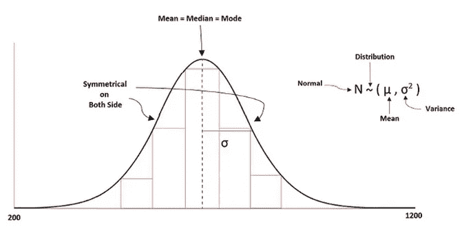

# 用 Python 实现数据预处理的标准化

> 原文：<https://pub.towardsai.net/standardization-in-data-preprocessing-with-python-96ae89d2f658?source=collection_archive---------0----------------------->

## [机器学习](https://towardsai.net/p/category/machine-learning)

## 机器学习和深度学习算法中的缩放方法


由[皮雷特·伊尔弗](https://unsplash.com/@saltsup?utm_source=medium&utm_medium=referral)在 [Unsplash](https://unsplash.com?utm_source=medium&utm_medium=referral) 上拍摄

标准化和规范化是机器学习和深度学习项目中大量使用的数据预处理技术。

**这些技术的主要作用**

*   以相似的格式缩放所有数据，使模型的学习过程变得容易。
*   数据中的奇数值被缩放或归一化，表现得像数据的一部分。

我们将通过 python 例子深入讨论这两个概念。

> ***标准化***

数据的基本缩放是使其标准化，以便所有值都在共同的范围内。在标准化中，数据的平均值和方差分别为零和一。它总是试图对数据进行正态分布。

标准化的公式如下所示:

**z =(列值—平均值)/标准差**



典型的均匀分布。一张由[作者](/data-preprocessing-concepts-with-python-b93c63f14bb6?source=friends_link&sk=5cc4ac66c6c02a6f02077fd43df9681a)拍摄的照片

机器学习中的一些算法试图感觉数据具有正态分布。但是，如果一个特征具有较大的方差，而其他特征具有较小的方差或单位方差，那么模型的学习将是不正确的，因为从一个特征到另一个特征的方差不同。

如上所述，标准标度的范围是“0”平均值和“1”单位方差。

**我们如何使用标准缩放？**

要使用标准缩放，我们需要从预处理类导入它，如下所示:

```
from sklearn.preprocessing import StandardScaler
                     or
from sklearn import preprocessing
scaler = preprocessing.StandardScaler()
```

**使用标准缩放的正确步骤是什么？**

我们可以在训练测试分割后使用标准缩放，因为如果我们在此之前使用，可能会出现数据泄漏的问题，从而导致模型不太可靠。如果我们在分割之前进行缩放，那么从训练中学习的过程也可以在测试集上进行，这是我们不想要的。你可以在这篇[文章](/tips-and-tricks-in-machine-learning-with-python-to-avoid-data-leakage-c3908fa4a0c9?source=friends_link&sk=ebd984646cc74aad31cb9ccf7e4273b0)中看到更多关于数据泄露的信息。

让我们借助 sklearn 库来看看拆分过程

```
from sklearn.model_selection import train_test_splitX_train, X_test, y_train, y_test = train_test_split(x,
                   y, train_size = 0.20, random_state = 42)
```

在此之后，我们可以使用标准缩放

```
from sklearn.preprocessing import StandardScaler
sc = StandardScaler()
X_train = sc.fit_transform(X_train)
X_test = sc.transform(X_test)
```

我们举一个 python 的例子。

```
from sklearn import preprocessing
import numpy as np#creating a training data
X_train = np.array([[ 4., -3.,  2.], 
                    [ 2.,  2.,  0.], 
                    [ 0.,  -6., 7.]])#fit the training data
scaler = preprocessing.StandardScaler().fit(X_train)
scaler**#output:**
StandardScaler()
```

现在，我们将检查训练数据中每个特征的平均值和比例。

```
scaler.mean_**#output:**
array([ 2., -2.33333333, 3.])scaler.scale_**#output:**
array([1.63299316, 3.29983165, 2.94392029])
```

`scale_`属性查找要素之间的相对比例，以获得标准比例，即零均值和单位方差。用于计算每个要素平均值的`mean_`属性。

现在，我们将转换我们的缩放数据

```
X_scaled = scaler.transform(X_train)
X_scaled**#output:**
array([[ 1.22474487, -0.20203051, -0.33968311],
       [ 0\.        ,  1.31319831, -1.01904933],
       [-1.22474487, -1.1111678 ,  1.35873244]])
```

要检查要素的零均值和单位方差，我们将找到均值和标准差。

```
X_scaled.mean(axis=0)**#output:**
array([0., 0., 0.])X_scaled.std(axis=0)**#output:**
array([1., 1., 1.])
```

我们还可以在`MinMaxScaler`和`MaxAbsScaler`的帮助下进行范围缩放。

有时，我们在影响算法建模的数据中有异常值，并且标准缩放器受到异常值的影响，并且像 min-max 和 max-abs 缩放器这样的其他方法使数据在某个范围内。

## 最小最大缩放器

`MinMaxScaler`是在[0，1]范围内缩放数据的另一种方法。它保持数据的原始形态，保留有价值的信息，较少受离群值的影响。

python 示例如下所示:

```
from sklearn import preprocessing
import numpy as np#creating a training data
X_train = np.array([[ 4., -3.,  2.], 
                    [ 2.,  2.,  0.], 
                    [ 0.,  -6., 7.]])min_max_scaler = preprocessing.MinMaxScaler()
X_train_minmax = min_max_scaler.fit_transform(X_train)
X_train_minmax**#output:**
array([[1\.        , 0.375     , 0.28571429],
       [0.5       , 1\.        , 0\.        ],
       [0\.        , 0\.        , 1\.        ]])
```

使用`MinMaxScaler`缩放后，我们可以看到数据在“0”到“1”的范围内。

[](/data-preprocessing-concepts-with-python-b93c63f14bb6) [## Python 中的数据预处理概念

### 一种为机器学习估值器准备数据的稳健方法

pub.towardsai.net](/data-preprocessing-concepts-with-python-b93c63f14bb6) [](/different-data-splitting-cross-validation-strategies-with-python-ec7cd93764ac) [## 使用 Python 的不同数据分割交叉验证策略

### 机器学习中的训练集、验证集和测试集

pub.towardsai.net](/different-data-splitting-cross-validation-strategies-with-python-ec7cd93764ac) 

## MaxAbsScaler

这是另一种缩放方法，其中数据在[-1，1]的范围内。这种缩放的好处是，它不会移动数据或使数据居中，并保持数据的稀疏性。

python 示例如下所示:

```
from sklearn import preprocessing
import numpy as np#creating a training data
X_train = np.array([[ 4., -3.,  2.], 
                    [ 2.,  2.,  0.], 
                    [ 0.,  -6., 7.]])max_abs_scaler = preprocessing.MaxAbsScaler()
X_train_maxabs = max_abs_scaler.fit_transform(X_train)
X_train_maxabs**#output:**
array([[ 1\.        , -0.5       ,  0.28571429],
       [ 0.5       ,  0.33333333,  0\.        ],
       [ 0\.        , -1\.        ,  1\.        ]])
```

我们可以看到用`MaxAbsScaler`缩放后的数据在'-1 '到' 1 '的范围内。

> ***结论***

数据的缩放是机器学习或深度学习非常重要的一部分。在本文中，`MaxAbsScaler`在稀疏数据中很有用，而另一方面，标准缩放也可以用于稀疏数据，但也会因为过多的内存分配而产生值错误。

我希望你喜欢这篇文章。通过我的 [LinkedIn](https://www.linkedin.com/in/data-scientist-95040a1ab/) 和 [twitter](https://twitter.com/amitprius) 联系我。

# 推荐文章

[1。NLP —零到英雄与 Python](https://medium.com/towards-artificial-intelligence/nlp-zero-to-hero-with-python-2df6fcebff6e?sk=2231d868766e96b13d1e9d7db6064df1)
2。 [Python 数据结构数据类型和对象](https://medium.com/towards-artificial-intelligence/python-data-structures-data-types-and-objects-244d0a86c3cf?sk=42f4b462499f3fc3a160b21e2c94dba6)3 .[Python 中的异常处理概念](/exception-handling-concepts-in-python-4d5116decac3?source=friends_link&sk=a0ed49d9fdeaa67925eac34ecb55ea30)
4。[用 Python 进行主成分分析降维](/principal-component-analysis-in-dimensionality-reduction-with-python-1a613006d531?source=friends_link&sk=3ed0671fdc04ba395dd36478bcea8a55)
5。[用 Python 全面讲解 K-means 聚类](https://medium.com/towards-artificial-intelligence/fully-explained-k-means-clustering-with-python-e7caa573176a?source=friends_link&sk=9c5c613ceb10f2d203712634f3b6fb28)
6。[用 Python](https://medium.com/towards-artificial-intelligence/fully-explained-linear-regression-with-python-fe2b313f32f3?source=friends_link&sk=53c91a2a51347ec2d93f8222c0e06402)
7 全面讲解了线性回归。[用 Python](https://medium.com/towards-artificial-intelligence/fully-explained-logistic-regression-with-python-f4a16413ddcd?source=friends_link&sk=528181f15a44e48ea38fdd9579241a78)
充分解释了 Logistic 回归 8。[concat()、merge()和 join()与 Python](/differences-between-concat-merge-and-join-with-python-1a6541abc08d?source=friends_link&sk=3b37b694fb90db16275059ea752fc16a)
的区别 9。[与 Python 的数据角力—第一部分](/data-wrangling-with-python-part-1-969e3cc81d69?source=friends_link&sk=9c3649cf20f31a5c9ead51c50c89ba0b)
10。[机器学习中的混淆矩阵](https://medium.com/analytics-vidhya/confusion-matrix-in-machine-learning-91b6e2b3f9af?source=friends_link&sk=11c6531da0bab7b504d518d02746d4cc)