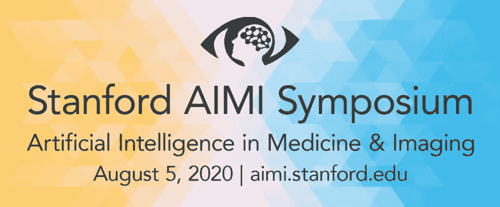
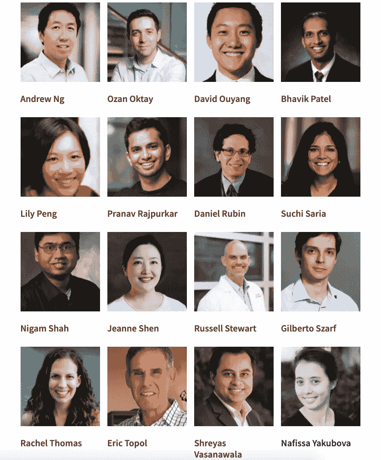
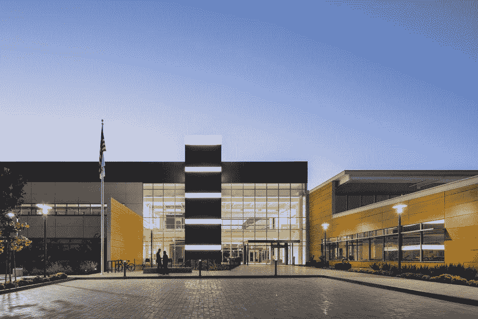
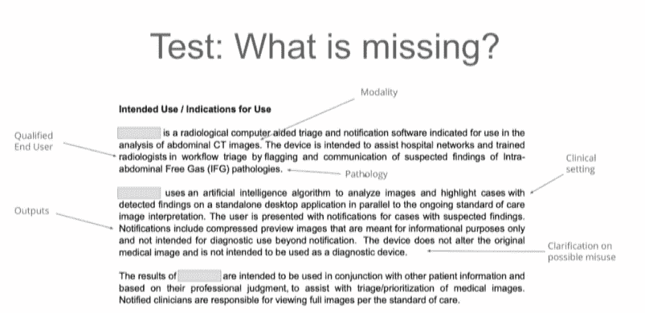

# 斯坦福大学 2020 年 AIMI 研讨会综述

> 原文：<https://pub.towardsai.net/stanfords-2020-aimi-symposium-a-brief-summary-af7f914252af?source=collection_archive---------5----------------------->

## [人工智能](https://towardsai.net/p/category/artificial-intelligence)，[观点](https://towardsai.net/p/category/opinion)

*斯坦福大学医学和成像中心 2020 年人工智能研讨会的简要概述和要点。*

图片来源:[斯坦福 AIMI 中心](https://aimi.stanford.edu/)

8 月 5 日星期三，斯坦福人工智能和医学成像中心举行了首次 AIMI 研讨会，这是一次斯坦福人工智能专家讨论医疗保健和医学中与人工智能相关的任何事情的会议。会议邀请了人工智能和医学领域的数十位知名人士，如吴恩达、埃里克·托帕尔等。从博士生到高中生到没有人工智能经验的开发人员，这次会议对所有类型的与会者来说都是信息丰富和互动的。本文将快速回顾此次活动，并重点介绍此次活动的一些要点。

小组中的几位发言者— [归功于](https://aimi.stanford.edu/news-events/aimi-symposium/speakers)

该活动分为五个不同的环节，每个环节都有演讲者讨论各种不同的主题。在每次会议结束时，整个小组都参加了现场问答，问题来自主持人 Matthew Lungren 和 Serena Young 以及参与者的现场聊天。此外，在会议间隙，还有多次炉边聊天，发言者以更随意的方式讨论会议主题。

他们以简短的欢迎词和开场白开始。在这些讲话中，斯坦福大学首先宣布了位于帕洛阿尔托 Page Mill 路 1701 号的新 AIMI 中心的开幕。该中心将接待一些世界上最聪明的研究人员，他们将继续发现医学成像领域的新进展，同时在一个美丽的设施中工作。

新 AIMI 中心— [学分](https://aimi.stanford.edu/)

此外，对于所有机器学习工程师和数据科学家来说，一个令人兴奋的发现是关于斯坦福大学的新新冠肺炎数据仓库，这是首批发布的数据仓库之一，也是迄今为止最大的数据仓库。该存储库将于今年晚些时候发布，并将包括一个完全标记的放射学数据集，这是对人工智能医学成像领域的一个巨大贡献。

第一场会议的题目是*用人工智能使医疗保健民主化。*这是迄今为止最引人入胜、最有趣的一次会议，因为它就如何让所有人都能获得高水平的研究提出了许多真知灼见。第一场会议首先强调了高水平研究和真正能从研究中受益的人之间的差距。所有发言人都强调了从研究中开发出真正有助于该领域的产品的重要性。已经取得了一些进展，其中一些包括智能手机供电的超声波，基于智能手表的 Afib 诊断，甚至人工智能供电的节食应用程序。

对于人工智能的民主化，他们也涵盖了一些重要的误解。首先，更多的数据总是能创造出更好的模型。这在医学成像中是不正确的，已经被许多研究证明了。例如，一项关于诊断糖尿病视网膜病变的研究发现，在过去的 50k 张图像中，模型不再改进，研究人员发现，花费所有时间试图找到更多数据集是浪费他们的时间。随后，另一个神话是，一个好的模型自动是一个好的产品。这忽略了一个事实，即一个模型需要是通用的，必须适应不同的领域，交叉验证是一个很好的方法来解决这个问题。此外，如果模型对用户不友好或者不适合用户的工作流程，人们就不会使用它。最重要的是，即使有了一个伟大的产品，这并不总是转化为临床影响。对于临床影响，公司需要考虑作为其领域一部分的所有系统因素和法规，以及它们如何限制其影响。访问和方便是这一过程的重要组成部分，Google 的 Lily Peng 强调这通常是这一过程中最困难的部分。发言者强调了民主化的重要性以及为什么这是一项如此艰巨的任务，并提出了如何减少障碍的想法。

关于推广人工智能的使用，第 2 场会议重点介绍了所有相关法规。Nines 副总裁 Russel Stewart 和儿科放射学教授 David Larson 等发言人都解释说，法规是开发该领域新产品的最大障碍，知道如何有效地取悦 FDA 等组织是开发突破性产品的关键因素。

标准法规文档以及如何满足他们的要求—鸣谢:Hugh Harvey

在午休期间，大会举办了一场速度交流活动，邀请所有与会者参加 Zoom 电话会议，他们被安排到 4-5 人的分组讨论室，让与会者有机会结识该领域的新学生和开发人员。我真的很喜欢这次活动，尽管只有 30 分钟，但我认识了来自世界各地的 10 多位新人，了解了他们在人工智能方面的经历和他们未来的目标。虽然作为唯一一个被博士和研究生包围的高中生，我确实感到有点疏远，但在与他们相处的短暂时间里，我仍然学到了很多东西，认识了很多优秀的人，这使这成为一次无与伦比的经历。

活动的后半部分继续构建人工智能的概念。由于前半部分侧重于新的创新，后半部分更侧重于人工智能作为一个整体以及它如何改变医疗领域。在一次炉边聊天中，吴恩达和放射学教授朱迪·吉乔亚(Judy Gichoya)讨论了他们如何相信人工智能是第四次工业革命，以及它对医学和医疗保健的意义。吴恩达甚至宣称，人工智能将像电力的出现一样具有革命性和影响力。

在会议结束时，发言者讨论了公平在临床机器学习中的重要性。比以往任何时候都更重要的是，发言者强调，拥有公平和无偏见的临床机器学习技术是机器学习任何扩展的基础。一个有趣的例子是，由于 Fitbit 使用绿光技术，因此它的设计方式在黑色素浓度较高的皮肤上不太准确，这表明人工智能存在明显的偏见问题。同样，当设计由数据驱动的机器学习算法时，考虑数据集内存在的偏见和不平衡是关键。

2020 年 AIMI 会议充满了斯坦福大学杰出人才的真知灼见。以下是一些重要的要点:

*   人工智能在医学上最大的问题是缺乏民主化
*   研究需要转化为应用
*   开发人工智能产品时，取悦监管机构是关键
*   当开发最大似然算法时，需要考虑偏见和种族主义
*   人工智能将成为第四次工业革命，对医学来说意义重大

> 人工智能不会取代医生，但利用人工智能的医生会取代不利用人工智能的医生。

最终，近年来，人工智能在医学成像和医学领域的研究和进步是巨大的。斯坦福大学一直是人工智能在医学领域的开拓者，在未来几年，我们可以期待更多的进步和应用。2020 年 AIMI 会议对学生和工程师来说是一次很好的体验，他们可以了解该领域，并由世界上顶尖的教授和研究人员回答他们迫切的问题。希望在明年的会议上，我们可以看到今年会议上提出的许多问题得到解决，机构群体迫不及待地期待明年的展示。

除了 AIMI 研讨会，AIMI 中心还举办欢乐时光讨论，他们在现场观众面前讨论各种话题，这些讨论在这里进行直播:[https://stanfordr3.sg-host.com/](https://stanfordr3.sg-host.com/)，并上传到他们的 youtube 上。

关于本次活动的议程、演讲人和一般信息，请访问:[https://aimi . Stanford . edu/news-events/aimi-symposium/overview](https://aimi.stanford.edu/news-events/aimi-symposium/overview)

对于活动的现场录音(将在几周内上传)，请访问:【https://www.youtube.com/channel/UCiHlZ1osvJ_1C8K5MCnJp7w 