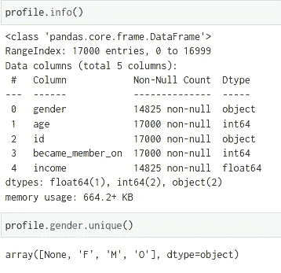
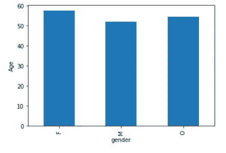
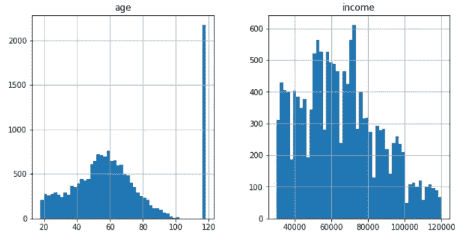
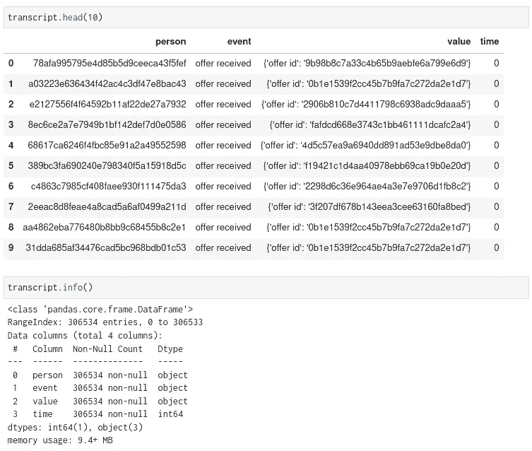
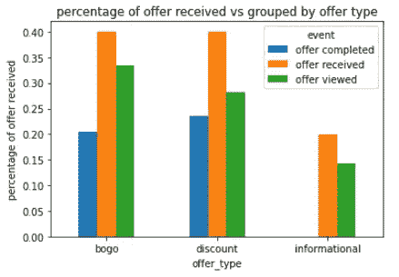
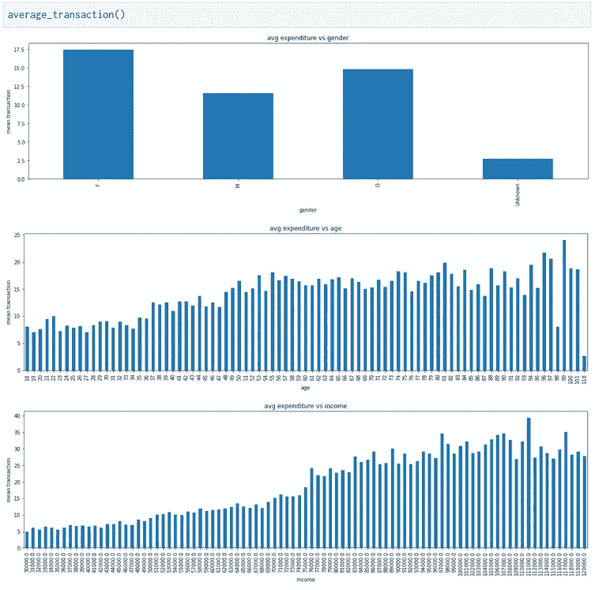

# 星巴克销售分析-第一部分

> 原文：<https://pub.towardsai.net/starbucks-sales-analysis-part-1-2fff081f1c4f?source=collection_archive---------4----------------------->

## [数据分析](https://towardsai.net/p/category/data-analysis)

深入了解星巴克的销售数据！

每一个数据都在讲述一个故事！作为 Udacity 数据科学纳米学位项目的一部分，我有幸看了一下星巴克的销售数据。在这个顶点项目中，我可以自由地用自己的方式分析数据。所以，在这篇博客中，我会试着解释我所做的。

# **数据集概述**

创建这些数据是为了获得以下内容的概述:

*   观察人们基于不同促销优惠的购买决策。
*   有三种类型的优惠:BOGO(买一送一)，折扣和信息。我想看看这些优惠对购买的影响。
*   最后，我想看看优惠是如何影响特定人群的。

数据集中有 3 个文件:

## profile.json

奖励计划用户(17000 个用户 x 5 个字段)

*   性别:(分类)M、F、O 或空
*   年龄:(数字)缺少编码为 118 的值
*   id:(字符串/哈希)每个用户的 id。
*   于:(日期)格式 YYYYMMDD
*   收入:(数字)

## 作品集. json

在 30 天测试期内发送的报价(10 个报价 x 6 个字段)

*   奖励:(数字)为所花金额而奖励的钱
*   渠道:(列表)网络、电子邮件、手机、社交
*   难度:(数字)获得奖励所需花费的钱
*   duration:(数字)报价开放的时间，以天为单位
*   offer_type: (string) BOGO，折扣，信息
*   id:(字符串/散列)优惠的 id

## 抄本. json

事件日志(306648 个事件 x 4 个字段)

*   人:(字符串/哈希)
*   event: (string)收到报价、查看报价、交易、完成报价
*   值:(字典)不同的值取决于事件类型
*   报价 id:(字符串/散列)不与任何“交易”相关联
*   金额:(数字)在“交易”中花费的钱
*   奖励:(数字)从“出价完成”中获得的钱
*   时间:(数字)测试开始后的小时数

# **问题陈述**

我试图回答三个主要问题。

1.  **基于优惠类型和人口统计的消费模式是什么？**
2.  **如何根据当前客户的消费模式向他们推荐优惠券/优惠？**
3.  **如何向新客户推荐优惠券/优惠？**

# **数据分析**

从 **portfolio.json** 文件中，我发现有 3 种不同类型的 10 个报价: **BOGO、折扣、信息。**

BOGO:对于买一送一的优惠，我们需要购买一个产品才能获得与阈值相等的产品。

折扣:在这项优惠中，用户需要花费一定的金额才能获得折扣。

信息:这种类型的优惠没有折扣或最低消费金额。

为了兑现这些优惠，人们必须花费 0、5、7、10 或 20 美元。



**profile.json** 数据是 17000 个唯一人的信息。数据有一些空值。通过查看数据，我们可以说有些人没有透露他们的性别、年龄或收入。这就是为什么我们在性别和收入列中有**相同数量的空值**，而相应的年龄列有 118 作为年龄。

**配置文件数据的分布**



图一。左图:平均年龄与性别的分布；右图:年龄和收入数据的分布

概况数据在不同性别中具有相同的平均年龄分布。

正如我们所看到的，年龄数据几乎是高斯分布(稍微右偏)，118 是异常值，而收入数据是右偏的。



**transcript.json** 数据有 17000 个独特的人的交易细节。4 种类型的事件被注册，**交易、收到的报价和查看的报价**

**值**列有*报价 id* 或*交易金额*。

# **数据预处理**

回答第一个问题:**基于优惠类型和人口统计的消费模式是什么？**我会重新整理数据文件，试着回答几个问题来回答问题 1。

这些子问题是:

*   有哪些热门优惠？
*   不同性别如何利用优惠？
*   交易如何随性别、年龄和收入而变化？

首先，我合并了 *portfolio.json、profile.json 和 script.json* 文件，以添加**人口统计信息和提供信息**以便更好地可视化。因此，我的新数据集包含以下几列:

```
'person', 'event', 'value', 'time', 'gender', 'age', 'income', 'date'.
```

此外，我将“空”性别改为“未知”，使其成为一个新特性。

为了更好地理解，让我们回顾一下这些栏目:

*   个人(类别):17000 个独立用户。
*   事件(类别):4 个唯一的类别:**已完成要约、已收到要约、已查看要约和交易**。
*   value(category/numeric):当 event = 'transaction '时，值为数字，否则为 categoric，提供 id 为类别。
*   时间(数字):0 是实验的开始。
*   性别(类别):4 个唯一类别:**男、女、其他、未知。**
*   年龄(数字):数字列，118 为未知或异常值。
*   收入(数字):数字列，带有一些对应于 118 年龄的空值。
*   日期:事务处理的日期。

## 受欢迎的优惠类型有哪些？

我们可以画出 BOGO、折扣和信息的分布报价的百分比，并最终找出报价被接收、查看和完成的百分比。

为此，我将报价数据从交易数据中分离出来(event = 'transaction ')。



图二。收到的报价与报价类型的百分比

我们可以看到，信息提供不需要完成。虽然， **BOGO 和折扣**报价分布均匀，

*   BOGO 的优惠比折扣优惠更受关注。
*   但是，折扣优惠完成得更多。

因此，**的折扣优惠在完工方面更受欢迎。**

**不同性别是如何利用优惠的？**

由于“信息性”报价没有报价完成，我们可以忽略包含“信息性”报价的行，以找出查看的报价和报价完成之间的关系。


图 3 报价类型与性别

从“按性别划分的平均录取人数”图中，我们看到按性别划分的人均录取人数**几乎相同**。

“按性别划分的聘用分布”图显示了按性别划分的已接收聘用中已浏览聘用的百分比以及已完成聘用的百分比。

我们看到，

*   **其他**顾客查看的优惠最多，并且
*   **男性**顾客查看的优惠最少。
*   **女性**顾客完成的报价最多，
*   **未知**组完成的报价最少。

我们可以说，给定一个提议，在**女性**和**其他**性别中，兑现提议的机会更高！

交易如何随性别、年龄和收入而变化？

让我们从交易数据中找出**性别、年龄和收入**与平均交易金额的关系。



图 4。年龄、性别、收入对平均支出的依赖性

我们可以看到**年龄**和**收入**对支出的预期趋势。随着年龄和收入的增长，平均支出也在增加。

*   在性别图中，我们看到**女性**倾向于花费最多，而没有人口统计数据的群体(**未知**性别)倾向于花费最少。
*   年龄和平均消费呈正相关。
*   收入越高，人们花费越多。

# **结论**

因此，总而言之，回答**基于优惠类型和人口统计的消费模式是什么？**

可能的答案是，

*   虽然 BOGO 的报价被浏览的更多，但是从完成情况来看**折扣报价更受欢迎**。
*   给定一个提议，在**女性**和**其他**性别中，兑现提议的机会更高！
*   女人往往花钱最多。
*   支出随着年龄和收入的增加而增加。

在这个博客的第二部分，我会解释，

*   如何根据当前客户的消费模式向他们推荐优惠券/优惠？
*   **如何向新客户推荐优惠券/优惠？**

这篇博客第二部分的链接可以在[这里](https://abhijana.medium.com/starbucks-sales-analysis-part-2-ff9e3c413b07)找到。

这个项目的 GitHub 库可以在这里找到。