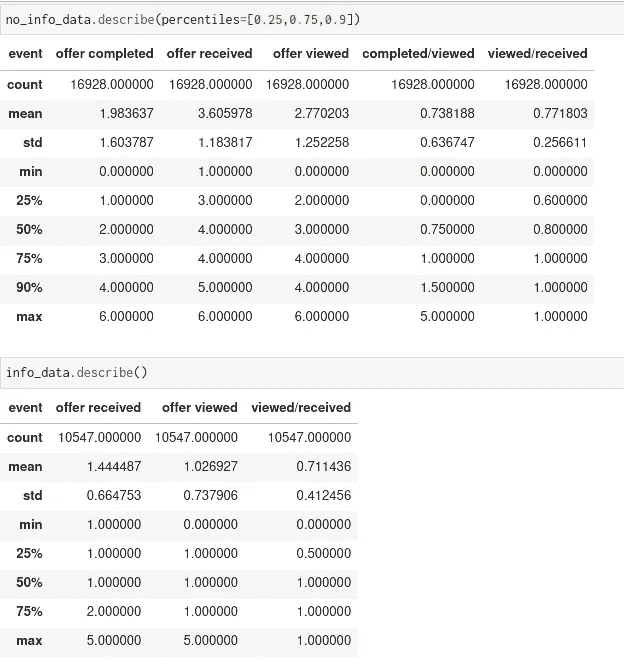
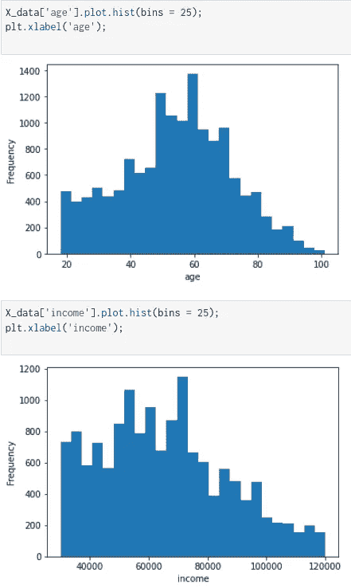
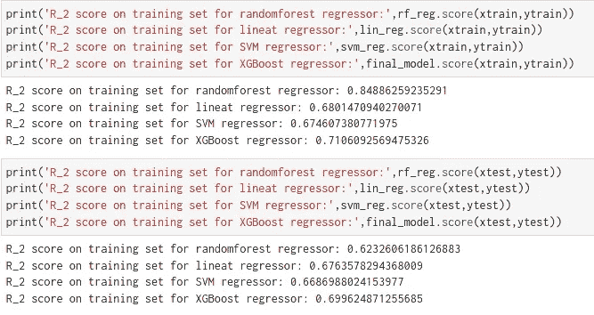
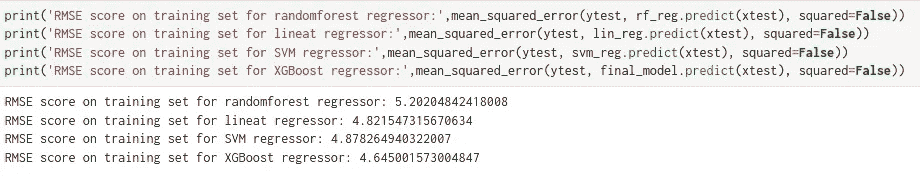
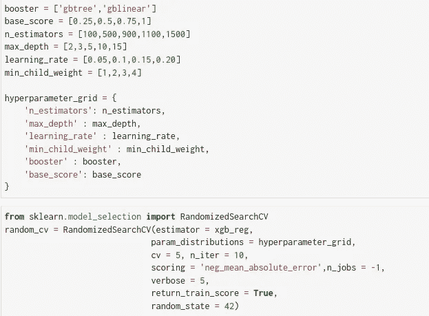
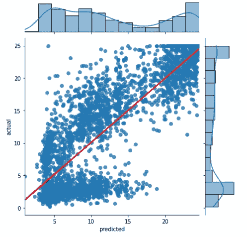
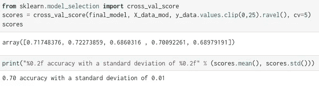

# 星巴克销售分析——第二部分

> 原文：<https://pub.towardsai.net/starbucks-sales-analysis-part-2-ff9e3c413b07?source=collection_archive---------5----------------------->

## [机器学习](https://towardsai.net/p/category/machine-learning)

深入了解星巴克的销售数据！

如果你没有读过这篇博客的第一部分，这里有一个[的链接](https://abhijana.medium.com/starbucks-sales-analysis-part-1-2fff081f1c4f)。在第 2 部分中，我将尝试解决剩下的两个问题:

1.  **如何根据当前客户的消费模式向他们推荐优惠券/优惠？**
2.  **如何向新客户推荐优惠券/优惠？**

我将向您展示如何构建一个推荐系统，为每个报价推荐理想的用户。

换句话说，我的目标是把最好的优惠推荐给现有用户。在这个系统中，我们选择一个现有的报价，并为该报价推荐前 n 名用户。但这可以很容易地扩展到类似的未来提供。

在这样做之前，我们需要记住一些事情。

*   我们需要识别那些在没有真正打开报价的情况下完成报价的用户。我们不需要向这些用户发送报价，因为他们很可能不在乎这些报价。
*   如果用户平均花费超过 20 美元，他们很可能不依赖于报价。
*   因为我们有$5、$7、$10 和$20 的报价值，我们可以得出一个一般规则，如果用户平均花费$15，我们可以推荐他们花更多一点的$20 报价。
*   最后，我们也想为新用户提供一些建议。因为，我们可以根据人口统计数据和其他特征训练一个 ML 模型来预测用户的消费金额。根据价值，我们可以向他们推荐报价，也可以不推荐！(例如，如果用户预计花费超过 20 美元，或者少于 5 美元，我们就不会发出报价)。

1.  **如何根据当前客户的消费模式向他们推荐优惠券/优惠？**

BOGO 和折扣优惠有两种可能性，

*   我们可以设置一个阈值比率**查看的报价/接收的报价**，如果该值大于阈值百分比，他们就有更好的机会打开报价。
*   类似地，我们可以设置一个阈值比率**已完成要约/已浏览要约**，如果该值大于阈值百分比，他们就有更好的机会完成要约。

但是有一个条件！我们可以让一些人甚至没有打开报价就完成了报价。在这种情况下，**完成报价/查看报价**的比率将大于 1。我们不需要向他们发送报价，因为他们很可能会购买产品。所以，我们也需要设定一个上限！

最后，我们可以使用信息提供数据，建立一个独立的推荐系统，而不是 BOGO 和折扣提供，因为人们不需要为这种类型的提供花费任何东西。

## 如何构建推荐系统？

对于 BOGO 和折扣优惠数据，

*   我们将使用**基于等级的推荐**
*   将有基于用户-用户的**协同过滤**，其中，我们将为每个报价推荐前 n 名用户。
*   我们将使用 ML 为新用户做一个**基于内容的推荐**。我们将根据人口统计数据训练一个模型来预测平均支出。根据该价值，我们将推荐优惠。

对于信息性报价，

*   我们将使用基于排名的推荐。由于该类别中只有两个优惠，我们将只预测类似新优惠的前 n 名用户。

让我们看看信息性报价数据和 look 折扣报价数据。



**no_info_data** 适用于 BOGO 和折扣优惠，而 **info_data** 仅适用于信息性优惠。

现在，从上表中，如果我们查看“no_info_data”中的**已完成/已查看**和**已查看/已接收**数据列，并查看“info_data”中的**已查看/已接收**数据列，我们可以估算出要使用的阈值。

*   no_info_data:已完成/已查看的平均值为 0.74 ， **1.5 是数据的第 90 百分位**。观看/接收的**平均值为 0.77** ，而 **1 是数据的第 90 百分位**。
*   info_data:查看/接收的平均值为 0.71 ， **1 是数据的第 75 百分位**。

# 基于排名的推荐:

在此方法中，我们将返回 n 个 BOGO/折扣优惠的热门人选，以及 n 个信息性优惠的热门人选。他们将有资格获得未来类似的优惠。

为了获得前 n 名非信息用户，我们将首先根据“已查看/已接收”和“已完成/已查看”列中的特定阈值过滤掉用户。然后我们会看看他们的平均交易价值。如果价值大于 20，那么我们将放弃该用户，因为最大的优惠是购买价值 20 美元的商品可享受 5 美元的折扣。所以用户并不关心报价。

对于 BOGO/折扣优惠:

```
get_n_top_info_user(topn = 5)>>> array(['23d67a23296a485781e69c109a10a1cf',
       '6dba14f698ae4030ab7354cd5cfe7119',
       'eece6a9a7bdd4ea1b0f812f34fc619d6',
       '05bbe7decb6d43b684221df448979612',
       '116b28e2983c44039eb8b20292742c94'], dtype=object)
```

对于信息报价:

```
get_n_top_non_info_user(topn = 5)>>> array(['d167940f7af04f4681daaa6d1bfd80a1',
       'a2633655a62e4287a3b651d926a774a6',
       '4d4216b868fe43ddb9c9f0b77212c0cb',
       'bb465e90882143b6a49f99d9d810dc3f',
       '17b29dcb0f924294a0d1de2ca59c763f'], dtype=object)
```

# 针对 BOGO/折扣数据的基于用户-用户的协同过滤

既然我们已经为新优惠创建了一个基于排名的推荐，**如果我们想将现有优惠发送给尚未收到一些优惠的现有用户，该怎么办？**

我们将尝试为每个现有报价找到前 n 名用户。为此，我们将创建一个 user_item 矩阵。

*   我们将重新格式化 offer_data 数据框，以用户为列，优惠为行。
*   每个用户在每个列中只能出现一次。
*   每个报价应该只出现在一行中。
*   如果用户已经与报价交互，那么在用户列与报价行相交的地方放置 1。用户与报价交互了多少次并不重要，用户与报价交互的所有条目都应该是 1。
*   如果用户没有与报价交互，那么在用户列与报价行相交的地方放置一个零。

我们将编写一个函数，它应该接受一个人，并提供一个与该用户最相似的用户的有序列表(从最相似到最不相似)。返回的结果不应该包含提供的人，因为我们知道每个用户都与他们相似。因为这里每个用户的结果都是二进制的，所以将相似性计算为两个用户的点积(可能)是有意义的。

```
find_similar_offers('9b98b8c7a33c4b65b9aebfe6a799e6d9')[:5]>>> ['3f207df678b143eea3cee63160fa8bed',
 '5a8bc65990b245e5a138643cd4eb9837',
 'ae264e3637204a6fb9bb56bc8210ddfd',
 '4d5c57ea9a6940dd891ad53e9dbe8da0',
 'fafdcd668e3743c1bb461111dcafc2a4']
```

最后，为了给出建议，我们将使用以下代码:

```
offer_offer_recs('3f207df678b143eea3cee63160fa8bed', m=10)>>> ['0020ccbbb6d84e358d3414a3ff76cffd',
 '005500a7188546ff8a767329a2f7c76a',
 '0063def0f9c14bc4805322a488839b32',
 '00857b24b13f4fe0ad17b605f00357f5',
 '0092a132ead946ceb30d11a1ed513d20',
 '00ad4c2cace94f67a6354ec90d6c6f45',
 '00b5fb9d842d437e83033ad9e36f7148',
 '00b901d68f8f4fd68075184cd0f772d2',
 '00bbce6533f44ddeaf4dd32bcab55441',
 '00bc983061d3471e8c8e74d31b7c8b6f']
```

**offer_offer_recs** 将给我们 n 个没有收到特定报价的用户。

我们可以结合基于排名的推荐来改进推荐。

*   不要武断地选择我们何时获得与给定报价同样接近的报价，而是先选择与人互动最多的报价，再选择与人互动较少的报价。
*   不要从推荐人数开始低于 m 而结束超过 m 的提议中任意选择用户，而是在选择总互动次数较少的人之前选择总互动次数最多的人。

```
offer_offer_recs_improved('3f207df678b143eea3cee63160fa8bed')>>> ['0020c2b971eb4e9188eac86d93036a77',
 '00426fe3ffde4c6b9cb9ad6d077a13ea',
 '004c5799adbf42868b9cff0396190900',
 '0099bf30e4cb4265875266eb3eb25eab',
 '00b18b535d6d4f779dea4dc9ac451478',
 '00b5fb9d842d437e83033ad9e36f7148',
 '00b901d68f8f4fd68075184cd0f772d2',
 '00bbce6533f44ddeaf4dd32bcab55441',
 '00bc42a62f884b41a13cc595856cf7c3',
 '00c2f812f4604c8893152a5c6572030e']
```

现在，由于我们已经构建了一个推荐系统，为每个提议推荐 n 个人，我们可以结合基于排名的推荐进一步改进它。我们使用了一些过滤来获得信息报价和 BOGO/折扣报价的前 n 名。在 **get_n_top_non_info_user，** **get_n_top_info_user** 函数中，如果我们设置 topn = 'max '我们将得到所有可能的用户。

最后结合 offer_offer_recs_improved 函数，得到上述函数创建的数据库内的 n 个顶尖人物。

```
make_recs('4d5c57ea9a6940dd891ad53e9dbe8da0')>>> array(['0009655768c64bdeb2e877511632db8f',
       '0011e0d4e6b944f998e987f904e8c1e5',
       '003d66b6608740288d6cc97a6903f4f0',
       '004b041fbfe44859945daa2c7f79ee64',
       '0056df74b63b4298809f0b375a304cf4',
       '0082fd87c18f45f2be70dbcbb0fb8aad',
       '00c6035df45840038a72766c6d27a0db',
       '0009655768c64bdeb2e877511632db8f',
       '0011e0d4e6b944f998e987f904e8c1e5',
       '003d66b6608740288d6cc97a6903f4f0'], dtype=object)
```

**上面的 make_recs** 函数返回优惠券的前 10 名推荐用户:“4d 5c 57 ea 9a 6940 DD 891 ad 53 e 9 db E8 da 0”

# **2。如何向新客户推荐优惠券/优惠？**

## 使用 ML 为新用户提供基于内容的推荐。

为了训练一个 ML 模型，我们将使用“事务 _ 数据”。

*   我们希望在给定人口统计信息的情况下预测值列。
*   在此数据中，“人员”、“事件”、“时间”和“日期”列不是必需的。
*   我们将按“人”对数据进行分组，并尝试预测中值。由于一个人偶尔会比平时花费更多或更少，我们通过取中间值来去除那些异常值。

**数据预处理:**

我如何处理 NaN 值？从目前的分析中，我们知道有些行没有人口统计信息。这几行有**年龄= 118，性别=未知，收入=男**。

因为我们知道，这些 NaN 值与无信息相关。因此，我们可以将它们视为异常值，我们可以简单地过滤掉该值，计算支出中值，如果新客户没有提供任何人口统计数据，就使用该值。

**一看数据:**

```
X_data.head(10) # target variable>>>
   gender       income       age                       
0       M       72000.0       33                 
1       O       57000.0       40                 
2       F       90000.0       59                 
3       F       60000.0       24                 
4       F       73000.0       26                 
5       F       65000.0       19                 
6       F       74000.0       55                 
7       M       99000.0       54                 
8       M       47000.0       56                 
9       M       91000.0       54
```

这里的“性别”是一个分类变量，包括 F(女性)、M(男性)、O(其他)类别。“收入”和“年龄”是数字数据。



图一。数字列的分布

从数字列的图中，我们看到“年龄”和“收入”列是右偏的。为了使其为高斯型，我们将进行对数变换，然后将数据标准化为平均值为 0。

对于分类列“性别”,我们将使用一次性编码。

我使用 scikit-learn 管道来执行数据预处理。

因为我们只有三个特性，所以我使用了 scikit-learn 中的多项式特性来添加更多的特性。关于如何工作的细节可以在[这里](https://scikit-learn.org/stable/modules/generated/sklearn.preprocessing.PolynomialFeatures.html)找到。

对于目标变量，我将上限值削减为 25。因为，如果一个人花费超过 25 美元，我们不会向他们发送任何优惠。

**训练一个 ML 模型**

由于这是一个回归问题，我们可以使用各种回归方法来寻找最佳模型。

我使用了:

*   线性回归
*   随机森林回归
*   SVM 回归量
*   XGBoost 回归器

在使用了这 4 种方法后，XGBoost 给了我一个更好的结果，所以我决定用它作为我的最终模型。

**矩阵:**

我们无法计算回归模型的准确性。我们只能根据预测误差来衡量性能。在我们的例子中，我们不想预测确切的金额，但是我们想看看我们的预测与实际值有多接近。我将使用 3 个矩阵来评估我的模型。

*   r 平方:因变量与模型符合程度的度量。
*   均方根误差(RMSE):误差平方和有助于选择最佳回归模型。MSE 对大偏差给予较大的惩罚。
*   平均绝对误差(MAE):类似于 MSE/RMSE，但它不是计算平方误差，而是计算绝对误差。梅对每个错误都一视同仁。



R2 分数



RMSE 分数

XGBoost 的 R 平方得分为 72–70 %,这意味着该模型非常稳健。

**超参数调谐:**

最后一步，我们需要调整超参数以获得最佳参数值。

我使用了 scikit-learn 的 RandomizedSearchCV 来寻找最佳的参数值。

针对此问题调整的超参数是:



# 模型评估和验证:

最佳参数是:

```
random_cv.best_estimator_>>> XGBRegressor(base_score=0.5, booster='gbtree',    colsample_bylevel=1,
             colsample_bynode=1, colsample_bytree=1, gamma=0, gpu_id=-1,
             importance_type='gain', interaction_constraints='',
             learning_rate=0.2, max_delta_step=0, max_depth=3,
             min_child_weight=3, missing=nan, monotone_constraints='()',
             n_estimators=100, n_jobs=8, num_parallel_tree=1, random_state=0,
             reg_alpha=0, reg_lambda=1, scale_pos_weight=1, subsample=1,
             tree_method='exact', validate_parameters=1, verbosity=None)
```



图二。预测值与实际值的图表

为了评估 XGBoost 模型对于所有数据是否稳定，我们可以使用 K-FOLD 交叉验证。



交叉验证

正如我们所见，该模型在整个数据集上非常稳定，标准偏差为 0.1。

最后，我们可以设置一个向新用户发送优惠券的规则。

*   一个没有人口统计数据的人预计将花费 1.71 美元，因此我们可以发出**信息报价或不报价！**
*   如果用户预计花费< $3 or >22 美元，发出**信息报价或不报价！**
*   如果用户预计消费≥ $3 和 $5 优惠券。
*   如果用户预计消费≥ $5 和< $7, send out the **$7 优惠券。**
*   如果用户预计消费≥ $7 和< $10, send out the **$10 优惠券。**
*   最后，如果用户预计消费≥$10 和< $20, send out the **20 美元优惠券。**

**示例:**

```
person_demo = {
    'gender' : ['M','F','O'],
    'income' : [60000.0,72000.0,80000.0],
    'age' : [36,26,30]
}predict_expense(person_demo, final_model)>>> array([ 3.78, 10.66, 22.26], dtype=float32)
```

*   人 1:性别=男，收入= 60000.00，年龄= 36。预计消费 3.78 美元，所以送出一张**5 美元的优惠券。**
*   人 2:性别=女，收入= 72000.00，年龄= 26。预计消费 10.66 美元，所以送出一张**20 美元的优惠券。**
*   人 3:性别=其他，收入= 80000.00，年龄= 30。预计花费 22.26 美元，因此发送一张**信息优惠券/根本没有优惠券！**

# **总结**

总而言之，

*   我创建了一个基于排名的推荐系统来过滤掉那些有很大机会浏览和兑换现有或未来产品的潜在用户。
*   我使用了一种**基于用户的协作过滤**方法来找出针对某个报价的潜在用户。
*   最后，我使用了**机器学习**方法向新用户推荐优惠。

# **项目论证**

我试图通过这个项目回答 3 个问题。

对于问题 1。有哪些受欢迎的优惠？

从第 1 部分的情节来看，可能的答案是，

*   我绘制了一张**收到的报价百分比与报价类型**的图表，以显示尽管 BOGO 的报价被浏览得更多，但就完成情况而言，折扣报价更受欢迎。
*   我绘制了一张**不同性别间的报价分布图**以得出结论，给定一份报价，女性和其他性别兑现报价的机会更高！
*   最后，我绘制了**性别、年龄、收入与平均支出**的图表，发现女性往往支出最多，支出随着年龄和收入的增加而增加。

对于问题 2。**如何根据当前客户的消费模式向其推荐优惠券/优惠？**

*   我使用了一个基于排名的推荐系统来过滤掉最有可能浏览和兑换现有或未来产品的潜在用户。
*   我创造了一个**的基于用户的协同过滤**方法来找出针对某个报价的潜在用户。

对于问题 3。**如何向新客户推荐优惠券/优惠？**

*   我使用各种矩阵(MAE/RMSE)来验证模型的稳健性。我发现 RMSE 大约是 4.5。虽然，这不足以区分 5 美元的报价和 7 美元的报价，或者 7 美元的报价和 10 美元的报价，但是只有一个 7 美元的报价，两个 5 美元的报价和四个 10 美元的报价。所以，区分 5 美元和 10 美元的报价更重要。对于这一点，RMSE 分数就足够了。
*   这种方法有助于向新用户推荐优惠。

# **未来工作**

在未来，

*   我计划部署该模型，并在 web 上构建一个数据仪表板。
*   我将尝试通过执行更多的特征工程来提高模型性能。增加训练数据的合成少数过采样技术(SMOT)。
*   使用 CatBoost 和 LightGBM 模型尝试并检查结果。
*   使用堆叠，因为使用了多个监督学习模型。

这个项目的 GitHub 库可以在[这里](https://github.com/abhishek-jana/Starbucks-spending-prediction)找到。

# **参考文献:**

*   [https://www.udacity.com/course/data-scientist-nanodegree-nd 025](https://www.udacity.com/course/data-scientist-nanodegree--nd025)
*   [https://scikit-learn.org/stable/](https://scikit-learn.org/stable/)
*   [https://xgboost.readthedocs.io/en/latest/](https://xgboost.readthedocs.io/en/latest/)
*   [https://harsh it-t yagi . medium . com/end-to-end-machine-learning-project-tutorial-part-1-ea6de 9710 c 0](https://harshit-tyagi.medium.com/end-to-end-machine-learning-project-tutorial-part-1-ea6de9710c0)
*   [https://www.youtube.com/watch?v=vtm35gVP8JU](https://www.youtube.com/watch?v=vtm35gVP8JU)
*   [https://www . ka ggle . com/Arthur Tok/introduction-to-ensembling-stacking-in-python](https://www.kaggle.com/arthurtok/introduction-to-ensembling-stacking-in-python)