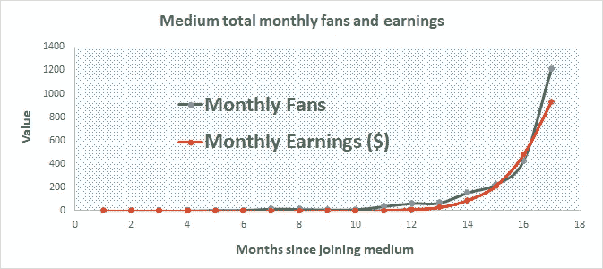

# 2020 年开始数据科学博客

> 原文：<https://pub.towardsai.net/start-data-science-blogging-in-2020-70a6336b3503?source=collection_archive---------0----------------------->

科琳·库兹在 [Unsplash](https://unsplash.com?utm_source=medium&utm_medium=referral) 上的照片

## 如何从数据科学博客开始

## 在 17 个月内，我看到我的中等收入从每月不到 2 美元增加到每月 900 美元

edium 现在被认为是最受欢迎的博客网站之一。Medium 是一个专门为作者和读者设计的平台。介质上的书写体验简直太神奇了。媒体网站有助于写作。基本上，每个人都可以成为一个中等作家，只要你有你想写的有趣的东西。

我一年多前加入了 Medium。我在 2018 年 7 月 7 日**发表了我的第一篇中型文章 [**使用 R 中的 sapply()函数生成一个表格**](https://medium.com/@benjaminobi/using-sapply-function-in-r-to-generate-a-table-310c8fb931cf) 。**本文主要用于实验目的。当有人真正阅读他们的作品并对他们的作品发表反馈和评论时，作家获得的满足感是鼓励我继续写作的原因。

距离我发表第一篇关于 medium 的文章已经过去了 17 个月。从那以后，我在不同的领域发表了大量的文章，涵盖了各种各样的主题，如体育分析、材料科学、物理学、在线教育和个人成长。

# 在 2020 年开始你的数据科学博客生涯

如果你有一些基本的数据科学知识，你可以尽快开始写博客。您可以撰写关于不同主题的数据科学博客，例如:

a)数据争论

b)数据可视化

c)机器学习

d)数据科学中的技术工具，如 R、Python、SAS、SQL、Hadoop 等。

e)数据科学专业发展

f)数据科学面试流程

g)数据科学的理论基础

# 写中型文章有 7 个主要优势:

1.  写作是一项智力活动。写作挑战你跳出框框思考。你必须不断地思考创造性的想法，以此作为你写作的基础。从广义上讲，我的文章涵盖了数据科学，重点是为数据科学爱好者提供教育指导。
2.  它为您提供了展示数据科学知识和技能的途径。
3.  它激励你从事具有挑战性的数据科学项目，从而提高你的数据科学技能。
4.  它使您能够与全球读者分享您的专业知识、知识和经验。现在，我的数据科学文章每月被全球热情的读者浏览超过 100，000 次。
5.  它使你能够提高你的沟通技巧。这是有用的，因为它使你能够以一种普通大众能够理解的方式传达信息。俗话说“如果你不能用简单的术语向某人解释某事，那么这意味着你没有很好地理解这个概念。”
6.  每一篇发表在 medium 上的文章都被认为是知识产权，所以你可以在简历中添加一篇 Medium 文章。
7.  你可以从你的文章中赚钱。通过 [**媒介合作伙伴计划**](https://medium.com/creators) ，任何在媒介上发表文章的人都可以获得赚钱的资格。

**作为一名成功的作家，随着时间的推移，你的浏览量、阅读量、阅读率、粉丝数和收入应该会以一个合理的速度增长。下面的图表显示了我作为一名作家加入 Medium 后的 17 个月里每月的浏览量、阅读量、粉丝量和收入。当你持续不断地发表高质量的文章时，你会看到你的浏览量、阅读量、粉丝数和收入随着时间的推移而增长。**

# 成功成为媒体作家的秘诀

1.  多产地写。随着你写得越来越多，你的文章会越来越受欢迎，这将转化为更多的观点、阅读和粉丝。
2.  写高质量的策划文章。多写是好的，但是你要确保你没有把数量放在质量之上。确保每篇发表的文章都是高的文章。
3.  为你的文章选择一个好的特色图片。一个吸引人的特色图片会提高你文章的质量，增加你的文章被浏览和阅读的可能性。选择特色图片时，确保不违反任何版权规则。避免违反版权规则的一个方法是使用来自 [**unsplash**](https://unsplash.com/) 的图像，或者你可以创建自己的图像。有关更多指导，请参见以下内容: [**为您的数据科学文章选择合适的特色图片**](https://medium.com/towards-artificial-intelligence/choose-the-right-featured-image-for-your-data-science-article-e101719600cf) **。**
4.  专注于一个领域。将你的精力集中在一个领域而不是写几个不同的主题是很好的。我将我的文章集中在数据科学教育和作为职业的数据科学上。
5.  耐心点，成功需要时间。树立好作家的声誉需要时间。就我而言，写作的前 12 个月非常艰难，但我从未放弃。我不停地写啊写啊写。我看到我的收入从每月不到 2 美元增加到每月 900 美元。在过去的 3 个月里，我的平均收入是 600 美元/月。
6.  保持你的文章长度在 4 到 6 分钟左右。大多数读者不会有很多时间花在阅读你的文章上，所以写短文是很好的。
7.  如果可能的话嵌入一些代码。如果您正在撰写一篇数据科学文章，如果您可以在文章中嵌入一些代码，文章的质量可能会得到提高。请参见以下示例:

*   [**如何从数据表中去掉%号**](https://towardsdatascience.com/how-to-remove-sign-from-data-table-baa37598982a) **。**
*   [**数据可视化的艺术——使用 Matplotlib 和 Ggplot2**](https://towardsdatascience.com/the-art-of-data-visualization-weather-data-visualization-using-matplotlib-and-ggplot2-4d4b48b5b7c4) 进行气象数据可视化

8.您可以向专注于数据科学的媒体出版物提交您的数据科学文章。排名前两位的数据科学出版物是面向数据科学的**和面向人工智能的**。在这些刊物上发表会帮助你的文章得到更多的关注。****

# ******帮助您入门的有用资源******

****[在媒体上写数据科学博客的初学者指南](https://medium.com/towards-artificial-intelligence/beginners-guide-to-writing-data-science-blogs-on-medium-a74774cf8f66)****

****[为您的数据科学文章选择合适的特色图片](https://medium.com/towards-artificial-intelligence/choose-the-right-featured-image-for-your-data-science-article-e101719600cf)****

****如何成为一名成功的媒体作家——从一本古书中学到的两个教训****