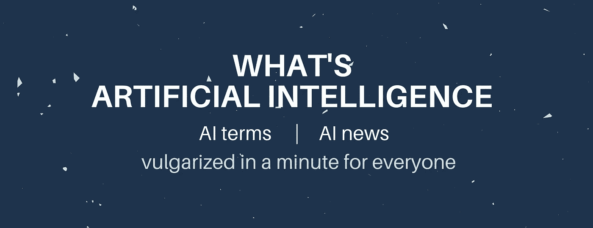
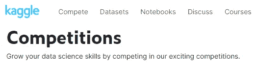

# 如何在 2022 年免费开始机器学习，100%在线

> 原文：<https://pub.towardsai.net/start-machine-learning-in-2020-become-an-expert-from-nothing-for-free-f31587630cf7?source=collection_archive---------0----------------------->

## [教育](https://towardsai.net/p/category/education)，[机器学习](https://towardsai.net/p/category/machine-learning)

## 一切你需要成为一个 ML 专家从无到有，免费没有任何领域的背景，并与最新的新闻和技术保持同步！

> 最初发表于 [louisbouchard.ai](https://www.louisbouchard.ai/learnai/) ，在那里阅读并支持我的工作，关注[我的简讯](https://www.louisbouchard.ai/newsletter/)！

照片由[艾玛·马修斯在](https://unsplash.com/@emmamatthews?utm_source=medium&utm_medium=referral) [Unsplash](https://unsplash.com?utm_source=medium&utm_medium=referral) 上进行数字内容制作

在我的社交媒体上，同一个问题一天会被问很多次。问题是“**机器学习怎么开始？**”。它经常以多种形式出现，例如“**我如何才能免费开始？**或**没有开发者背景怎么下手**等。所以我决定写一个关于如何在 2022 年从没有任何背景开始学习机器的完整指南，而且是免费的。因为这些相关的问题，我研究了很多资源，并在过去的一年里把最好的保存在记事本上，以快速回答接下来即将到来的问题。

今天，我将把这个记事本分享给大家，并列出许多很棒的资源，并给你一些如何学习的技巧，提高你的机器学习技能。

## 2022 年谁能成为机器学习专家？

本指南适用于任何在编程、数学和/或机器学习方面没有任何背景的人。遵循没有特定的顺序，但是一个经典的路径是从上到下，遵循本文给出的顺序。如果你不喜欢看书，跳过这一节，如果你不想参加在线课程，你也可以跳过这一节。成为机器学习专家没有单一的方法，有了动力，你绝对可以通过创造自己的步骤来实现。

但是这篇文章的**目标**是**给任何想要**进入机器学习**和**不知道从哪里开始**的人一条路径**。我知道当学习新的东西时，很难找到从哪里开始，或者下一步该做什么。尤其是当你没有老师或者没有人指导你的时候。这就是为什么我会用一条线性学习曲线按“难度”排序列出许多重要的参考资料。如果你更高级，你可以跳过一些步骤。

**这里列出的所有资源都是免费的**，除了一些在线课程和书籍，它们当然是为了更好地理解而推荐的，但是没有它们**绝对有可能**成为专家**，多花一点时间在在线阅读、视频和练习上。说到付费课程，本指南中的链接是附属链接。如果你想学习一门课程，请使用它们，因为它会支持我。谢谢，祝你学习愉快！*记住，这完全取决于你，没有必要。我觉得它对我有用，也可能对其他人有用。***

**不要害怕重播视频或从多个来源学习相同的概念。重复是成功学习新事物的关键！**

***在 GitHub 上找到* [***完整列表***](https://github.com/louisfb01/start-machine-learning)**并订阅我的* ***周刊 AI*** [***简讯***](http://eepurl.com/huGLT5) *并保持最新！****

******在 Twitter 上给我贴标签***[***@ Whats _ AI***](https://twitter.com/Whats_AI)***或者 LinkedIn***[***@ Louis(What ' s AI)Bouchard***](https://www.linkedin.com/in/whats-ai/)***如果分享名单！******

## ***目录***

***如果你想跳过第一步，这里有一个本文的快速目录:
——[让我们开始吧！](#e08d)(从简短的 YouTube 视频介绍开始)
——[开始认真学习](#900f)(关注 YouTube 上的免费在线课程)
——[在线阅读文章](#4830)
——[阅读重要书籍](#1c82)
——[没有数学背景的 ML？看看这个。](#e465)
——[无编码背景，没问题！](#18d0)(针对初学者的编码资源)
— [跟随在线课程](#5488)
— [练习，练习，再练习！](#07bb)
— [更多资源](#3d76)(加入社区，使用备忘单，关注该领域的新闻，等等！)
— [机器学习如何找工作](#c5f8)
— [结论](#6923)***

****请注意，本文* *还有一个* [资源库*，其中明确列出了所有资源，您也可以按顺序查看。*](https://github.com/louisfb01/start-machine-learning-in-2020)***

## ***让我们开始吧！***

***在我看来，开始学习任何东西的最好方式是从 YouTube 视频简介开始。这个领域也不例外。这个平台上有成千上万的令人惊叹的视频和播放列表，免费教授机器学习的重要概念，你绝对应该好好利用它们。在这里，我列出了几个我发现的最好的视频，它们会给你一个很好的开始进入这个领域所需要知道的术语的第一次介绍。***

******

***[https://www.youtube.com/WhatsAI](https://www.youtube.com/WhatsAI)***

***我个人推荐的第一个是 [YouTube 播放列表，介绍了该领域最常用的术语](https://www.youtube.com/playlist?list=PLO4GrDnQanVe6F6MRJg_KO7JEoH-ukFzY)作者[什么是人工智能](https://www.youtube.com/channel/UCUzGQrN-lyyc0BWTYoJM_Sg)。这是一个**必看的播放列表**，以便对机器学习和提到的其他资源中经常出现的所有术语有一个基本的了解。这只是一系列非常短的 1 分钟视频，涵盖了从基础到更高级的所有最常用的术语。不超过 30 分钟的时间*就可以对该领域有一个完整的了解！****

****在这些短视频之后，我建议稍微深入一点机器学习和深度学习的**基础，并了解更多关于神经网络的信息**。理解神经网络和反向传播是开始时最重要的事情，当你深入更高级的讲座和课程时，它会给你巨大的优势。****

********

****[https://www.youtube.com/c/3blue1brown](https://www.youtube.com/c/3blue1brown)****

****对我们来说幸运的是，一个叫做 [3Blue1Brown](https://www.youtube.com/c/3blue1brown) 的神奇频道制作了一个[系列视频，非常清晰地涵盖了这些确切的概念](https://www.youtube.com/playlist?list=PLZHQObOWTQDNU6R1_67000Dx_ZCJB-3pi)。如果您对视频的某些方面不清楚，不要害怕重播视频或自己查找任何其他播放列表！学习是由重复组成的！****

****现在，您已经对什么是机器学习算法、它如何工作以及它如何通过反向传播进行学习有了良好的基础，您已经准备好通过更完整和更高级的课程进行更深入的学习。****

*****请继续观看 YouTube 上的其他视频。它拥有丰富的资源，是一个免费的、被低估的学习平台！*****

## ****开始认真学习****

****这一步比前一步稍长，因为你将在 YouTube 上观看许多小时免费的精彩课程，并从中学到很多东西。****

****请不要一边看这些课程，一边做其他事情。它们是值得关注的重要资源，你可以通过 [*在线社区*](#e259) *做笔记和提问！*****

****它们也很迷人。一旦你有动力按下“播放”键，你就会一直沉迷到最后，学到很多东西**，我保证！******

******以下是我建议首先观看的最佳课程的快速列表。它们以“*理解难度*顺序列出。从介绍开始，以专业结束。请注意，在这一点上，即使专业化仍然是一个介绍，但它将为你接下来的**更有趣的**做准备！当然，他们是**全部免费**！******

******— [机器学习入门(斯坦福)](https://www.youtube.com/playlist?list=PLoROMvodv4rMiGQp3WXShtMGgzqpfVfbU)******

******— [深度学习(MIT)简介](https://www.youtube.com/playlist?list=PLtBw6njQRU-rwp5__7C0oIVt26ZgjG9NI)******

******— [深度学习专业化(Deeplearning.ai —吴恩达)](https://www.youtube.com/channel/UCcIXc5mJsHVYTZR1maL5l9w/playlists)******

******— [麻省理工深度学习——莱克斯·弗里德曼最新深度学习课程](https://deeplearning.mit.edu/)******

******— [深度学习(与 PyTorch 合作)——NYU、扬·勒村](https://atcold.github.io/pytorch-Deep-Learning/)******

## ******在线阅读文章******

******正如已经多次证明的那样。**人类通过不同方式的重复和学习，**如听、写、读、看等，学习得更好。这就是为什么为了更好地理解，阅读和观看视频一样重要。******

******你将涵盖许多角度，对你试图学习的东西有一个更完整的看法。这个部分列出了一些完全免费和可选的短文。同样，使用[媒介](https://whats-ai.medium.com/membership)是一个寻找伟大解释的惊人平台，无论是对人工智能的[还是对数据科学出版物](https://pub.towardsai.net/)的[。我也在那里分享我自己的文章，我喜欢使用这个平台。如果你对此感兴趣，并且你愿意同时支持我，你可以使用我的链接](https://pub.towardsai.net/)[订阅 Medium。](https://whats-ai.medium.com/membership)******

******请注意，你当然可以自己找到其他商品，这些只是基于我个人选择的建议。******

******这里有 **5 篇文章，都可以在 Medium 上找到，**我建议你在钻研任何书籍、编码或在线课程之前先看看**。这些都是**短文**，如果你把它们和前面提到的视频结合起来，会非常有益。********

*   ******使用 Python 学习机器学习和数据科学的 5 个初学者友好步骤******
*   ******[什么是机器学习？](https://medium.com/towards-artificial-intelligence/what-is-machine-learning-ml-b58162f97ec7) —罗伯特·伊里翁多******
*   ******[初学者的机器学习:神经网络介绍](https://towardsdatascience.com/machine-learning-for-beginners-an-introduction-to-neural-networks-d49f22d238f9) — Victor Zhou******
*   ******神经网络初学者指南******
*   ******[理解神经网络](https://towardsdatascience.com/understanding-neural-networks-22b29755abd9) —卡努玛王子******
*   ******[新 MILA 学生阅读清单](https://docs.google.com/document/d/1IXF3h0RU5zz4ukmTrVKVotPQypChscNGf5k6E25HGvA/edit#) —匿名******
*   ******[80/20 AI 阅读清单](https://medium.com/machine-learning-for-humans/ai-reading-list-c4753afd97a) — Vishal Maini******

******现在你已经看完了这些短文和视频，你肯定已经准备好**开始编码和练习**！如果你觉得你需要对机器学习的**理论方面**有更深的理解，那么**下一节就是为你准备的**。否则，您可以直接跳到下面的编码、在线课程或实践部分，以指数级的速度学习！******

## ******阅读重要的书籍******

******这一部分是完全可选的，但强烈建议您更好地理解机器学习算法的“幕后”。书籍是按照你的节奏学习的好方法。在进入*练习模式*之前，请务必理解所有内容。不要害怕重读章节！******

******正如你可能知道的，大多数书需要作者的大量工作，因此，不是免费的。对我们来说幸运的是，有**一本*令人惊叹的*书**，那就是**完全免费且可在线获得的**！其余的可以在亚马逊上买到。在这里，我为喜欢阅读的人列出了一些最好的书籍:******

*   ******[深度学习书籍](https://www.deeplearningbook.org/) —免费在线******
*   ******[深入学习](http://d2l.ai/) —免费在线******
*   ******[概率机器学习:简介](https://probml.github.io/pml-book/book1.html) —免费在线******
*   ******[人工智能:现代方法](https://amzn.to/3mSqhk2) —可选(付费)******
*   ******[模式识别和机器学习](https://amzn.to/3mPUGPF) —可选(付费)******
*   ******[使用 Python 进行深度学习](https://amzn.to/32iR3sm) —可选(付费)******
*   ******[理解机器学习:从理论到算法](http://www.cs.huji.ac.il/~shais/UnderstandingMachineLearning/)——Shai Shalev-Shwartz 和 Shai Ben-David——免费在线******

******构建数学背景的好书:******

*   ******[机器学习的数学](https://mml-book.com/) —在线免费******
*   ******[统计学习的要素](https://amzn.to/3mMn5Gy) —可选(付费)******
*   ******[统计推断](https://amzn.to/3aawToM) —可选(付费)******

******完整的微积分背景:******

*   ******[微积分:概念与语境](https://amzn.to/2OT4NXC) —可选(付费)******
*   ******[单变量微积分:概念与上下文](https://amzn.to/3wXtzHf) —可选(付费)******
*   ******[多变量微积分:概念与语境](https://amzn.to/32jIRYC) —可选(付费)******

******同样，这些书是完全可选的，但是它们会让你更好地理解理论，甚至教你一些关于神经网络编码的东西！******

******现在，您已经准备好开始编码并应用您所学习和掌握的理论了。******

## ******ML 没有数学背景？看看这个。******

******不要紧张，就像生活中的大多数事情一样，你可以学习数学！这里有一些很好的初学者和高级资源来学习机器学习数学。我建议从机器学习中的这三个非常重要的概念开始(这里有 3 个可汗学院的免费课程):******

1.  ******[线性代数](https://www.khanacademy.org/math/linear-algebra) —可汗学院******
2.  ******[统计与概率](https://www.khanacademy.org/math/statistics-probability) —可汗学院******
3.  ******[多元微积分](https://www.khanacademy.org/math/multivariable-calculus) —可汗学院******

******这里有一些很棒的**免费**书籍和视频，可能会帮助你以一种更“结构化的方法”学习:******

*   ******YouTube 上的数学和尚******
*   ******[机器学习的数学](https://gwthomas.github.io/docs/math4ml.pdf) —加勒特·托马斯******
*   ******[统计学习介绍:在 R(统计学中的施普林格文本)中的应用](http://fs2.american.edu/alberto/www/analytics/ISLRLectures.html) —加雷斯·詹姆斯、丹妮拉·威滕、特雷弗·哈斯蒂和罗伯特·蒂布拉尼******

*******如果你仍然缺乏数学自信，可以看看上面的* [*书籍*](#1c82) *部分，我在那里分享了许多伟大的书籍来建立强大的数学背景。*******

******你现在已经有了很好的机器学习的数学背景，你已经准备好深入学习了！******

## ******没有编码背景，没问题！******

************

******[萨法尔·萨法罗夫](https://unsplash.com/@codestorm?utm_source=medium&utm_medium=referral)在 [Unsplash](https://unsplash.com?utm_source=medium&utm_medium=referral) 上拍摄的照片******

******本节是为**初学编码的**准备的。如果你没有 Python 或任何其他编程语言的背景，这将让你起步，并为你的机器学习编程打下坚实的基础。******

*******如果你对 python 已经相当熟悉，你可以跳到“* [*跟随在线课程*](#f2a8) *”的步骤！*******

********下面是学习机器学习编程方面最好的在线课程:********

******一开始需要 [**学习 python**](https://www.learnpython.org/) 。一个很好的开始方式是通过这个[免费互动教程来学习 python](https://www.learnpython.org/) 或者跟随[这个很棒的实用机器学习教程](https://www.youtube.com/playlist?list=PLQVvvaa0QuDfKTOs3Keq_kaG2P55YRn5v)。******

******那么，你可以跟着 OpenClassroom 上的[这个**免费课程**](https://openclassrooms.com/en/courses/2304731-learn-python-basics-for-data-analysis/6009031-get-started-with-python-and-anaconda) ，名为[学习 Python 基础知识进行数据分析](https://openclassrooms.com/en/courses/2304731-learn-python-basics-for-data-analysis/6009031-get-started-with-python-and-anaconda)。******

******根据这两个资源，如果你仍然不习惯 python，你可以更深入地了解 IBM 在 Coursera 上的一个付费课程，名为[用 Python 进行机器学习](https://coursera.pxf.io/P0vOZe)。这肯定会让你准备好开始编写你的第一个机器学习算法，并极大地提高你的编程技能！另一个很好的主意是进行在线培训，就像数据科学道场的[一样。请注意，这些通常是付费的，并且是完全可选的。对于那些希望通过现场会议获得更多“指导”实践的人来说，它们只是其他资源，在现场会议中，它们将为您提供具有挑战性的练习和项目！另一种方法是在网上寻找练习和项目，例如使用](https://datasciencedojo.com/python-for-data-science/ref/whatsai/) [Kaggle](http://www.kaggle.com) ，加入一个社区来寻找学习伙伴并提出问题。******

******通过这些 [100 个数字练习](https://github.com/rougier/numpy-100/blob/master/100_Numpy_exercises.ipynb)来确认你的 python 技能。这是一个很好的练习集，收集在 NumPy 邮件列表、堆栈溢出和 NumPy 文档中。******

## ******参加在线课程******

******现在你已经很好地理解了机器学习背后的理论和编码背景，你已经**准备好进入机器学习课程**了。当然，这些都是**可选**。同样，第一个是免费的，其他的是付费的，因为他们会教你很多东西，有些甚至会给你一些证书，你可以在简历中使用！******

*******如果不想上任何课程，可以跳到下一节，开始自己练习。一开始会有点困难，但凭借你的“谷歌搜索”技能和动力，你肯定能做到。*******

******如果你希望得到更多的指导，并有明确的步骤可以遵循，这些课程是最好的选择*(从基础到高级)*:******

*   ******[机器学习介绍— Kaggle](https://www.kaggle.com/learn/intro-to-machine-learning) (学习机器学习中的核心思想，建立你的第一个模型)******
*   ******[从人工智能/人工智能开始—吴恩达](https://coursera.pxf.io/gbeOKA)******
*   ******[机器学习——吴恩达——斯坦福](https://coursera.pxf.io/oeg43O)******
*   ******[深度学习专业化——吴恩达](https://coursera.pxf.io/WDvyaA)******
*   ******[TensorFlow(专业证书)](https://coursera.pxf.io/6bQy9q)******
*   ******[AI 工程— IBM(专业证书)](https://coursera.pxf.io/RyNGjN)******
*   ******[完整数据科学训练营 202](https://click.linksynergy.com/deeplink?id=8jtkHPNI0iU&mid=39197&murl=https%3A%2F%2Fwww.udemy.com%2Fcourse%2Fthe-data-science-course-complete-data-science-bootcamp%2F) 2******
*   ******[讲师指导的在线数据科学训练营— datasciencedojo](https://datasciencedojo.com/data-science-bootcamp/ref/whatsai/) (完整的 16 周学习计划)******
*   ******[数据科学培训+行业经验——datasciencedojo](https://datasciencedojo.com/data-science-training-and-internship/ref/whatsai/)(完成 16 周的培训计划并获得经验)******
*   ******[fast.ai 的深度学习课程](https://www.fast.ai/) —免费******

******现在，你已经准备好开始练习和建立你的作品集了！******

## ******练习，练习，再练习！******

******编程最重要的是实践。这也适用于机器学习。很难找到一个个人项目来实践。在开始编码之前，你必须找到一个需要解决的问题，这在没有任何帮助的情况下是非常困难的。******

************

******【https://www.kaggle.com/ ******

******幸好有****的存在。这个网站充斥着**免费课程**、**教程、**和**比赛**。你可以免费参加竞赛**，下载他们的数据，阅读他们的问题，然后马上开始编码和测试！你甚至可以通过赢得比赛来挣钱,这是你简历上的一大亮点。这可能是在学到很多东西的同时获得经验的最好方式，甚至还能挣钱！************

********你还可以为 [Kaggle](https://www.kaggle.com/) 比赛创建队伍，和人一起学习！我建议你加入一个社团，找一个团队，和别人一起学习，总比自己一个人学习好。下一节将专门讨论这一点。********

## ********更多资源********

********大多数时候，最好的学习方法是和别人一起学习。加入在线社区，寻找一起学习的伙伴！********

********— [这里的](https://discord.gg/learnaitogether)是一个很棒的[**Discord Server**](https://discord.gg/learnaitogether)有很多 AI 爱好者，在这里你可以一起学习，提问，寻找 Kaggle 队友，分享你的项目，等等。
— [这里的](https://ws.towardsai.net/discord)是一个很棒的[**Discord Server**](https://ws.towardsai.net/discord)在这里你可以保持最新的 AI 新闻，提问，分享你的项目，等等。********

******—您还可以关注 Reddit 社区 —提问、分享您的项目、关注该领域的新闻等等。以下是最受欢迎的:******

*   ******[人工](https://www.reddit.com/r/artificial/) —人工智能******
*   ******[机器学习](https://www.reddit.com/r/MachineLearning/) —机器学习(该领域最大的子领域)******
*   ******[深度学习论文](https://www.reddit.com/r/DeepLearningPapers/) —深度学习论文******
*   ******[计算机视觉](https://www.reddit.com/r/computervision/) —从图像和视频中提取有用信息******
*   ******[学习机器学习](https://www.reddit.com/r/learnmachinelearning/) —学习机器学习******
*   ******[人工智能](https://www.reddit.com/r/ArtificialInteligence/) — AI******
*   ******[LatsestInML](https://www.reddit.com/r/LatestInML/)——你不应错过的改变游戏规则的机器学习发展******

******—保存**备忘单**！******

******人工智能、机器学习和 Python 的最佳备忘单:******

*   ******[人工智能、神经网络、机器学习、深度学习的备忘单&大数据](https://becominghuman.ai/cheat-sheets-for-ai-neural-networks-machine-learning-deep-learning-big-data-678c51b4b463) — Stefan Kojouharov******
*   ******斯坦福大学 CS 229 的机器学习备忘单——阿弗森·阿米迪&舍维·阿米迪******
*   ******[机器学习和 Python(和数学)的小抄](https://medium.com/machine-learning-in-practice/cheat-sheet-of-machine-learning-and-python-and-math-cheat-sheets-a4afe4e791b6) — Robbie Allen******
*   ******人工智能专家路线图——把它作为一个技能清单！******

******—这一领域的另一件重要事情是通过了解最新的**即将发布的新论文****以及每天**发布的新应用**。一个很好的方法是加入分享这些新应用的 LinkedIn 群组，关注媒体出版物，甚至 YouTube 频道，这里我列出了一些我知道的最好的，但是你可以在你感兴趣的领域搜索更多！************

****订阅分享新论文的 **YouTube 频道**:**了解该领域的最新新闻！******

*   ******两分钟论文——报道新论文的双周视频******
*   ******[什么是 AI](https://www.youtube.com/channel/UCUzGQrN-lyyc0BWTYoJM_Sg) —涵盖新论文的每周视频******
*   ******[Bycloud](https://www.youtube.com/channel/UCgfe2ooZD3VJPB6aJAnuQng) —涵盖新报纸的每周视频******

******—加入 **LinkedIn 群组********

*   ******[人工智能、机器学习、深度学习新闻](https://www.linkedin.com/groups/8942343/)******
*   ******[人工智能|深度学习|机器学习](https://www.linkedin.com/groups/45655/)******
*   ******[应用人工智能](https://www.linkedin.com/groups/127447/)******

******—加入**脸书团体********

*   ******[人工智能&深度学习](https://www.facebook.com/groups/DeepNetGroup) —人工智能、神经网络和深度学习领域最权威、最活跃的 FB 团体。人工智能和深度学习前沿的所有新鲜有趣的东西。神经网络将在未来几年重新定义智能机器的含义。******
*   ******[深度学习](https://www.facebook.com/groups/DeepLearnng/) —如今的社会趋向于软性化和自动化，演变成第四次工业革命，从而推动各种成分进入社会动荡的漩涡。为了生存或领先，人们应该配备相关的工具。机器变得越来越聪明。机器学习是不可避免的技能，它需要人们熟悉。这个小组是为那些对发展自己才能感兴趣的人设立的。******

******—订阅**时事通讯********

*   ******[同步人工智能技术&行业评论](https://syncedreview.com/) —中国领先的人工智能&信息提供商&机器学习。******
*   ******《人工智能内幕》——关于人工智能、机器人和神经技术的每日综合报道和评论。******
*   ******人工智能周刊(AI Weekly)——人工智能和机器学习方面的人工智能新闻和资源的每周集合。******
*   ******[人工智能伦理周刊](https://lighthouse3.com/newsletter/) —人工智能伦理的最新更新每周都会发送到您的收件箱。******
*   ******什么是人工智能周刊 -报道人工智能新闻******

******—遵循**媒介账户和出版物********

*   ******[走向数据科学](http://Towards Data Science)——“分享概念、想法和代码”******
*   ******[走向人工智能](https://towardsai.net)——“最好的技术、科学和工程。”******
*   ******[one zero](https://onezero.medium.com/)**——“未来的暗流。关于技术和科学的媒体出版物。”********
*   *********一点自我宣传，* [本人](https://whats-ai.medium.com/)——“大家好，我是 Louis (loo ee，法语发音)，来自加拿大蒙特利尔，又名“什么是 AI”。我尽我所能为每个人分享和解释人工智能术语和新闻。我的目标是为所有人揭开人工智能“黑匣子”的神秘面纱，并让人们了解使用它的风险。”********

********—查看此**完整 GitHub 指南，跟上 AI 新闻:**********

*   ******[bailoul/doyouevenleed](https://github.com/BAILOOL/DoYouEvenLearn)—跟上 AI/ML/DL/CV 的必备指南******

## ******我有很好的 ML 基础。现在怎么办？—机器学习如何找工作******

************

******马库斯·温克勒在 [Unsplash](https://unsplash.com?utm_source=medium&utm_medium=referral) 上的照片******

******首先，如果你不确定要进入什么工作，请看看[这本神奇的免费书籍](https://huyenchip.com/ml-interviews-book/contents/chapter-1.-ml-jobs.html)的第一章，详细介绍了 ML 中的不同工作。它将帮助你了解各种角色以及你更喜欢做什么。******

******现在你知道了你的目标角色，你需要建立你的投资组合。要做到这一点，你*需要*你参与的中有趣的**项目**，这些项目你可以在网上分享——比如一个完整的 **GitHub** ，一个**博客**，一个很棒的 **Kaggle** 个人资料，等等。你还需要为你将要经历的不同类型的面试做好准备。******

******先说个人项目。个人项目被低估。以**拥有一个博客**为例。它可以让你找到工作，甚至消除找工作的需要。如果你发布了你是如何制作基于 ML 的应用程序的，这个帖子可能会落到招聘人员的手里，如果解释得很好，招聘人员可能会给你发信息并给你提供一份工作或一份合同。另一方面，如果你的博客做得好，它将成为一个副业，最终可能会赚很多钱。当然，这是一个博客的例子，你可以在 Medium 上发布，这是一个按浏览量付费的博客平台，非常容易，[这里是如何](/submit-your-medium-story-to-towards-ai-a4fa7e8b141d)。你只需要写作和发表！不需要个人网站什么的。**不要低估清晰分享你所做事情的力量**。知道如何清楚地解释你所从事的项目，以便让你的非技术型老板能够理解，这一点极其重要，并直接体现在你的工资中。拥有博客的最后一个原因是教学。教学是现存的最有价值的技能之一，也是很难培养的。它将提高你的沟通技巧和领导力，这在数据科学工作中非常重要，因为你的主要目标是理解数据并优化使用数据。它可能会变得极其复杂，在你的结果没有发表之前，你需要知道如何解释你正在做的事情以及为什么它会起作用，否则你可能得不到任何资金来做这件事。只要不是给投资人或者你老板发布的，就好像你什么都没做一样。伟大的沟通技巧的力量来了。哦，为什么不做二合一，通过解释一些事情来帮助别人呢？一旦你理解了一个给你带来困难的复杂概念，就立即反馈。这将证实你真的理解它，同时也帮助其他人不要像你一样陷入困境。******

******技术技能的展示也很重要。拥有一个供应充足的 GitHub 是非常有价值的，尤其是如果你花时间注释和清理你的代码和 readme 文件的话。分享你做过的项目，即使是课程项目！显然，对于招聘人员来说，你自己参与的个人项目更令人印象深刻。然而，这些其他项目仍然可以证明你的技能水平和团队工作的能力，并记录你的工作。如果您有时间，最好是创建一个基于 ML 的应用程序，并在您的 GitHub 和应用程序中与世界分享。在网站上或手机应用程序中，或者两者都有。这将表明你花时间学习了许多学校没有教你的技能，而这些技能是出版它们所需要的。它显示了你解决复杂问题和学习新事物的动力。最好的是它还能给你挣钱！这就是副业的妙处。当它既能帮你找到工作，又能在最好的情况下成为你的工作时，你怎么能不去做呢？******

************

******照片由[你好我是尼克](https://unsplash.com/@helloimnik?utm_source=medium&utm_medium=referral)在 [Unsplash](https://unsplash.com?utm_source=medium&utm_medium=referral)******

******社交网络(疫情期间和之后)…社交网络被低估了，即使是在 LinkedIn 上。拥有一个伟大的网络会改变你的生活，但你需要建立它。一个好的联系人会给你一个工作机会，甚至成为你的联合创始人合伙人！幸运的是，我们现在可以访问 LinkedIn，在那里你可以很容易地与人联系并开始交流。但是，请不要只是垃圾邮件连接。与和你有相同兴趣的人或你想联系的角色的人联系，给他们发一条私人信息，介绍你自己以及你为什么联系他们。普通的复制粘贴消息不起作用。你需要看到这就像一个现实生活中的网络事件。你真的会去和某人握手而什么都不说吗？你会和别人握手并自我介绍说“嗨，我在找工作吗？”。肯定不会。你可以问他们的名字和角色，Linkedin 上有，所以你可以跳过这一步，然后谈谈你自己，问你认识的人一些问题。然后，如果它点击，你将有一个新的联系人在您的名单中！在这样做之前，就像在现实生活中一样，你需要像样，所以请更新你的 LinkedIn，让你的个人资料看起来不错！******

******现在让我们进入最后但并非最不重要的一步:面试过程。我不是采访方面的专家，所以我将主要引用我在 Chip Huyen 的 [**这本令人惊叹的书中发现的最佳技巧。如果你目前正在找工作，这本书是必读的！**](https://huyenchip.com/ml-interviews-book/)******

************

******照片由 [Jasmin Sessler](https://unsplash.com/@jasmin_sessler?utm_source=medium&utm_medium=referral) 在 [Unsplash](https://unsplash.com?utm_source=medium&utm_medium=referral) 拍摄******

******ML 面试的注意事项…******

******在这里，我将列出来自《T1》这本书本身的一些有价值的提示，排名不分先后。你可能已经知道，找工作需要时间，所以你需要早点开始。在完成你的学位之前，换工作之前，或者通过一个在线课程开始，慢慢地平行进行。回到人际网络的重要性，试着与你的教授或同事交流，以获得有价值的推荐。它**帮了大忙**！和你的关系网分享你正在找工作。如果你不会使用它，为什么要建立这样一个网络？就像编码和数学一样，练习！使用[书中](https://huyenchip.com/ml-interviews-book/contents/2.3-types-of-questions.html)的模拟问题，与你的朋友、家人或同事练习面试技巧。跟上新的研究和新的实践。我在上面的部分分享了很多这方面的技巧！保持你的技能与时俱进，做编码练习，就像 NumPy 在本指南的编码实践部分分享的那样，但不要就此打住，还要在[leetcode.com](http://leetcode.com)上试试！试着在面试前找到要问的问题，让自己看起来感兴趣，并了解公司的使命，这样你就可以把你的回答引向这些问题。听清楚，不要说太多。试着去了解他们和这个角色，但不要沉默地坐着。大声思考，这样他们可以分析你的思维过程，看看你对透明的反应。这是一个胜利者的习惯！记住这些面试也是为了找到适合你的，而不仅仅是适合他们的。经常被考生失败的最重要的一步:**不撒谎**，诚实是关键，你撒谎他们也会看出来。最后，请**找一份你认为你会喜欢的工作**。我知道你不可能提前知道，但是跟随你的心，在与一个令人惊叹、有趣、激励人心的团队一起工作的时候，试着挑选一些能够挑战你的事情**。********

******在我们结束本指南之前，有一些快速禁忌:再次强调，不要说谎。这个很关键。不要批评前任或现任雇主。你对他们做的任何事情都会被认为是你对受访者的公司做的同样的事情。任何时候都要尊重。要有信心，不要害怕，**他们在找人，就像你在找工作一样**，记住这一点。我知道你这边可能会有更多的竞争，但你是独一无二的，而且肯定拥有别人没有的宝贵技能。**不要向下看或移开目光。当你思考的时候，看着眼睛或者向上看。这表明你正在你的记忆中寻找一个真正的答案。**凡事不答应**。有时他们会把你放在一些情境中，以测试你会如何反应，有时你只是想要一些与他们提供的不同的东西。还是那句话，要坦诚，和他们一起自发的想明白。不要谈论与你的面试官不同的无关的个人信息，比如你的政治倾向、宗教信仰、年龄、婚姻状况等。不要先提薪水的问题。等他们问你(如果他们问的话)。之后，你会经常和面试官以外的其他人讨论这个问题。同理，工资不是万能的。如果工资看起来有点低，还有其他优势，如奖金或股权奖励，可以像正常工资一样有趣，甚至更好。学会谈判。无论是薪水还是其他非常重要的方面，一份工作能给你带来什么，知道如何得到你想要的并尊重地去做是非常重要的。如果你没有**谈判**经验，我强烈推荐读(或听)克里斯·沃斯的书[永远不要分割分歧](https://info.blackswanltd.com/never-split-the-difference)。它改变了我的生活。最重要的是，不要强调它。你独一无二，很牛逼，你会找到工作的。根据世界的现状和你居住的地方，这可能需要十几次甚至上百次的尝试，这是完全正常的。慢慢来，保持耐心，通过不断学习和提高来尽可能地享受这个过程！********

****这主要是为了让你熟悉环境，并给你一些快速的提示来帮助你获得面试机会。如果你有兴趣了解更多关于**提问类型**、**面试流程**、如何**协商你的角色**和**薪水**、**需要哪些技能**等等的细节，看看 Chip Huyen 的这本不可思议的免费书籍[。](https://huyenchip.com/ml-interviews-book/)****

## ****结论****

********

****简·廷伯格在 [Unsplash](https://unsplash.com?utm_source=medium&utm_medium=referral) 上拍摄的照片****

****这是对任何没有或仅有少量编程、数学和/或机器学习背景的人的指导。没有特定的顺序可循，但经典的路径是从上到下。****

****请注意，这是一个*的非详尽的*资源列表，列出了在 2022 年从无到有成为机器学习专家的资源。你当然可以使用更多或更少的资源，并按照你的节奏学习。并非生活中的每件事都是竞争，你必须以你能学到的最好方式跟随你的直觉。永远不要因为为了理解一个概念而重播一段视频或阅读一篇文章而感到内疚。我们都经历过这种情况，这很正常。最重要的是你理解这些概念，而不是你尽可能快地浏览列表。****

****非常感谢您的阅读，并祝您在未来的机器学习生涯中一切顺利！****

****—注销。****

****这里有一个 [**GitHub 资源库**](https://github.com/louisfb01/start-machine-learning) **与** **本文中的所有链接**如果你想投稿或者只是通过它轻松找到信息:****

**** [## GitHub-louisfb 01/start-machine-learning:机器学习启动和改进的完整指南…

### 一个完整的指南开始和改善在机器学习(ML)，人工智能(AI)在 2022 年没有任何…

github.com](https://github.com/louisfb01/start-machine-learning) 

***在 Twitter 上给我加标签***[***@ Whats _ AI***](https://twitter.com/Whats_AI)***或者 LinkedIn***[***@ Louis(What ' s AI)Bouchard***](https://www.linkedin.com/in/whats-ai/)***如果分享名单！******* 

****如果你喜欢我的工作，并想了解人工智能的最新动态，你绝对应该关注我的其他社交媒体账户( [LinkedIn](https://www.linkedin.com/in/whats-ai/) 、 [Twitter](https://twitter.com/Whats_AI) )，并订阅我的每周人工智能 [**简讯**](http://eepurl.com/huGLT5) ！****

## ****支持我:****

*   ****支持我的最好方式是在 [**媒体**](https://medium.com/@whats-ai) 上关注我，或者如果你喜欢视频格式，在[**YouTube**](https://www.youtube.com/channel/UCUzGQrN-lyyc0BWTYoJM_Sg)**上订阅我的频道。******
*   ******支持我在 [**上的工作**](https://www.patreon.com/whatsai)******
*   ******加入我们的 [**Discord 社区:** **一起学习 AI**](https://discord.gg/learnaitogether)和*分享你的项目、论文、最佳课程、寻找 Kaggle 队友等等！*******