# 从 K 个最近的邻居开始你的 ML 之旅！

> 原文：<https://pub.towardsai.net/start-off-your-ml-journey-with-k-nearest-neighbors-f72a122f428?source=collection_archive---------1----------------------->

## [机器学习](https://towardsai.net/p/category/machine-learning)

## 详细的理论讲解和 scikit-learn 实现附一个例子！

**K-最近邻(KNN)** 是机器学习中的基本方法之一，也是在机器学习的世界中介绍自己的一种很好的方式。

# 目录:

1.  **K-NN 简介 **
2.  ***K-NN 是如何工作的？***
3.  ***我们如何选择“K”？***
4.  ***伪代码为 KNN***
5.  ***实施 KNN 将乳腺癌分为恶性和良性***
6.  ***KNN 的利弊***

# K-NN 简介

KNN 是**监督学习算法**，当输入新的未标记数据时，它依赖输入数据进行训练，以产生相关的输出。

举个例子，假设你是一个 5 岁孩子的监护人，你想让他知道一只“*狗*长什么样，你会给他看几张*狗*的照片，其余的可以是任何其他动物的照片。

每当你遇到一只"*狗*"你会告诉你的孩子*"它是一只狗"*每当其他动物出现你会告诉你的孩子*"不，它不是一只狗"*。重复这个过程几次将有助于你的孩子理解狗到底是什么，他可以区分和识别狗和其他动物。这叫做 ***监督学习算法。***

“是一只狗”

监督机器学习算法用于解决*分类*或*回归*问题。一般来说，无监督学习算法用于*聚类*问题。

K-NN 是一个**非参数**，对应的是它对底层数据不做任何假设。它也被称为“**懒惰学习算法**”，因为它不会立即从输入数据中学习，而是在查询时进行分类。它保存数据集中的所有值，使其**训练非常快**，并且不像当代的 SVM**可以丢弃非支持向量**。其懒惰的学习特性导致**巨大的空间和时间复杂度**。但是，这种算法对于小数据集来说还是很有效的。

*KNN* 是**最不精确的算法，**每当我们开发一个新算法时，我们都会用 *KNN* 的算法来交叉检查它的精确度。它的准确性被用作新算法的最小阈值，这是 KNN 的优点和缺点。

K-NN 的预期输出是**类成员**。

与其他算法相比，它的独特之处在于它具有双重性，即它既可用于分类问题，也可用于回归问题。

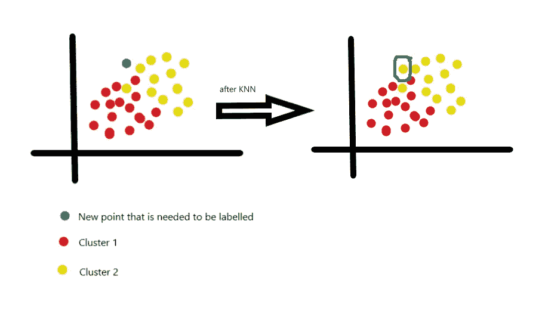

KNN 的工作原理是**多数票**原则，也就是说，一个物体被其邻居的多数票分类，该物体被分配到其 k 个最近邻居中最常见的类别。

使用**距离度量**来决定投票，并且假设数据在**度量空间中。**

最常见的距离度量是:

1.  [**欧氏距离**](https://en.wikipedia.org/wiki/Euclidean_distance) :定义为两点之间的平方差之和的平方根。

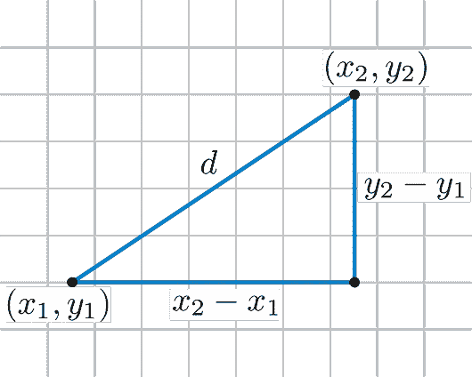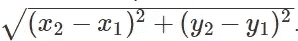

**2。** [**曼哈顿距离**](https://en.wikipedia.org/wiki/Taxicab_geometry) :这是使用绝对差之和的真实向量之间的距离。

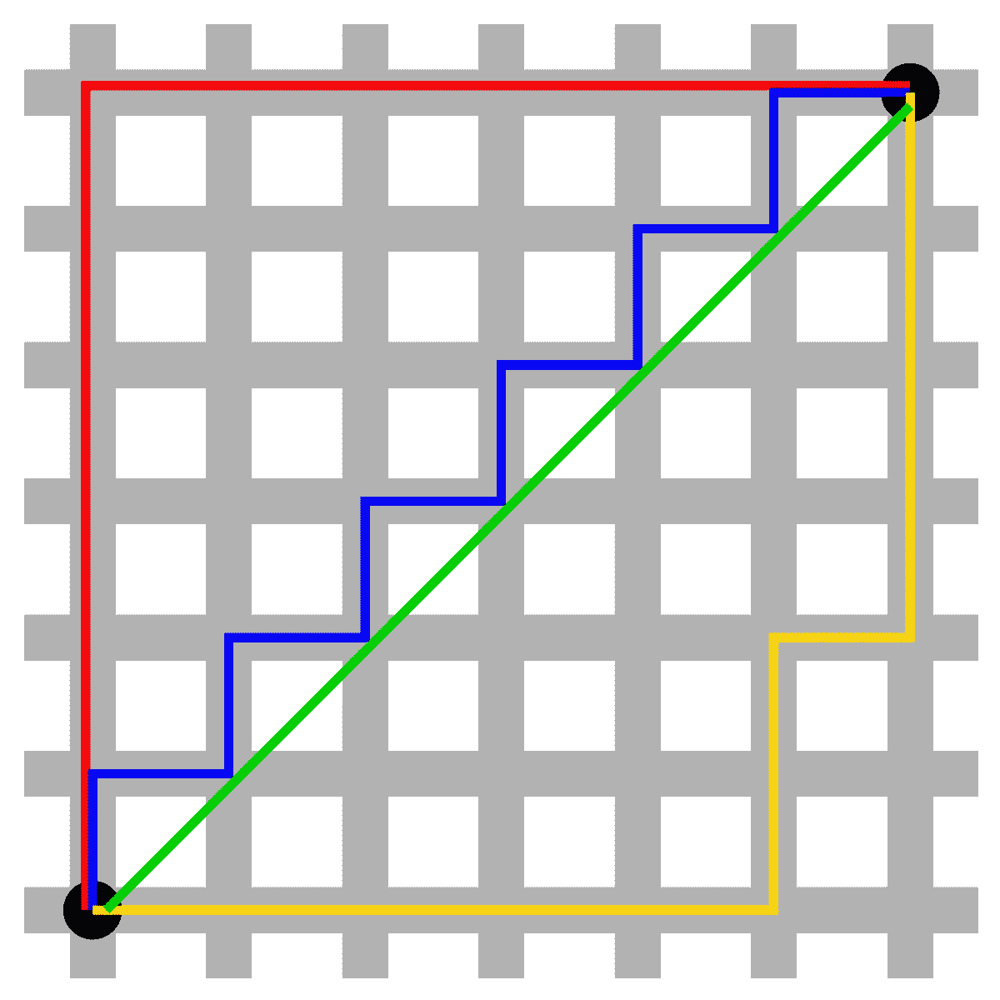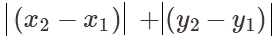

# K-NN 是如何工作的？

1.  将数据分为测试集和训练集。
2.  假设“ *k* 的值。
3.  假设一个距离度量，并计算到其 n 个训练样本的距离。
4.  对计算的距离进行排序，并获取 k 个最近的样本。
5.  根据多数点，将类别分配给未标记的数据点。

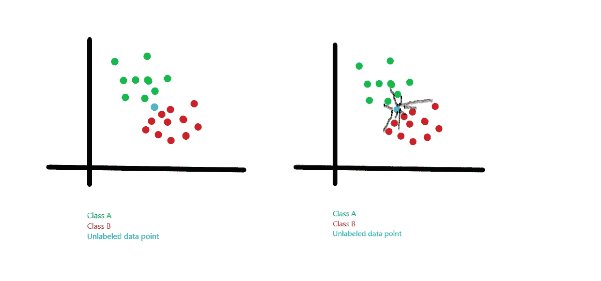

我们试图计算不同点与一个新的未识别数据点之间的距离。

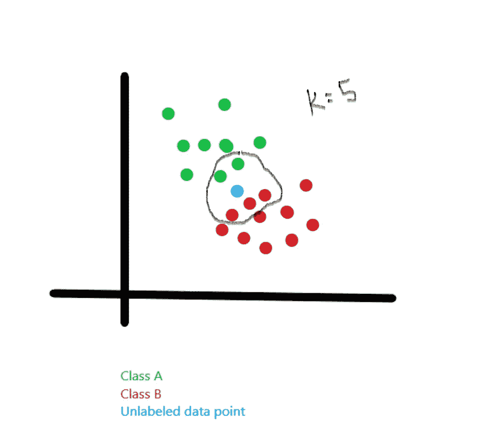

一旦计算出距离，我们取 k-最近的样本，并根据多数票，将一个类别分配给一个未识别的数据点。

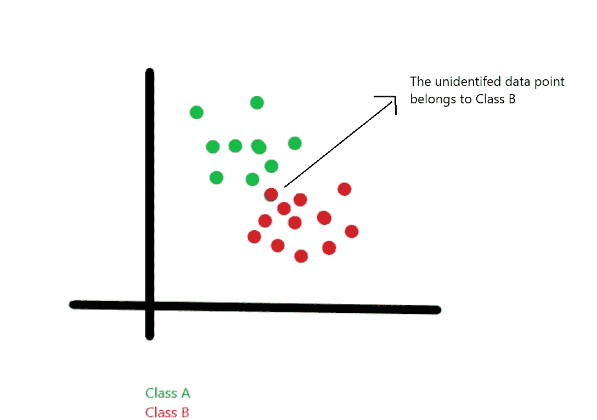

# 我们如何选择“K”？

一个简洁的答案是，对于“ *K* ”没有最优值。它是**超参数**，因此由你选择，但是记住它是决策边界，因此必须明智地选择。

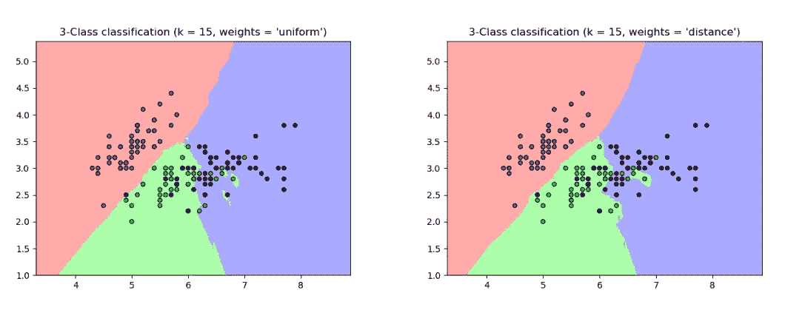

K = 1 vs K = 15[来源](https://sklearn.org/modules/neighbors.html)

正如我们所见，当 **K=1** 时，曲线过于尖锐，但随着我们增加 K，锐度降低，平滑度开始发挥作用。如果我们把 K 增加到无穷大，基于多数票，所有东西都将是红色、绿色或蓝色。

*K* 的值在确定决策边界时起着非常重要的作用；

> k:太大；一切都被分类到给定的类中(欠拟合)
> 
> k:太小；高度可变的数据集和不稳定的决策边界(过拟合)

“K”的值可以用两种方法确定:

1.  ***手动法*** :我们需要使用点击&试法；改变 K 值并观察训练和验证误差。

如果训练误差很低但是测试误差很高，那么我们的模型就是**过拟合**。如果我们经历高训练误差但低测试误差，那么我们的模型是**欠拟合**。

要了解有关为您的模型选择最佳拟合的更多信息:

 [## 确定最适合您的 ML 模型。

### 以最简单的方式教授过度拟合与欠拟合以及完美拟合。

medium.com](https://medium.com/datadriveninvestor/determining-perfect-fit-for-your-ml-model-339459eef670) 

2. ***网格搜索*** : Scikit-learn 提供了 **GridSearchCV** 函数，让我们可以轻松地检查 k 的多个值。

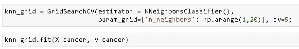

# KNN 的伪代码

这里，我们接受参数作为距离度量，然后计算未标记数据点到每个标记点的距离。

一旦计算出距离，我们就取唯一的值并使用`argmax`来寻找多数投票，稍后我们可以仅使用这些投票将该点分类。

# ***实施 KNN 将乳腺癌分为恶性和良性***

我们将在一个最常见的数据集(即乳腺癌检测)上实验我们的 KNN 模型。

数据集包含 569 行和 33 列。癌症分为两部分，即良性(B)和恶性(M)。我们的目的是将随机癌症患者的特征分为 B 类或 m 类。

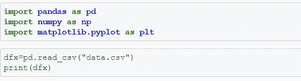

导入所有必需的库，可以在以下位置找到数据集:

[乳腺癌数据](http://archive.ics.uci.edu/ml/datasets/breast+cancer+wisconsin+%28diagnostic%29)

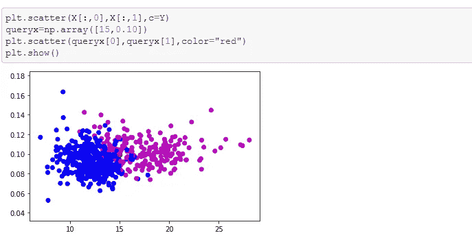

将数据标绘为良性(蓝色)和恶性(紫色)，未标记的数据点以红色显示。

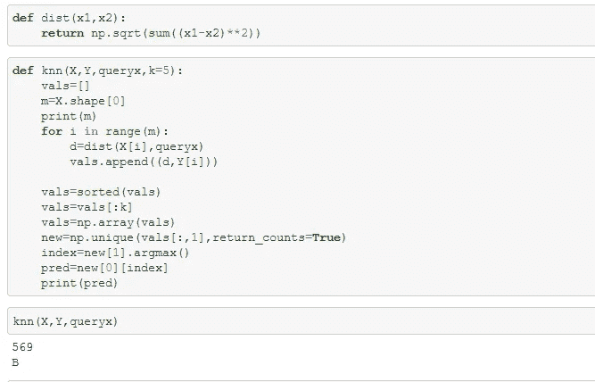

在执行算法之后，数据点可以被视为良性家族的一部分。

**代码可在:**找到

 [## 乳腺癌患者达赫施特莱汉/KNN

### 此时您不能执行该操作。您已使用另一个标签页或窗口登录。您已在另一个选项卡中注销，或者…

github.com](https://github.com/dakshtrehan/KNN-on-Breast-Cancer) 

## **使用 sci-kit learn 执行 KNN**

# KNN 的利与弊

## 优点:

1.  简单易行
2.  训练时间低。
3.  对有噪声的训练数据稳健。

## 缺点:

1.  确定完美的“K”是乏味的。
2.  大量存储需求。
3.  对异常值敏感。
4.  最不精确的算法。

# 结论

希望这篇文章能帮助你更好地理解 KNN，也能帮助你实际运用它。

一如既往，非常感谢你的阅读，如果你觉得这篇文章有用，请分享！

请随意连接:

> *领英~*[https://www.linkedin.com/in/dakshtrehan/](https://www.linkedin.com/in/dakshtrehan/)
> 
> *insta gram ~*[*https://www.instagram.com/_daksh_trehan_/*](https://www.instagram.com/_daksh_trehan_/)
> 
> *Github ~*[https://github.com/dakshtrehan](https://github.com/dakshtrehan)

关注更多机器学习/深度学习博客。

> *中等~*[【https://medium.com/@dakshtrehan】T21](https://medium.com/@dakshtrehan)

## 想了解更多？

 [## 无法逃脱的人工智能算法:抖音

### 描述一个抖音用来吸引用户的渐进式推荐系统！

towardsdatascience.com](https://towardsdatascience.com/the-inescapable-ai-algorithm-tiktok-ad4c6fd981b8)  [## 使用深度学习检测新冠肺炎

### 一个实用的方法来帮助医生帮助我们对抗新冠肺炎

towardsdatascience.com](https://towardsdatascience.com/detecting-covid-19-using-deep-learning-262956b6f981)  [## 为什么你要为乔治·弗洛伊德的谋杀和德里社区骚乱负责！！

### 一个 ML 爱好者改变世界的方法。

medium.com](https://medium.com/@dakshtrehan/why-are-you-responsible-for-george-floyds-murder-delhi-communal-riots-4c1edb7acbc5)  [## 关于朴素贝叶斯你不知道的事情！！

### 朴素贝叶斯快速指南，帮助你开发垃圾邮件过滤系统！

medium.com](https://medium.com/swlh/things-you-never-knew-about-naive-bayes-eb84b6ee039a)  [## 解释激活功能

### 阶跃，Sigmoid，双曲正切，Softmax，ReLU，Leaky ReLU 解释

medium.com](https://medium.com/analytics-vidhya/activation-functions-explained-8690ea7bdec9)  [## 解释参数优化

### 梯度下降的简要描述指南，ADAM，ADAGRAD，RMSProp

towardsdatascience.com](https://towardsdatascience.com/parameters-optimization-explained-876561853de0)  [## 梯度下降解释

### 梯度下降综合指南

towardsdatascience.com](https://towardsdatascience.com/gradient-descent-explained-9b953fc0d2c)  [## 逻辑回归解释

### 尽可能简单地解释逻辑回归。

towardsdatascience.com](https://towardsdatascience.com/logistic-regression-explained-ef1d816ea85a)  [## 线性回归解释

### 尽可能简单地解释线性回归。

medium.com](https://medium.com/towards-artificial-intelligence/linear-regression-explained-f5cc85ae2c5c)  [## 确定最适合您的 ML 模型。

### 以最简单的方式教授过度拟合与欠拟合以及完美拟合。

medium.com](https://medium.com/datadriveninvestor/determining-perfect-fit-for-your-ml-model-339459eef670)  [## 将机器学习技术与现实生活联系起来。

### 尽可能简单地解释 ML 模型的类型。

levelup.gitconnected.com](https://levelup.gitconnected.com/relating-machine-learning-techniques-to-real-life-4dafd626fdff)  [## 为新手提供数据科学服务

### 所以，上周我的团队负责人让我面试一些可能加入团队的实习生，了解数据的作用…

medium.com](https://medium.com/towards-artificial-intelligence/serving-data-science-to-a-rookie-b03af9ea99a2) 

> 干杯