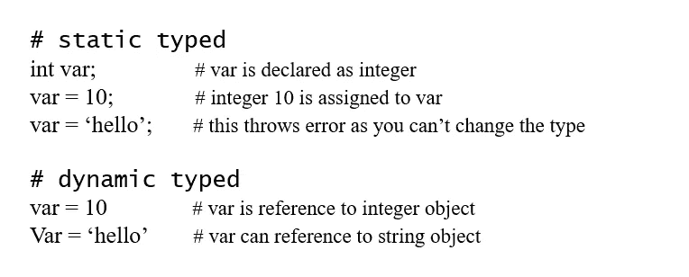
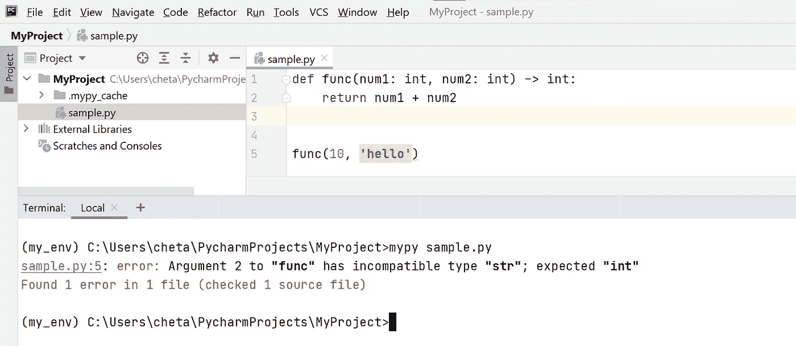
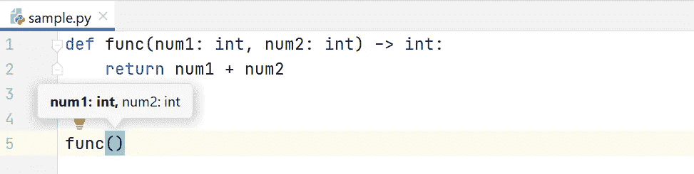
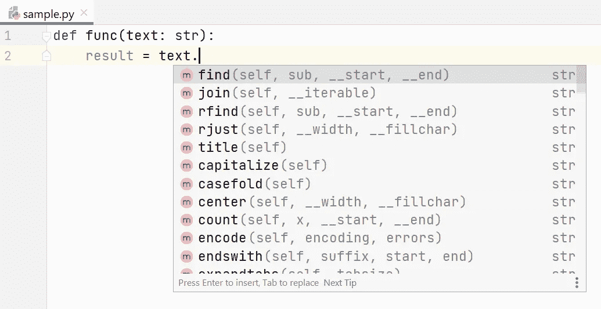

# 开始在 Python 代码中使用注释

> 原文：<https://pub.towardsai.net/start-using-annotations-in-your-python-code-f410bbc61426?source=collection_archive---------0----------------------->

## [PYTHON](https://towardsai.net/p/category/programming/python) ，[编程](https://towardsai.net/p/category/programming)

## 理解 Python 中的函数和变量注释


作者图片

# 介绍

C、C++、Java 等编程语言。是静态类型语言，这意味着在程序中实际使用变量之前，必须声明变量的数据类型。另一方面，Python 是一种动态类型语言，这意味着您不必事先声明变量的数据类型。



静态类型语言和动态类型语言各有利弊。动态类型语言的一个问题是类型错误只能在运行时被捕获。Python 提供了一种借助**注释**来处理这个问题的方法。但是请记住， **Python 并不强制注释**，而是向开发人员提示变量的数据类型，以便在运行之前发现类型错误。让我们通过例子来理解什么是注释，不同的类型，以及它们是如何有帮助的。

# 什么是注释

正如我们刚刚在简介部分所介绍的，注释是 Python 的特性，它向开发人员提示变量或函数参数的数据类型以及返回类型。它们还增加了 Python 程序的可读性。

Python 中的注释主要有两种:**函数注释**和**变量(类型)注释**。我们将首先浏览函数注释，然后深入到变量注释。

# 函数注释

函数注释的**语法**如下所示:

```
def func(a: <expression>, b: <expression>) -> <expression> :
    pass
```

上面的函数注释语法接受两个参数 **a** 和**b**，函数的返回类型表示为`**-> <expression>**`。 **<表达式>** 可以是任何东西。它可以包含参数的描述或数据类型等。然而，最常见的是，**函数注释**用于表示函数参数的数据类型和函数返回类型。

让我们看几个例子。以下三个示例采用两个参数并返回它们的和。可以看到， **<表达式>** 可以是任何东西。这三个都是有效的函数定义，但是它展示了使用函数注释的不同方式。

```
def func1(num1: "1st param", num2: "2nd param") -> "return type":
    return num1 + num2def func2(num1: int, num2: int) -> int:
    return num1 + num2def func3(num1: int, num2: int=10) -> int :
    return num1 + num2
```

在第一个例子中，我们使用了一些描述性的文字。在第二个示例中，参数的数据类型，在第三个示例中，参数的数据类型以默认值作为注释。

注意，如果有任何参数有默认值，那么注释必须总是在参数的默认值之前，就像你在上面第三个例子中看到的那样。

# 如何访问注释

可以使用函数对象上的 **__annotations__** 属性来访问函数注释。 **__annotations__** 以字典的形式给出结果，其中键和值分别映射到参数和注释。

在下面的例子中， **num1** 和 **num2** 是函数参数，其中 **int** 作为注释，表示参数的预期数据类型。注意，即使**返回**不是一个参数，Python 还是添加了它来指示函数的返回类型。

```
def func(num1: int, num2: int=10) -> int :
    return num1 + num2
print(func.__annotations__)**>>> {'num1': int, 'num2': int, 'return': int}**
```

您可能已经猜到，如果一个函数没有任何注释，那么 **__annotations__** 属性将返回一个空字典。

```
def func(num1, num2):
    return num1 + num2
print(func.__annotations__)**>>> {}**
```

# 可变注释

类型(变量)注释首次在 **PEP 484** 中引入，其中**类型注释**用于注释变量。顾名思义，使用的注释表明了变量的数据类型。这种方法并不十分有效，它有自己的缺点，如这里的[](https://www.python.org/dev/peps/pep-0526/#rationale)**所列。因此，我们不会详细讨论类型注释。相反，我们将研究 Python 3.6 中的 **PEP 526** 中引入的**变量注释**。**

**变量注释最简单的例子如下所示。编写变量注释的一些规则是—**

*   **冒号前不应有空格。**
*   **冒号后面应该有一个空格。**

```
my_var: int=10
```

**现在，让我们再看几个例子。在下面的第一个例子中，名称被注释为字符串类型。在第二个示例中，城市被注释为一个初始值为“Mysore”的字符串。在第三个示例中，age 被注释为默认值为 35 的整数。**

```
name: str
print(__annotations__)
>>> {‘name’: <class ‘str’>}city: str = ‘Mysore’
print(__annotations__)
>>> {‘city’: <class ‘str’>}age: int = 35
print(__annotations__)
>>> {'age': 35}
```

# **使用类型模块的示例**

**在上面三个类型注释的例子中，我们使用了 Python 的原始数据类型，比如 **int** 和 **string** 。对于列表、元组等复杂类型，应该探索 [**类型化**](https://docs.python.org/3/library/typing.html) 模块。我们将在另一篇博文中了解**键入**模块的用法。然而，让我们来看一个使用类型模块的例子，它同时使用了*函数注释*和*类型注释*。**

**在下面的示例中， **square** 函数需要一个整数参数 **num** ，并返回从 0 到 num 的所有数字的平方。变量 ***squares*** 被声明为**List【int】**表示它保存一个整数列表。同样，函数的返回类型也是**List【int】**。接下来，**方。__annotations__** 给出函数的局部注释， **__annotations__** 给出全局注释。关于**打字**模块的高级用法，请参考官方文档。**

```
from typing import Listsquares: List[int] = []def square(num: int) -> List[int]:
    for i in range(num):
        squares.append(i**2)
    return squaresprint(square(10))
>>> [0, 1, 4, 9, 16, 25, 36, 49, 64, 81]print(square.__annotations__)
>>> {'num': int, 'return': typing.List[int]}print(__annotations__)
>>> {'squares': typing.List[int]}
```

# **注释的使用**

**到目前为止，您已经了解了什么是注释，如何在代码中添加注释，如何访问注释，等等。但是这对开发人员有什么帮助呢？下面是注释的一些用法。**

*   ****类型检查:**第三方工具如 **mypy** 可用于在运行前捕捉类型错误。在下面这个简单的例子中， ***func*** 接受两个整数参数并返回一个整数。当您保存这段代码并通过 ***mypy*** 运行它时，您将得到一个关于 ***num2*** 的错误，因为它需要一个整数，而您传递的是一个字符串‘hello’。**

****

**作者图片**

*   ****IDEs 类型提示:**如果注释用于指示参数的数据类型，IDEs 会提示参数的数据类型，等等。这将帮助您在 IDE(如 Pycharm)中编写代码时捕捉类型错误。参考下面的例子。**

****

**作者图片**

*   ****自动完成:**注释也有助于自动完成，让您的生活变得轻松。在下面的例子中， ***文本*** 变量被注释为字符串类型。所以，IDE 认为它是一个 ***字符串*** 数据类型。因此它将开始显示可以应用于 string 对象的方法。是不是很牛逼？**

****

**作者图片**

*   ****可读性**:注释也让你的代码更具可读性。例如，当有人在查看下面的代码时，很明显该函数需要两个整数参数并返回一个整数值。您不必使用文档字符串或注释来解释参数的数据类型。**

```
def func(num1: int, num2: int) -> int:
    return num1 + num2
```

*****注意:*** *注释本身对 Python 没什么用。使用注释的真正好处来自第三方库，如 linters、类型检查器、ide 等。解析注释并使用它们。例如，mypy 是一个第三方类型检查器库，它解析注释的数据类型，并帮助您在运行前捕捉类型错误。***

# **结论**

**希望您对本文中的函数注释和变量注释有了很好的理解。我建议您在下一个 Python 项目中尝试使用注释，看看它如何提高您的生产率。如果您有任何意见，请在下面的评论区告诉我们。**

**最初发布于 2021 年 4 月 5 日的[**python 简化版**](https://pythonsimplified.com/start-using-annotations-in-your-python-code/) 。**

**我希望你喜欢阅读这篇文章。如果你喜欢我的文章并想订阅 Medium，你可以在这里这样做:**

**[](https://chetanambi.medium.com/membership) [## 通过我的推荐链接加入媒体- Chetan Ambi

### 作为一个媒体会员，你的会员费的一部分会给你阅读的作家，你可以完全接触到每一个故事…

chetanambi.medium.com](https://chetanambi.medium.com/membership)** 

# **参考**

**[1].[https://www.python.org/dev/peps/pep-3107/](https://www.python.org/dev/peps/pep-3107/)(功能注释)**

**[2].[https://www.python.org/dev/peps/pep-0526/](https://www.python.org/dev/peps/pep-0526/)(变量注释的语法)**

**[3].[https://www.python.org/dev/peps/pep-0484/](https://www.python.org/dev/peps/pep-0484/)(键入提示)**

**[4].[https://docs.python.org/3/library/typing.html](https://docs.python.org/3/library/typing.html)**