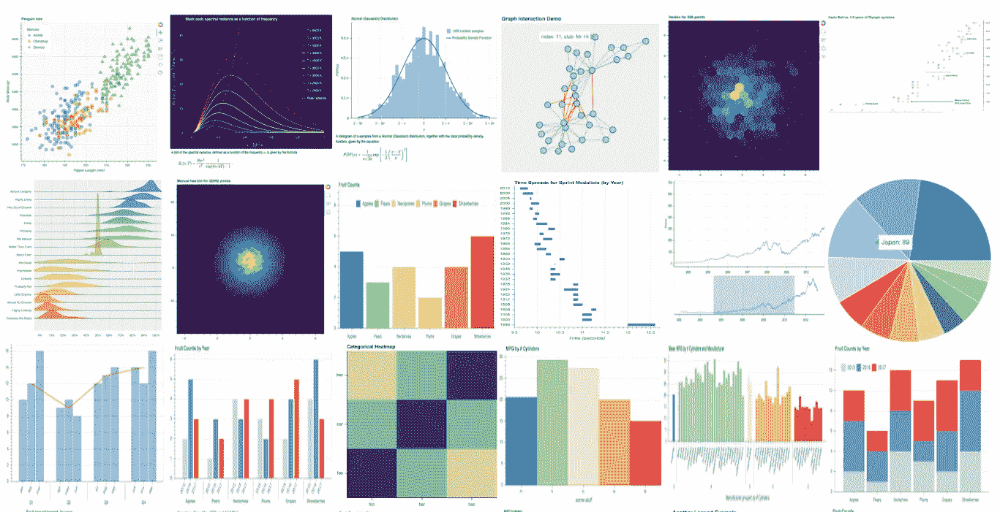
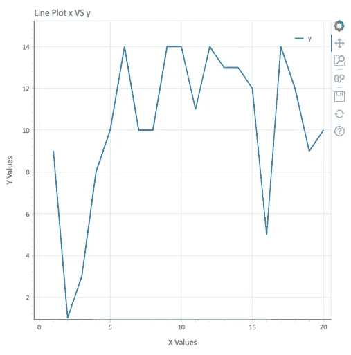
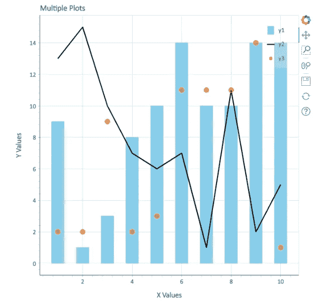
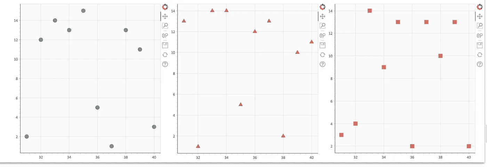
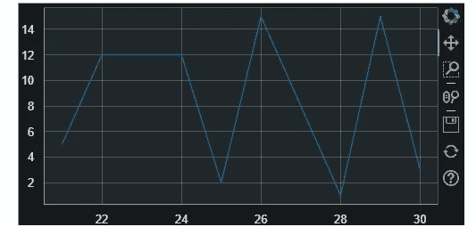
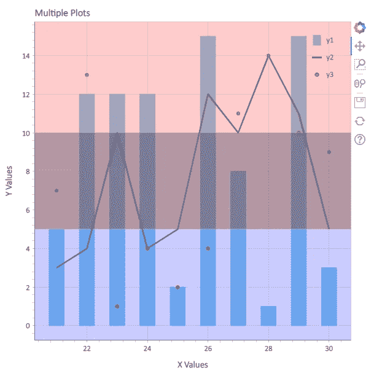

# 开始使用这个交互式数据可视化库:Python 散景教程

> 原文：<https://pub.towardsai.net/start-using-this-interactive-data-visualization-tool-python-bokeh-tutorial-dd4afba8e999?source=collection_archive---------1----------------------->

> 数据可视化是数据分析的关键。无论是理解数据中隐藏的模式或层次，还是分析产品的指标或见解，或者向非技术客户展示我们的分析，数据可视化都是必不可少的。有各种工具可用于可视化数据，今天我们将介绍一个这样的工具，它在 Python 中使用并提供交互式功能。



资料来源:Bokeh.org

**Bokeh 是 Python 中的一个数据可视化库**，它为数据科学家分析数据提供了交互式和复杂的功能。与其他绘图库不同，Bokeh 使绘图具有交互性，当 Bokeh 使用 Python 和 Javascript 渲染数据时，我们可以将绘图导出到 HTML 文件中。

*相对于其他图书馆的优势* —

1.  对于使用 Python Django 或 Flask 的 ***web 开发者来说，由于情节被导出为 HTML 文件，他们可以很容易地将其嵌入到网页中。***
2.  对于想要分析数据的*数据科学家来说，散景通过创建互动图来帮助他们，使用这些图他们可以放大和平移图表并实现模式。*

*让我们开始使用散景创建一个**线图；使用的数据集**可以在 这里找到 [**。**](https://github.com/muttinenisairohith/Encoding-Categorical-Data/blob/2bb4569962ddf05baef25b219c27f96dedf7c343/data/Data.csv)*

*使用 Python 安装散景—*

```
*pip install bokeh*
```

*导入库*

```
*from bokeh.plotting import figure, show, output_notebook*
```

*我们需要从散景导入数字来创建数字。为了显示该图，使用了 show 函数，当我们想要在笔记本中可视化绘图时，显式地使用 output_notebook。*

```
*from bokeh.plotting import figure, show, output_notebookx = df["x"].values[:20]
y = df["y"].values[:20]# create a new plot with a title and axis labels
p = figure(title="Line Plot x VS y", x_axis_label="X Values", y_axis_label="Y Values")# add a line renderer with legend and line thickness
p.line(x, y, legend_label="y", line_width=2)# show the results
output_notebook()
show(p)*
```

*在上面的代码中，导入数据后—*

1.  *该图形是使用 figure()方法创建的。我们可以为 figure()添加 title、x_axis_label、y_axis_label 等附加选项。*
2.  *line()方法用于创建折线图。我们传递的参数是 x，y —数据，legended _ label—代表 y 数据的标签，line_width —线形图的宽度。*

*输出会是这样的—*

**

*线形图输出*

*为了可视化这些图并使它们具有交互性，散景提供了一些工具，如上图所示——平移、框缩放、滚轮缩放、保存和重置。为了探索互动性，从 [**这里**](https://github.com/muttinenisairohith/Encoding-Categorical-Data/blob/f9e55bc2a7d1b125ffa05f2a38ba4d19b402d9ed/Bokeh/line_plot.html) 下载上面 HTML 格式的情节。*

***用不同的渲染组合多个地块:***

```
*#Combining mutliple plots with different renders
from bokeh.plotting import figure, showx = df["x"].values[:10]
y1 = df["y"].values[:10]
y2 = df["y1"].values[:10]
y3 = df["y2"].values[:10]p = figure(title="Multiple Plots", x_axis_label="X Values", y_axis_label="Y Values")p.vbar(x=x, top=y1, legend_label="y1", color="skyblue", width=0.5, bottom=0)p.line(x, y2, legend_label="y2", color="black", line_width=2)p.circle(x,y3,legend_label="y3",fill_color="red",fill_alpha=0.5,line_color="yellow",size=10)# show the results
show(p)*
```

*在上面的代码中，我们使用了三种不同的渲染方式——vbar、line 和 circle。在圆形图中，我试图显示一些我们可以使用的附加参数，例如 fill_color —填充圆形，fill_alpha —颜色的不透明度，line_color —圆形的边框颜色，以及 size —圆形的半径。*

*输出会是这样的—*

**

*使用散景的多幅图*

***使用散景的支线剧情:***

```
*from bokeh.layouts import row
from bokeh.plotting import figure, showx = df["x"].values[30:40]
y1 = df["y"].values[30:40]
y2 = df["y1"].values[30:40]
y3 = df["y2"].values[30:40]# create three plots with one renderer each
s1 = figure(width=250, height=250, background_fill_color="#fafafa")
s1.circle(x, y1, size=12, color="#53777a", alpha=0.8)s2 = figure(width=250, height=250, background_fill_color="#fafafa")
s2.triangle(x, y2, size=12, color="#c02942", alpha=0.8)s3 = figure(width=250, height=250, background_fill_color="#fafafa")
s3.square(x, y3, size=12, color="#d95b43", alpha=0.8)# put the results in a row that adjusts accordingly
show(row(children=[s1, s2, s3], sizing_mode="scale_width"))*
```

*在上面的代码中，我们可以看到，我们使用了三种渲染方式——圆形、三角形和正方形来绘制三个地块。我们使用 row 函数合并了这些图。参数-使用 scale_width，以便根据窗口宽度调整绘图宽度。*

*输出会是这样的—*

**

*使用散景的子图特征*

***在散景中保存情节和设置主题—***

```
*from bokeh.io import curdoc
from bokeh.plotting import figure, show, save, output_filex = df["x"].values[20:30]
y = df["y"].values[20:30]# apply theme to current document
curdoc().theme = "dark_minimal"output_file(filename="custom_filename.html", title="Static HTML file")# create a plot
p = figure(sizing_mode="stretch_width", max_width=500, height=250)# add a renderer
p.line(x, y)# show the results
save(p)*
```

*为了将绘图保存到 HTML 文件中，使用了上面的代码。这里的 output_file 参数用于记录文件的文件名和标题。创建绘图后，save()方法用于将绘图保存在指定的 HTML 文件中。*

*curdoc()。主题方法用于设置散景图的主题。散景中有以下几种主题— `caliber`、`dark_minimal`、`light_minimal`、`night_sky`和`contrast`。*

*我们可以通过在 figure 方法中指定来定制绘图的宽度和高度。*

*输出会是这样的—*

**

*我们还可以使用方框注释法在散景图中添加背景色*

```
*from bokeh.models import BoxAnnotationlow_box = BoxAnnotation(top=10, fill_alpha=0.2, fill_color="blue")
mid_box = BoxAnnotation(top=10, bottom=5, fill_alpha=0.2, fill_color="green")
high_box = BoxAnnotation(bottom=5, fill_alpha=0.2, fill_color="red")*
```

*正如我们看到的，三个盒子是用三种不同的颜色创建的；让我们用一个情节把它们整合起来。*

```
*from bokeh.plotting import figure, showcurdoc().theme = "light_minimal"x = df["x"].values[20:30]
y1 = df["y"].values[20:30]
y2 = df["y1"].values[20:30]
y3 = df["y2"].values[20:30]p = figure(title="Multiple Plots", x_axis_label="X Values", y_axis_label="Y Values")p.vbar(x=x, top=y1, legend_label="y1", color="skyblue", width=0.5, bottom=0)
p.line(x, y2, legend_label="y2", color="black", line_width=2)
p.circle(x, y3, legend_label="y3", color="red", size = 5)p.add_layout(low_box)
p.add_layout(mid_box)
p.add_layout(high_box)# show the results
show(p)*
```

*如我们所见，我们已经创建了地块并将布局添加到地块中。*

*输出:*

**

*散景中的注释*

*我们还可以在散景中添加许多自定义设置，例如—图例自定义、标题自定义、图形自定义等。；我们也有许多类型的散景渲染，可以根据需要使用。我们还可以在散景中添加悬停功能。*

*那么，还有什么？下次当您可视化一些数据时，请确保使用这个交互式数据可视化库。*

*结尾注释——学习是我的日常活动，我把我所有的学习都写在这里，这样我可以随时参考它们，也可以和任何感兴趣的人分享我的学习。*

*要使用 Seaborn 探索数据可视化，请阅读本文*

*[](/medium-reader-and-author-behavioural-analysis-using-spacy-and-seaborn-in-python-24f9a6d4950b) [## 使用 Python 中的 Spacy 和 Seaborn 进行媒体读者和作者行为分析

### 所以在我的 Pyspark 系列之后，我在考虑接下来要写什么，退格之后，我想，为什么不…

pub.towardsai.net](/medium-reader-and-author-behavioural-analysis-using-spacy-and-seaborn-in-python-24f9a6d4950b) 

快乐学习…*